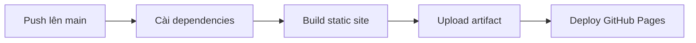

Dự án được cấu hình để xuất HTML tĩnh bằng Next.js static export. GitHub Actions sẽ build site và publish thư mục `out/` lên GitHub Pages.

## Điều kiện cần

- Repository đã bật GitHub Pages với nguồn **GitHub Actions**.
- Nhánh mặc định là `main` hoặc workflow đã được chỉnh theo nhánh mong muốn.
- Node.js tương thích với cấu hình trong workflow.

## Quy trình CI/CD



## Kiểm tra cục bộ

```bash
npm ci
npm run build
npm run start
```

Sau khi build, site tĩnh nằm trong thư mục `out/`.
