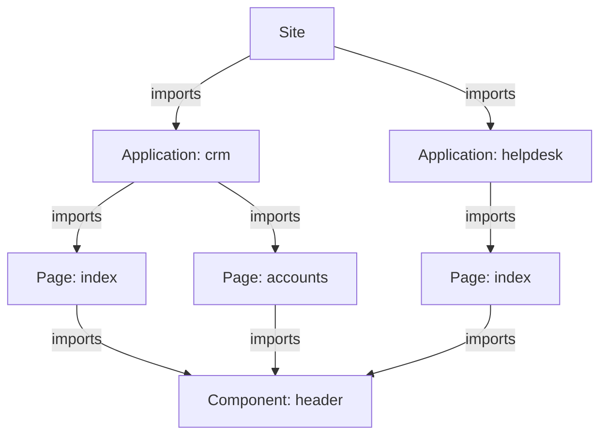
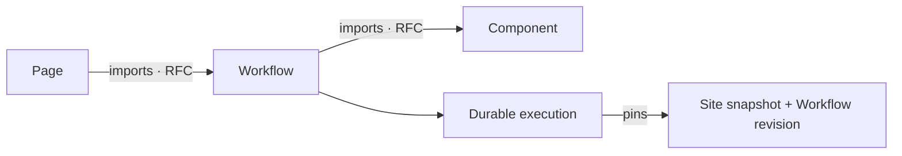

A Taskmigo system manages one site graph in a user-managed PostgreSQL database.

## Database boundary

Taskmigo owns one configurable PostgreSQL schema, named `taskmigo` by default. It must not access or modify `public` or other user schemas.

Taskmigo currently has no tenant registry, database routing, or `tenant_id`.

## Resource graph

The graph starts at the system's only logical Site resource. Every regular runtime resource must be reachable through an allowed `imports` edge.

A Site imports Applications. An Application imports Pages. A Page may import Pages or Components, and a Component may import Components. Multiple Pages may point to the same Component while supplying different typed props. Resources are never discovered by name, so a resource outside this graph cannot become part of the running Site.

The one-Site invariant is system-wide. Schema prefixes do not create separate composition roots, so `v0/site` and a future `v1/site` cannot coexist as separate Site resources. See [Site cardinality](/versions/v0/resources#site-cardinality).

Version selection happens per edge, so separate branches may resolve the same `(kind, name)` to different revisions. See [Resource model](/versions/v0/resources#imports) for reference syntax and resolution.

The [Reference ability matrix](/versions/v0/resources#reference-ability) defines every allowed kind pair. Translation catalogs are selected by locale rather than imported by consumers. See [v0/translation](/versions/v0/manifests/v0-translation).

## Composition root

The [Site manifest](/versions/v0/manifests/v0-site) imports applications and selects which ones to expose. An [Application manifest](/versions/v0/manifests/v0-application) imports pages and assigns each routed page a path below the application's base path. A [Page manifest](/versions/v0/manifests/v0-page) may import Pages and [Components](/versions/v0/manifests/v0-component); a Component may import other Components.

## Workflow RFC extension

<Callout title='RFC architecture' type='warn'>
  The relationships and runtime boundary in this section belong to the [`v0/workflow` RFC](/versions/v0/manifests/v0-workflow). They are not supported behavior yet.
</Callout>

The Workflow RFC extends the same resource graph instead of creating a second discovery model. A Page may import Workflows that users can discover and start from that Page, and a Workflow may import Components used by interactive UI steps.

Workflow-to-Workflow imports remain disallowed in the RFC. The canonical proposed relationships are recorded in the [RFC extension to the reference matrix](/versions/v0/resources#workflow-rfc-extension).

A Workflow definition belongs to the immutable Site snapshot, while a Workflow execution is durable runtime state. Starting an execution pins the exact Workflow revision, Site snapshot, and imported dependencies needed to resume it. Activating a newer Site snapshot therefore affects new executions only; an existing execution never changes definition while it is running or waiting for user input.

## Runtime boundary

A valid graph compiles into an immutable Site snapshot. Each request reads one snapshot. Invalid changes retain diagnostics while the current snapshot continues serving traffic.

The Workflow RFC preserves this snapshot boundary and adds a separate resumable execution lifecycle. See [Workflow execution lifecycle](/versions/v0/runtime#workflow-execution-lifecycle-rfc) for how pinned executions coexist with snapshot activation.

Continue with the [Runtime lifecycle](/versions/v0/runtime) to see how a resource change becomes an active snapshot.
