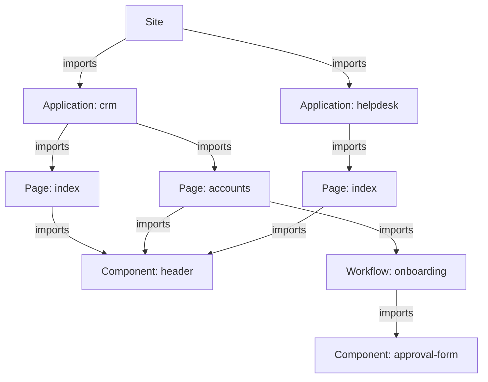

A Taskmigo system manages one site graph in a user-managed PostgreSQL database.

## Database boundary

Taskmigo owns one configurable PostgreSQL schema, named `taskmigo` by default. It must not access or modify `public` or other user schemas.

Taskmigo currently has no tenant registry, database routing, or `tenant_id`.

## Resource graph

The graph starts at the system's only logical Site resource. Every regular runtime resource must be reachable through an allowed `imports` edge.

A Site imports Applications. An Application imports Pages. A Page may import Pages or Components and, under the Workflow design, Workflows that users can discover and start from that Page. A Component may import Components, while a Workflow may import Components used by interactive steps.

Multiple Pages may point to the same Component while supplying different typed props. Resources are never discovered by name, so a resource outside this graph cannot become part of the running Site.

The one-Site invariant is system-wide. Schema prefixes do not create separate composition roots, so `v0/site` and a future `v1/site` cannot coexist as separate Site resources. See [Site cardinality](/versions/v0/resources#site-cardinality).

Version selection happens per edge, so separate branches may resolve the same `(kind, name)` to different revisions. See [Resource model](/versions/v0/resources#imports) for reference syntax and resolution.

The [Reference ability matrix](/versions/v0/resources#reference-ability) defines every allowed kind pair. Translation catalogs are selected by locale rather than imported by consumers. See [v0/translation](/versions/v0/manifests/v0-translation).

## Composition root

The [Site manifest](/versions/v0/manifests/v0-site) imports applications and selects which ones to expose. An [Application manifest](/versions/v0/manifests/v0-application) imports pages and assigns each routed page a path below the application's base path. A [Page manifest](/versions/v0/manifests/v0-page) may import Pages, [Components](/versions/v0/manifests/v0-component), and discoverable [Workflows](/versions/v0/manifests/v0-workflow). A Component may import other Components, and a Workflow may import Components for interactive steps.

## Runtime boundary

A valid graph compiles into an immutable Site snapshot. Each request reads one snapshot. Invalid changes retain diagnostics while the current snapshot continues serving traffic.

Workflow definitions are compiled into the same immutable snapshot. Workflow executions are durable runtime state created from a selected snapshot and remain pinned to that snapshot and Workflow revision until they finish, so a later snapshot activation affects new executions without mutating existing ones.

Continue with the [Runtime lifecycle](/versions/v0/runtime) to see how resource changes and Workflow executions use that snapshot boundary.
