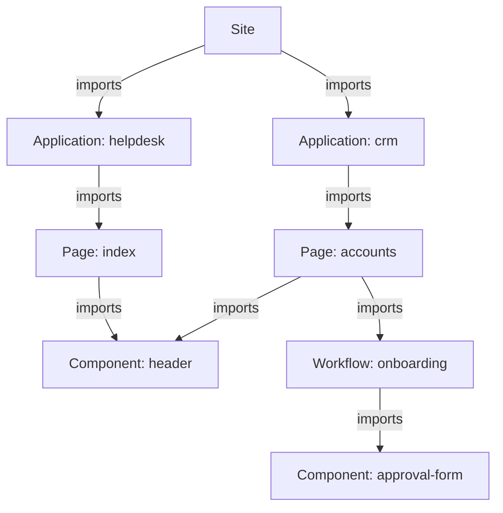

A Taskmigo deployment manages one Site graph in a user-managed PostgreSQL database.

## Database boundary

Taskmigo owns one configurable PostgreSQL schema, `taskmigo` by default, and must not access other user schemas. Multi-tenancy and database routing are not supported.

## Resource graph

The Site is the composition root.

Resources outside the reachable graph are not included in the running Site. Multiple resources may depend on the same resource. Translation catalogs are selected by locale instead of dependency edges. Policy RFC resources are registered globally and activated through Role attachments rather than dependency edges.

See [Resource model](/versions/v0/resources) for identity and references, and [Runtime lifecycle](/versions/v0/runtime) for activation and execution.
