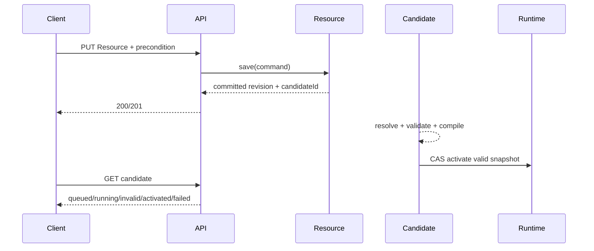

The canonical machine-readable HTTP contract is `public/openapi/v0/openapi.yaml`. Use the [interactive Scalar API Reference](/api-reference/) to browse operations, schemas, examples, and request/response contracts. The viewer loads the same OpenAPI 3.2.0 document that is reviewed in the repository, so the rendered reference and implementation contract cannot drift into separate sources of truth.

## API principles

The HTTP layer is an adapter over application services. Controllers do not own Resource revision rules, candidate compilation, snapshot activation, or database transactions.

The API uses `/api/v0` as the HTTP contract namespace. Resource kinds remain independently versioned. A manifest kind such as `v0/page` is decomposed into `{kindVersion}/{kindName}` in URLs, so the Resource `v0/page` named `home` is addressed as:

```text
/api/v0/resources/v0/page/home
```

This avoids encoded-slash behavior while preserving the exact internal identity `(v0/page, home)`.

All responses except raw manifest input are JSON. Errors use `application/problem+json` with a stable Taskmigo `code` in addition to standard Problem Details fields.

All endpoints require bearer authentication. Do not hard-code product Roles in controllers. Authentication belongs to `access`; operation authorization remains a replaceable policy decision so Policy can own it when that capability enters delivery.

## Endpoint surface

The current OpenAPI contract exposes Resource list/get/write operations, immutable revision history, immutable tags, Site candidate state and diagnostics, immutable snapshot metadata and Resource pins with resolved graph checksums, and the current runtime pointer.

This inspection surface is not sufficient for Next.js SSR rendering. A serving API still needs to expose the compiled runtime read model described below. Its concrete path and transport schema remain an open decision and must not be invented independently in implementation.

There is deliberately no Resource delete API, tag mutation API, manual snapshot activation API, candidate retry API, or compiled-artifact download API in the current contract. Those operations require product semantics that are not yet defined.

## SSR serving contract

Next.js must not reconstruct runtime state from Resource and revision endpoints. The serving boundary works with a **runtime binding**: an opaque binding between one browser application instance, one immutable Site snapshot, and the presentation context captured for that instance.

A browser application instance begins with a full document load and normally ends at the next full reload. The initial load creates a fresh binding from the currently active snapshot and current presentation defaults. Client-side navigation reuses that binding rather than reacquiring the active snapshot.

The logical route result contains:

- the matched Application and Page from the bound snapshot;
- Site/Application metadata required by the rendered layout;
- a deterministic not-found outcome when the bound snapshot has no matching route.

The logical render result contains:

- Page metadata and body;
- every reusable Component definition required to render that Page, without requiring follow-up Resource requests;
- Translation and Expression results evaluated with the bound presentation context;
- runtime identity sufficient for caching, compatibility checks, and diagnostics without requiring the browser to understand persistence IDs.

These are logical parts of one serving operation, not a requirement for separate HTTP endpoints. The happy path should require one backend HTTP round trip from Next.js. The backend may load multiple snapshot artifacts internally, but Next.js must not perform a serial Site → Application → Page → Component request chain.

### Binding lifecycle

The serving boundary follows these rules:

1. **Full document bootstrap:** ignore any previous app-instance binding for version selection, acquire the current active snapshot, capture supported presentation defaults, and return a fresh binding with the initial render model.
2. **Client-side navigation:** accept the existing binding, validate it, and resolve exclusively against its bound snapshot and presentation context.
3. **Full reload:** bootstrap again, allowing the tab to adopt the latest active snapshot and current profile defaults.
4. **Explicit presentation change:** when the user intentionally changes a bound presentation value such as locale in the current tab, establish a consistent replacement binding/rerender for that tab. Do not mutate other tabs implicitly.
5. **Invalid binding:** an expired, revoked, or renderer-incompatible binding may require a full reload. Exact error codes and recovery transport are not defined yet.

The binding should be opaque to the browser. Do not make raw snapshot UUIDs, graph checksums, database keys, or token internals part of frontend logic. A signed/stateless token or server-side lease record are both possible implementations; token format and persistence remain open decisions.

Do not scope the binding to the login session. Two tabs opened at different times must be able to use different runtime versions and presentation contexts independently.

### Presentation context

Mutable profile data is a **bootstrap default**, not automatically the live rendering source for an already-running application instance.

Locale demonstrates why. Suppose Tab A bootstraps with `ja-JP`. Tab B later changes the user's profile language to `en`. Tab A must continue resolving `Trans`/`TransN` with `ja-JP`; otherwise its already-rendered Japanese layout can be combined with an English Page after client navigation.

For v0, Expression evaluation is backend-only. The serving API returns resolved values and does not expose Expression source or a frontend Expression program. Translation and Expression evaluation use the locale and other supported presentation values from the runtime binding, not mutable profile defaults reread during each navigation.

Future presentation values such as timezone or an SSR-rendered theme may join the binding when changing them between navigations would create a mixed UI. Do not automatically freeze security-sensitive or business-authoritative mutable state. Authorization, account status, permissions, and other security decisions require their own freshness contract and must not become stale merely because UI presentation is pinned.

### Consistency and compatibility

A request carrying a valid binding resolves entirely against the bound snapshot. Route lookup, Page/Component loading, Translation lookup, and Expression evaluation never fall back to `resource.current_revision_id` or the newly active snapshot.

A newer snapshot may activate while the tab is open. Existing bindings normally continue to use their snapshot until full reload. The final design must support bounded retention and may support expiry or emergency revocation so old snapshots are not retained forever and unsafe versions can be retired.

Renderer/artifact compatibility must be checkable independently of snapshot identity. A retained snapshot cannot be assumed renderable by every future Next.js deployment.

Compiled route indexes and render artifacts may be cached by immutable snapshot identity. Exact artifact partitioning, cache topology, binding representation, retention policy, and the public serving endpoint/schema are still open decisions; optimize them without weakening the one-binding or one-round-trip contracts.

## Resource writes

Use `PUT /api/v0/resources/{kindVersion}/{kindName}/{name}` because the client identifies the logical Resource being written. The body is the complete manifest source using `application/yaml` or `text/yaml`.

### Optimistic concurrency

Never implement last-write-wins for Resource authoring.

A Resource GET/PUT returns a strong `ETag` representing the exact current revision.

Creation uses:

```http
If-None-Match: *
```

Update uses:

```http
If-Match: "<current-revision-id>"
```

Missing required preconditions map to `428 Precondition Required`. A stale `If-Match` or an existing Resource with `If-None-Match: *` maps to `412 Precondition Failed`. A durable invariant conflict unrelated to the HTTP precondition maps to `409 Conflict`.

The application service performs the authoritative compare/write in the same transaction that inserts the immutable revision and advances the current pointer. A controller-side read/check is never sufficient for concurrency safety.

### Idempotent source writes

Canonicalize source and compare its source checksum with the current revision. If the submitted source is already current, return the existing revision with `200` instead of inserting duplicate immutable history. Dependency changes never alter this checksum or create a new revision for an unchanged importer.

A newly created Resource returns `201`. A changed existing Resource returns `200`.

The response includes the committed Resource/revision and, when authoring schedules Site evaluation, a candidate reference. A successful Resource write means authoring state is durable; it does not mean runtime activation succeeded.

## Async activation contract

Resource save and runtime activation are separate operations.



Do not hold the HTTP request open while the candidate compiles. Do not return `202` for the Resource write itself: the Resource mutation is complete when the authoring transaction commits. The asynchronous part is represented explicitly by `candidate`.

Candidate states are `queued`, `running`, `invalid`, `valid`, `activated`, and `failed`. `invalid` represents deterministic product/source diagnostics. `failed` represents pipeline or infrastructure failure.

Diagnostics are ordered by `sequence` and contain a stable `code`, source `path`, optional Resource/revision identity, optional line/column, and a safe message. Never expose secrets, Expression context values, SQL errors, stack traces, or internal exception class names.

## Checksum contract

The API exposes distinct immutable checksums and must not collapse them into one meaning:

| Field                            | Meaning                                                 | Changes when a child dependency changes? |
| -------------------------------- | ------------------------------------------------------- | ---------------------------------------- |
| `ResourceRevision.checksum`      | Canonical authored source for that exact revision.      | No                                       |
| `SnapshotResource.graphChecksum` | Resolved subgraph rooted at that exact pinned revision. | Yes, for affected ancestors              |
| `SiteSnapshot.graphChecksum`     | Complete resolved Site graph selected for the snapshot. | Yes                                      |
| `SiteSnapshot.checksum`          | Compiled snapshot output.                               | Yes when compiled runtime output changes |

A dependency change can therefore produce a new snapshot whose `siteRevisionId` is unchanged. The snapshot Resource pins expose the unchanged ancestor `revisionId` together with a new `graphChecksum`, while the changed child pin carries its new `revisionId`.

`graphChecksum` is derived by the Resource resolver/compiler boundary. Controllers only map the persisted values into response DTOs; they never recompute graph identity from current Resource pointers.

## Tags

Tags are immutable. `POST .../tags` creates one `(kind, name, tag) -> revisionId` association.

Retrying the same tag-to-revision association returns `200` with the existing association. Reusing an existing tag for another revision returns `409`. A revision that belongs to another Resource is rejected; the database composite foreign key remains the final safety boundary.

Do not implement PATCH or PUT for moving tags.

## Pagination

List endpoints use opaque cursor pagination.

```json
{
  "items": [],
  "page": {
    "nextCursor": null,
    "hasMore": false
  }
}
```

`limit` defaults to 50 and is capped at 200. Cursors are implementation-owned opaque tokens. Clients must not parse or construct them.

Pagination order must be deterministic and include a unique tie-breaker. Do not expose raw database offsets as cursors when concurrent inserts can cause duplicates or skips.

## Problem Details

Use Spring `ProblemDetail` as the transport model while keeping application failures framework-neutral.

Every API problem includes a stable `code`:

```json
{
  "type": "/problems/resource-precondition-failed",
  "title": "Resource precondition failed",
  "status": 412,
  "detail": "The Resource has changed since it was read.",
  "code": "RESOURCE_PRECONDITION_FAILED"
}
```

Use `violations[]` for multiple request-field/source-envelope errors. Candidate diagnostics are not embedded into generic Problem Details; they remain candidate resources because graph validation is asynchronous authoring feedback.

Stable error categories for this slice include `REQUEST_INVALID`, `AUTHENTICATION_REQUIRED`, `ACCESS_DENIED`, `RESOURCE_NOT_FOUND`, `RESOURCE_ALREADY_EXISTS`, `RESOURCE_PRECONDITION_REQUIRED`, `RESOURCE_PRECONDITION_FAILED`, `RESOURCE_SOURCE_INVALID`, `RESOURCE_KIND_UNSUPPORTED`, `TAG_CONFLICT`, `REVISION_NOT_FOUND`, `CANDIDATE_NOT_FOUND`, `SNAPSHOT_NOT_FOUND`, and `RUNTIME_NOT_ACTIVE`.

Do not use human-readable exception messages as the machine contract.

## Spring implementation

Keep HTTP adapters inside the owning Resource capability:

```text
resource/internal/web/
├── ResourceController.java
├── ResourceRevisionController.java
├── ResourceTagController.java
├── SiteCandidateController.java
├── SiteSnapshotController.java
├── SiteRuntimeController.java
├── dto/
│   ├── request/
│   └── response/
└── ResourceProblemHandler.java
```

Controllers depend on application/query ports, never repositories.

Suggested application boundaries:

```java
ResourceCommandService.save(SaveResourceCommand command)
ResourceQueryService.get(ResourceIdentity identity)
ResourceQueryService.list(ResourceFilter filter, CursorPageRequest page)
ResourceRevisionQueryService.list(ResourceIdentity identity, CursorPageRequest page)
ResourceRevisionQueryService.get(ResourceIdentity identity, UUID revisionId)
ResourceTagService.create(ResourceIdentity identity, SemVer tag, UUID revisionId)
ResourceTagQueryService.list(ResourceIdentity identity, CursorPageRequest page)
SiteCandidateQueryService.get(UUID candidateId)
SiteCandidateQueryService.list(CandidateFilter filter, CursorPageRequest page)
SiteDiagnosticQueryService.list(UUID candidateId, CursorPageRequest page)
SiteSnapshotQueryService.get(UUID snapshotId)
SiteSnapshotQueryService.list(CursorPageRequest page)
SiteSnapshotQueryService.listResources(UUID snapshotId, CursorPageRequest page)
SiteRuntimeQueryService.getActive()
```

Do not add the unresolved SSR serving endpoint to this list until its OpenAPI transport contract is decided. The internal runtime boundary should nevertheless be able to bootstrap a runtime binding and resolve later navigation from that binding without querying current authoring pointers.

Do not make controller DTOs the domain model. Mapping is explicit at the web boundary.

## Manifest source parsing

The controller treats request content as source text. It does not deserialize the manifest into controller-specific DTOs.

Pass media type and source text into the Resource application boundary. Parsing, identity verification, canonicalization, source-checksum generation, contract dispatch, and revision persistence remain Resource responsibilities. Resolved graph checksums are calculated later during candidate resolution from exact revision selections and dependency relationships.

The identity encoded in the manifest must match the Resource identity in the URL. A mismatch is rejected and must never silently rename or re-key the Resource.

## Authorization boundary

The first implementation authenticates bearer JWTs through the existing access/security stack.

Do not scatter Role-name checks through controllers. Keep an operation-level seam such as:

```java
ResourceAuthorization.authorize(ResourceOperation operation, ResourceIdentity identity, Principal principal)
```

Until Policy is implemented, the concrete rule follows the current access contract, but the controller shape must not prevent Policy from later supplying the decision. Query authorization must happen before pagination when object filtering becomes applicable.

A runtime binding freezes presentation context, not security authority. Do not use a bound locale/snapshot as justification for reusing stale authorization decisions. Security-sensitive mutable state requires fresh authoritative evaluation according to the owning capability's contract.

## OpenAPI implementation rule

`public/openapi/v0/openapi.yaml` is the canonical HTTP schema for the currently defined API surface.

When changing a defined endpoint, update the OpenAPI operation, schemas, errors, and examples first. Then update this guide when behavior or architecture changes, implement controller/application mappings, add contract tests proving Spring behavior matches OpenAPI, and update Manual/status documentation if user-visible behavior changes.

Do not add a speculative SSR serving operation to OpenAPI until its concrete path, request context, response schema, binding representation, and error semantics are decided. The runtime requirements in this guide constrain that future design.

Do not generate the OpenAPI file from Spring annotations as the source of truth. Code generation may consume the file, but the reviewed contract remains design-first.

## API tests

Contract tests parse and validate `public/openapi/v0/openapi.yaml` as OpenAPI 3.2.0 and fail on invalid references, duplicate `operationId`, invalid schemas, or unsupported contract syntax.

Web integration tests use the real Spring security/filter/controller stack and prove authentication/authorization responses, content negotiation, ETag/Location headers, precondition behavior, status mappings, Problem Details codes, cursor validation, manifest URL identity mismatch, no-op writes, and snapshot graph-checksum serialization.

PostgreSQL/Testcontainers tests prove two writers using the same ETag cannot both advance the current revision, tag ownership cannot cross Resource identity, dependency changes propagate graph checksums without creating ancestor revisions, and cursor ordering remains deterministic under concurrent inserts.

When the SSR serving endpoint is defined, add contract/integration coverage proving one backend request returns a self-contained Page render model; client navigation preserves the bound snapshot and locale across concurrent snapshot activation and profile-language changes; full reload can acquire the latest snapshot/defaults; one tab cannot silently change another tab's binding; and serving never queries mutable current Resource pointers after binding validation.

## Definition of done

An API change is complete only when the OpenAPI contract, Spring adapter, application service, persistence/concurrency semantics, security boundary, Problem Details mapping, contract tests, integration tests, and Developer documentation agree.
