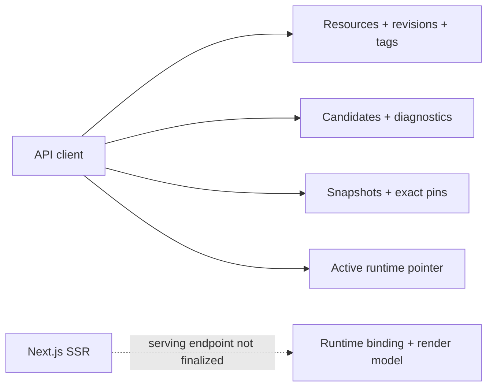
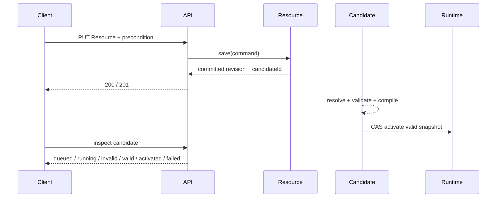
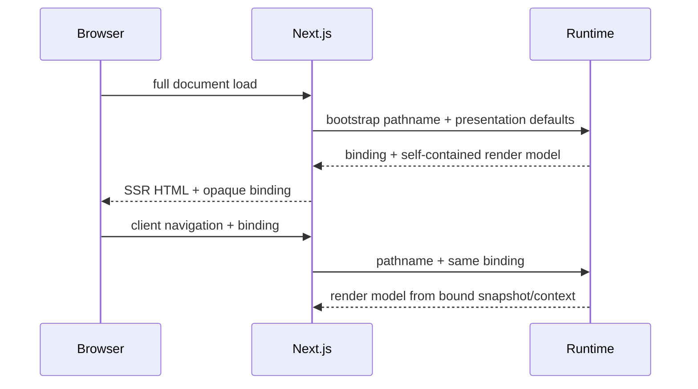

import { File, Folder, Files } from 'fumadocs-ui/components/files';

`public/openapi/v0/openapi.yaml` is the canonical machine-readable HTTP contract. The [interactive API Reference](/api-reference/) renders that same document.

## API surface



The defined OpenAPI surface is an **authoring and inspection API**. It deliberately does not expose Resource deletion, tag mutation, manual activation, candidate retry, compiled-artifact download, or the still-undecided SSR serving endpoint.

## Resource identity in URLs

Resource identity is `(kind, metadata.name)`. `apiVersion` selects the contract for a revision; it is not part of identity and therefore is not part of the canonical Resource URL.

A manifest with:

```yaml
apiVersion: v0
kind: page
metadata:
  name: home
```

is addressed as:

```text
/api/v0/resources/page/home
```

If that same Resource later receives a revision with another supported `apiVersion`, its canonical Resource URL remains unchanged. Historical revision URLs are also anchored by `(kind, name)` plus the immutable `revisionId`; the revision response carries its own `apiVersion`.

All defined API operations require bearer authentication. Authorization stays behind an operation-level boundary rather than hard-coding Role names into controllers so the Policy RFC can later provide decisions without reshaping the transport layer.

## Resource writes

Use `PUT /api/v0/resources/{kind}/{name}` with the complete YAML source. The source `kind` and `metadata.name` must match the URL. `apiVersion` is validated from the source and stored on the resulting revision.

### Optimistic concurrency

Creation:

```http
If-None-Match: *
```

Update:

```http
If-Match: "<current-revision-id>"
```

| Condition                                                | HTTP result                 |
| -------------------------------------------------------- | --------------------------- |
| Required precondition missing                            | `428 Precondition Required` |
| ETag is stale or create-only Resource already exists     | `412 Precondition Failed`   |
| Durable invariant conflict unrelated to the precondition | `409 Conflict`              |

The application service performs the compare/write in the same authoring transaction that appends the immutable revision and advances the current pointer. A controller-side read/check is not the concurrency boundary.

### No-op source write

Canonicalize source and compare it with the current revision checksum. Identical source returns the existing revision with `200`; it does not create duplicate immutable history.

A dependency-only change never changes an unchanged importer's source checksum or manufactures another revision for it.

## Save versus activation

A successful write means **authoring state committed**, not **runtime activated**.



Do not keep the authoring HTTP request open while compilation runs. Candidate diagnostics belong to the candidate resource; they are not embedded into a generic save error after the authoring transaction already committed.

## Checksum contract

The HTTP model exposes separate identities and must not collapse them:

| Field                            | Meaning                                                 | Child dependency change                                      |
| -------------------------------- | ------------------------------------------------------- | ------------------------------------------------------------ |
| `ResourceRevision.checksum`      | Canonical authored source of that exact revision.       | No change for an unchanged importer.                         |
| `SnapshotResource.graphChecksum` | Resolved subgraph rooted at that exact pinned Resource. | Changes for affected ancestors.                              |
| `SiteSnapshot.graphChecksum`     | Complete resolved Site graph selected by the snapshot.  | Changes when any selected dependency changes the root graph. |
| `SiteSnapshot.checksum`          | Compiled snapshot output.                               | Changes when compiler-relevant runtime output changes.       |

A new snapshot can therefore keep the same `siteRevisionId` while its root `graphChecksum` and selected child revision change.

## Tags

`POST .../tags` creates one immutable `(kind, name, tag) → revisionId` association.

- retrying the identical association returns the existing result;
- reusing that tag for another revision is a conflict;
- a revision owned by another Resource is rejected;
- there is no endpoint that moves a tag.

## Pagination

List operations use opaque cursor pagination:

```json
{
  "items": [],
  "page": {
    "nextCursor": null,
    "hasMore": false
  }
}
```

`limit` defaults to 50 and is capped at 200. Cursor encoding is implementation-owned; clients do not parse or construct cursors. Ordering includes a unique tie-breaker so concurrent inserts cannot make a page ambiguous.

## Problem Details

Transport failures use `application/problem+json` with a stable Taskmigo `code` in addition to standard Problem Details fields.

```json
{
  "type": "/problems/resource-precondition-failed",
  "title": "Resource precondition failed",
  "status": 412,
  "detail": "The Resource has changed since it was read.",
  "code": "RESOURCE_PRECONDITION_FAILED"
}
```

Use `violations[]` for multiple request/source-envelope errors. Do not expose SQL errors, stack traces, secrets, Expression context values, or exception class names as the machine contract.

## SSR serving contract

The current OpenAPI inspection endpoints are not sufficient for Next.js rendering. Next.js must not call Resource/revision endpoints to reconstruct `Site → Application → Page → Component` itself.

The future serving boundary works with an opaque **runtime binding** for one browser application instance.



The logical render operation supplies everything required for the matched Page: Site/Application layout metadata, Page metadata/body, required reusable Components, and backend-resolved Translation/Expression values.

The happy path targets **one backend round trip** from Next.js per render/navigation. Exact endpoint, request/response DTO, binding token/lease representation, expiry/revocation errors, and cache protocol remain open decisions and must not be invented in OpenAPI until agreed.

A valid binding always resolves against its bound snapshot and presentation context. It does not fall back to `resource.current_revision_id` or the newly active snapshot. Presentation pinning also does not make authorization/account/business state stale; those decisions follow the owning capability's freshness contract.

## Target Spring adapter

<Files>
  <Folder name='resource/internal/web' defaultOpen>
    <File name='ResourceController.java' />
    <File name='ResourceRevisionController.java' />
    <File name='ResourceTagController.java' />
    <File name='SiteCandidateController.java' />
    <File name='SiteSnapshotController.java' />
    <File name='SiteRuntimeController.java' />
    <Folder name='dto'>
      <Folder name='request' />
      <Folder name='response' />
    </Folder>
    <File name='ResourceProblemHandler.java' />
  </Folder>
</Files>

Controllers map HTTP to framework-neutral application commands/queries. They do not own graph resolution, snapshot transactions, or revision/tag invariants.

Suggested application boundaries include Resource command/query services, revision/tag queries, candidate/diagnostic queries, snapshot queries, and active-runtime inspection. Do not add an SSR controller until its transport contract is defined; implement the stable runtime-binding/render services behind the transport boundary first.

## Manifest source boundary

The web adapter treats the body as source text plus media type. Resource application/domain code owns YAML parsing, URL/source identity comparison, canonicalization, source checksum, contract dispatch, and revision persistence.

The identity in source must match the URL identity. Never silently rename/re-key a Resource because those two inputs disagree.

## OpenAPI change rule

When a **defined HTTP operation** changes, update the OpenAPI operation/schema/error examples and then implementation/tests/documentation in the same change.

When behavior is **not yet defined**—such as the SSR serving endpoint—document the internal product/runtime requirement but do not publish a speculative route or DTO.

## Verification

Contract and integration coverage must prove:

- OpenAPI 3.2.0 parses with valid references and unique `operationId` values;
- bearer authentication/authorization and content negotiation match the contract;
- ETags/preconditions/no-op writes match authoring semantics;
- candidate status/diagnostic serialization is stable and safe;
- `SiteSnapshot.graphChecksum` and `SnapshotResource.graphChecksum` serialize exactly as persisted;
- cursor ordering is deterministic;
- URL/source Resource identity mismatch is rejected;
- concurrent writers cannot both advance the same current revision;
- future SSR serving coverage proves one self-contained render response, bound snapshot/locale stability, full-reload adoption, and no mutable authoring lookup after binding validation.

An API change is done only when OpenAPI, application boundary, persistence/concurrency semantics, security mapping, tests, and Developer/Manual documentation agree.
