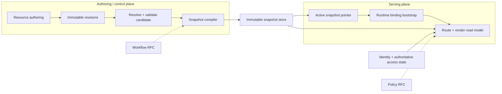
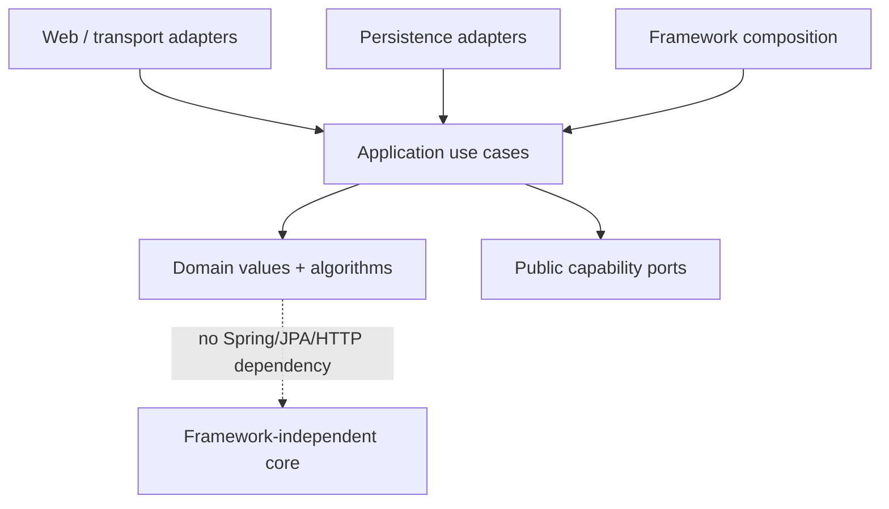

import { File, Folder, Files } from 'fumadocs-ui/components/files';

This page defines the target architecture. It explains **who owns each decision** and the invariants implementation must preserve; concrete classes and persistence details live in the subsystem pages.

## System boundaries



The control plane may change while users continue to run an older immutable snapshot. The serving plane never reconstructs runtime state from mutable current Resource pointers.

## Capability ownership

| Capability       | Owns                                                                                                                   | Does not own                                               |
| ---------------- | ---------------------------------------------------------------------------------------------------------------------- | ---------------------------------------------------------- |
| `resource`       | Resource identity/history, tags, graph resolution, candidates, snapshots, activation, runtime-binding snapshot access. | User identity, Policy decisions, Workflow execution state. |
| `expression`     | Safe FreeMarker compilation/evaluation foundation and profile enforcement.                                             | Business functions such as Translation catalog ownership.  |
| `access`         | Authentication and authoritative identity/access state.                                                                | Resource compilation or pinned presentation context.       |
| `policy` (RFC)   | Proposed API request/object authorization.                                                                             | Authentication and Resource authoring.                     |
| `workflow` (RFC) | Proposed durable execution state.                                                                                      | Resource revision history or snapshot activation.          |

Cross-capability dependencies point to narrow public ports or events. No capability reads another capability's internal repository as a shortcut.

## Target module shape

<Files>
  <Folder name='com.taskmigo.console' defaultOpen>
    <Folder name='resource'>
      <File name='package-info.java' />
      <File name='public ports and events' />
      <Folder name='internal'>
        <Folder name='application' />
        <Folder name='domain' />
        <Folder name='persistence' />
        <Folder name='web' />
        <Folder name='configuration' />
      </Folder>
    </Folder>
    <Folder name='expression' />
    <Folder name='access' />
    <Folder name='policy (RFC)' />
    <Folder name='workflow (RFC)' />
  </Folder>
</Files>

The public root contains only contracts another capability legitimately consumes. Implementation stays below `internal`.

## Dependency direction



Taskmigo-specific rules:

- transaction ownership belongs to the use case that makes the complete durable decision;
- compiler/runtime code receives immutable Resource/snapshot identities explicitly rather than rereading mutable pointers;
- cross-module data is represented by public value types, not another module's persistence entity;
- shared technical foundations are introduced only when multiple capabilities need the same stable mechanism.

## Invariants every implementation preserves

| Invariant                                                           | Why it matters                                                                    |
| ------------------------------------------------------------------- | --------------------------------------------------------------------------------- |
| Resource revision is authored-source history only.                  | A child change must not manufacture ancestor revisions.                           |
| Resolved graph identity propagates dependency changes.              | The Site can produce a new snapshot even when its own revision stays unchanged.   |
| Snapshot persistence and activation are separate atomic boundaries. | Invalid or partial candidates cannot replace a working runtime.                   |
| Runtime binding is application-instance scoped.                     | Client navigation cannot mix snapshots or presentation locales.                   |
| Presentation pinning does not pin authority.                        | Permission/account/business state can retain the freshness required by its owner. |
| Expressions execute on the backend.                                 | Browser rendering does not become a second Expression/runtime engine.             |
| Public HTTP schema is design-first OpenAPI.                         | Implementation cannot silently redefine transport semantics.                      |

## Implementation dependency order

```mermaid
flowchart TD
  history["Resource identity + immutable revisions"] --> references["Tags + reference selection"]
  references --> expression["Expression foundation"]
  expression --> contracts["Manifest contracts"]
  contracts --> graph["Resolved graph + diagnostics"]
  graph --> candidate["Candidate pipeline"]
  candidate --> snapshot["Snapshot persistence + activation"]
  snapshot --> binding["Runtime binding + render model"]
  binding --> operations["Retention + operational hardening"]
  binding -.-> policy["Policy RFC"]
  binding -.-> workflow["Workflow RFC"]
```

[Development instructions](/versions/v0/developer/development-instructions) turns this dependency graph into implementation phases. [Resource and runtime](/versions/v0/developer/resource-runtime) is canonical for the serving side.

## Open decisions

These decisions remain intentionally unresolved and must not be invented in implementation:

- concrete SSR serving endpoint, request/response schema, and runtime-binding transport;
- runtime-binding token/lease representation, maximum lifetime, expiry, revocation, and emergency reload behavior;
- physical snapshot artifact partitioning, cache topology, renderer/artifact compatibility protocol, and retention duration;
- candidate queue implementation, retry/coalescing policy, and operational limits;
- explicit in-tab presentation-change transport and any future pinned presentation fields beyond locale;
- Role/Group management and Policy attachment APIs;
- Policy API metadata/database mapping contract while Policy remains RFC;
- Workflow start/inspect/interact/cancel/retry APIs, Action idempotency/error envelope, retention, and parallel execution while Workflow remains RFC;
- production signing-key integration and quantitative operational SLOs.

An open decision may refine internal representation, but it cannot weaken the public Resource, snapshot, runtime-binding, or safety contracts already defined.
