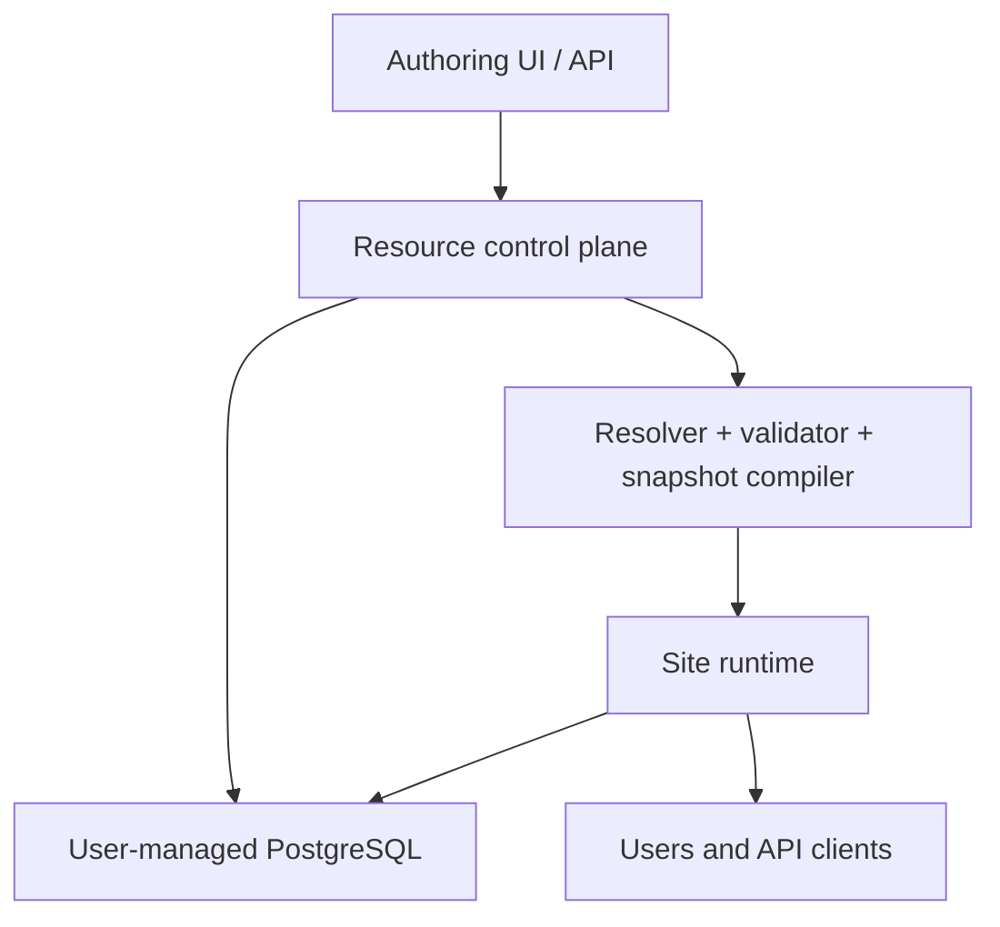
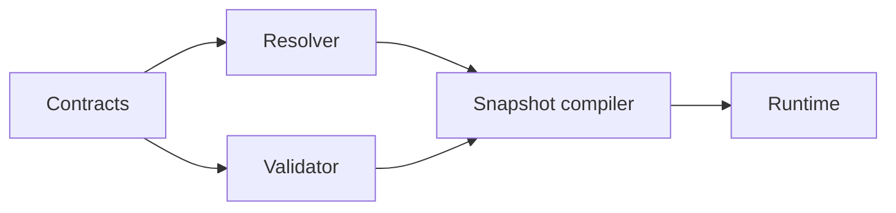

Taskmigo is a manifest-driven system: mutable authoring operations create immutable resource revisions, then a compiler-like pipeline produces an immutable Site snapshot for runtime use.

## System context

Taskmigo owns one configurable PostgreSQL schema, `taskmigo` by default. It must not access other user schemas. Multi-tenancy and database routing are outside the current contract.

## Logical components

These are responsibility boundaries, not required process or package names.

| Component              | Owns                                                                  | Must not own                                            |
| ---------------------- | --------------------------------------------------------------------- | ------------------------------------------------------- |
| Resource control plane | Create/update operations, immutable revisions, tags, diagnostics.     | Runtime mutation of an active snapshot.                 |
| Reference resolver     | Identity lookup, tag-constraint selection, import graph traversal.    | Kind-specific runtime behavior.                         |
| Contract validator     | Schema, field, Expression, reference, graph, and security validation. | Partial activation or fallback to a different revision. |
| Snapshot compiler      | Normalized runtime model and exact revision pins.                     | Authoring-state mutation.                               |
| Activator              | Atomic replacement of the active snapshot reference.                  | Incremental exposure of a candidate.                    |
| Site runtime           | Serve Pages and APIs from one pinned snapshot per operation.          | Reading mutable authoring state to complete a request.  |
| Recovery worker        | Reevaluate Sites affected by dependency changes.                      | Bypassing the normal resolver and validator.            |
| Policy engine (RFC)    | API Policy selection, request decisions, object-filter compilation.   | Application-memory filtering or raw SQL rendering.      |
| Workflow engine (RFC)  | Persisted executions, step attempts, interaction waits, navigation.   | Switching revisions for an existing execution.          |

## Data ownership

| Data                      | Mutability                                  | Identity / lookup                              | Consumer                             |
| ------------------------- | ------------------------------------------- | ---------------------------------------------- | ------------------------------------ |
| Resource revision         | Immutable                                   | Resource identity plus revision ID.            | Resolver and audit/history views.    |
| Revision tag              | Immutable association                       | Resource identity plus semantic version.       | Reference resolver.                  |
| Diagnostic                | Append or replace per candidate evaluation. | Candidate/Site and source location.            | Authoring UI/API and operations.     |
| Site snapshot             | Immutable                                   | Snapshot ID with exact resource revision pins. | Runtime and Workflow executions.     |
| Active snapshot reference | Atomically replaceable                      | Logical Site.                                  | New runtime operations.              |
| Workflow execution (RFC)  | Persisted state transitions                 | Execution ID.                                  | Workflow engine and interaction API. |

Physical PostgreSQL tables and indexes remain implementation decisions. Preserve the ownership and immutability rules even if multiple logical records share a table.

## Non-negotiable invariants

1. A request or execution observes one snapshot, never a mixture of revisions.
2. Invalid candidates cannot replace a valid active snapshot.
3. Resolution is deterministic for the same revisions, tags, and contract versions.
4. Activation is atomic; a package or dependency recovery cannot expose a partial graph.
5. Security failures are fail-closed: Policy compilation cannot fall back to an unfiltered query.
6. Workflow transitions required for recovery are persisted before dependent work is scheduled.
7. Diagnostics may identify a manifest path and source location but must not expose credentials or data outside Taskmigo's schema.

## Dependency direction

Runtime code consumes compiled contracts; it must not become an alternative validator. Database adapters implement declared capabilities for compilation layers such as Policy predicates, while product contracts remain storage-agnostic.

## Where to continue

- [Resource pipeline](/versions/v0/developer/resource-pipeline): compilation and activation mechanics.
- [Policy engine](/versions/v0/developer/policy-engine): security-critical phase separation and database translation.
- [Workflow engine](/versions/v0/developer/workflow-engine): durable state transitions and recovery.
- [Quality strategy](/versions/v0/developer/quality-strategy): verification of architectural invariants.
