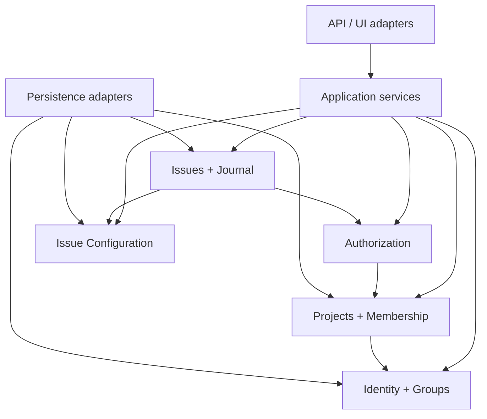

The core should be implemented as a modular monolith first. Taskmigo's domains require transactional consistency more than independent deployment, and splitting them into services would turn simple invariants such as project membership and issue transitions into distributed coordination problems.

## Domain boundaries

**Identity** owns users, account status, and groups. It does not know project roles.

**Projects** owns projects and principal membership. It references user/group identities but does not own them.

**Authorization** resolves effective roles and permissions from project membership. It contains no issue lifecycle logic.

**Issue Configuration** owns issue types, priorities, statuses, roles, permission assignments, workflows, and project configuration that selects those values.

**Issues** owns issues, hierarchy, assignment, comments, journal entries, and transition orchestration. It asks Authorization whether the actor may attempt the action and asks Issue Configuration whether the requested state is valid.

## Application boundary

All mutations should pass through application services that establish one transaction, load the required domain state, authorize the actor, validate invariants, persist changes, and append audit records before commit.

HTTP handlers, GraphQL resolvers, jobs, and CLI commands are adapters. They must not bypass domain/application invariants by writing repositories directly.

## Deployment direction

Keep module interfaces explicit so a future extraction remains possible, but do not introduce network boundaries inside the core simply for theoretical scalability. The first scaling tools should be ordinary database indexing, caching of safe derived reads, read replicas where appropriate, and background processing for non-transactional side effects.
