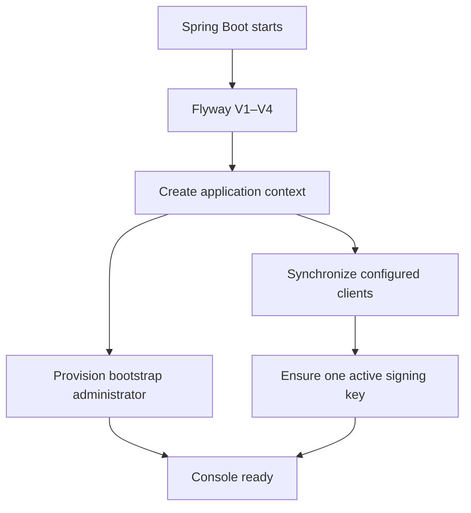

Taskmigo is a modular monolith built around capability ownership and immutable runtime snapshots. Start here to understand dependency direction and the invariants every implementation must preserve.

## Architecture and package rules

Taskmigo Console is a modular monolith. A top-level package represents a cohesive business capability; packages below `internal` separate application, domain, persistence, web, and configuration concerns.

```text
<capability>/
├── package-info.java                    # Spring Modulith boundary
└── internal/
    ├── application/                     # use cases and transaction orchestration
    ├── domain/                          # entities, value objects and domain behavior
    ├── persistence/                     # JPA/JDBC adapters
    ├── web/                             # controllers, request/response types, error mapping
    └── configuration/                   # Spring beans and framework composition
```

Module boundaries are declared in each capability's `package-info.java`, beginning with `access/package-info.java` and `system/package-info.java`. A module with no compile-time dependency declares none; every additional dependency must be explicit and minimal.

When adding a real business capability:

- create one top-level module for the capability, not one module per framework type;
- expose cross-module contracts only from the module's public root package;
- keep implementation types below `internal`;
- declare the smallest exact `allowedDependencies` set when a compile-time dependency is necessary;
- prefer a public application interface or domain event over access to another module's repository;
- use constructor injection; `@Autowired` is prohibited;
- keep transactions in application services or persistence adapters that own the complete operation;
- add the module and dependency rules to `ArchitectureTest`.

Do not create a generic `common`, `api`, or `composition` dumping ground. A shared error envelope, serializer, or filter moves to a foundation package only after at least two capabilities need the same stable contract and an architecture test protects its scope.

## Application startup and request flows

### Startup



`IdentityConfiguration.administratorBootstrap` invokes `BootstrapAdministrator.provision`. `AuthorizationServerConfiguration.authorizationBootstrap` invokes client synchronization and then signing-key initialization. The runners have no required relative order; each must be independently safe and idempotent unless an explicit dependency is introduced.

### HTTP security

Spring Security chooses the first matching `SecurityFilterChain`:

| Order | Matcher                        | Behavior                                                                                        |
| ----: | ------------------------------ | ----------------------------------------------------------------------------------------------- |
| `100` | Authorization Server endpoints | OAuth 2.1 and OpenID Connect; unauthenticated browser requests enter form login.                |
| `200` | `/api/**`                      | JWT Resource Server; `/api/public` is explicitly public and other paths require authentication. |
| `300` | Fallback                       | Browser routes and form login.                                                                  |

Feature-specific authorization belongs beside the owning controller or use case through `@PreAuthorize`. The security-chain owner remains `access`; a new feature must not create a competing catch-all chain.

### JWT and OAuth client lifecycle

JWT validation is local: signature, timestamps, issuer, and authorities are checked without database client-state lookup. Disabling or deleting an OAuth client prevents new authorization, token, and refresh operations, but a previously issued self-contained JWT remains valid until `exp`. Permanent deletion removes stored authorization and consent rows through database cascades; it does not retroactively revoke the JWT itself.

## Common code and coding conventions

Common behavior should be a stable contract, not a convenience folder.

| Concern              | System pattern                                  | Rule for new code                                                                     |
| -------------------- | ----------------------------------------------- | ------------------------------------------------------------------------------------- |
| Time                 | Injected `Clock`                                | Never call `Instant.now()` in domain/application behavior that tests must control.    |
| Dependency injection | Constructors                                    | Do not add field injection or `@Autowired`.                                           |
| Transactions         | Application service/repository method           | One use case owns its transaction; controllers and domain entities do not.            |
| API errors           | Scoped `RestControllerAdvice` + Problem Details | Use stable machine `code`, safe human detail, and feature ownership.                  |
| DTOs/value objects   | Java records where immutable                    | Validate at creation/boundary; avoid untyped `Map` past parsing boundaries.           |
| Persistence          | Flyway schema + JPA/JDBC validation             | Never use Hibernate DDL generation; migrations and integration tests change together. |
| Cross-module calls   | Public root interface or event                  | Never import another module's `internal` package or repository.                       |
| Framework mapping    | Configuration/persistence/web adapter           | Keep Spring/Nimbus/JPA types out of core domain contracts where practical.            |

If two capabilities need a common primitive, first decide whether one capability should own and expose it. Create a shared foundation only for truly technical, stable code such as correlation IDs or a generic outbox primitive, and protect the allowed contents with architecture tests. Shared code must not contain business endpoints, domain repositories, or feature-specific DTOs.

## Recommended implementation order

The order below produces usable vertical slices and avoids building Policy or Workflow on an unstable snapshot model:

1. Resource identity, immutable revisions, Flyway schema, and CRUD API.
2. Tag creation and deterministic reference parsing/selection.
3. Versioned Manifest contracts for Site, Application, Page, Component, and Translation.
4. Resource graph resolution and diagnostics.
5. Snapshot compilation, persistence, atomic activation, and runtime acquisition.
6. Page/Application runtime using only compiled snapshots.
7. Role/Group domain and effective-role resolution in `access`.
8. Policy parser, snapshot contributor, request authorization, then object-query adapter.
9. Workflow definition compiler and persistence state machine.
10. Workflow worker, outbox, Actions, UI interaction, and operational recovery.

Each step should include its migration, source code, tests, Manual updates, and a runnable acceptance scenario. Do not create all database tables first and postpone behavior; unused schema quickly diverges from the actual model.

## Open decisions

The following require explicit product or architecture decisions before implementation can be considered complete:

- Application source layout after Console gains a separate end-user runtime or frontend.
- Public resource CRUD, revision-tag, diagnostics, and snapshot inspection APIs.
- Physical snapshot artifact format, cache, compiler compatibility, and retention.
- Candidate queue implementation, retry policy, coalescing, and operational limits.
- Role/Group management APIs and migration from or coexistence with `app_authority`.
- API contract for exposing Policy Request values and database Resource mappings.
- Workflow start, inspect, interact, cancel, retry, and authorization APIs.
- Action idempotency/error contract, execution retention, cancellation, and parallel fork/join.
- Production signing-key integration with KMS/HSM instead of database private JWK storage.
- Quantitative SLOs for compilation, activation, API latency, Workflow scheduling, and recovery.

An open decision may refine the proposed class or table layout, but it must preserve the public contract and the safety boundaries described above.
