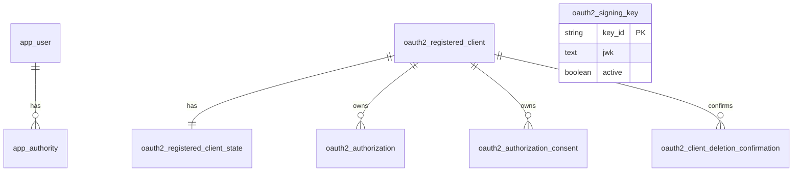

Use this page when you need to locate a responsibility or decide where new application code belongs. Paths under a capability are relative to `console/src/main/java/com/taskmigo/console/` unless shown from the repository root.

## Repository map

```text
taskmigo/
├── compose.yaml                         # PostgreSQL + Console development stack
├── examples/                            # deterministic local environment and wrapper
├── docs/                                # application-level technical notes
└── console/
    ├── build.gradle.kts                 # Java, Spring Boot, Modulith and test dependencies
    └── src/
        ├── main/java/com/taskmigo/console/
        │   ├── ConsoleApplication.java  # application entry point
        │   ├── access/                  # identity and access bounded context
        │   └── system/                  # sample system endpoints
        ├── main/resources/
        │   ├── application.yml
        │   └── db/migration/            # Flyway is the database schema owner
        └── test/java/com/taskmigo/console/
            ├── ArchitectureTest.java
            └── PersistenceIntegrationTest.java
```

Start at `console/src/main/java/com/taskmigo/console/ConsoleApplication.java`. It enables configuration-properties scanning and method security. Spring Boot discovers capability modules below `com.taskmigo.console`.

## Find code by responsibility

| You want to change…             | Canonical source location                                                        | Follow the call to…                                                     |
| ------------------------------- | -------------------------------------------------------------------------------- | ----------------------------------------------------------------------- |
| Security-chain precedence       | `access/internal/configuration/AccessSecurityConfiguration.java`                 | Authorization Server configuration or controller-level `@PreAuthorize`. |
| Bootstrap administrator         | `access/internal/application/identity/BootstrapAdministrator.java`               | `AppUser` and `AppUserRepository`.                                      |
| Form-login user lookup          | `access/internal/application/identity/JpaUserDetailsService.java`                | `AppUser` domain state.                                                 |
| Configured OAuth clients        | `access/internal/application/oauth/client/OAuthClientSynchronizer.java`          | `SpringRegisteredClientMapper` and `ActiveRegisteredClientRepository`.  |
| OAuth client lifecycle API      | `access/internal/web/oauth/OAuthClientManagementController.java`                 | `OAuthClientManagementService`.                                         |
| OAuth deletion confirmation     | `access/internal/application/oauth/management/OAuthClientManagementService.java` | `ClientDeletionConfirmation` and its repository.                        |
| RSA signing-key lifecycle       | `access/internal/application/signing/SigningKeyLifecycle.java`                   | `RsaSigningKeyGenerator`, `SigningKeyRepository`, `DatabaseJwkSource`.  |
| System API scopes               | `system/internal/web/SystemApiController.java`                                   | `AccessSecurityConfiguration`.                                          |
| Database structure              | `console/src/main/resources/db/migration/`                                       | JPA entities and Spring Authorization Server JDBC services.             |
| Architecture enforcement        | `console/src/test/java/com/taskmigo/console/ArchitectureTest.java`               | Spring Modulith verification and ArchUnit rules.                        |
| End-to-end persistence/security | `console/src/test/java/com/taskmigo/console/PersistenceIntegrationTest.java`     | PostgreSQL Testcontainer, MockMvc, OAuth token issuance.                |

Paths under a capability are relative to `console/src/main/java/com/taskmigo/console/`.

## Foundation class and function design

### Identity

| Type / function                                      | Responsibility and behavior                                                                                                                                                 |
| ---------------------------------------------------- | --------------------------------------------------------------------------------------------------------------------------------------------------------------------------- |
| `IdentityProperties.Bootstrap`                       | Validated `username` and `password` from `app.security.bootstrap`. Password has no source-code default.                                                                     |
| `IdentityConfiguration.passwordEncoder()`            | Creates Spring Security's delegating password encoder.                                                                                                                      |
| `BootstrapAdministrator.provision(bootstrap)`        | Encodes the configured password; creates or updates and re-enables the user; grants `ROLE_USER` and `ROLE_ADMIN`; preserves unrelated authorities; commits transactionally. |
| `JpaUserDetailsService.loadUserByUsername(username)` | Loads `AppUser`, preserves its enabled state, and maps authorities into Spring `UserDetails`.                                                                               |
| `AppUser`                                            | JPA aggregate for username, encoded password, enabled flag, and authorities. Domain methods update credentials, grant authority, and disable the user.                      |
| `AppUserRepository`                                  | `JpaRepository<AppUser, String>` owned by `access`.                                                                                                                         |

### OAuth clients

| Type / function                                                       | Responsibility and behavior                                                                                                                                                                                           |
| --------------------------------------------------------------------- | --------------------------------------------------------------------------------------------------------------------------------------------------------------------------------------------------------------------- |
| `OAuthClientSynchronizer.synchronize(properties)`                     | Requires at least one configured client, maps and upserts every registration, marks it configuration-managed, then disables absent clients unless manually enabled. One transaction prevents partial synchronization. |
| `SpringRegisteredClientMapper.map(registrationId, client, existing)`  | Converts complete Spring configuration into `RegisteredClient`, retaining its internal ID when updating. Rejects unknown algorithms and empty client IDs.                                                             |
| `ActiveRegisteredClientRepository`                                    | Wraps Spring's JDBC repository. Authorization Server lookups return active clients only; management methods can include inactive clients.                                                                             |
| `RegisteredClientState`                                               | Owns `active`, `manualOverride`, and `updatedAt`; distinguishes configuration activation from manual enablement.                                                                                                      |
| `OAuthClientManagementService.list()`                                 | Returns a client-ID-sorted, secret-free management view.                                                                                                                                                              |
| `OAuthClientManagementService.enable(clientId, requestedBy)`          | Manually activates an existing client and records the override.                                                                                                                                                       |
| `OAuthClientManagementService.requestDeletion(clientId, requestedBy)` | Rejects configured clients, invalidates prior confirmations, creates a five-minute token, stores only its SHA-256 hash, and returns plaintext once.                                                                   |
| `OAuthClientManagementService.delete(clientId, token, requestedBy)`   | Validates token use, expiry, requester, target client, and configuration state; marks confirmation used and permanently deletes the client transactionally.                                                           |
| `OAuthClientManagementExceptionHandler`                               | Maps missing client to `404` and lifecycle conflicts to `409` Problem Details with stable `code` values.                                                                                                              |

### Signing keys

| Type / function                            | Responsibility and behavior                                                                                                     |
| ------------------------------------------ | ------------------------------------------------------------------------------------------------------------------------------- |
| `SigningKeyLifecycle.ensureActiveKey()`    | Returns when an active key exists; otherwise generates and stores one. A unique partial index resolves concurrent initializers. |
| `RsaSigningKeyGenerator.generate()`        | Creates a 3072-bit RSA key pair and random key ID; wraps cryptographic failures as explicit startup failures.                   |
| `KeyPairGeneratorFactory`                  | Injection seam used to test cryptographic failure.                                                                              |
| `DatabaseJwkSource.get(selector, context)` | Loads active persisted JWKs, parses them, applies Nimbus selection, and surfaces invalid database data as `KeySourceException`. |

### Web APIs

| Method and path                                                    | Owner                                    | Authorization                                        |
| ------------------------------------------------------------------ | ---------------------------------------- | ---------------------------------------------------- |
| `GET /api/public`                                                  | `SystemApiController.publicEndpoint()`   | Public.                                              |
| `GET /api/me`                                                      | `SystemApiController.currentUser(jwt)`   | JWT with `api.read`.                                 |
| `GET /api/admin`                                                   | `SystemApiController.adminEndpoint(jwt)` | JWT with `api.admin`.                                |
| `GET /api/admin/oauth2-clients`                                    | `OAuthClientManagementController.list()` | JWT with `api.admin`; secrets omitted.               |
| `POST /api/admin/oauth2-clients/{clientId}/enable`                 | `enable(...)`                            | JWT with `api.admin`.                                |
| `POST /api/admin/oauth2-clients/{clientId}/deletion-confirmations` | `requestDeletion(...)`                   | JWT with `api.admin`; returns one-time confirmation. |
| `DELETE /api/admin/oauth2-clients/{clientId}`                      | `delete(...)`                            | JWT with `api.admin` plus `X-Deletion-Confirmation`. |

### Expression engine

Taskmigo Expressions follow Go `text/template` syntax and semantics. The implementation exposes only field-approved context values and functions; it never evaluates arbitrary code. A field contract supplies the expected result type and an expression profile such as `GENERAL`, `WORKFLOW`, or `POLICY_PREDICATE`.

| Type / function                                | Responsibility and behavior                                                                                                               |
| ---------------------------------------------- | ----------------------------------------------------------------------------------------------------------------------------------------- |
| `ExpressionCompiler.compile(source, contract)` | Parses once, rejects unavailable syntax/functions/context paths, checks the expected result type, and returns an immutable compiled form. |
| `ExpressionContract`                           | Declares the profile, context schema, function set, expected type, and whether literal text around template actions is permitted.         |
| `ExpressionFunctionRegistry`                   | Registers explicit, side-effect-free functions by profile; duplicate names fail startup.                                                  |
| `CompiledExpression.evaluate(context)`         | Evaluates against validated data with execution limits and returns the typed result or a source-aware error.                              |
| `ExpressionDiagnostic`                         | Carries a stable code, manifest path, line/column, and safe message without input secrets.                                                |

A value containing only one action, such as `'{{ eq .Step.status "done" }}'`, preserves the function's typed result. Literal text or multiple rendering actions produce a string and are valid only where the field accepts rendered text. If the implementation language is not Go, conformance fixtures must compare parsing, whitespace, pipelines, variables, conditionals, iteration, escaping, and error behavior with Go `text/template` for every supported construct.

Policy uses a restricted `POLICY_PREDICATE` profile. It accepts the familiar `{{ ... }}` action grammar but forbids output rendering, pipelines, variables, control blocks, iteration, I/O, and side effects. The complete user-facing function lists remain in [Expressions](/versions/v0/manuals/expressions) and [Policy predicate functions](/versions/v0/manuals/manifests/v0-policy#available-predicate-functions).

## Database foundation

Flyway owns schema evolution. Hibernate uses `ddl-auto: validate`; JPA must never create or update production tables. `open-in-view` is disabled, so application services must load everything needed inside their transaction.

Taskmigo owns one configurable PostgreSQL schema, named `taskmigo` by default. Deployment provisions that schema and makes it the effective default for all Taskmigo connections. Configure Flyway's schema, Hibernate's default schema, JDBC `currentSchema`, and the role's `search_path` consistently. The application database role must have no access to other user schemas. This keeps framework-generated unqualified queries inside Taskmigo's boundary.



`oauth2_client_deletion_confirmation.registered_client_id` is a retained logical association, not a foreign key. Confirmation history intentionally survives permanent client deletion so a used token cannot become valid again.

| Migration                               | Tables and constraints                                                                               | Java owner                                                   |
| --------------------------------------- | ---------------------------------------------------------------------------------------------------- | ------------------------------------------------------------ |
| `V1__oauth2_schema.sql`                 | Spring Authorization Server client, authorization, and consent tables.                               | Spring JDBC services and `ActiveRegisteredClientRepository`. |
| `V2__identity_and_signing_keys.sql`     | `app_user`, `app_authority`, `oauth2_signing_key`; one-active-key unique index.                      | `AppUser`, `SigningKey`, repositories.                       |
| `V3__registered_client_constraints.sql` | Unique OAuth `client_id`.                                                                            | OAuth synchronization and lookup.                            |
| `V4__oauth_client_lifecycle.sql`        | Active/manual state, deletion confirmation, and delete cascades; migration rejects existing orphans. | OAuth lifecycle domain and management service.               |

Database timestamps are stored as `timestamp with time zone` for Taskmigo-owned lifecycle data. Inject `Clock` into application/domain services instead of calling the system clock directly; this keeps expiry, lifecycle, and retry behavior testable.

## How to implement a new feature

Use this path so architecture, persistence, API, and verification evolve together:

1. Identify the owning capability and public Manual contract.
2. Add or update the capability root `package-info.java`; declare only necessary public module dependencies.
3. Define domain value types and invariants before persistence entities or controller DTOs.
4. Define the application service method and its transaction boundary.
5. Add persistence ports/adapters and a Flyway migration when durable state is required.
6. Add the web adapter and method-level authorization; keep business behavior in the application service.
7. Add unit tests for domain/application behavior, integration tests for PostgreSQL and security, and architecture rules for new boundaries.
8. Update the acceptance map and public/Product status documentation in the same change.

### Where each kind of code belongs

| Code                                               | Location                                                                              |
| -------------------------------------------------- | ------------------------------------------------------------------------------------- |
| Use-case orchestration                             | `<module>/internal/application/<use-case>`                                            |
| Entity/value object and invariant                  | `<module>/internal/domain/<sub-capability>`                                           |
| JPA/JDBC repository or external adapter            | `<module>/internal/persistence/<sub-capability>`                                      |
| Controller, request/response, exception mapping    | `<module>/internal/web/<sub-capability>`                                              |
| Spring bean composition and properties             | `<module>/internal/configuration/<sub-capability>`                                    |
| Cross-module interface/event intentionally exposed | `<module>` public root, outside `internal`                                            |
| Flyway migration                                   | `console/src/main/resources/db/migration`                                             |
| Unit test                                          | Mirrors the source package under `src/test/java`                                      |
| Full PostgreSQL/security flow                      | Capability integration test or `PersistenceIntegrationTest` until split by capability |
