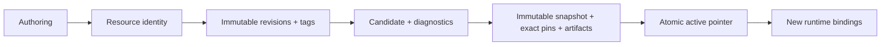
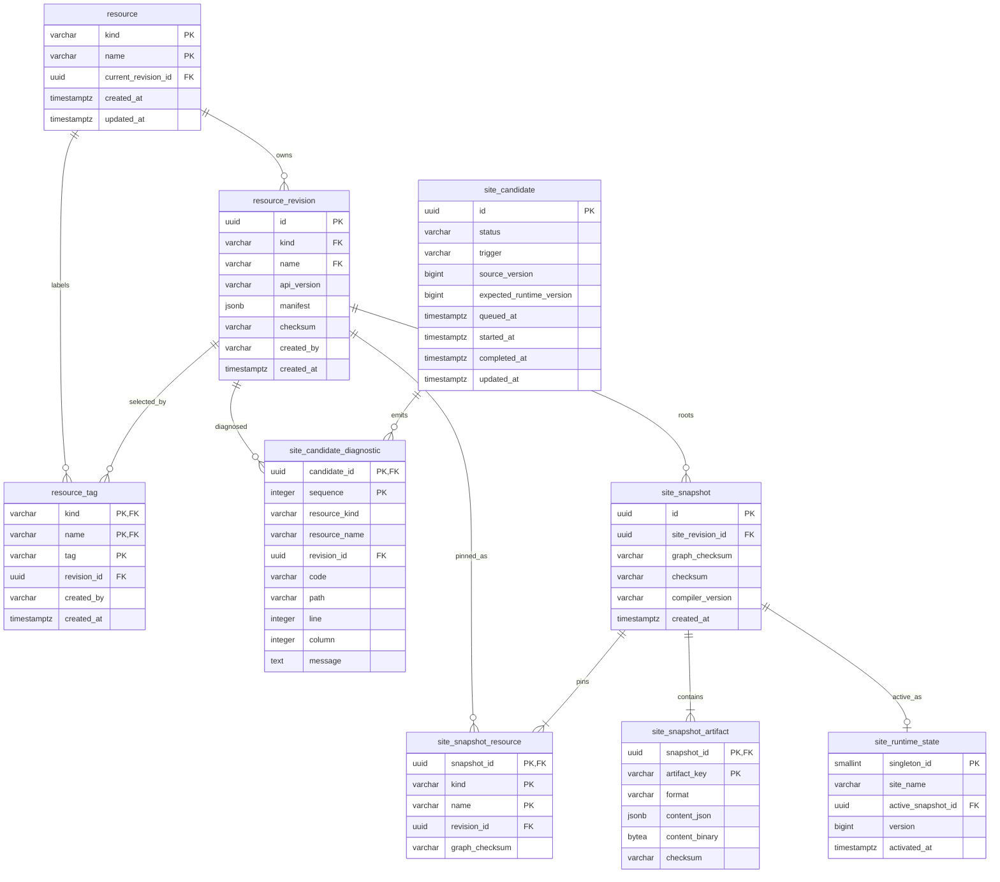
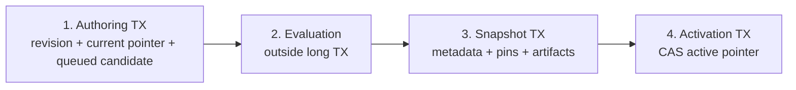

This page is the canonical persistence design for the defined Resource/runtime foundation. Other capabilities own their own durable state; this page does not duplicate Access, Policy, or Workflow schemas.

## Persistence model



The database stores three different kinds of state:

| Layer | Mutable? | Owns |
| --- | --- | --- |
| Authoring | Resource current pointer is mutable; revisions/tags are immutable. | User-authored source history and selectors. |
| Compilation | Candidate status/diagnostics progress through one evaluation attempt. | Why committed source did or did not become runtime. |
| Runtime | Snapshot content is immutable; one active pointer is mutable. | Exact compiled version and retained artifacts used for rendering. |

## Resource/runtime ERD



## Identity constraints Mermaid cannot express

- `resource_revision(kind, name)` references `resource(kind, name)`.
- `resource_revision` has `UNIQUE (id, kind, name)`.
- `resource(current_revision_id, kind, name)` references `resource_revision(id, kind, name)` so one Resource cannot point at another Resource's revision.
- `resource_tag(revision_id, kind, name)` and `site_snapshot_resource(revision_id, kind, name)` reference the same composite revision identity.
- `site_snapshot.site_revision_id` references a Resource revision that the compiler has verified is `kind = 'site'`.
- exactly one logical Site identity is enforced with a partial unique index over `resource` where `kind = 'site'`.
- `site_runtime_state` is one fixed-key row such as `singleton_id = 1`.
- `site_snapshot_artifact` stores exactly one payload representation per row: JSONB or binary.

## Authoring model

### `resource`

`resource` is the mutable identity row. Resource identity is `(kind, name)`; `apiVersion` belongs to each revision and is not part of identity.

`current_revision_id` selects the revision used by unconstrained references. The manifest itself does not live on this row.

### `resource_revision`

Every save that changes canonical authored source appends one immutable revision. Store:

- UUID `id`;
- owning `(kind, name)`;
- `api_version`;
- complete canonical manifest as JSONB;
- source `checksum`;
- creator and timestamp.

A dependency change does not mutate this row or change an unchanged importer's checksum.

### `resource_tag`

A tag is an immutable `(kind, name, tag) → revision_id` selector. Creating the same association may be idempotent; moving an existing tag to another revision is not allowed.

Site, Application, Page, Component, and Translation all use this same authoring model. Do not mirror their paths, UI nodes, props, or translation keys into mutable relational child tables.

## Candidate model

`site_candidate` represents one attempt to turn committed authoring state into a runtime snapshot. Persist explicit status rather than inferring it from nullable timestamps.

The defined statuses are `queued`, `running`, `invalid`, `valid`, `activated`, and `failed`. Store the trigger, the authoring/source version needed to identify what is being evaluated, and `expected_runtime_version` used by activation CAS.

`site_candidate_diagnostic` stores ordered source-aware validation output. `revision_id` may be null when syntax/identity fails before an exact revision can be identified. Never persist secrets or Expression context values in diagnostics.

Queue workers may use PostgreSQL `FOR UPDATE SKIP LOCKED` for candidate acquisition. That pattern is queue-specific, not a general consistency mechanism.

## Snapshot and activation

### Three different checksums

| Column | Identity represented |
| --- | --- |
| `resource_revision.checksum` | Canonical authored source of one exact revision. |
| `site_snapshot_resource.graph_checksum` | Resolved subgraph rooted at one exact pinned Resource revision. |
| `site_snapshot.graph_checksum` | Complete resolved Site graph selected for the snapshot. |
| `site_snapshot.checksum` | Compiled snapshot output produced from that resolved graph and compiler-relevant inputs. |

A child revision can therefore create a new snapshot while `site_revision_id` remains unchanged: affected ancestor pins keep the same `revision_id` but receive new `graph_checksum` values.

### `site_snapshot`

Store immutable snapshot metadata: UUID, exact root `site_revision_id`, root `graph_checksum`, compiled-output `checksum`, `compiler_version`, and creation time.

### `site_snapshot_resource`

Primary key: `(snapshot_id, kind, name)`.

Each row pins both the exact `revision_id` and the resolved `graph_checksum` used by that snapshot. Runtime never re-resolves these pins against current Resource pointers.

### `site_snapshot_artifact`

Artifacts are partitioned by deterministic `artifact_key` instead of forcing the complete runtime into one giant JSON value. Store format/version, one payload representation, and an artifact checksum when independent integrity checks are useful.

Exact partitioning and artifact encoding remain compiler design decisions. Keep artifacts coarse enough to avoid thousands of tiny rows but separable enough that route/Page/component/translation runtime data does not require loading an unrelated whole-site payload.

### `site_runtime_state`

The singleton runtime row contains `site_name`, `active_snapshot_id`, monotonic `version`, and `activated_at`.

Activation uses compare-and-swap:

```sql
UPDATE site_runtime_state
SET active_snapshot_id = :snapshotId,
    version = version + 1,
    activated_at = :activatedAt
WHERE version = :expectedVersion;
```

Zero updated rows means the candidate is stale and cannot overwrite newer runtime state.

The active pointer is used when **bootstrapping a new runtime binding**. Later navigation with a valid binding acquires its exact retained snapshot; it does not reread this pointer as a version selector.

## Transaction boundaries



1. **Authoring transaction:** create Resource when needed, append revision, advance current pointer, enqueue affected-Site candidate.
2. **Candidate evaluation:** resolve, validate, calculate graph checksums, and compile without holding one long database transaction.
3. **Snapshot transaction:** persist snapshot metadata, every exact revision/graph pin, and required artifacts atomically.
4. **Activation transaction:** CAS the runtime version and swap the active snapshot. Stale activation loses.

A crash after snapshot persistence but before activation may leave an inactive snapshot; it must never leave a partially activatable snapshot.

## JSONB boundary

Use typed columns for identity, revision/snapshot IDs, `api_version`, source/graph/output checksums, status, timestamps, versions, and foreign keys.

Use JSONB for complete immutable manifests and JSON-form snapshot artifacts. Do not promote Application routes, Page nodes, Component props, Translation keys, or Expression fragments into columns merely because they are fields in the current DSL.

## Required index families

Create indexes for named invariants/query paths only:

- Resource primary lookup and one-Site uniqueness;
- revision history by Resource and creation order;
- tag selection by Resource/tag;
- candidate pickup by status/queue order;
- diagnostics by candidate/sequence;
- snapshot pins by snapshot/Resource identity;
- reverse revision/snapshot reachability for cleanup;
- active runtime singleton lookup.

Verify performance-sensitive indexes with PostgreSQL `EXPLAIN` against representative data rather than indexing every column.

## Runtime binding persistence

Do **not** add a `runtime_binding` table yet. The binding may become a signed stateless token, a server-side lease, or a hybrid. Persistence choice, maximum lifetime, expiry, revocation, and renderer compatibility are open decisions.

Database cleanup must therefore depend on an explicit retention boundary that can later account for valid bindings without baking one premature token/lease design into the schema.

## Retention and cleanup

A revision cannot be physically removed while it is current, tagged, pinned by a retained snapshot, or referenced by another durable capability. The active snapshot cannot be deleted.

An inactive snapshot is removable only when retention says it is no longer serveable and no durable reference still requires it. Cleanup must be batched, indexed, idempotent, and race-safe.

Public Resource deletion semantics remain open; do not expose physical deletion only because the foreign-key graph makes a delete technically possible.

## Migration order

1. Resource identity, immutable revisions, current-pointer integrity, tags.
2. Candidate queue and diagnostics.
3. Snapshot metadata with root graph checksum and exact Resource revision/graph pins.
4. Snapshot artifacts and atomic runtime state.
5. Retention/cleanup indexes and queries when their policy is defined.

Each migration lands with the Java behavior and PostgreSQL integration coverage that uses it.

## Verification

Use real PostgreSQL for constraints and races. The persistence suite must prove:

- first Resource creation establishes a valid current revision atomically;
- concurrent saves cannot cross-link or corrupt current pointers;
- tags/pins cannot reference another Resource's revision;
- only one Site identity exists;
- child revision changes propagate graph checksums without creating ancestor revisions;
- invalid candidates preserve the active snapshot;
- snapshot metadata, revision/graph pins, and artifacts persist all-or-nothing;
- stale activation loses CAS;
- a bound snapshot remains readable after a newer snapshot activates while retention permits it;
- cleanup cannot remove current, tagged, active, or otherwise retained state;
- deterministic input produces deterministic graph/output identity regardless of row order.
