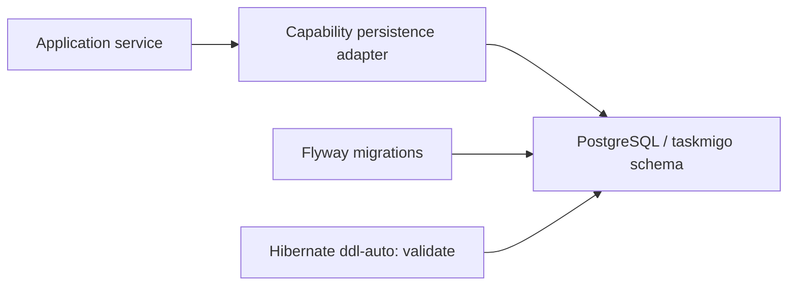
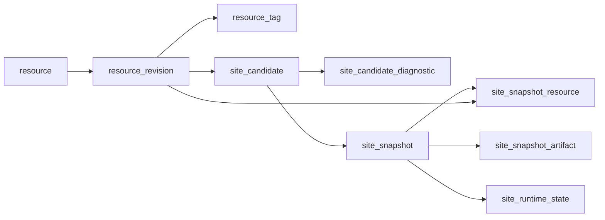
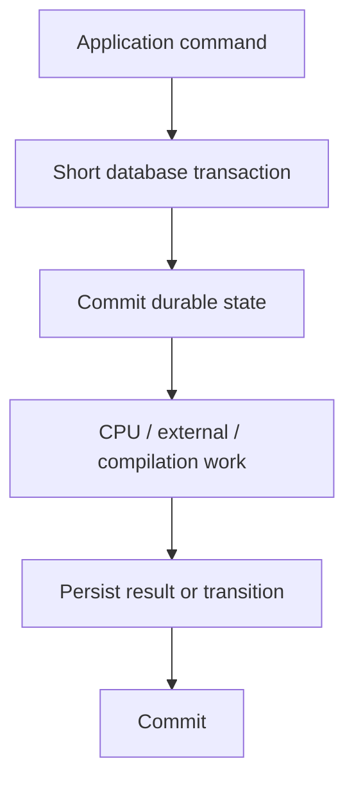

This page is the canonical engineering guide for database design in Taskmigo. It defines ownership, schema rules, planned persistence, migration policy, transaction boundaries, concurrency patterns, indexing, retention, and verification. Feature pages still own their domain state machines; this page owns the physical persistence rules shared across capabilities.

## Database contract

Taskmigo uses PostgreSQL as the durable store for Console state. Flyway owns schema evolution. Hibernate validates mappings but never creates or updates production schema. `open-in-view` stays disabled, so application services must load everything they need inside their transaction boundary.

Taskmigo owns one configurable PostgreSQL schema, named `taskmigo` by default. Configure Flyway schema, Hibernate default schema, JDBC `currentSchema`, and the application role `search_path` consistently. The application role should not have access to unrelated user schemas.



Do not introduce a generic Java `database` module. Persistence remains owned by the capability that owns the business state.

## Ownership and dependency rules

A table belongs to exactly one capability. That capability owns its Flyway change, entity or JDBC mapping, repository, lifecycle rules, and integration tests.

- `access` owns users, authorities, OAuth clients, signing keys, Roles, and Groups. See [Codebase map](/versions/v0/developer/codebase) and [Policy](/versions/v0/developer/policy).
- `resource` owns resources, revisions, tags, candidates, snapshots, and activation. See [Resource and runtime](/versions/v0/developer/resource-runtime).
- `policy` owns Role-to-Policy attachment. See [Policy](/versions/v0/developer/policy).
- `workflow` owns executions, attempts, interactions, and outbox records. See [Workflow](/versions/v0/developer/workflow).

One capability must not import another capability's repository or reach directly into its tables as an implementation shortcut. Cross-module behavior goes through the owning module's public application contract, event, or snapshot artifact. Database foreign keys may protect durable ownership where the domain requires it, but they do not create a Java module dependency by themselves.

## Planned capabilities

The current Planned set is Resource model, Expressions, Site, Application, Page, Component, and Translation. Their persistence is intentionally centered on the Resource model rather than one table per manifest kind.

```mermaid
flowchart TD
  site["Site manifest"] --> revision["resource_revision"]
  app["Application manifest"] --> revision
  page["Page manifest"] --> revision
  component["Component manifest"] --> revision
  translation["Translation manifest"] --> revision
  revision --> graph["Resolve exact revisions"]
  graph --> snapshot["site_snapshot + pins + artifacts"]
  snapshot --> runtime["site_runtime_state"]
  expression["Expressions"] --> compile["Compiled into snapshot artifacts"]
  compile --> snapshot
```

### Why manifests do not get separate tables

`Site`, `Application`, `Page`, `Component`, and `Translation` are versioned Resource kinds. Their public fields can evolve with `apiVersion`, while Resource identity and revision history remain stable. Store each complete manifest in `resource_revision.manifest` JSONB and select its validator/compiler through `(api_version, kind)`.

Do not create tables such as `site`, `application`, `page`, `component`, or `translation` merely to mirror manifest fields. Doing so would duplicate the manifest, couple relational schema to every contract version, and make an old revision impossible to interpret independently of later migrations.

Promote data out of the manifest only when it becomes durable runtime state or a database-level invariant that cannot be protected through the generic Resource identity. Examples are the current revision pointer, immutable tags, exact snapshot revision pins, candidate status, and active snapshot pointer.

### Resource source schema

The first Resource migration should establish these logical records.

- `resource` is the mutable identity row. Primary key is `(kind, name)`. It stores `current_revision_id`, `created_at`, and `updated_at`. A partial unique index for `kind = 'site'` enforces the current one-Site product invariant.
- `resource_revision` is immutable history. Primary key is UUID `id`; it also stores `kind`, `name`, `api_version`, full `manifest` JSONB, SHA-256 `checksum`, `created_by`, and `created_at`.
- `resource_tag` is an immutable semantic-version association with primary key `(kind, name, tag)`, plus `revision_id` and `created_at`.

`resource_revision` has a foreign key to `resource(kind, name)`. Add a unique key on `(id, kind, name)` so both the current pointer and tags can use composite foreign keys that prove the selected revision belongs to the same logical Resource.

The current pointer should therefore reference `(current_revision_id, kind, name) -> resource_revision(id, kind, name)`. A tag should reference `(revision_id, kind, name) -> resource_revision(id, kind, name)`. This prevents a corrupted pointer or tag from selecting a revision belonging to another Resource even when UUIDs are valid.

A save operation inserts one immutable `resource_revision`, updates `resource.current_revision_id`, and records candidate work in one transaction. Existing revision rows are never updated to represent newer source.

### Reference and import persistence

Imports and other Resource references remain part of the immutable manifest. Do not persist a mutable `resource_dependency` table as source of truth.

The compiler parses references from a specific revision, applies reference-ability rules, selects exact revisions, and produces a resolved graph. Invalid or unresolved references are allowed to exist in an authored revision because a failed candidate must not destroy history or replace the active runtime.

The exact dependency result becomes durable only when a snapshot is accepted, through `site_snapshot_resource`. This is the historical record needed by runtime and Workflow pinning.

A derived dependency cache may be added later only when profiling proves graph parsing is material. It must be keyed by immutable revision checksum/compiler version and remain disposable; deleting it cannot change correctness.

### Expressions

Expressions require no independent persistence table in the Planned design.

Expression source remains inside the owning immutable manifest. Validation and compilation operate on that revision. Compiled forms used at runtime belong inside the immutable snapshot artifact keyed by compiler/profile version. The in-process Expression cache is also disposable and may be reconstructed from revisions or snapshot artifacts.

Do not persist a mutable global Expression registry or Expression-to-Resource relationship table. Context availability is determined by manifest contract and compile location, not database membership.

### Site compilation queue

Use `site_candidate` to decouple authoring transactions from compilation. The row contains UUID `id`, candidate `status`, the triggering revision/change identity, `expected_runtime_version`, and lifecycle timestamps.

Candidate status should use a constrained set such as `QUEUED`, `RUNNING`, `INVALID`, `VALID`, `ACTIVATED`, and terminal failure/recovery states defined by the pipeline. Do not infer status from nullable timestamps.

Use `site_candidate_diagnostic(candidate_id, sequence)` for ordered validation output. Store resource identity/revision, stable diagnostic `code`, manifest `path`, optional line/column, safe `message`, and no context values or secrets.

The first implementation may coalesce queued work because the product has one logical Site. Coalescing must never mutate or delete a candidate that is already running; a newer committed source change becomes later work and stale activation is rejected by runtime-version compare-and-swap.

### Snapshot schema

An accepted candidate produces immutable runtime data:

- `site_snapshot` stores UUID `id`, exact Site revision, deterministic `checksum`, `compiler_version`, and `created_at`.
- `site_snapshot_resource` stores one row per exact Resource selected by the graph. Primary key is `(snapshot_id, kind, name)` and each row references the exact `revision_id` for that identity.
- `site_snapshot_artifact` stores partitioned compiled output by `(snapshot_id, artifact_key)`, with `format`, artifact/compiler version when necessary, and `content` as JSONB or binary depending on the artifact contract.
- `site_runtime_state` is a singleton mutable row containing `site_name`, `active_snapshot_id`, monotonic `version`, and `activated_at`.



Snapshot rows and artifacts are immutable after insertion. Activation updates only `site_runtime_state` with `WHERE version = :expectedVersion`; zero updated rows means the candidate is stale and must not overwrite newer state.

### Planned kind mapping

The generic schema has these consequences for each Planned kind:

- **Site:** stored as Resource source; database separately enforces that only one logical Site identity exists. Its accepted revision is the root of each `site_snapshot`.
- **Application:** stored only as Resource source and snapshot pin/artifact. Application path and route data stay in the versioned manifest/compiler artifact, not mutable relational columns.
- **Page:** stored only as Resource source and snapshot pin/artifact. Declarative UI body stays JSONB source and compiled runtime artifact.
- **Component:** stored only as Resource source and snapshot pin/artifact. Prop contracts and templates are compiled with the selected revision.
- **Translation:** stored only as Resource source and snapshot pin/artifact. Locale catalogs remain versioned document data unless a future runtime query requirement proves a normalized representation is necessary.
- **Expressions:** source is embedded in those manifests; compiled forms live in snapshot artifacts and disposable caches.

This model means adding a new manifest kind normally does not require a new database table. It requires a `ManifestContract`, validation/compiler support, and potentially a new snapshot artifact key. A migration is needed only when the capability introduces new durable state or a database invariant outside generic Resource storage.

## Physical modeling rules

Prefer typed relational columns for identity, lifecycle, relationships, filtering, ordering, uniqueness, and concurrency control. Use JSONB only for document-shaped data whose internal structure is versioned or intentionally flexible.

- **Primary identity:** use a UUID or stable natural key. Choose once at the domain boundary; do not expose database-generated sequence semantics as a public contract.
- **Timestamps:** use `timestamp with time zone`. Inject `Clock` in Java for domain/application time.
- **Lifecycle state:** use a typed column with a constrained string or mapped enum. Never derive state from nullable-column combinations.
- **Relationships:** use foreign keys when PostgreSQL must protect durable ownership and deletion safety.
- **Immutable source documents:** use JSONB plus a checksum for complete manifests or compiled artifacts whose internal shape is versioned.
- **Queryable business fields:** keep frequently filtered, joined, ordered, or paginated values in typed columns rather than hiding them inside JSONB.
- **Optimistic concurrency:** use an integer or bigint `version` and compare the expected version in the same write that advances state.
- **Ordered diagnostics/events:** use parent key plus sequence when order is semantically meaningful.

Do not add a generic `deleted_at` convention. Use physical deletion only when reachability and product semantics allow it; use an explicit lifecycle status when the domain requires disabled, revoked, inactive, terminal, or archived state.

## JSONB boundary

JSONB is appropriate for values such as immutable manifests, compiled snapshot artifacts, Workflow input/output payloads, and bounded diagnostic metadata. It is not the default storage model for Taskmigo.

A value should become a typed column when at least one of these is true:

- PostgreSQL must enforce uniqueness, referential integrity, or a check constraint on it;
- the application joins, filters, orders, or paginates by it on a normal request path;
- it participates in optimistic locking or lifecycle transitions;
- operators need a stable index or operational query for it;
- another durable row references it directly.

If a JSONB path becomes a hot query dimension, first decide whether it has become part of the relational contract. Promote it to a typed column unless the document shape is intentionally dynamic and a JSONB index is demonstrably the better model.

## Constraints are part of the domain

Application validation provides useful errors; database constraints protect invariants under concurrency, retries, scripts, and future code paths. Encode invariants at the strongest layer that can express them without coupling unrelated capabilities.

Use:

- `NOT NULL` for required persisted state;
- foreign keys for durable ownership and deletion safety;
- unique constraints for identity and immutable names/tags;
- check constraints for local row invariants;
- partial unique indexes for subset invariants such as one active row;
- optimistic `version` columns for multi-step state machines.

Do not depend on a prior `SELECT` to prove uniqueness before an `INSERT`. Let the write race against the database constraint and map the resulting conflict into the application contract.

## Index design

Every index must serve a known invariant or query path. Avoid speculative indexes added only because a column looks searchable.

Design indexes from the actual predicate shape:

1. identify the request, worker, compiler, or cleanup query;
2. define equality, range, ordering, and cardinality characteristics;
3. choose the narrowest index that supports the dominant predicate and ordering;
4. verify with realistic PostgreSQL integration data and `EXPLAIN` when the path is performance-sensitive;
5. remove redundant indexes when an existing composite or unique index already covers the requirement.

Required paths for the Planned Resource/runtime slice include current Resource lookup by `(kind, name)`, tag selection by identity/tag, candidate pickup by status/order, diagnostics by candidate/sequence, snapshot pins by snapshot and Resource identity, active snapshot acquisition, and unreachable snapshot cleanup.

Do not create one index per column. Every additional index increases write cost, migration time, storage, and vacuum work.

## Transaction boundaries

A transaction represents one atomic business decision, not an entire request or background pipeline.



Keep transactions short and deterministic. Never hold a transaction open while performing manifest compilation, network I/O, Action execution, rendering, or other unbounded work.

Feature-specific boundaries remain canonical in their owning pages:

- Resource save, candidate evaluation, snapshot persistence, and activation are separate phases. See [Resource and runtime](/versions/v0/developer/resource-runtime#candidate-flow-and-transaction-boundaries).
- Workflow transition, attempt/interactions, resulting state, and outbox event are committed atomically. See [Workflow](/versions/v0/developer/workflow#execution-and-persistence-model).
- OAuth lifecycle changes remain transactional inside `access` application services.

## Concurrency patterns

Use the smallest concurrency primitive that preserves the invariant.

- **Two requests advance the same aggregate:** use an optimistic version check in the update.
- **Snapshot activation must not overwrite newer runtime state:** use compare-and-swap on the expected runtime version.
- **Multiple workers consume independent queued rows:** row locking with `FOR UPDATE SKIP LOCKED` is acceptable for queue-like work only.
- **Only one logical active row is allowed:** use a partial unique index or equivalent unique constraint.
- **Duplicate external delivery is possible:** use a durable idempotency key plus recorded outcome.

`SKIP LOCKED` must not become a general read-consistency strategy. It intentionally presents an incomplete view of locked rows and is appropriate only when independent workers are competing for queue-like work.

Avoid JVM-local locks for durable invariants. They do not protect multiple application instances and disappear on restart.

## Immutable and mutable records

Taskmigo deliberately mixes immutable history with small mutable pointers/state machines.

**Immutable records** include resource revisions, resource tags, accepted snapshot content, exact snapshot revision pins, and historical attempts/events whose meaning must survive newer definitions.

**Mutable records** include the current Resource pointer, runtime active snapshot pointer, OAuth lifecycle state, candidate processing state, and Workflow execution state/version.

Do not update an immutable row to represent a newer version. Insert a new immutable record and move the owning mutable pointer inside the correct transaction.

## Deletion, retention, and cleanup

Deletion is based on product semantics and reachability rather than a generic retention flag.

A durable record cannot be physically deleted while another required historical object still references it. In particular, revisions or snapshots pinned by active runtime state or Workflow executions remain reachable.

Cleanup jobs should operate on explicit classes of unreachable data such as abandoned candidates, unreferenced compiled snapshots, expired one-time confirmations, terminal outbox rows after the chosen retention window, or other capability-owned temporary state.

Before deleting rows in bulk, define:

1. the reachability rule;
2. the retention window;
3. the indexed query used to find candidates;
4. batch size and transaction boundary;
5. behavior when a row becomes reachable between selection and deletion;
6. observability for deleted/skipped/error counts.

Cleanup must be idempotent and safe to retry.

## Flyway development workflow

Place migrations under `console/src/main/resources/db/migration/`. Use one migration for one coherent schema change. A migration and the application behavior that depends on it should land together.

Versioned migrations are forward-only history. Once a migration has been applied to a shared or released environment, do not edit it to change history; add a new migration that moves the schema forward.

A migration must be deterministic from the previous supported schema. Do not depend on application startup code to finish schema changes after Flyway completes.

For the Planned Resource/runtime slice, prefer migrations grouped by executable vertical capability instead of creating every future table at once: Resource identity/revisions/tags first, then candidate/diagnostics, then snapshot/runtime activation. Do not create Policy or Workflow tables until those capabilities move beyond Proposal and their contracts are accepted for implementation.

For destructive or shape-changing migrations, make the data invariant explicit before changing constraints. Reject inconsistent existing data instead of silently dropping or rewriting it unless the product contract defines the transformation.

### Migration checklist

For every migration, verify:

- a new empty PostgreSQL database migrates successfully to head;
- the previous supported schema migrates successfully to head;
- Hibernate validation passes against the migrated schema;
- new constraints have integration tests for success and violation cases;
- indexes support the query that justified them;
- rollback is operationally understood even when the migration itself is forward-only;
- no migration rewrites large tables unexpectedly without an explicit deployment plan.

## Repository and Java mapping

A persistence implementation stays behind the owning capability's `internal/persistence` package.

```text
<capability>/internal/
├── application/             # transaction orchestration
├── domain/                  # durable invariants and value types
└── persistence/
    ├── entity or row model
    ├── repository or JDBC adapter
    └── mapping
```

For the Planned Resource slice, keep repositories separated by persistence responsibility rather than kind. Prefer packages such as `resource/internal/persistence/resource`, `candidate`, and `snapshot`; do not create persistence packages for every manifest kind when they share the same Resource revision store.

JPA entities are persistence models, not cross-module contracts. Keep Spring Data, JPA annotations, JDBC records, and PostgreSQL-specific types inside persistence adapters when possible. Application and domain code should exchange capability-owned value objects or records.

Use JDBC deliberately for operations where explicit SQL is clearer or safer than an ORM abstraction, such as compare-and-swap activation, queue row acquisition, bulk cleanup, or queries whose execution plan is part of the design.

## Verification strategy

Database verification uses real PostgreSQL through Testcontainers for behavior that depends on SQL semantics, constraints, locking, isolation, JSONB, indexes, or Flyway.

Unit tests remain appropriate for domain state machines and mapping logic that do not require PostgreSQL semantics.

The Planned Resource/runtime acceptance suite must cover:

- migrations from empty and previous supported schemas;
- one-Site partial uniqueness;
- current revision and tag composite foreign keys rejecting cross-Resource revision IDs;
- immutable revision/tag behavior;
- exact, caret, tilde, missing, cyclic, and diamond reference selection without a mutable dependency table;
- invalid authored revisions remaining stored while the previous snapshot stays active;
- candidate pickup/coalescing and stale activation races;
- snapshot pin integrity and deterministic checksum independent of row order;
- crash boundaries between authoring, compilation, snapshot persistence, and activation;
- cleanup preserving active/pinned snapshots and revisions;
- Expression compilation being reconstructable without a separate Expression database table;
- Site/Application/Page/Component/Translation all sharing the generic Resource persistence path.

Do not replace PostgreSQL integration tests with H2 or another database when the behavior under test is PostgreSQL-specific.

## Adding durable state to a feature

When implementing new persistence, follow this sequence:

1. identify the owning capability and the invariant that requires durability;
2. define the domain identity, lifecycle, and transaction boundary;
3. decide whether the data is Resource source, compiled snapshot data, or independent durable state;
4. choose relational columns versus JSONB using the rules above;
5. define constraints before repository convenience methods;
6. add the Flyway migration;
7. add the persistence adapter behind the capability boundary;
8. add PostgreSQL integration tests for constraints and concurrency;
9. add indexes only for demonstrated invariant or query paths;
10. define retention and cleanup before creating unbounded historical data;
11. update the owning Developer page when the feature-specific state machine changes.

A database change is complete only when schema, owning Java behavior, migration path, concurrency semantics, cleanup implications, and verification agree.
