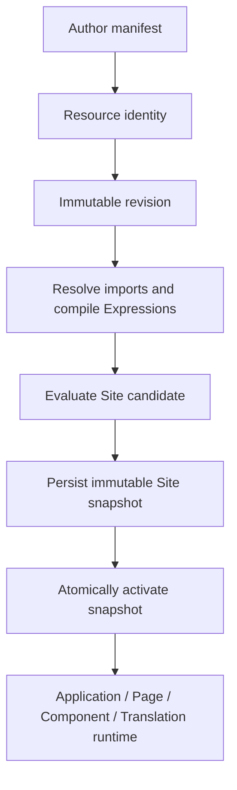
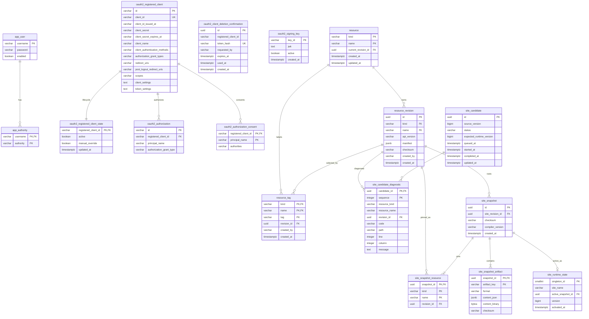

This page is the canonical engineering design for Taskmigo persistence. The current planned slice covers **Resource model, Expressions, Site, Application, Page, Component, and Translation**, while preserving the existing Access/OAuth persistence already present in Console. Policy, Workflow, and later capabilities must build on these foundations without changing their historical meaning.

## Current planned delivery slice

The database must support this flow:



`Site`, `Application`, `Page`, `Component`, and `Translation` do not map to five independent relational models. They are Resource kinds. The Resource model owns identity, revisions, tags, dependency resolution, candidates, snapshots, and activation. Expressions have no independent durable identity; their source stays inside the owning immutable manifest and compiled forms live inside snapshot artifacts or disposable caches.

The planned database design therefore has three Resource/runtime layers in addition to the existing Access/OAuth tables:

1. **Authoring source** — mutable Resource identity plus immutable revisions and tags.
2. **Compilation state** — Site candidates and ordered diagnostics.
3. **Runtime state** — immutable snapshots, exact revision pins, compiled artifacts, and one atomic active pointer.

## Full ERD

The ERD below is the complete physical database shape for the existing Console persistence plus the current Planned delivery slice. Policy and Workflow are intentionally absent because they remain Proposal.



Important relational constraints that Mermaid cannot express completely:

- `resource_revision(kind, name)` references `resource(kind, name)`.
- `resource_revision` also has `UNIQUE (id, kind, name)`.
- `resource(current_revision_id, kind, name)` references `resource_revision(id, kind, name)`.
- `resource_tag(revision_id, kind, name)` references `resource_revision(id, kind, name)`.
- `site_snapshot_resource(revision_id, kind, name)` references `resource_revision(id, kind, name)`.
- `site_snapshot.site_revision_id` references a `resource_revision`; the compiler additionally requires that revision's `kind = 'site'`.
- `site_candidate_diagnostic.revision_id` is nullable because syntax/identity failures may happen before an exact revision is known.
- `site_runtime_state` is a singleton row enforced by a fixed-key check such as `singleton_id = 1`.
- exactly one logical Site identity is enforced with a partial unique index over `resource` where `kind = 'site'`.
- `site_snapshot_artifact` stores exactly one payload representation per row: JSONB or binary, enforced with a check constraint.
- `oauth2_client_deletion_confirmation.registered_client_id` remains a logical association rather than a foreign key so confirmation history can survive permanent client deletion.

## Database contract

Taskmigo uses PostgreSQL for durable Console state. Flyway owns schema evolution. Hibernate uses schema validation only and must never create or update production tables. `open-in-view` remains disabled.

Taskmigo owns one configurable PostgreSQL schema, named `taskmigo` by default. Flyway schema, Hibernate default schema, JDBC `currentSchema`, and the database role `search_path` must agree.

Do not create a generic Java `database` module. Resource persistence remains inside `resource/internal/persistence`; existing Access/OAuth persistence remains inside `access`; other capabilities consume their owning modules through public contracts rather than repositories.

## Resource model

Resource identity is `(kind, name)`. `apiVersion` belongs to a revision and is not part of identity.

### `resource`

`resource` is the small mutable identity row.

Required columns:

- `kind` — Resource kind.
- `name` — `metadata.name`.
- `current_revision_id` — exact revision currently selected for unconstrained references.
- `created_at` and `updated_at` — lifecycle timestamps.

Primary key: `(kind, name)`.

The row does not contain the manifest. Updating a Resource means creating a new immutable revision and moving `current_revision_id` in the same authoring transaction.

PostgreSQL must enforce that at most one logical Resource with `kind = 'site'` exists. Use a partial unique index rather than an application-only check.

### `resource_revision`

`resource_revision` is immutable source history shared by Site, Application, Page, Component, and Translation.

Required columns:

- `id` — UUID primary key.
- `kind` and `name` — owning Resource identity.
- `api_version` — contract version used to validate and compile this revision.
- `manifest` — complete normalized-source document as JSONB.
- `checksum` — deterministic SHA-256 checksum of the canonical stored source.
- `created_by` and `created_at`.

Add a foreign key from `(kind, name)` to `resource(kind, name)`.

Also add a unique key on `(id, kind, name)`. This enables composite foreign keys that prove a revision pointer belongs to the same logical Resource instead of merely pointing to a valid UUID.

Revision rows are append-only. Do not update an old manifest, `api_version`, or checksum to represent a new state.

### Current revision integrity

The current Resource pointer must be protected by a composite foreign key:

```text
resource(current_revision_id, kind, name)
  -> resource_revision(id, kind, name)
```

This prevents `v0/page/home` from accidentally pointing at a revision of another Page or another Resource kind.

The initial insert has a cyclic ownership problem: a Resource must exist before its revision can reference it, but the Resource's current pointer needs that revision. Handle this inside one transaction by inserting the Resource with a nullable current pointer, inserting the first revision, then setting the pointer before commit. Outside that transaction a committed Resource must always have a current revision.

### `resource_tag`

Tags are immutable selectors over revisions.

Required columns:

- `kind`, `name`, and `tag` — primary key.
- `revision_id` — selected immutable revision.
- `created_at` and creator/audit information when available.

Protect tag ownership with:

```text
resource_tag(revision_id, kind, name)
  -> resource_revision(id, kind, name)
```

A tag is never moved. Creating another label for a newer revision creates another row.

## Planned manifest kinds

### Site

Site is the root Resource for compilation. It does not receive a separate `site` source table; its manifest is a normal `resource_revision` with `kind = 'site'`.

A Site revision imports Applications. Saving any Resource that can affect the Site schedules candidate evaluation, but saving and compilation must not share one long transaction.

### Application

Application remains a Resource kind stored in `resource_revision`. Do not create an `application` relational table merely to mirror `spec.path`, routes, label, icon, or description.

Application imports and route configuration are versioned contract data. They belong to the immutable manifest and the compiled snapshot artifact. Route uniqueness and path semantics are compiler invariants, not mutable database columns.

### Page

Page is stored only through the Resource model. Its declarative UI tree belongs inside the immutable manifest. Storing individual UI nodes as relational rows would couple database migrations to the Page DSL and make historical revisions depend on the current schema.

The snapshot pins the exact Page revision selected through the owning Application. Runtime reads the compiled Page artifact from the acquired snapshot rather than querying the mutable current Resource pointer.

### Component

Reusable Component source follows the same rule as Page: one immutable Resource revision contains the complete prop contract and template.

Do not normalize `spec.props`, template nodes, or Expression-bearing values into relational child tables. They are versioned contract data and are validated/compiled as one revision.

### Translation

Translation is also a Resource kind and uses the same `resource` + `resource_revision` model. Locale catalogs, plural forms, and translated strings stay in the immutable Translation manifest rather than becoming one relational row per key.

Snapshot compilation pins the exact Translation revisions reachable from the Site graph and emits normalized locale artifacts. Runtime translation lookup reads those immutable artifacts instead of current authoring rows.

### Expressions

Expressions have no standalone table. Their source is embedded in whichever Resource field accepts Expression syntax. Compilation validates the source against its field contract/profile and stores the compiled or normalized representation inside the owning snapshot artifact.

An optional compiled-expression cache may exist later, but it is disposable derived data keyed by immutable source checksum, compiler/profile version, and expected result type. Cache loss must not change correctness.

## Site candidate persistence

### `site_candidate`

A candidate records one attempt to turn committed authoring state into a runtime snapshot.

Required durable information:

- UUID `id`.
- status.
- trigger/source version sufficient to identify the authoring state being evaluated.
- `expected_runtime_version` captured before activation.
- queued, started, completed, and updated timestamps as appropriate.

Candidate status is explicit. Do not infer it from combinations of nullable timestamps.

The first status set should cover queued, running, invalid, valid, activated, and terminal pipeline failure. Exact Java names may change with the state machine, but database values must be constrained and deterministic.

### `site_candidate_diagnostic`

Validation output is durable because an invalid candidate must be inspectable while the previous runtime snapshot remains active.

Use `(candidate_id, sequence)` as the primary key. Store:

- affected Resource identity and revision when known;
- stable diagnostic `code`;
- manifest `path`;
- optional line and column;
- safe user-facing message.

Never persist secrets or Expression context values in diagnostics.

### Candidate acquisition

Multiple workers may compete for queued candidates. `FOR UPDATE SKIP LOCKED` is acceptable for this queue-like operation, but not as a general consistency strategy.

The one-Site model allows queued work to be coalesced later, but the first implementation must favor correctness over aggressive coalescing. Never mutate a candidate already being evaluated just because a newer source revision appears.

## Import and dependency persistence

Do not create `resource_dependency` as mutable source of truth for the planned slice.

Imports live inside each immutable manifest. Candidate evaluation parses those references, applies reference-ability rules, selects exact revisions, and builds a resolved graph.

Authored revisions may contain unresolved or invalid imports; that is allowed because authoring history must survive validation failure. Only an accepted snapshot turns the resolved graph into durable runtime pins.

If dependency parsing later becomes a proven bottleneck, a derived cache may be introduced. It must be keyed by immutable revision checksum and compiler version, and deleting it must never alter correctness.

## Snapshot model

### `site_snapshot`

A snapshot is immutable runtime identity.

Required columns:

- UUID `id`.
- exact root `site_revision_id`.
- deterministic snapshot `checksum`.
- `compiler_version`.
- `created_at`.

The root revision must reference an actual Site revision. Validate this in the compiler and protect the revision reference with a foreign key.

### `site_snapshot_resource`

This table is the durable exact dependency graph for runtime.

Primary key: `(snapshot_id, kind, name)`.

Each row stores the selected `revision_id`. Protect identity with a composite foreign key to `resource_revision(id, kind, name)`.

A valid snapshot contains exactly the selected Site plus every reachable Application, Page, Component, and Translation revision required by that Site graph.

Runtime and later durable executions must never re-resolve these rows against current Resource pointers.

### `site_snapshot_artifact`

Compiled runtime data is partitioned by artifact key instead of being forced into one giant JSON document.

Primary key: `(snapshot_id, artifact_key)`.

Store:

- artifact `format` or format version;
- JSONB or binary content depending on the artifact contract;
- checksum when artifacts need independent integrity verification.

Keep artifacts coarse enough to avoid thousands of tiny rows but separate enough that future contributors do not require rewriting the core snapshot format. Exact artifact partitioning remains a compiler decision and must be deterministic.

### `site_runtime_state`

Runtime activation is one small mutable pointer.

The table is a singleton row containing:

- active `site_name`;
- `active_snapshot_id`;
- monotonic bigint `version`;
- `activated_at`.

Activation is compare-and-swap:

```sql
UPDATE site_runtime_state
SET active_snapshot_id = :snapshotId,
    version = version + 1,
    activated_at = :activatedAt
WHERE version = :expectedVersion;
```

Zero affected rows means the candidate is stale. It must not overwrite the newer runtime state.

A runtime request acquires the active snapshot once and keeps that immutable handle for the complete operation. A later activation cannot change what that operation sees.

## Transaction boundaries

The planned slice uses four persistence boundaries.

### Authoring transaction

In one transaction:

1. create the Resource identity when new;
2. insert the immutable revision;
3. move `current_revision_id`;
4. enqueue Site candidate work when the change can affect the Site.

Commit before graph resolution or compilation starts.

### Candidate evaluation

Resolve references, validate manifests and Expressions, and compile outside a long database transaction. The candidate being evaluated must identify the committed source state it represents.

Invalid candidates persist diagnostics and leave the current runtime snapshot untouched.

### Snapshot transaction

Persist `site_snapshot`, every `site_snapshot_resource` pin, and all required `site_snapshot_artifact` rows atomically. A partial snapshot must never become activatable.

### Activation transaction

Compare `expected_runtime_version`, update the singleton active pointer, and record/publish the activation event atomically. Stale activation loses rather than replacing newer state.

## Required indexes and constraints

Start with indexes required by invariants and known access paths only.

Required coverage includes:

- `resource(kind, name)` primary lookup;
- one-Site partial uniqueness;
- revision lookup by Resource and creation order when history is listed;
- tag selection by Resource identity and tag;
- candidate pickup by status and queue order;
- diagnostics by candidate and sequence;
- snapshot pins by snapshot and Resource identity;
- reverse revision reachability for deletion/cleanup checks;
- singleton active snapshot acquisition.

Do not create one index per column. Add an index only for a named invariant or query path, and verify performance-sensitive choices with PostgreSQL `EXPLAIN` against representative data.

## JSONB boundary

For the planned slice, JSONB is correct for complete versioned manifests and compiled artifact content. It is not the default for lifecycle or relational state.

Keep these as typed columns: identity, revision IDs, `api_version`, checksums, status, timestamps, snapshot IDs, runtime version, and foreign keys.

Do not promote Application paths, Page node props, Component prop definitions, Translation keys, or Expression source fragments into columns merely because they are currently useful fields. They remain part of versioned manifest contracts unless Taskmigo later needs a database-level invariant or hot query that cannot be served by compiled runtime artifacts.

## Deletion and cleanup

Do not implement generic soft deletion for these tables.

A revision cannot be physically removed while it is:

- the current revision of a Resource;
- referenced by a tag;
- pinned by any retained snapshot;
- referenced by another future durable execution contract.

An active snapshot cannot be deleted. An inactive snapshot can be cleaned only when no retained durable state references it and the retention policy permits deletion.

Candidate and diagnostic cleanup must be batched, indexed, idempotent, and safe when a row changes state between selection and deletion.

Public Resource deletion semantics are still unresolved, so the first Resource implementation must not expose physical Resource deletion merely because foreign keys make it technically possible.

## Flyway implementation order

Implement persistence incrementally rather than creating all future tables at once.

1. Resource identity, immutable revisions, current-pointer integrity, and tags.
2. Site candidate queue and diagnostics.
3. Immutable snapshot metadata and exact Resource pins.
4. Snapshot artifacts and atomic runtime state.
5. Cleanup indexes/queries only when their retention behavior is implemented.

Each migration lands with the Java behavior and PostgreSQL integration tests that use it. Once a versioned migration has been applied to a shared or released environment, move forward with a new migration instead of rewriting history.

## Verification

Use real PostgreSQL through Testcontainers for persistence behavior. H2 or mocked repositories cannot verify the constraints and races this design depends on.

The planned slice must prove:

- first Resource creation establishes a valid current revision atomically;
- concurrent saves never corrupt the current pointer or cross-link revisions;
- a tag cannot point to another Resource's revision;
- only one Site identity can exist;
- invalid Application/Page/Component/Translation imports produce diagnostics without replacing runtime;
- invalid Expressions produce diagnostics without replacing runtime;
- a valid `Site → Application → Page` graph activates successfully;
- Page/Component/Translation exact revisions remain pinned after newer revisions become current;
- cyclic and disallowed imports cannot create an active snapshot;
- snapshot persistence is all-or-nothing;
- stale candidate activation loses the compare-and-swap race;
- runtime acquisition remains stable across a later activation;
- cleanup cannot remove a current, tagged, pinned, or active record;
- output is deterministic regardless of database row order.

A database change in the planned slice is complete only when the schema, Resource-domain behavior, compiler selection, Expression compilation, transaction boundaries, cleanup reachability, and PostgreSQL integration tests agree.

## Deferred persistence design

Policy, Workflow, and later capabilities are intentionally outside this database slice. They must reuse Resource revision and snapshot pinning where applicable. Add new tables only when those capabilities introduce durable state that cannot be represented by the Resource source/snapshot model.
