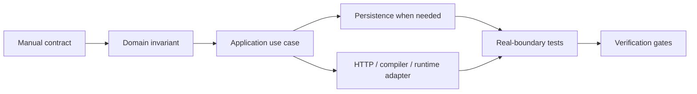
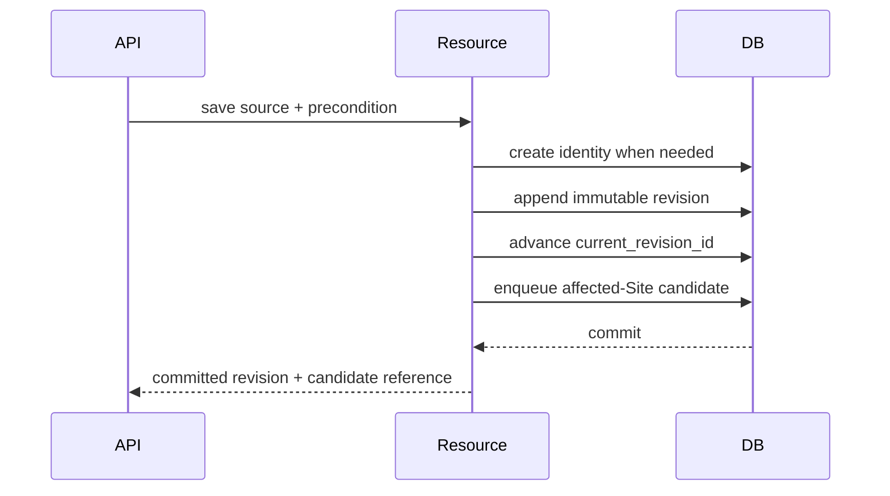
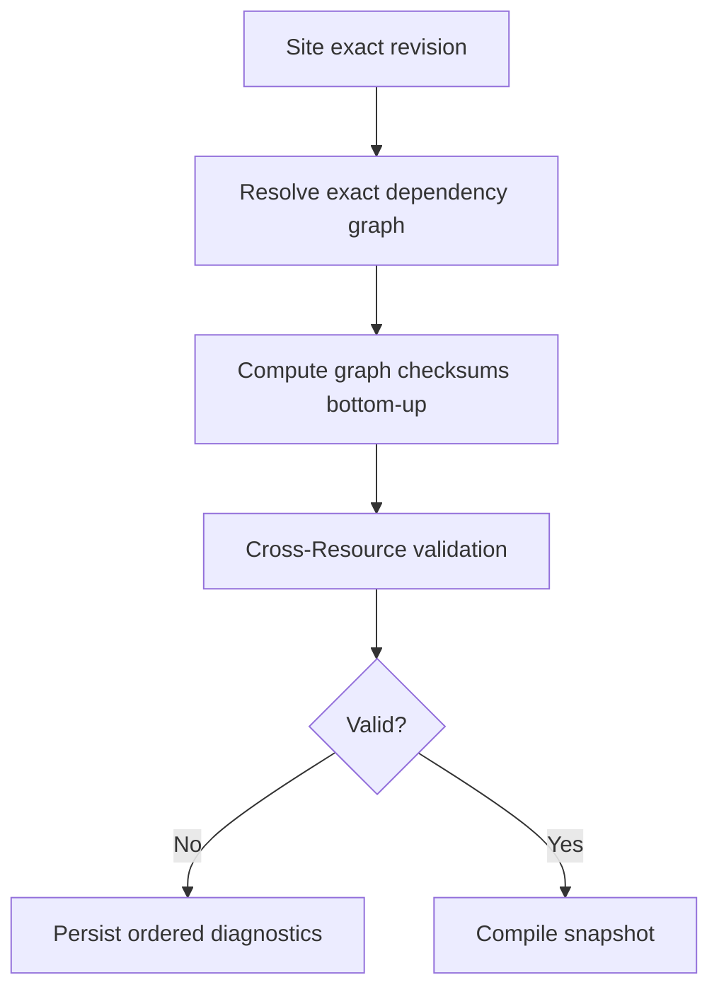
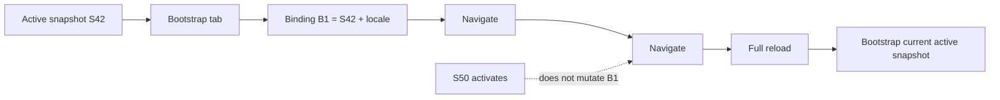

import { File, Folder, Files } from 'fumadocs-ui/components/files';

This page is the **execution order**. It intentionally does not repeat full database schemas, HTTP DTOs, or runtime algorithms; follow the linked canonical page when implementing each phase.

<Callout title='Target implementation, not repository inventory' type='info'>
  Create the packages and types required by each phase when they do not exist yet. Manuals define product behavior;
  Developer pages define the target implementation. Do not infer delivery status from a class name in this handbook.
</Callout>

## Delivery model

Implement one vertical behavior through all required layers before moving to the next dependency.

Before coding, identify the owning capability, immutable versus mutable state, transaction boundary, race/crash boundaries, failure category, and the test that proves the real technology involved.

## Target module shape

<Files>
  <Folder name='<capability>' defaultOpen>
    <File name='package-info.java' />
    <File name='public port/event only when another capability needs it' />
    <Folder name='internal'>
      <Folder name='application' />
      <Folder name='domain' />
      <Folder name='persistence' />
      <Folder name='web' />
      <Folder name='configuration' />
    </Folder>
  </Folder>
</Files>

Another capability may depend on the public root; it may not import `internal` packages or query another capability's repository.

## Implementation phases

| Phase | Deliverable                                    | Canonical design                                                                                                                          | Exit proof                                                                                   |
| ----- | ---------------------------------------------- | ----------------------------------------------------------------------------------------------------------------------------------------- | -------------------------------------------------------------------------------------------- |
| 0     | Application/module/persistence test baseline   | [Architecture](/versions/v0/developer/architecture)                                                                                       | Architecture and real PostgreSQL test harness can run.                                       |
| 1     | Resource identity + immutable revisions        | [Resource model](/versions/v0/manuals/resources#identity-and-revisions), [Database](/versions/v0/developer/database#authoring-model)      | Create/update/no-op/concurrency preserve immutable history.                                  |
| 2     | Immutable tags + reference selection           | [Resource model](/versions/v0/manuals/resources#references)                                                                               | Exact/caret/tilde selection is deterministic.                                                |
| 3     | Backend Expression foundation                  | [Expressions](/versions/v0/manuals/expressions)                                                                                           | Typed evaluation, sandbox, profiles, and diagnostics are proven.                             |
| 4     | Defined manifest contracts                     | [Manifest reference](/versions/v0/manuals/manifests)                                                                                      | Site/Application/Page/Component/Translation validate and normalize independently.            |
| 5     | Resolved graph + graph checksums + diagnostics | [Resource model](/versions/v0/manuals/resources#resolved-graph-identity), [Resource and runtime](/versions/v0/developer/resource-runtime) | Child changes propagate graph identity without fake ancestor revisions.                      |
| 6     | Candidate pipeline                             | [Resource and runtime](/versions/v0/developer/resource-runtime#candidate-and-activation-flow)                                             | Invalid/crashed/stale candidates cannot replace active runtime.                              |
| 7     | Snapshot persistence + activation              | [Database](/versions/v0/developer/database#snapshot-and-activation)                                                                       | Snapshot, pins, graph identity, and artifacts persist atomically; CAS activation is safe.    |
| 8     | Runtime binding + render read model            | [Resource and runtime](/versions/v0/developer/resource-runtime)                                                                           | One tab keeps snapshot/locale across navigation and renders without mutable authoring reads. |
| 9     | Retention + operational hardening              | [Database](/versions/v0/developer/database#retention-and-cleanup)                                                                         | Cleanup cannot remove current/tagged/bound/otherwise retained runtime state.                 |

Policy and Workflow remain RFCs. Do not insert their persistence or runtime behavior into phases 0–9 as delivered foundation work.

## Resource history

Create one Resource model for every manifest kind. Site, Application, Page, Component, and Translation do not receive independent authoring tables.

The authoring transaction owns this decision:

A dependency change never alters the source checksum or revision ID of an unchanged importer.

## References and tags

Keep parsing separate from selection:

- `ResourceReferenceParser` parses `<kind>/<name>[@constraint]` without persistence access;
- `RevisionSelector` selects the current revision or highest matching immutable tag;
- validation failure after selection never causes fallback to another revision;
- tag ownership is protected by the Resource identity as well as revision ID.

## Expression foundation

`ExpressionCompiler` receives a field-owned contract describing the visible context, profile, expected result type, and limits. FreeMarker stays behind the `expression` capability; Resource/Workflow/Policy code consumes the public Expression API rather than its internals.

The browser does not evaluate Expression source. Runtime rendering receives backend-resolved values.

## Manifest contracts

Expose a registry keyed by `(apiVersion, kind)` and one contract per defined Resource kind:

- `V0SiteManifestContract`
- `V0ApplicationManifestContract`
- `V0PageManifestContract`
- `V0ComponentManifestContract`
- `V0TranslationManifestContract`

A contract validates and normalizes its own revision. Graph traversal, snapshot activation, and current-runtime lookup remain outside kind-local contracts.

## Graph and candidate pipeline

The resolver must be deterministic under traversal/database ordering, detect direct/transitive cycles, reuse shared diamond nodes, and include contract-selected Resources such as Translation catalogs even when they are not authored through `imports`.

Compilation happens after the authoring transaction commits; do not hold one transaction across save, graph resolution, compilation, and activation.

## Snapshot and runtime

Snapshot persistence stores immutable metadata, root graph identity, exact revision/graph pins, and required artifacts in one transaction. Activation then compares the expected runtime version and atomically swaps the active pointer.

Runtime bootstrap reads the active pointer once to create a browser application binding. Later client navigation validates that binding and reacquires its **exact retained snapshot**, not the current active pointer.

The serving-side details are canonical in [Resource and runtime](/versions/v0/developer/resource-runtime).

## HTTP API boundary

The authoring/inspection HTTP surface is already design-first in `public/openapi/v0/openapi.yaml`. Implement those routes from [API development](/versions/v0/developer/api); do not treat Resource CRUD, candidate diagnostics, or snapshot inspection as open endpoints anymore.

The **SSR serving endpoint is still open**. Complete `RuntimeBindingService` and `RuntimeRenderService` behind framework-neutral internal/public boundaries, but do not publish a provisional route, token shape, or response DTO before the serving contract is decided.

## Retention and cleanup

Do not add generic soft deletion. A revision/snapshot remains physically reachable while current, tagged, active, pinned by retained runtime state, or referenced by another durable capability.

Runtime-binding representation and maximum lifetime are open decisions, so cleanup must preserve a pluggable retention boundary rather than inventing a duration.

## Verification and definition of done

Use [Verification](/versions/v0/developer/verification) for required evidence. A phase is complete only when:

- Manual behavior and implementation agree;
- module/public-port ownership is explicit;
- persistence constraints protect identity and concurrency invariants;
- crash/race boundaries have real integration coverage;
- diagnostics/errors are safe and machine-readable;
- no RFC or open decision was silently converted into delivered behavior;
- OpenAPI, Database, Resource/runtime, and Manual docs remain mutually consistent;
- repository verification gates pass.

## Adding another Resource kind

A later Resource kind normally adds a Manual contract, `(apiVersion, kind)` `ManifestContract`, validation/normalization fixtures, reference rules, and snapshot/runtime representation when needed. It reuses Resource identity, immutable revision, tag, candidate, and snapshot infrastructure unless the capability introduces genuinely new durable mutable state.
