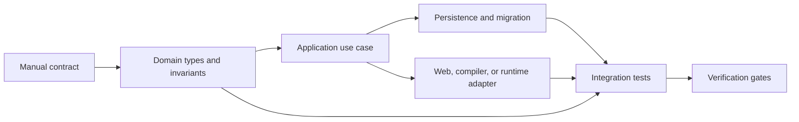
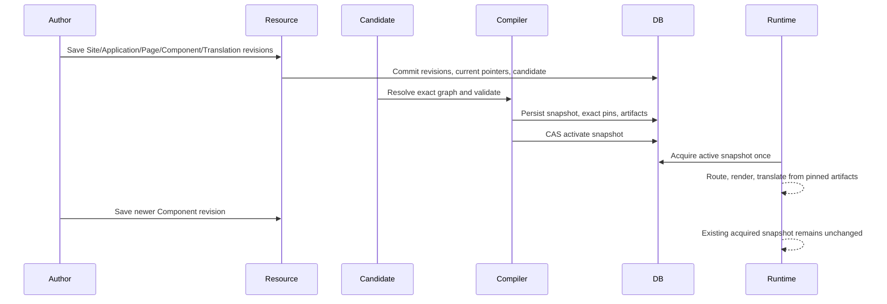

Use this page as the implementation playbook for Taskmigo. It is written so that a junior engineer or coding agent can take a planned capability from documentation to working code without reconstructing the architecture from scattered notes.

The Manual defines user-visible behavior. Developer documentation defines how to implement and verify that behavior. If an implementation choice would introduce product semantics that are not documented, do not guess. Complete only the stable internal boundary and keep the unresolved decision explicit.

> **Do not invent product behavior.** Public API routes, deletion semantics, retention values, queue limits, artifact formats, retry policy, and other open decisions stay open until the product contract defines them.

## Implementation model

Every feature is delivered as a vertical slice:



Before coding, answer these questions:

1. Which Manual page defines the behavior?
2. Which capability owns it?
3. What is the smallest public Java contract another capability needs?
4. Which state is immutable and which state is mutable?
5. Which transaction owns the state transition?
6. What can race with this operation?
7. What happens after a crash at each commit boundary?
8. Which failures are product errors, diagnostics, conflicts, or startup failures?
9. Which test proves the behavior with the real technology involved?

Do not build all entities, then all repositories, then all controllers. Complete one behavior through every required layer and prove it before continuing.

## Repository and module rules

Application code lives below `console/src/main/java/com/taskmigo/console/`.

```text
com.taskmigo.console/
├── access/                         # identity, OAuth/OIDC, JWT, access primitives
├── expression/                     # FreeMarker Expression foundation
├── resource/                       # Resource authoring, resolution, snapshots
├── policy/                         # Policy RFC
├── workflow/                       # Workflow RFC
└── system/                         # system/sample endpoints
```

A capability follows this shape:

```text
<capability>/
├── package-info.java
├── PublicPort.java                 # only when another module needs it
├── PublicEvent.java                # only for cross-module observation
└── internal/
    ├── application/                # use cases and transaction orchestration
    ├── domain/                     # entities, values, parsers, algorithms
    ├── persistence/                # JPA/JDBC adapters
    ├── web/                        # controllers and API mapping
    └── configuration/              # Spring/framework composition
```

Apply these rules mechanically:

- another module may import the public root package, never another module's `internal` package;
- another module may not inject or query another capability's repository;
- controllers do not own business transitions or long transactions;
- domain code does not depend on Spring MVC, repositories, servlet types, Nimbus, or FreeMarker internals;
- cross-module calls use a narrow public port or event;
- constructor injection is required;
- use an injected `Clock` for persisted time, expiry, retries, and lifecycle behavior;
- do not create generic `common`, `api`, `database`, or `composition` dumping grounds;
- update `ArchitectureTest` whenever a module or allowed dependency changes.

See [Architecture](/versions/v0/developer/architecture) for dependency direction and [Codebase map](/versions/v0/developer/codebase) for existing code.

## Delivery order

Implement the planned foundation in this order:

```mermaid
flowchart TD
  resource["1. Resource identity and revisions"] --> tag["2. Tags and reference selection"]
  tag --> expression["3. Expression foundation"]
  expression --> contracts["4. Manifest contracts"]
  contracts --> graph["5. Dependency graph and diagnostics"]
  graph --> candidate["6. Candidate pipeline"]
  candidate --> snapshot["7. Snapshot persistence and activation"]
  snapshot --> runtime["8. Application/Page/Component/Translation runtime"]
  runtime --> cleanup["9. Cleanup and operational hardening"]
```

Do not implement Policy or Workflow persistence while those capabilities remain outside the active delivery scope.

## Phase 0 — establish the baseline

Before adding feature code, verify the existing application and persistence baseline:

- Flyway owns schema creation and migration;
- Hibernate validates the schema instead of generating it;
- `open-in-view` is disabled;
- Flyway, Hibernate, JDBC `currentSchema`, and the application role agree on the Taskmigo schema;
- `ArchitectureTest` passes;
- `PersistenceIntegrationTest` starts real PostgreSQL through Testcontainers;
- current repository verification passes before feature code is added.

Do not fix a failing baseline by weakening schema validation, security, or database fidelity.

**Exit criteria:** the implementation starts from a known-good checkout.

## Phase 1 — Resource identity and immutable revisions

Create the `resource` capability first. It owns Resource identity and immutable source history for every manifest kind.

```text
com.taskmigo.console.resource/
├── package-info.java
└── internal/
    ├── application/resource/
    ├── domain/model/
    ├── persistence/resource/
    └── configuration/ResourceConfiguration.java
```

### Domain types

Create value types before persistence entities:

```java
public record ResourceIdentity(ResourceKind kind, String name) {}

public record ResourceRevision(
    UUID id,
    ResourceIdentity identity,
    ApiVersion apiVersion,
    JsonNode manifest,
    String checksum,
    Instant createdAt,
    String createdBy) {}
```

`ResourceIdentity` is `(kind, metadata.name)`. `apiVersion` belongs to the revision and is not part of identity. Convert stable concepts into dedicated values instead of carrying untyped maps through application services.

### Persistence

Implement the schema from [Database](/versions/v0/developer/database):

- `resource` stores mutable identity and `current_revision_id`;
- `resource_revision` stores immutable source history;
- database constraints enforce the one-Site invariant;
- composite identity protection prevents a current pointer from referencing another Resource's revision.

Do not create source tables for Site, Application, Page, Component, or Translation. They are Resource kinds and share this model.

### Save use case

Create:

```java
ResourceCommandService.save(SaveResourceCommand command)
```

One authoring transaction performs the complete durable decision:

1. validate and construct `ResourceIdentity`;
2. create the Resource row when necessary;
3. insert one immutable revision;
4. move `current_revision_id` to that revision;
5. enqueue affected-Site evaluation once candidate persistence exists;
6. commit.

Never mutate an older revision to represent new source. Handle first-revision creation and the current-pointer relationship inside one transaction. Canonicalize stored source before calculating its checksum so equivalent stored data produces the same checksum.

### Failure behavior

Distinguish malformed input, concurrent uniqueness conflicts, persistence rollback, and later compilation failure. A revision that is valid authoring history but cannot activate remains stored; do not delete it to make compilation green.

### Tests

Use unit tests for identity/checksum logic and PostgreSQL integration tests for first creation, later revisions, rollback, concurrent saves, cross-identity pointer protection, one-Site enforcement, and Hibernate validation against the Flyway schema.

**Exit criteria:** immutable Resource history is correct before reference resolution exists.

## Phase 2 — tags, references, and revision selection

Create:

```text
resource/internal/domain/reference/
├── ResourceReference.java
├── ResourceReferenceParser.java
└── RevisionSelector.java
```

Create:

```java
ResourceTagService.create(ResourceIdentity identity, SemVer tag, RevisionId revisionId)
```

A tag is immutable. Do not add a tag-update path that moves an existing tag.

`ResourceReferenceParser.parse(String)` parses syntax only and does not query persistence. `RevisionSelector.select(ResourceReference)` performs deterministic selection: unconstrained references use the current revision; exact/caret/tilde constraints follow the documented rules; selection never silently falls back after later validation fails; database row order cannot affect the result.

Protect tag ownership with the composite foreign key defined by the Database design.

### Tests

Cover exact, caret, tilde, missing, duplicate, boundary versions, shuffled insertion order, and direct attempts to create cross-Resource tag references.

**Exit criteria:** a reference resolves to one exact immutable revision or one deterministic diagnostic.

## Phase 3 — Expression foundation

Expressions are a shared technical foundation and do not receive their own Resource table.

```text
com.taskmigo.console.expression/
├── package-info.java
├── ExpressionCompiler.java
├── ExpressionContract.java
├── ExpressionProfile.java
├── ExpressionFunctionProvider.java
└── internal/
    ├── compilation/
    ├── evaluation/
    ├── function/
    └── configuration/
```

Pin FreeMarker explicitly in `console/build.gradle.kts`.

`FreeMarkerConfigurationFactory` creates one long-lived immutable configuration. Do not expose reflection, static models, arbitrary beans, filesystem templates, or class resolution. Keep the template loader unset and the API built-in disabled.

### Compiler contract

`ExpressionCompiler.compile(source, contract)` receives an `ExpressionContract` defining profile, visible context schema, expected result type, and limits. Typed Expressions and rendered templates are different modes; never recover typed booleans/numbers/objects by rendering text and parsing it back.

`TaskmigoTemplateModelFactory` exposes only approved immutable scalars, maps, lists, and Taskmigo-owned template values. Syntax validity does not imply context validity: a field may reject a variable or function that its profile does not expose.

### Tests

Cover typed results, missing values, invalid result types, forbidden Java access, failed include/import attempts, determinism, evaluation limits, duplicate function registration, and each documented profile/context.

See [Codebase map](/versions/v0/developer/codebase#expression-engine) for concrete engine configuration.

**Exit criteria:** Manifest contracts can compile Expressions without depending on FreeMarker internals.

## Phase 4 — Manifest contracts

Expose:

```java
public interface ManifestContract {
  ApiVersion apiVersion();
  ResourceKind kind();
  ValidationResult validate(ResourceRevision revision, ManifestValidationContext context);
  NormalizedResource normalize(ResourceRevision revision, ManifestValidationContext context);
}

public interface SnapshotContributor {
  String key();
  ContributionResult compile(SnapshotCompilationContext context);
}
```

Create `ManifestContractRegistry` keyed by `(apiVersion, kind)`. Duplicate registrations fail startup.

```text
resource/internal/domain/contract/v0/
├── V0SiteManifestContract.java
├── V0ApplicationManifestContract.java
├── V0PageManifestContract.java
├── V0ComponentManifestContract.java
└── V0TranslationManifestContract.java
```

Each contract owns kind-local validation and normalization only. It must not activate snapshots, inspect the current runtime snapshot, or query another module's repository.

`V0SiteManifestContract` validates Site-local fields/imports. `V0ApplicationManifestContract` validates metadata, path, routes, and local fields. `V0PageManifestContract` validates the declarative UI tree. `V0ComponentManifestContract` validates reusable props/template structure. `V0TranslationManifestContract` validates locale/catalog semantics.

Keep route definitions, UI nodes, Component props, and translation keys in versioned Resource source/normalized artifacts rather than introducing mutable SQL child models.

Dispatch validation from the revision's `apiVersion`; never reinterpret historical revisions with the newest contract.

### Tests

For every contract, cover smallest valid input, required-field failures, boundaries, unsupported `(apiVersion, kind)`, Expression-capable fields, deterministic normalization, and historical contract coexistence.

**Exit criteria:** every planned Resource kind validates and normalizes independently from graph resolution.

## Phase 5 — dependency graph and diagnostics

Create:

```text
resource/internal/domain/graph/
├── ResolvedResourceGraph.java
└── ResourceGraphResolver.java
```

`ResourceGraphResolver.resolve(ResourceIdentity site)` returns a complete graph of exact revisions or ordered diagnostics.

The resolver must start from the single Site, parse imports through `ResourceReferenceParser`, select through `RevisionSelector`, reuse diamond nodes, detect direct/transitive cycles, enforce reference-ability rules, retain exact revision IDs, produce deterministic output, and never mutate current pointers.

Do not add a mutable `resource_dependency` source-of-truth table. Imports remain in immutable manifests. A derived cache is allowed later only if deleting it cannot affect correctness.

### Validation order

Validate in this order:

1. source syntax and source locations;
2. identity and kind-local fields;
3. Expression syntax/profile/type;
4. reference parsing and revision existence;
5. reference-ability and cycles;
6. graph-wide rules such as route uniqueness;
7. compiler/runtime capability requirements;
8. snapshot contributor validation.

Diagnostics contain stable codes, manifest paths, optional source positions, and safe messages. Do not persist secrets or Expression context values.

### Tests

Cover direct/transitive cycles, diamond graphs, disallowed references, missing revisions, tag selection, graph-wide conflicts, and deterministic diagnostics under randomized fixture order.

**Exit criteria:** one Site resolves into one exact validated graph without changing runtime state.

## Phase 6 — candidate pipeline

Create:

```java
SiteCandidatePipeline.evaluate(CandidateId candidateId)
```

Candidate persistence belongs under `resource/internal/persistence/candidate/` and follows the Database ERD.

Resource save and candidate enqueue happen in the same authoring transaction. Compilation begins only after commit. Candidate lifecycle is explicit; do not infer status from nullable timestamps.

### Worker acquisition

Multiple workers may acquire independent queued rows using `FOR UPDATE SKIP LOCKED`. Restrict this pattern to queue consumption.

### Crash boundaries

The implementation must remain correct when a process fails:

- before authoring commit: no revision/candidate is visible;
- after authoring commit: queued work remains recoverable;
- after invalid diagnostics persist: previous runtime remains active;
- after snapshot persistence but before activation: an inactive snapshot may remain;
- after activation commit: the new snapshot is authoritative.

Do not wrap save, graph resolution, compilation, snapshot persistence, and activation in one long transaction.

### Tests

Inject failures at each durable boundary and test competing workers/stale candidates against real PostgreSQL.

**Exit criteria:** authoring changes enter a durable retryable pipeline without threatening current runtime.

## Phase 7 — snapshot compilation and activation

Create:

```text
resource/internal/domain/snapshot/
├── CompiledSiteSnapshot.java
└── SiteSnapshotCompiler.java
```

Expose:

```java
public interface ActiveSiteSnapshotProvider {
  AcquiredSiteSnapshot acquire();
}
```

`SiteSnapshotCompiler.compile(ResolvedResourceGraph)` receives an exact graph. It must not query mutable current pointers to upgrade revisions while compiling. Core runtime data and `SnapshotContributor` outputs compile deterministically; duplicate artifact keys are errors.

### Snapshot transaction

Persist `site_snapshot`, all exact `site_snapshot_resource` pins, and all required `site_snapshot_artifact` rows atomically. A partial snapshot must never become activatable.

### Activation transaction

Use compare-and-swap on `site_runtime_state.version`:

```sql
UPDATE site_runtime_state
SET active_snapshot_id = :snapshotId,
    version = version + 1,
    activated_at = :activatedAt
WHERE version = :expectedVersion;
```

Zero updated rows means the candidate is stale and must not overwrite newer runtime state. Record/publish `SiteSnapshotActivated` only at the durable activation boundary defined by the final event/outbox design.

### Runtime acquisition

`ActiveSiteSnapshotProvider.acquire()` returns an immutable handle. Acquire once per runtime operation and keep that handle through the operation. Later activation cannot change an already-running operation's view.

### Tests

Prove all-or-nothing snapshot persistence, revision pin integrity, historical immutability, stale CAS loss, stable acquired handles, and deterministic compiled checksums.

**Exit criteria:** a valid candidate atomically replaces runtime state without mutating in-flight work.

## Phase 8 — runtime for planned Resource kinds

Runtime reads only the acquired compiled snapshot. It does not parse mutable authoring manifests per request or re-resolve current pointers.

### Application

Compile paths/routes into runtime artifacts. Route conflicts are candidate-time errors. Routing selects the exact Page artifact pinned in the same snapshot.

### Page

Render the normalized/compiled tree. Unsupported structure should already have failed candidate compilation. Direct built-in UI components and reusable Components resolve from the same snapshot handle.

### Component

Validate/evaluate props against the compiled Component contract and render the pinned Component template. Newer Component revisions do not mutate an existing snapshot.

### Translation

Compile Translation Resources into snapshot-owned catalogs. Runtime lookup never queries mutable authoring revisions. Missing locale/key/plural semantics come from the Translation Manual; do not invent fallback behavior.

### Expressions

Evaluate with the documented field profile/context. Never expose arbitrary Spring objects, persistence entities, request objects, or Java beans as convenience context.

A condition that should have been rejected by candidate compilation is an internal defect if it appears at runtime. Do not silently skip the node or fall back to a newer revision.

**Exit criteria:** a valid Site can be served completely from one immutable acquired snapshot.

## Phase 9 — cleanup and operations

Do not introduce generic soft deletion.

A revision cannot be physically removed while current, tagged, pinned by a retained snapshot, or referenced by future durable state. The active snapshot cannot be deleted.

Before implementing cleanup, define the exact reachability predicate, retention period, indexed selection query, batch size, transaction boundary, reachability race behavior, metrics, and idempotent retry behavior.

If retention is not decided, implement the safe reachability boundary but do not invent a duration.

See [Database](/versions/v0/developer/database#deletion-and-cleanup).

## Public APIs require a product contract

Internal services can be completed before final HTTP shape is decided. It is valid to finish `ResourceCommandService`, `ResourceTagService`, graph resolution, candidate compilation, snapshot persistence, and runtime acquisition while public Resource CRUD/diagnostics/snapshot-inspection APIs remain open.

When an API contract is unresolved:

- keep the use case framework-neutral;
- use domain command/query records rather than temporary HTTP-shaped models;
- do not publish provisional endpoints;
- test application services directly or through internal adapters;
- add web adapters only after route, authorization, request, response, and error semantics are defined.

Apply the same rule to cleanup scheduling, candidate retry policy, snapshot inspection, Policy management, and Workflow management.

## Error and diagnostic rules

Inside a capability, preserve machine-readable failures using typed results/exceptions. Web adapters translate stable product errors to Problem Details with stable codes. Resource/compiler validation emits source-aware diagnostics with stable codes, manifest paths, optional source positions, and safe messages.

Do not expose SQL exceptions or stack traces, persist secrets, use exception text as a machine contract, continue with an unvalidated fallback, or collapse every conflict into an internal server error.

If HTTP mapping is still open, keep the internal failure stable and postpone only the web mapping.

## Transaction rules

Before adding `@Transactional`, identify the complete atomic business decision. Transactions belong on application services or owned persistence operations coordinating that decision.

Do not keep transactions open across network I/O, graph compilation, FreeMarker rendering, external Actions, user-interaction waiting, or other unbounded work.

For every transaction, add a failure test proving rollback. For every multi-transaction pipeline, test crash boundaries and recovery.

## Persistence rules

Flyway is the schema source of truth and Hibernate DDL generation stays disabled. A migration and the Java behavior depending on it land together.

Use JPA for ordinary aggregate persistence when it keeps the model clear. Use explicit JDBC when SQL semantics are part of correctness, including CAS activation, `SKIP LOCKED` queue acquisition, bulk reachability/cleanup, exact locking/ordering queries, and future Policy predicate translation.

Keep identity, lifecycle, concurrency, relationships, and hot query dimensions in typed columns. Use JSONB for immutable versioned manifests and compiled artifact content owned by versioned contracts.

See [Database](/versions/v0/developer/database#full-erd) for the physical model.

## Testing instructions

Use the narrowest test that proves behavior, but do not mock away the technology whose semantics matter.

### Unit tests

Use unit tests for value objects, reference parsing, version selection, graph algorithms, manifest contracts, Expression profile/type behavior, checksums/canonicalization, deterministic compilation, and local state machines.

### PostgreSQL integration tests

Use Testcontainers PostgreSQL for Flyway migrations, database constraints, JSONB behavior, optimistic/CAS races, `SKIP LOCKED` workers, transaction rollback, snapshot reachability, cleanup races, and PostgreSQL-specific ordering/locking semantics. Do not substitute H2 for these cases.

### Spring and security integration tests

Use the real application context for module wiring, security-chain precedence, OAuth/JWT behavior, controller authorization, and Problem Details mapping.

### Architecture tests

Every new module/public dependency updates `ArchitectureTest`. Prevent cross-module `internal` imports and repository shortcuts.

## Acceptance scenario

At minimum, prove this complete flow:



Negative acceptance cases include missing/disallowed imports, direct/transitive cycles, invalid Expressions, route conflicts, invalid candidates preserving old runtime, stale CAS loss, crash after snapshot persistence before activation, and newer revisions not mutating historical snapshots.

## Definition of done

An implementation task is complete only when all applicable conditions are true:

- Manual and implementation behavior agree;
- ownership/module boundaries are explicit;
- cross-module public Java surface is minimal;
- domain invariants are independent of controller DTOs;
- Flyway schema and persistence mapping agree;
- transaction/crash boundaries are tested;
- concurrency conflicts behave deterministically;
- diagnostics/errors are safe and machine-readable;
- unit and PostgreSQL tests cover relevant boundaries;
- architecture tests protect dependencies;
- no open product decision was silently invented;
- Manual and Developer docs are synchronized;
- all required repository verification gates pass before publication.

## Adding a new Resource kind later

A new Resource kind normally requires:

1. a Manual contract;
2. a `ManifestContract` keyed by `(apiVersion, kind)`;
3. validation/normalization fixtures;
4. reference-ability rules;
5. snapshot/runtime representation when needed;
6. historical-version coexistence tests.

It normally does not need new identity, revision, tag, or authoring-transaction infrastructure. Add kind-specific tables only when the capability introduces durable mutable state that cannot be represented by immutable Resource source plus snapshot artifacts.

## Canonical deep dives

- [Architecture](/versions/v0/developer/architecture) — module boundaries and invariants.
- [Codebase map](/versions/v0/developer/codebase) — existing classes, packages, and framework setup.
- [Database](/versions/v0/developer/database) — ERD, migrations, constraints, concurrency, and cleanup.
- [Resource and runtime](/versions/v0/developer/resource-runtime) — Resource ports, graph resolution, candidates, and snapshots.
- [Policy](/versions/v0/developer/policy) — implementation design when Policy enters delivery.
- [Workflow](/versions/v0/developer/workflow) — durable execution design when Workflow enters delivery.
- [Verification](/versions/v0/developer/verification) — test layers, gates, failure injection, and acceptance evidence.

Treat this page as the execution order and each linked subsystem page as the canonical source for its detailed contract.
