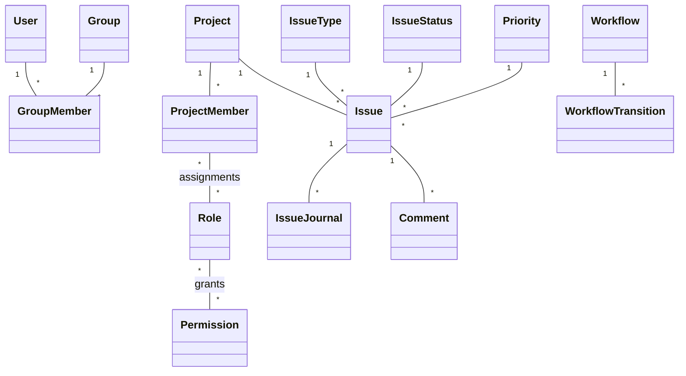

## Identity and membership

`User` has a stable ID, username, normalized email, display name, account status, and system-administrator flag.

`Group` has a stable ID, name, and optional description. `GroupMember(group_id, user_id)` is unique by pair. Nested groups do not exist.

`ProjectMember` belongs to one project and references exactly one principal: a user or a group. The tuple `(project_id, principal_type, principal_id)` is unique.

Role assignments form a many-to-many relationship between `ProjectMember` and `Role`.

## Project and issue identity

Project keys are globally unique. The issue sequence is unique inside a project and never reused. Human issue references are derived as `<project-key>-<sequence>`; they are not the database primary key.

An Issue stores stable foreign keys to Project, IssueType, IssueStatus, and Priority. Author is immutable. Assignee is nullable and references one User or Group principal that is currently a project member.

Parent issue is nullable, must belong to the same project, cannot reference self, and cannot introduce a cycle.

## Workflow

A project selects one Workflow for each enabled IssueType. A workflow transition is unique by `(workflow_id, from_status_id, to_status_id)` and has one or more allowed roles.

Status changes are never persisted as generic issue field edits. They use the transition operation so workflow authorization and journaling cannot be bypassed.

## Audit model

Issue field mutations append an immutable `IssueJournal` entry in the same transaction as the issue update. A journal records actor, timestamp, and before/after values for changed fields.

Comments are independent records associated with the issue and actor. Comment creation appears in the issue activity stream, but comment text is not encoded as a field diff.
