<Callout title='Proposed serving protocol' type='warning'>
  This paper is a technical design, not a statement that the serving protocol is already implemented. Resource identity,
  immutable snapshots, runtime binding, backend Expressions, and route ownership remain defined contracts. The concrete
  serving endpoint, wire schema, graph-state token, artifact encoding, retention policy, and compatibility negotiation
  remain open until they are added to the public contract and OpenAPI.
</Callout>

## Abstract

A Taskmigo Site can contain many Applications, Pages, reusable Components, and Translation resources. Shipping the entire active snapshot to a browser makes bootstrap payload grow with the Site instead of with the route being rendered. Returning a complete render model on every navigation fixes HTTP waterfalls but repeatedly transfers UI data that the browser already received.

This paper proposes **Incremental Runtime Graph Delivery**: the browser keeps a partial materialization of one immutable runtime snapshot, while Taskmigo progressively sends only graph nodes required by the requested route that are not already available to that browser application instance.

For a route `r` and client graph state `G`, the central operation is:

```text
missing(r, G) = closure(r) - available(G)
```

The serving response contains the route descriptor, the missing immutable nodes, request-scoped dynamic values, and the next graph-state token. The browser adds the new immutable nodes to its local graph instead of replacing the graph after every navigation.

The target happy-path invariants are:

1. **One Taskmigo HTTP round trip per render or navigation.**
2. **Only missing immutable graph nodes are transferred.**
3. **A runtime binding never mixes nodes from different snapshots.**
4. **Static graph data and mutable authoritative data have independent freshness rules.**
5. **Next.js renders the graph; it does not resolve the Resource dependency graph.**

## Problem

The authoring and inspection APIs are intentionally Resource-oriented. They are useful for editors, diagnostics, revision history, and snapshot inspection, but they are a poor serving protocol.

A frontend that reconstructs a Page from inspection APIs would need to discover the active snapshot, inspect its Resource pins, fetch revisions, parse authored manifests, traverse imports, match routes, expand Components, and resolve runtime values. This creates an HTTP waterfall and duplicates backend runtime responsibilities in Next.js.

A single self-contained render response removes that waterfall, but introduces another scaling problem:

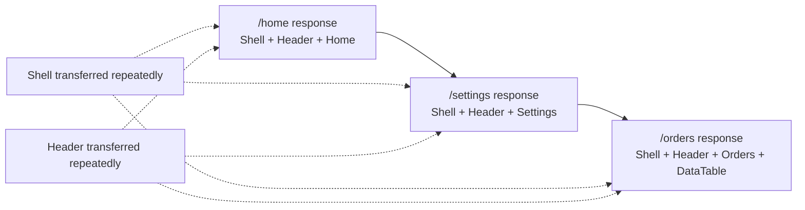

The desired behavior is progressive. Once `Shell` and `Header` are present locally, later routes reference them rather than transferring their payload again.

## Design goals

| Goal | Requirement |
| --- | --- |
| Network latency | One Next.js-to-Taskmigo request on the happy path for bootstrap and each navigation. |
| Network bytes | Transfer route metadata, dynamic values, and only immutable nodes missing from the client graph. |
| Runtime consistency | Every node used by one binding belongs to the exact snapshot pinned by that binding. |
| Frontend simplicity | Next.js does not parse manifests, traverse imports, select revisions, or evaluate backend Expressions. |
| Site scalability | Bootstrap cost is proportional to the initial route closure, not the complete Site graph. |
| Reuse | Shared immutable artifacts can be reused across routes and, when identity permits, across snapshots. |
| Recovery | Cache loss or stale client graph state recovers without corrupting the runtime view. |
| Security | Client cache claims are optimization hints, never authorization or integrity evidence. |

The design does not require a specific database, cache product, compression codec, RSC representation, or graph-state-token encoding.

## Runtime graph

A compiled snapshot is modeled as an immutable directed graph. Nodes contain renderer-consumable artifacts; edges express the artifacts required to interpret or render another node.

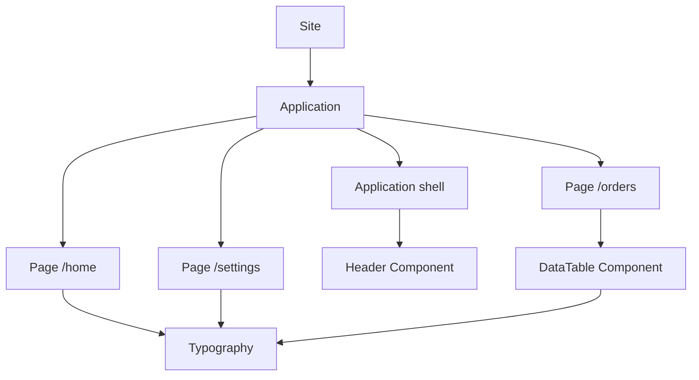

This graph is a runtime artifact graph, not a requirement to expose authored Resource manifests to the browser. Compilation may normalize or partition authored Resources into a representation optimized for rendering.

### Node identity

Every immutable node needs a stable identifier. The preferred identity is a content-derived artifact identifier because identical compiled content can then be reused without depending on a particular route or snapshot.

Conceptually:

```text
artifactId = hash(artifact-format-version || canonical-artifact-bytes)
```

The hash algorithm, canonical encoding, and artifact format version are open protocol decisions. Implementations must not assume that a Resource name or mutable current pointer is sufficient artifact identity.

A snapshot stores references to exact artifact IDs. The snapshot remains the authority for which artifacts are legal for a bound runtime even if the same artifact ID also occurs in another snapshot.

### Route closure

For a pathname, the compiled route index resolves an Application and Page. The **route closure** is the transitive set of immutable artifacts required to render that route under the bound snapshot.

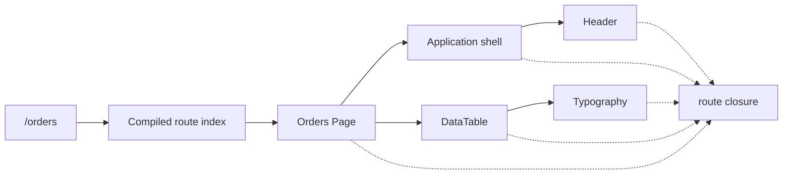

The closure should be known from compiled snapshot metadata. The serving hot path must not rediscover it by parsing YAML or recursively calling Resource HTTP APIs.

## Client partial graph

A browser application instance maintains a partial local graph associated with its runtime binding. The graph starts empty and normally grows as the user visits routes.

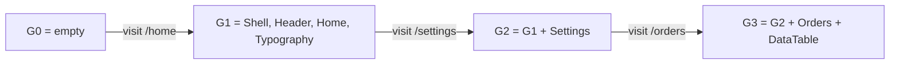

Logically, while artifacts remain cached:

```text
G0 ⊆ G1 ⊆ G2 ⊆ G3
```

Navigation does not semantically remove immutable nodes just because the next Page does not use them. This makes back navigation and repeated navigation cheap. Physical cache eviction is separate from graph semantics and is discussed later.

## Serving protocol

The protocol has two pieces of browser state:

- **runtime binding** — pins snapshot and presentation context;
- **graph-state token** — compactly describes the server-recognized delivery state for that browser graph.

The graph-state token prevents the browser from sending an ever-growing list of artifact hashes on every navigation. Its concrete representation is intentionally open. It may be an opaque signed token, a server-side state handle, or another bounded capability, provided recovery and integrity requirements are met.

A conceptual request is:

```json
{
  "pathname": "/orders",
  "binding": "B1",
  "graphState": "G2"
}
```

A conceptual response is:

```json
{
  "binding": "B1",
  "graphState": "G3",
  "route": {
    "root": "artifact:orders-page",
    "requires": [
      "artifact:app-shell",
      "artifact:header",
      "artifact:orders-page",
      "artifact:data-table",
      "artifact:typography"
    ]
  },
  "nodes": {
    "artifact:orders-page": {},
    "artifact:data-table": {}
  },
  "dynamicValues": {}
}
```

The examples illustrate responsibilities, not finalized field names or wire types.

`route.requires` describes the artifacts the route expects. `nodes` contains only payloads the server believes the client still needs. `dynamicValues` is request-scoped data and is not implicitly cached as immutable graph content.

## Initial SSR

The initial request has no existing binding and no graph state. Taskmigo acquires the active snapshot exactly once, creates the binding, resolves the route closure, and sends that closure as the first graph patch.

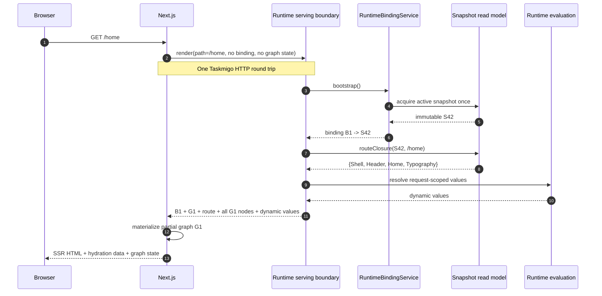

The initial payload is therefore proportional to `/home` and its dependencies. A Site with hundreds of unvisited Pages does not ship those Pages during `/home` bootstrap.

## Progressive navigation

Suppose `/settings` reuses all artifacts already delivered for `/home` except that it introduces `SettingsPage`.

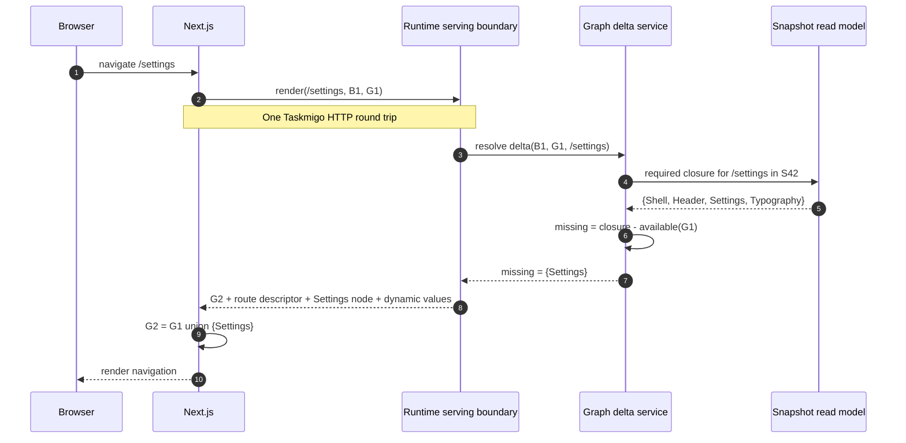

A later `/orders` navigation may add only `OrdersPage` and `DataTable`. Returning to `/home` can transfer zero immutable node bytes when its closure remains locally available.

## Delta calculation

The backend, not Next.js, owns graph resolution.

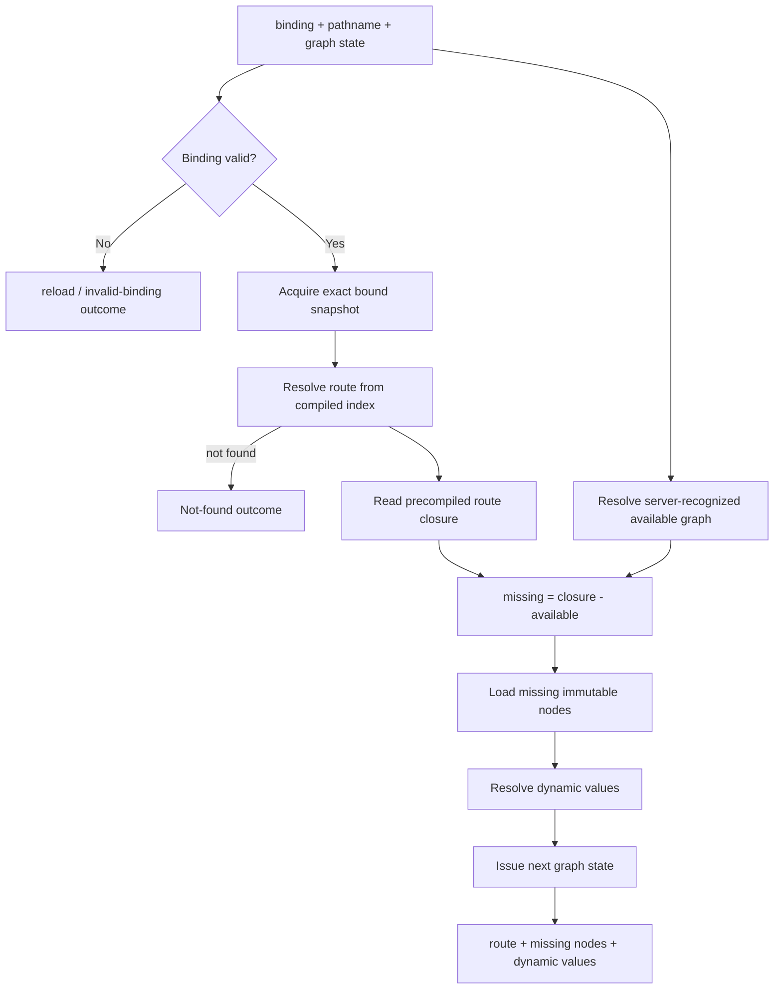

The critical performance property is that route matching and closure discovery are compiled operations. A request must not perform a serial traversal through authoring APIs.

## Static graph and dynamic values

Immutable UI structure and mutable runtime values have different caching semantics and must not be combined into one content-addressed artifact.

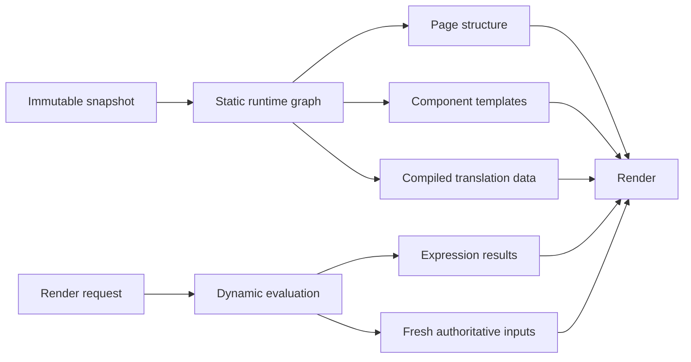

Static graph nodes can be reused as long as their artifact identity remains valid. Authorization, account state, subscriptions, workflow state, and other mutable authoritative inputs follow the freshness rules of their owning capability. A graph-state token must never imply that such mutable state is still valid.

Expression results are dynamic unless the compiler can prove they depend only on immutable snapshot inputs. The initial protocol should prefer correctness over aggressive promotion of Expression results into immutable artifacts.

## Cross-page reuse

Shared Components naturally deduplicate because routes reference the same artifact IDs.

For example:

```text
/home     -> Shell, Header, Typography, Home
/settings -> Shell, Header, Typography, Settings
/orders   -> Shell, Header, Typography, DataTable, Orders
```

After visiting all three routes, the browser stores one copy of `Shell`, `Header`, and `Typography`, not three route-specific copies.

This is different from response caching. The unit of reuse is the immutable graph node, so reuse survives different route response compositions.

## Cross-snapshot reuse

A full reload normally creates a new binding to the currently active snapshot. A newer snapshot can still reference artifact IDs identical to artifacts from the previous snapshot.

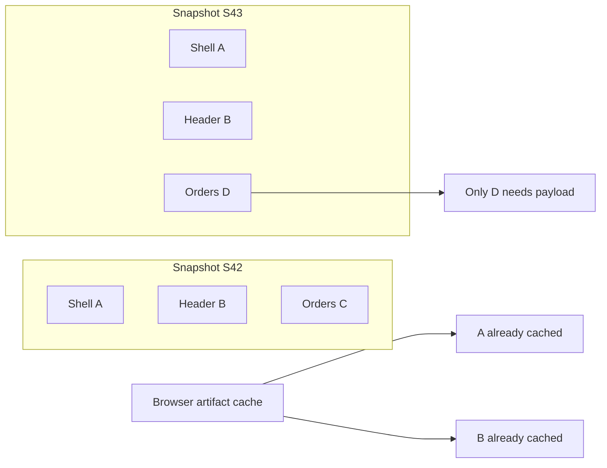

Cross-snapshot reuse is safe only when artifact identity includes every compatibility input needed to interpret the bytes, including artifact format or renderer compatibility where applicable. The new snapshot remains authoritative for the allowed graph; possession of an old artifact does not authorize the client to inject it into a route that the new snapshot does not reference.

A new binding and a new graph-state token may therefore reuse physical artifact bytes while still establishing a new logical delivery state.

## Graph-state token

Sending all cached artifact IDs on every request eventually makes request headers or bodies grow with browsing history. The serving protocol needs a bounded representation of known delivery state.

The graph-state abstraction must support:

- identifying the binding/snapshot context it belongs to;
- advancing after successful graph delivery;
- rejecting tokens from an incompatible binding or renderer;
- recovering when the browser has evicted artifacts that the token assumes are present;
- bounded request size independent of the number of visited Pages;
- protection against client modification if server correctness depends on token contents.

Two implementation families are viable:

| Model | Benefit | Cost |
| --- | --- | --- |
| Stateless opaque token | No per-tab graph-state row is required. | Token encoding must remain bounded and cannot simply embed every artifact ID. |
| Server-side graph-state handle | Small client token and precise server knowledge. | Requires lifecycle, expiry, storage, cleanup, and multi-instance coordination. |

This paper does not select between them. `GraphStateService` should hide the representation so route/delta logic does not depend on that choice.

## Cache eviction and recovery

Logical graph growth does not require the browser to retain every artifact forever. Memory pressure may evict artifacts.

If the graph-state token says an artifact is available but the renderer discovers that its local payload is absent, the client must recover explicitly. It must not substitute a different revision or fetch authored Resource source.

A recovery exchange can report missing artifact IDs to the same serving boundary:

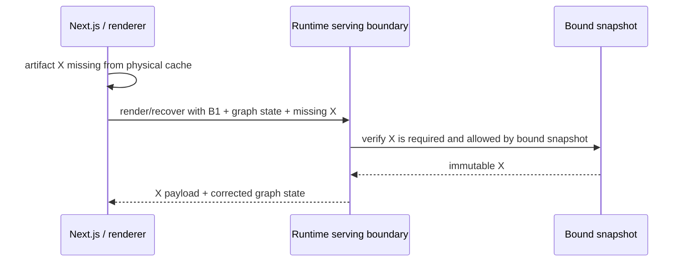

The exact recovery request shape is open. The invariant is that recovery remains snapshot-bound and can be satisfied without rebuilding runtime state from mutable authoring pointers.

## Concurrency

Multiple navigations or prefetches may be in flight concurrently. Graph-state updates must therefore not rely on responses arriving in request order.

The safest semantic model is set-based: receiving valid immutable nodes is idempotent, and merging two patches is a union operation.

```text
apply(G, patchA, patchB) = G ∪ patchA ∪ patchB
```

A graph-state token may still have ordering or generation semantics internally, but an older successful response must not cause the frontend to discard newer immutable nodes. If token advancement requires compare-and-swap behavior, the protocol must define how a stale response is merged or refreshed.

Route-specific dynamic values are not unioned this way. They belong to the render/navigation request that produced them and must obey the frontend's normal stale-navigation cancellation rules.

## Prefetch

Progressive delivery works naturally with route prefetching. Prefetch is an optimization, not a correctness dependency.

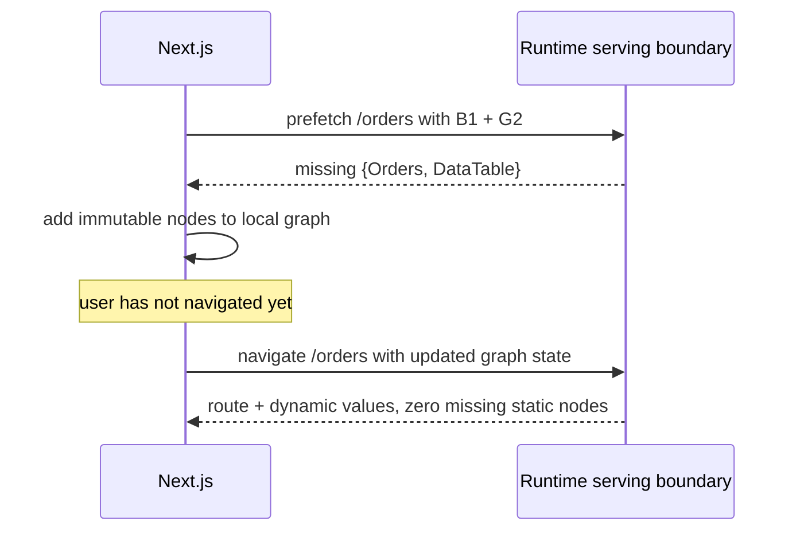

The server may choose a lower priority for prefetch work. Prefetch must not change the bound snapshot or presentation context.

## HTTP and transport behavior

The serving boundary is an aggregation boundary. Internal runtime services should call repositories, compiled read models, and caches directly rather than calling Taskmigo's public Resource APIs over HTTP.

```mermaid
flowchart LR
  next["Next.js"] -->|"1 HTTP request"| serving["Runtime serving boundary"]
  serving --> binding["Binding service"]
  serving --> graph["Graph delta service"]
  graph --> route["Compiled route index"]
  graph --> artifacts["Artifact store/cache"]
  serving --> eval["Runtime evaluation"]
```

HTTP/2 or HTTP/3 multiplexing can reduce the cost of multiple requests but does not remove request scheduling, headers, authorization, serialization, service admission, or application-level waterfalls. The primary protocol therefore remains one aggregate request, not one HTTP request per artifact.

Large responses should use normal transport compression. Content-addressed artifacts also permit immutable HTTP caching or CDN storage in a future transport, but cache misses should still be inlineable in the aggregate response so the happy path does not become an artifact-fetch waterfall.

## Backend hot path

The serving path should be dominated by indexed lookups, set operations, immutable artifact reads, and dynamic evaluation.

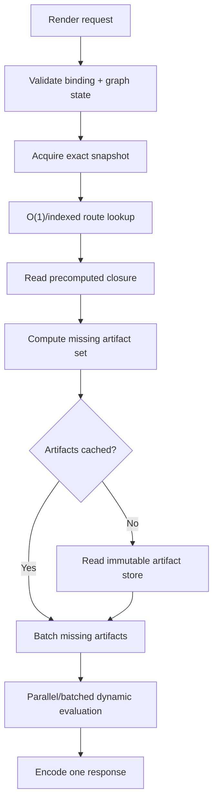

Avoid these operations on the hot path:

- parsing YAML manifests;
- recursively resolving Resource imports;
- reading mutable current Resource pointers;
- making internal HTTP calls to Resource/revision APIs;
- loading the complete snapshot graph when only one route closure is required;
- serially fetching one artifact at a time;
- recomputing content hashes for immutable artifacts on every request.

## Compilation requirements

Snapshot activation should produce enough read-model data for serving to avoid runtime graph reconstruction. At minimum, compilation needs to make these queries efficient:

```text
pathname -> route descriptor
route -> required artifact IDs
artifact ID -> immutable compiled payload
snapshot -> allowed artifact IDs / graph metadata
```

Whether route closure is stored fully materialized per route or represented by a compact structure that can be expanded cheaply is an implementation tradeoff. Full closure materialization improves serving latency but can duplicate artifact IDs across route indexes. A compact dependency DAG saves storage but adds traversal CPU. Both satisfy this design if traversal is local, bounded, and does not create frontend-visible round trips.

## Failure semantics

| Failure | Required behavior |
| --- | --- |
| Invalid binding | Reject the request; do not silently bootstrap onto another snapshot. |
| Expired/revoked/incompatible binding | Return a reload-required outcome according to the future binding contract. |
| Invalid graph-state token | Recover/reset graph delivery state without changing the bound snapshot when possible. |
| Route not found | Return the route-level not-found outcome for the bound snapshot. |
| Missing/corrupt immutable artifact on server | Fail the render and surface an operational error; never fall back to mutable authored state. |
| Client claims artifact it does not physically have | Use explicit cache-miss recovery and resend the verified artifact. |
| Dynamic evaluation failure | Follow the owning Expression/runtime error contract; do not cache the failure as immutable graph data. |
| Concurrent stale response | Merge immutable nodes idempotently; do not overwrite newer graph knowledge with an older set. |

## Security model

The browser is untrusted. Progressive graph delivery changes bandwidth behavior, not the authority model.

The server must derive the legal route closure from the bound snapshot. A client-provided graph state can suppress transfer of an artifact the server believes the client already owns, but it must never cause an artifact outside the snapshot/route closure to become render-authoritative.

Artifact hashes provide identity/integrity properties only when the chosen hash and canonical encoding are used correctly; they are not authorization tokens. Sensitive per-user values should not be embedded into globally reusable immutable artifacts. Authorization checks and other mutable security decisions retain their own freshness semantics.

If a shared CDN/artifact cache is introduced, artifact partitioning must ensure that globally cacheable payloads contain no user-specific or secret data.

## Payload budget

Consider three routes:

```text
/home     closure = {Shell, Header, Typography, Home}
/settings closure = {Shell, Header, Typography, Settings}
/orders   closure = {Shell, Header, Typography, Orders, DataTable}
```

A full render-model protocol transfers 4 + 4 + 5 = 13 artifact payload occurrences across the three navigations.

Incremental delivery transfers:

```text
/home     -> Shell + Header + Typography + Home     = 4
/settings -> Settings                               = 1
/orders   -> Orders + DataTable                     = 2
                                                    ---
unique transferred artifact payloads                = 7
```

The exact byte savings depend on artifact sizes and dynamic payloads, but the asymptotic property is more important: repeated navigation cost approaches the size of newly discovered route dependencies rather than the total route closure.

## Round-trip budget

| Operation | Browser → Next.js | Next.js → Taskmigo | Additional artifact HTTP requests |
| --- | ---: | ---: | ---: |
| Initial SSR | 1 | 1 | 0 on happy path |
| Client navigation | 1 | 1 | 0 on happy path |
| Route prefetch | — | 1 | 0 on happy path |
| Cache recovery | — | 1 recovery exchange | 0 if missing artifacts are inlined |

The protocol optimizes both latency and bytes. Reducing round trips by sending the entire Site would satisfy the first metric while failing the second.

## Frontend responsibilities

Next.js owns transport integration and rendering, not runtime graph resolution.

It must:

- retain the opaque runtime binding for the browser application instance;
- retain the current graph-state token;
- store immutable nodes by artifact ID;
- merge patches idempotently;
- verify that every artifact referenced by the route descriptor is physically available before rendering;
- request recovery for missing physical cache entries;
- keep request-scoped dynamic values associated with the correct navigation;
- discard or ignore stale dynamic responses when a newer navigation wins.

It must not:

- parse Taskmigo YAML manifests to discover runtime dependencies;
- call Resource/revision APIs to fill graph holes;
- infer revisions from Resource names;
- evaluate backend Expressions;
- switch snapshots because an artifact is missing;
- trust locally cached artifacts that are not referenced by the bound route descriptor.

## Backend responsibilities

A clean implementation boundary is:

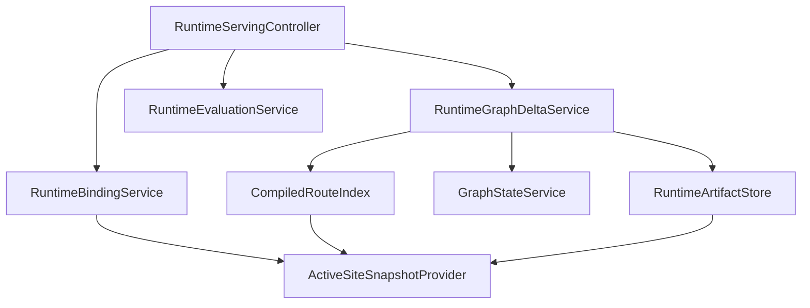

Names are implementation guidance rather than a public API requirement. Responsibilities should remain separated even if the initial implementation uses fewer concrete classes.

`RuntimeGraphDeltaService` should accept an already validated binding/snapshot context. It must not reacquire the mutable active pointer. `GraphStateService` owns the opaque graph-state representation and recovery semantics. `RuntimeArtifactStore` serves immutable compiled payloads by artifact identity.

## Observability

Measure the protocol as a graph-delivery system, not only as an HTTP endpoint. Useful metrics include:

- serving request latency by bootstrap/navigation/prefetch/recovery;
- route closure artifact count and bytes;
- missing artifact count and bytes per response;
- graph reuse ratio: `1 - missingBytes / closureBytes`;
- artifact cache hit ratio at browser, edge, and backend layers where observable;
- graph-state recovery rate;
- average and p95 response bytes by route;
- dynamic-evaluation latency separately from static artifact lookup;
- reload-required and invalid-binding rates;
- server artifact-missing/corruption errors.

A regression where HTTP latency stays flat but missing bytes approach closure bytes should be visible as a graph-reuse regression.

## Verification strategy

The implementation test suite should prove protocol invariants, not only example responses.

### Graph correctness

- Bootstrap sends every artifact required by the initial route and no unrelated Page artifacts.
- Navigating to a route with shared dependencies sends only the missing nodes.
- Returning to an already materialized route sends zero immutable nodes when nothing was evicted.
- Every route reference resolves to either an existing local node or a node included in the response.
- A node from another snapshot cannot be injected merely because the browser possesses its bytes.

### Snapshot consistency

- Activating S43 while a tab is bound to S42 does not alter that tab's route closures or graph nodes.
- A new binding can adopt S43 and physically reuse content-identical artifacts without mixing snapshot graph authority.
- Recovery always uses the bound snapshot.

### Concurrency

- Two concurrent route patches can arrive in either order and their immutable nodes are retained.
- An older navigation cannot replace newer request-scoped dynamic state.
- Duplicate artifact delivery is idempotent.

### Failure and recovery

- Evicting a locally required artifact triggers bounded recovery rather than a Resource API waterfall.
- Invalid graph state cannot change snapshot identity.
- Missing server artifacts fail closed instead of falling back to current authoring state.

### Performance

Use representative Sites with many unvisited Pages and heavily shared Components. Assert that bootstrap payload is bounded by initial route closure, and record the transferred immutable bytes for navigation sequences to detect accidental full-model regressions.

## Rollout strategy

A practical implementation can be staged without exposing Resource resolution to Next.js:

1. **Compile runtime artifacts and route closures.** Keep the existing runtime binding contract and establish internal artifact identity/store abstractions.
2. **Introduce one serving boundary.** It may initially return the complete route closure, establishing the one-round-trip contract without frontend graph resolution.
3. **Add client artifact storage and graph patches.** Introduce graph-state negotiation and omit already delivered nodes.
4. **Add recovery and concurrency hardening.** Support physical eviction, stale graph state, concurrent prefetch/navigation, and operational metrics.
5. **Evaluate cross-snapshot reuse and edge caching.** Enable only after artifact compatibility and security partitioning are explicit.

At no stage should Next.js temporarily depend on the authoring/inspection API chain as the production rendering architecture.

## Open decisions

The following must be finalized before the protocol becomes a public API contract:

- serving endpoint method and path;
- request and response DTOs;
- runtime binding transport and lifetime;
- graph-state token representation, lifetime, reset, and recovery contract;
- artifact hash algorithm, canonical encoding, and format versioning;
- renderer/artifact compatibility negotiation;
- artifact partitioning granularity;
- maximum response size and behavior when a route closure exceeds it;
- browser cache persistence and eviction policy;
- cross-snapshot artifact reuse rules;
- CDN/HTTP cache topology;
- dynamic-value representation and error contract;
- authorization policy for the serving endpoint;
- observability SLOs and payload budgets.

Until those decisions are defined, implementations should preserve the internal boundaries in this paper without inventing externally observable wire behavior.

## Decision summary

Incremental Runtime Graph Delivery treats UI serving as synchronization of a **partial immutable graph**, not repeated transfer of complete render models.

The browser starts with no graph, receives the closure required for its first route, and progressively accumulates immutable artifacts as navigation discovers new parts of the Site. For every later route, Taskmigo computes the difference between the required closure and the graph already recognized for that browser application instance, then sends only the difference plus request-scoped dynamic values.

The resulting architecture preserves a thin Next.js layer, keeps snapshot resolution authoritative in Taskmigo, avoids Resource-by-Resource HTTP waterfalls, prevents repeated transfer of shared UI artifacts, and scales network cost with what the user actually visits rather than with the total size of the Site.
