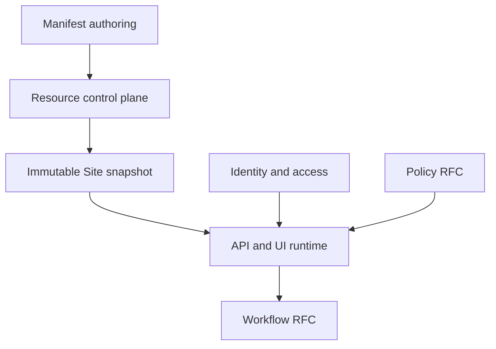

This section is the engineering handbook for building Taskmigo. Start with [Development instructions](/versions/v0/developer/development-instructions), then open the subsystem page for the implementation detail you need.

<Callout title='System design and product availability' type='info'>
  Developer pages define the target implementation. [Product status](/versions/v0/manuals/status) tells you whether a
  capability is available, defined, planned, or still an RFC.
</Callout>

## System at a glance

The Resource control plane validates a complete dependency graph and activates one immutable snapshot. Runtime operations acquire that snapshot instead of rebuilding state from mutable manifests. Access authenticates the Principal; Policy decides API access and object scope; Workflow persists long-running execution against pinned revisions.

## Choose your path

<Cards>
  <Card
    title='Implement Taskmigo'
    href='/versions/v0/developer/development-instructions'
    description='Detailed implementation phases, technical boundaries, tests, and definition of done.'
  />
  <Card
    title='Implement the HTTP API'
    href='/versions/v0/developer/api'
    description='OpenAPI 3.2.0 contract, endpoints, concurrency, Problem Details, Spring adapters, and API tests.'
  />
  <Card
    title='Explore the API'
    href='/api-reference'
    description='Interactive Scalar viewer rendered directly from the canonical OpenAPI 3.2.0 document.'
  />
  <Card
    title='Understand the system'
    href='/versions/v0/developer/architecture'
    description='Module boundaries, dependency rules, request flows, invariants, and implementation order.'
  />
  <Card
    title='Find code and data'
    href='/versions/v0/developer/codebase'
    description='Repository layout, classes, functions, database ownership, and where new code belongs.'
  />
  <Card
    title='Develop the database'
    href='/versions/v0/developer/database'
    description='Schema, constraints, transactions, concurrency, retention, and PostgreSQL verification.'
  />
  <Card
    title='Build resources and runtime'
    href='/versions/v0/developer/resource-runtime'
    description='Revisions, resolution, validation, snapshot compilation, activation, and runtime acquisition.'
  />
  <Card
    title='Implement Policy'
    href='/versions/v0/developer/policy'
    description='Request authorization, Role attachment, typed predicates, and database-backed object filters.'
  />
  <Card
    title='Implement Workflow'
    href='/versions/v0/developer/workflow'
    description='Durable state transitions, interactions, retries, outbox processing, and recovery.'
  />
  <Card
    title='Verify a change'
    href='/versions/v0/developer/verification'
    description='Local gates, test layers, failure injection, acceptance evidence, and debugging entry points.'
  />
</Cards>
