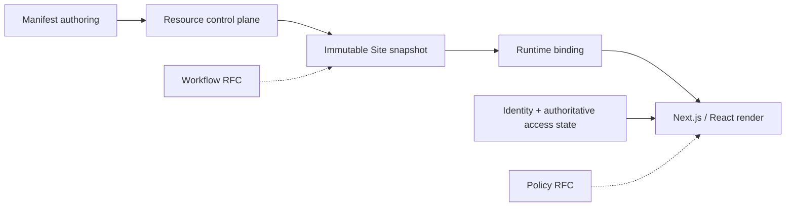

Developer documentation describes the **target implementation** of the contracts in Manuals. A named package, class, table, or endpoint is an implementation requirement only when its canonical page defines it; its presence in this handbook is not evidence that the application repository already contains it.

<Callout title='Start with product behavior' type='info'>
  Manuals are the source of truth for user-visible semantics. [Product status](/versions/v0/manuals/status) separates defined
  contracts from RFCs and planned delivery. Developer pages must not turn an RFC or open decision into current behavior.
</Callout>

## System at a glance

The Resource control plane owns authoring history, dependency resolution, validation, compilation, and activation. The serving side consumes immutable snapshots through runtime bindings; it does not rebuild a Site from mutable Resource pointers per request.

## Recommended reading path

<Cards>
  <Card
    title='1. Architecture'
    href='/versions/v0/developer/architecture'
    description='Understand capability ownership, dependency direction, runtime planes, invariants, and open decisions.'
  />
  <Card
    title='2. Development instructions'
    href='/versions/v0/developer/development-instructions'
    description='Implement the defined foundation in dependency order without duplicating subsystem design.'
  />
  <Card
    title='3. Resource and runtime'
    href='/versions/v0/developer/resource-runtime'
    description='Implement graph compilation, snapshots, browser bindings, routing, and the render read model.'
  />
  <Card
    title='4. API development'
    href='/versions/v0/developer/api'
    description='Implement the design-first OpenAPI contract and preserve the unresolved SSR serving boundary.'
  />
  <Card
    title='5. Database'
    href='/versions/v0/developer/database'
    description='Implement Resource/runtime persistence, graph identity, transactions, activation, and retention safety.'
  />
  <Card
    title='6. Codebase map'
    href='/versions/v0/developer/codebase'
    description='Find the target packages, public ports, and ownership for each implementation responsibility.'
  />
  <Card
    title='7. Verification'
    href='/versions/v0/developer/verification'
    description='Prove graph propagation, snapshot consistency, runtime binding, persistence races, and contract behavior.'
  />
</Cards>

## RFC implementation designs

<Cards>
  <Card
    title='Policy RFC'
    href='/versions/v0/developer/policy'
    description='Proposed request authorization and database-backed object filtering design.'
  />
  <Card
    title='Workflow RFC'
    href='/versions/v0/developer/workflow'
    description='Proposed durable execution, interaction, retries, persistence, and recovery design.'
  />
</Cards>

Use the [interactive API Reference](/api-reference/) only for endpoints already present in the canonical OpenAPI document.
