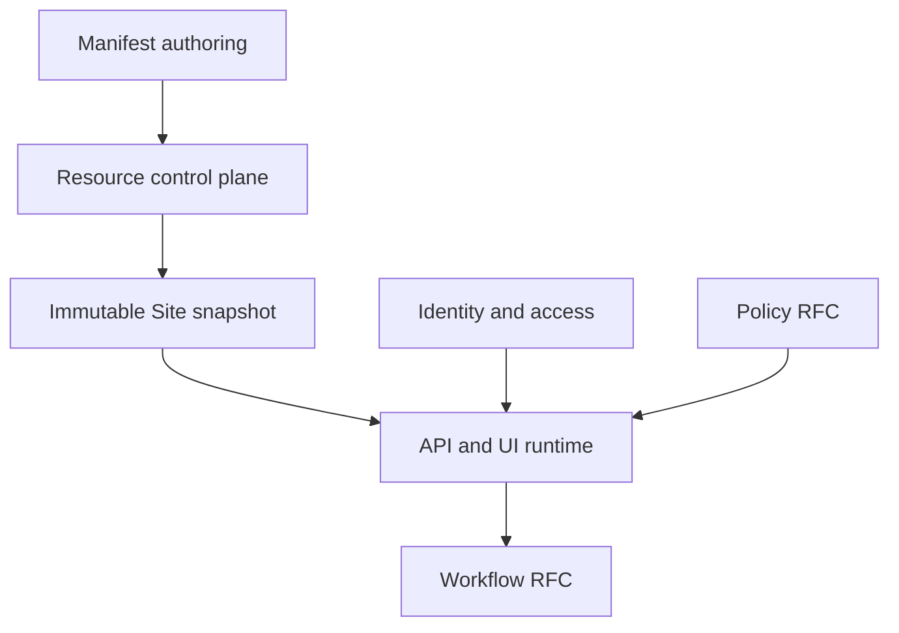

This section is for engineers building Taskmigo—from a new team member locating code to an architect reviewing cross-module behavior. Start with the page that matches the task; each engineering rule has one canonical home.

<Callout title='System design and product availability' type='info'>
  Developer pages define the target implementation. [Product status](/versions/v0/manuals/status) tells you whether a
  capability is available, defined, planned, or still an RFC.
</Callout>

## System at a glance

The Resource control plane validates a complete dependency graph and activates one immutable snapshot. Runtime operations acquire that snapshot instead of rebuilding state from mutable manifests. Access authenticates the Principal; Policy decides API access and object scope; Workflow persists long-running execution against pinned revisions.

## Choose your path

<Cards>
  <Card
    title='Understand the system'
    href='/versions/v0/developer/architecture'
    description='Module boundaries, dependency rules, request flows, invariants, and implementation order.'
  />
  <Card
    title='Find code and data'
    href='/versions/v0/developer/codebase'
    description='Repository layout, classes, functions, database ownership, and where new code belongs.'
  />
  <Card
    title='Build resources and runtime'
    href='/versions/v0/developer/resource-runtime'
    description='Revisions, resolution, validation, snapshot compilation, activation, and runtime acquisition.'
  />
  <Card
    title='Implement Policy'
    href='/versions/v0/developer/policy'
    description='Request authorization, Role attachment, typed predicates, and database-backed object filters.'
  />
  <Card
    title='Implement Workflow'
    href='/versions/v0/developer/workflow'
    description='Durable state transitions, interactions, retries, outbox processing, and recovery.'
  />
  <Card
    title='Verify a change'
    href='/versions/v0/developer/verification'
    description='Local gates, test layers, failure injection, acceptance evidence, and debugging entry points.'
  />
</Cards>

## Design maturity

| Area                                        | Design status | Canonical guide                                                 |
| ------------------------------------------- | ------------- | --------------------------------------------------------------- |
| Console, identity, OAuth/OIDC, JWT, signing | Defined       | [Codebase map](/versions/v0/developer/codebase)                 |
| Resources, tags, compilation, snapshots     | Defined       | [Resource and runtime](/versions/v0/developer/resource-runtime) |
| API authorization and object filtering      | RFC           | [Policy](/versions/v0/developer/policy)                         |
| Durable Workflow execution                  | RFC           | [Workflow](/versions/v0/developer/workflow)                     |

**Defined** means the engineering contract is decided. **RFC** means the design is implementable but may change through documented open decisions. Neither means the capability is already available.
