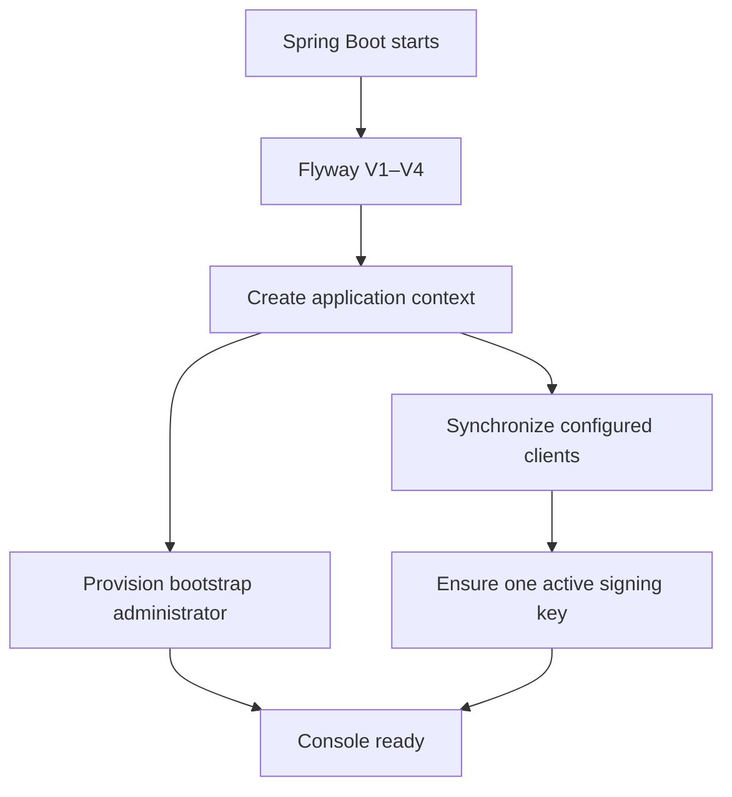
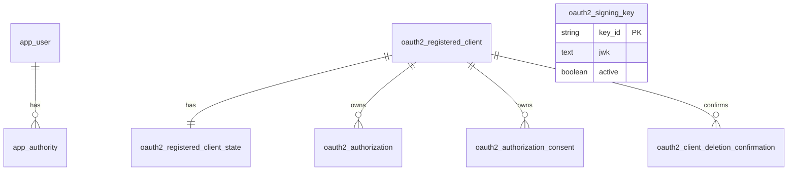
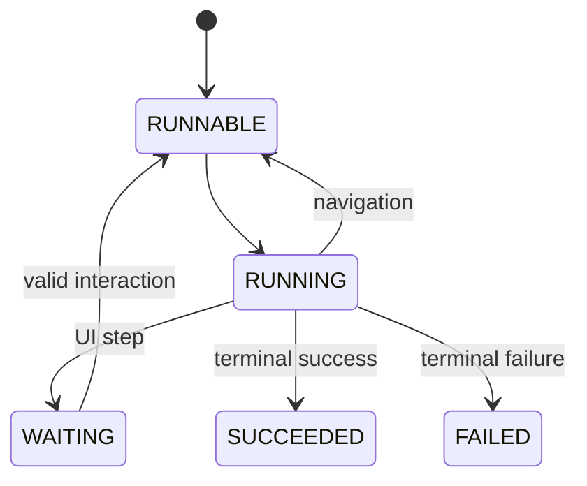

This document is the technical entry point for anyone building Taskmigo. A new team member should be able to use it to answer four questions without reading the entire repository:

1. Which capability owns the behavior, and where does its code belong?
2. How does a request or startup workflow move through the system?
3. Where should a new capability, class, database table, or test be added?
4. Which behavior proves that the implementation is complete and safe?

<Callout title='Canonical system design' type='info'>
  This page defines Taskmigo's target architecture: where code belongs, how data is stored, how requests and background
  work flow, and how each capability is verified. [Product status](/versions/v0/manuals/status) remains the source for
  runtime availability.
</Callout>

## Find a topic

| Need                                  | Go to                                                                                                             |
| ------------------------------------- | ----------------------------------------------------------------------------------------------------------------- |
| Run or build Taskmigo                 | [Run and verify](#run-and-verify-taskmigo)                                                                        |
| Find a class or function              | [Code map](#find-code-by-responsibility) and [class reference](#foundation-class-and-function-design)             |
| Understand persistence                | [Database foundation](#database-foundation)                                                                       |
| Implement manifests and snapshots     | [Resource and snapshot engine](#resource-and-snapshot-engine)                                                     |
| Implement API authorization/filtering | [Policy RFC](#policy-rfc-implementation-design)                                                                   |
| Implement durable execution           | [Workflow RFC](#workflow-rfc-implementation-design)                                                               |
| Add common code or a new feature      | [Coding conventions](#common-code-and-coding-conventions) and [feature workflow](#how-to-implement-a-new-feature) |
| Verify or debug behavior              | [Verification strategy](#verification-strategy) and [debugging](#debugging-and-operational-entry-points)          |

## System design status

| Area                                          | Design status | Owning boundary                                                                       |
| --------------------------------------------- | ------------- | ------------------------------------------------------------------------------------- |
| Console application and local stack           | Defined       | Java 26, Spring Boot 4.1, Spring Modulith 2.1, PostgreSQL 18, Gradle, Docker Compose. |
| Identity, OAuth 2.1/OIDC, JWT, signing keys   | Defined       | `access` module.                                                                      |
| Public/authenticated/admin system APIs        | Defined       | `system` module; not a home for business APIs.                                        |
| Taskmigo-owned PostgreSQL schema              | Defined       | One configurable schema, `taskmigo` by default.                                       |
| Resource revisions, tags, manifest validation | Defined       | `resource` module.                                                                    |
| Site snapshot compilation and activation      | Defined       | `resource` module with an immutable runtime read model.                               |
| Policy                                        | RFC           | `policy` module integrated with `access`, API owners, and snapshot compilation.       |
| Workflow                                      | RFC           | `workflow` module with durable execution and an outbox-backed worker.                 |

**Defined** means the engineering contract is decided. **RFC** means the design is implementable but may still change through the documented open decisions. Neither status states that a capability is available; use [Product status](/versions/v0/manuals/status) for that.

## Run and verify Taskmigo

The application lives in `console/`. The repository root contains Compose and development examples.

```bash
bash examples/docker-compose.sh up --build
```

The sample starts PostgreSQL and Console on port `9000`. It creates the local bootstrap user `developer` and two environment-configured OAuth clients. The wrapper removes conflicting exported credentials before invoking Compose, so use it instead of calling Docker Compose directly when reproducing the documented sample.

Run without Compose only when Java 26 and PostgreSQL 18 are available:

```bash
cd console
./gradlew bootRun
```

The repository acceptance gate is:

```bash
cd console
./gradlew test
./gradlew build
```

`./gradlew test` includes PostgreSQL integration tests when Docker is available. Do not interpret a Docker-disabled run as evidence that migrations, JDBC repositories, OAuth issuance, or deletion cascades work.

## Repository map

```text
taskmigo/
├── compose.yaml                         # PostgreSQL + Console development stack
├── examples/                            # deterministic local environment and wrapper
├── docs/                                # application-level technical notes
└── console/
    ├── build.gradle.kts                 # Java, Spring Boot, Modulith and test dependencies
    └── src/
        ├── main/java/com/taskmigo/console/
        │   ├── ConsoleApplication.java  # application entry point
        │   ├── access/                  # identity and access bounded context
        │   └── system/                  # sample system endpoints
        ├── main/resources/
        │   ├── application.yml
        │   └── db/migration/            # Flyway is the database schema owner
        └── test/java/com/taskmigo/console/
            ├── ArchitectureTest.java
            └── PersistenceIntegrationTest.java
```

Start at `console/src/main/java/com/taskmigo/console/ConsoleApplication.java`. It enables configuration-properties scanning and method security. Spring Boot discovers capability modules below `com.taskmigo.console`.

## Architecture and package rules

Taskmigo Console is a modular monolith. A top-level package represents a cohesive business capability; packages below `internal` separate application, domain, persistence, web, and configuration concerns.

```text
<capability>/
├── package-info.java                    # Spring Modulith boundary
└── internal/
    ├── application/                     # use cases and transaction orchestration
    ├── domain/                          # entities, value objects and domain behavior
    ├── persistence/                     # JPA/JDBC adapters
    ├── web/                             # controllers, request/response types, error mapping
    └── configuration/                   # Spring beans and framework composition
```

Module boundaries are declared in each capability's `package-info.java`, beginning with `access/package-info.java` and `system/package-info.java`. A module with no compile-time dependency declares none; every additional dependency must be explicit and minimal.

When adding a real business capability:

- create one top-level module for the capability, not one module per framework type;
- expose cross-module contracts only from the module's public root package;
- keep implementation types below `internal`;
- declare the smallest exact `allowedDependencies` set when a compile-time dependency is necessary;
- prefer a public application interface or domain event over access to another module's repository;
- use constructor injection; `@Autowired` is prohibited;
- keep transactions in application services or persistence adapters that own the complete operation;
- add the module and dependency rules to `ArchitectureTest`.

Do not create a generic `common`, `api`, or `composition` dumping ground. A shared error envelope, serializer, or filter moves to a foundation package only after at least two capabilities need the same stable contract and an architecture test protects its scope.

## Find code by responsibility

| You want to change…             | Canonical source location                                                        | Follow the call to…                                                     |
| ------------------------------- | -------------------------------------------------------------------------------- | ----------------------------------------------------------------------- |
| Security-chain precedence       | `access/internal/configuration/AccessSecurityConfiguration.java`                 | Authorization Server configuration or controller-level `@PreAuthorize`. |
| Bootstrap administrator         | `access/internal/application/identity/BootstrapAdministrator.java`               | `AppUser` and `AppUserRepository`.                                      |
| Form-login user lookup          | `access/internal/application/identity/JpaUserDetailsService.java`                | `AppUser` domain state.                                                 |
| Configured OAuth clients        | `access/internal/application/oauth/client/OAuthClientSynchronizer.java`          | `SpringRegisteredClientMapper` and `ActiveRegisteredClientRepository`.  |
| OAuth client lifecycle API      | `access/internal/web/oauth/OAuthClientManagementController.java`                 | `OAuthClientManagementService`.                                         |
| OAuth deletion confirmation     | `access/internal/application/oauth/management/OAuthClientManagementService.java` | `ClientDeletionConfirmation` and its repository.                        |
| RSA signing-key lifecycle       | `access/internal/application/signing/SigningKeyLifecycle.java`                   | `RsaSigningKeyGenerator`, `SigningKeyRepository`, `DatabaseJwkSource`.  |
| System API scopes               | `system/internal/web/SystemApiController.java`                                   | `AccessSecurityConfiguration`.                                          |
| Database structure              | `console/src/main/resources/db/migration/`                                       | JPA entities and Spring Authorization Server JDBC services.             |
| Architecture enforcement        | `console/src/test/java/com/taskmigo/console/ArchitectureTest.java`               | Spring Modulith verification and ArchUnit rules.                        |
| End-to-end persistence/security | `console/src/test/java/com/taskmigo/console/PersistenceIntegrationTest.java`     | PostgreSQL Testcontainer, MockMvc, OAuth token issuance.                |

Paths under a capability are relative to `console/src/main/java/com/taskmigo/console/`.

## Application startup and request flows

### Startup



`IdentityConfiguration.administratorBootstrap` invokes `BootstrapAdministrator.provision`. `AuthorizationServerConfiguration.authorizationBootstrap` invokes client synchronization and then signing-key initialization. The runners have no required relative order; each must be independently safe and idempotent unless an explicit dependency is introduced.

### HTTP security

Spring Security chooses the first matching `SecurityFilterChain`:

| Order | Matcher                        | Behavior                                                                                        |
| ----: | ------------------------------ | ----------------------------------------------------------------------------------------------- |
| `100` | Authorization Server endpoints | OAuth 2.1 and OpenID Connect; unauthenticated browser requests enter form login.                |
| `200` | `/api/**`                      | JWT Resource Server; `/api/public` is explicitly public and other paths require authentication. |
| `300` | Fallback                       | Browser routes and form login.                                                                  |

Feature-specific authorization belongs beside the owning controller or use case through `@PreAuthorize`. The security-chain owner remains `access`; a new feature must not create a competing catch-all chain.

### JWT and OAuth client lifecycle

JWT validation is local: signature, timestamps, issuer, and authorities are checked without database client-state lookup. Disabling or deleting an OAuth client prevents new authorization, token, and refresh operations, but a previously issued self-contained JWT remains valid until `exp`. Permanent deletion removes stored authorization and consent rows through database cascades; it does not retroactively revoke the JWT itself.

## Foundation class and function design

### Identity

| Type / function                                      | Responsibility and behavior                                                                                                                                                 |
| ---------------------------------------------------- | --------------------------------------------------------------------------------------------------------------------------------------------------------------------------- |
| `IdentityProperties.Bootstrap`                       | Validated `username` and `password` from `app.security.bootstrap`. Password has no source-code default.                                                                     |
| `IdentityConfiguration.passwordEncoder()`            | Creates Spring Security's delegating password encoder.                                                                                                                      |
| `BootstrapAdministrator.provision(bootstrap)`        | Encodes the configured password; creates or updates and re-enables the user; grants `ROLE_USER` and `ROLE_ADMIN`; preserves unrelated authorities; commits transactionally. |
| `JpaUserDetailsService.loadUserByUsername(username)` | Loads `AppUser`, preserves its enabled state, and maps authorities into Spring `UserDetails`.                                                                               |
| `AppUser`                                            | JPA aggregate for username, encoded password, enabled flag, and authorities. Domain methods update credentials, grant authority, and disable the user.                      |
| `AppUserRepository`                                  | `JpaRepository<AppUser, String>` owned by `access`.                                                                                                                         |

### OAuth clients

| Type / function                                                       | Responsibility and behavior                                                                                                                                                                                           |
| --------------------------------------------------------------------- | --------------------------------------------------------------------------------------------------------------------------------------------------------------------------------------------------------------------- |
| `OAuthClientSynchronizer.synchronize(properties)`                     | Requires at least one configured client, maps and upserts every registration, marks it configuration-managed, then disables absent clients unless manually enabled. One transaction prevents partial synchronization. |
| `SpringRegisteredClientMapper.map(registrationId, client, existing)`  | Converts complete Spring configuration into `RegisteredClient`, retaining its internal ID when updating. Rejects unknown algorithms and empty client IDs.                                                             |
| `ActiveRegisteredClientRepository`                                    | Wraps Spring's JDBC repository. Authorization Server lookups return active clients only; management methods can include inactive clients.                                                                             |
| `RegisteredClientState`                                               | Owns `active`, `manualOverride`, and `updatedAt`; distinguishes configuration activation from manual enablement.                                                                                                      |
| `OAuthClientManagementService.list()`                                 | Returns a client-ID-sorted, secret-free management view.                                                                                                                                                              |
| `OAuthClientManagementService.enable(clientId, requestedBy)`          | Manually activates an existing client and records the override.                                                                                                                                                       |
| `OAuthClientManagementService.requestDeletion(clientId, requestedBy)` | Rejects configured clients, invalidates prior confirmations, creates a five-minute token, stores only its SHA-256 hash, and returns plaintext once.                                                                   |
| `OAuthClientManagementService.delete(clientId, token, requestedBy)`   | Validates token use, expiry, requester, target client, and configuration state; marks confirmation used and permanently deletes the client transactionally.                                                           |
| `OAuthClientManagementExceptionHandler`                               | Maps missing client to `404` and lifecycle conflicts to `409` Problem Details with stable `code` values.                                                                                                              |

### Signing keys

| Type / function                            | Responsibility and behavior                                                                                                     |
| ------------------------------------------ | ------------------------------------------------------------------------------------------------------------------------------- |
| `SigningKeyLifecycle.ensureActiveKey()`    | Returns when an active key exists; otherwise generates and stores one. A unique partial index resolves concurrent initializers. |
| `RsaSigningKeyGenerator.generate()`        | Creates a 3072-bit RSA key pair and random key ID; wraps cryptographic failures as explicit startup failures.                   |
| `KeyPairGeneratorFactory`                  | Injection seam used to test cryptographic failure.                                                                              |
| `DatabaseJwkSource.get(selector, context)` | Loads active persisted JWKs, parses them, applies Nimbus selection, and surfaces invalid database data as `KeySourceException`. |

### Web APIs

| Method and path                                                    | Owner                                    | Authorization                                        |
| ------------------------------------------------------------------ | ---------------------------------------- | ---------------------------------------------------- |
| `GET /api/public`                                                  | `SystemApiController.publicEndpoint()`   | Public.                                              |
| `GET /api/me`                                                      | `SystemApiController.currentUser(jwt)`   | JWT with `api.read`.                                 |
| `GET /api/admin`                                                   | `SystemApiController.adminEndpoint(jwt)` | JWT with `api.admin`.                                |
| `GET /api/admin/oauth2-clients`                                    | `OAuthClientManagementController.list()` | JWT with `api.admin`; secrets omitted.               |
| `POST /api/admin/oauth2-clients/{clientId}/enable`                 | `enable(...)`                            | JWT with `api.admin`.                                |
| `POST /api/admin/oauth2-clients/{clientId}/deletion-confirmations` | `requestDeletion(...)`                   | JWT with `api.admin`; returns one-time confirmation. |
| `DELETE /api/admin/oauth2-clients/{clientId}`                      | `delete(...)`                            | JWT with `api.admin` plus `X-Deletion-Confirmation`. |

### Expression engine

Taskmigo Expressions follow Go `text/template` syntax and semantics. The implementation exposes only field-approved context values and functions; it never evaluates arbitrary code. A field contract supplies the expected result type and an expression profile such as `GENERAL`, `WORKFLOW`, or `POLICY_PREDICATE`.

| Type / function                                | Responsibility and behavior                                                                                                               |
| ---------------------------------------------- | ----------------------------------------------------------------------------------------------------------------------------------------- |
| `ExpressionCompiler.compile(source, contract)` | Parses once, rejects unavailable syntax/functions/context paths, checks the expected result type, and returns an immutable compiled form. |
| `ExpressionContract`                           | Declares the profile, context schema, function set, expected type, and whether literal text around template actions is permitted.         |
| `ExpressionFunctionRegistry`                   | Registers explicit, side-effect-free functions by profile; duplicate names fail startup.                                                  |
| `CompiledExpression.evaluate(context)`         | Evaluates against validated data with execution limits and returns the typed result or a source-aware error.                              |
| `ExpressionDiagnostic`                         | Carries a stable code, manifest path, line/column, and safe message without input secrets.                                                |

A value containing only one action, such as `'{{ eq .Step.status "done" }}'`, preserves the function's typed result. Literal text or multiple rendering actions produce a string and are valid only where the field accepts rendered text. If the implementation language is not Go, conformance fixtures must compare parsing, whitespace, pipelines, variables, conditionals, iteration, escaping, and error behavior with Go `text/template` for every supported construct.

Policy uses a restricted `POLICY_PREDICATE` profile. It accepts the familiar `{{ ... }}` action grammar but forbids output rendering, pipelines, variables, control blocks, iteration, I/O, and side effects. The complete user-facing function lists remain in [Expressions](/versions/v0/manuals/expressions) and [Policy predicate functions](/versions/v0/manuals/manifests/v0-policy#available-predicate-functions).

## Database foundation

Flyway owns schema evolution. Hibernate uses `ddl-auto: validate`; JPA must never create or update production tables. `open-in-view` is disabled, so application services must load everything needed inside their transaction.

Taskmigo owns one configurable PostgreSQL schema, named `taskmigo` by default. Deployment provisions that schema and makes it the effective default for all Taskmigo connections. Configure Flyway's schema, Hibernate's default schema, JDBC `currentSchema`, and the role's `search_path` consistently. The application database role must have no access to other user schemas. This keeps framework-generated unqualified queries inside Taskmigo's boundary.



`oauth2_client_deletion_confirmation.registered_client_id` is a retained logical association, not a foreign key. Confirmation history intentionally survives permanent client deletion so a used token cannot become valid again.

| Migration                               | Tables and constraints                                                                               | Java owner                                                   |
| --------------------------------------- | ---------------------------------------------------------------------------------------------------- | ------------------------------------------------------------ |
| `V1__oauth2_schema.sql`                 | Spring Authorization Server client, authorization, and consent tables.                               | Spring JDBC services and `ActiveRegisteredClientRepository`. |
| `V2__identity_and_signing_keys.sql`     | `app_user`, `app_authority`, `oauth2_signing_key`; one-active-key unique index.                      | `AppUser`, `SigningKey`, repositories.                       |
| `V3__registered_client_constraints.sql` | Unique OAuth `client_id`.                                                                            | OAuth synchronization and lookup.                            |
| `V4__oauth_client_lifecycle.sql`        | Active/manual state, deletion confirmation, and delete cascades; migration rejects existing orphans. | OAuth lifecycle domain and management service.               |

Database timestamps are stored as `timestamp with time zone` for Taskmigo-owned lifecycle data. Inject `Clock` into application/domain services instead of calling the system clock directly; this keeps expiry, lifecycle, and retry behavior testable.

## Resource and snapshot engine

The `resource` capability owns authoring resources, immutable revisions, tags, validation, dependency resolution, snapshot compilation, diagnostics, and atomic activation. Do not distribute these responsibilities across the `system` module.

### Target package structure

```text
com.taskmigo.console.resource/
├── package-info.java
├── ActiveSiteSnapshotProvider.java       # public runtime port
├── ManifestContract.java                 # public resource-kind extension SPI
├── ManifestValidationContext.java
├── NormalizedResource.java
├── SnapshotCompilationContext.java
├── SnapshotContributor.java              # public compiler extension port
├── SiteSnapshotActivated.java            # public event
└── internal/
    ├── application/
    │   ├── resource/ResourceCommandService.java
    │   ├── resource/ResourceQueryService.java
    │   ├── tag/ResourceTagService.java
    │   └── pipeline/SiteCandidatePipeline.java
    ├── domain/
    │   ├── model/{ResourceIdentity,ResourceRevision,ResourceTag}.java
    │   ├── reference/{ResourceReference,ResourceReferenceParser,RevisionSelector}.java
    │   ├── contract/{ManifestContractRegistry,V0SiteManifestContract}.java
    │   ├── graph/{ResolvedResourceGraph,ResourceGraphResolver}.java
    │   └── snapshot/{CompiledSiteSnapshot,SiteSnapshotCompiler}.java
    ├── persistence/
    │   ├── resource/
    │   ├── candidate/
    │   └── snapshot/
    ├── web/resource/
    └── configuration/ResourceConfiguration.java
```

The public root contains only types another capability legitimately consumes. Everything else remains internal to `resource`.

### Core types and ports

Use value types at boundaries rather than passing raw strings and maps through the pipeline:

```java
public record ResourceIdentity(ResourceKind kind, String name) {}

public record ResourceReference(
    ResourceIdentity identity,
    Optional<TagConstraint> tagConstraint) {}

public record ResourceRevision(
    UUID id,
    ResourceIdentity identity,
    ApiVersion apiVersion,
    JsonNode manifest,
    String checksum,
    Instant createdAt,
    String createdBy) {}

public interface ManifestContract {
  ApiVersion apiVersion();
  ResourceKind kind();
  ValidationResult validate(ResourceRevision revision, ManifestValidationContext context);
  NormalizedResource normalize(ResourceRevision revision, ManifestValidationContext context);
}

public interface SnapshotContributor {
  String key();
  ContributionResult compile(SnapshotCompilationContext context);
}

public interface ActiveSiteSnapshotProvider {
  AcquiredSiteSnapshot acquire();
}
```

`ManifestContractRegistry` is keyed by `(apiVersion, kind)` and fails startup on duplicate registrations. Each contract implementation owns kind-specific validation and normalization. The pipeline owns ordering and cross-resource validation; individual contracts must not activate state or query the current snapshot.

The first defined contracts are `V0SiteManifestContract`, `V0ApplicationManifestContract`, `V0PageManifestContract`, `V0ComponentManifestContract`, and `V0TranslationManifestContract`. Keep them under `resource.internal.domain.contract.v0`. `V0PolicyManifestContract` and `V0WorkflowManifestContract` live in their owning RFC modules and implement the public `ManifestContract` SPI.

`SnapshotContributor` is the inversion point for future modules such as Policy and Workflow. Those modules depend on the public `resource` contract and register a contributor bean; `resource` never imports their internal classes.

### Application services and method boundaries

| Class / method to create                                          | Responsibility                                                                                                                                      |
| ----------------------------------------------------------------- | --------------------------------------------------------------------------------------------------------------------------------------------------- |
| `ResourceCommandService.save(SaveResourceCommand)`                | Parse identity, store one immutable revision, update the current-revision pointer, and enqueue affected-Site evaluation in one transaction.         |
| `ResourceCommandService.delete(ResourceIdentity, Actor)`          | Do not implement until public deletion semantics are resolved. Any future implementation must preserve revisions pinned by snapshots or executions. |
| `ResourceTagService.create(ResourceIdentity, SemVer, RevisionId)` | Create one immutable tag association after verifying that the revision belongs to the identity.                                                     |
| `ResourceReferenceParser.parse(String)`                           | Parse `<kind>/<name>[@constraint]`; return a typed result or source-aware diagnostic.                                                               |
| `RevisionSelector.select(ResourceReference)`                      | Select current revision or highest matching immutable tag; never fallback after selection.                                                          |
| `ResourceGraphResolver.resolve(ResourceIdentity site)`            | Traverse allowed dependencies, detect cycles, reuse shared nodes, and return exact revision selections plus diagnostics.                            |
| `ManifestContractRegistry.contractFor(ApiVersion, ResourceKind)`  | Return the one contract registered for the pair or a deterministic unsupported-contract diagnostic.                                                 |
| `SiteCandidatePipeline.evaluate(CandidateId)`                     | Coordinate resolution, validation, contributor compilation, snapshot persistence, diagnostics, and activation.                                      |
| `SiteSnapshotCompiler.compile(ResolvedResourceGraph)`             | Create the immutable core runtime artifact and merge successful contributor artifacts.                                                              |
| `ActiveSiteSnapshotProvider.acquire()`                            | Return an immutable snapshot handle for one runtime operation; the handle remains valid after later activation.                                     |

### Candidate flow and transaction boundaries

Saving and compiling must not be one long transaction:

1. **Authoring transaction:** insert the immutable revision, update `resource.current_revision_id`, and insert a queued candidate/recovery record. Commit before compilation.
2. **Evaluation outside a transaction:** resolve, validate, and compile using an explicitly identified candidate version. Persist diagnostics when validation fails.
3. **Snapshot transaction:** insert immutable snapshot metadata, revision pins, and artifacts.
4. **Activation transaction:** compare the expected runtime version, replace the active snapshot reference, increment its version, and publish/record `SiteSnapshotActivated` atomically.

A process crash before activation leaves the previous snapshot active. A crash after snapshot persistence but before activation may leave an unreferenced snapshot, which cleanup can remove after a retention window. A stale activation conflict reevaluates or terminates; it does not overwrite newer state.

### Resolution and validation order

Resolution starts from the single logical Site. Resource identity is `(kind, metadata.name)`; `apiVersion` selects the contract for a revision and is not part of identity. Unconstrained references select the current revision. Exact, caret, and tilde references select the highest matching tag.

Validate in this order so one root error does not create dozens of misleading diagnostics:

1. YAML syntax and source locations;
2. `apiVersion`, `kind`, metadata, and kind-local fields;
3. Expression syntax, allowed functions/context, and result type;
4. reference parsing and selected-revision existence;
5. reference-ability and cycle rules;
6. cross-resource rules such as Site cardinality and route uniqueness;
7. compiler capabilities, including Policy database translations;
8. snapshot contributor validation.

The same revisions, tags, contracts, and adapter capabilities must produce the same graph, diagnostics, and compiled checksum regardless of database row order.

### Resource database schema

Add one Flyway migration per coherent schema change. The following is the target logical schema; names may change only if all owning types and this document change together.

| Table                       | Key columns                                                                                              | Purpose and ownership                                                                                     |
| --------------------------- | -------------------------------------------------------------------------------------------------------- | --------------------------------------------------------------------------------------------------------- |
| `resource`                  | `(kind, name)` PK; `current_revision_id`; timestamps                                                     | Mutable identity row and current pointer. A partial unique index where `kind = 'site'` enforces one Site. |
| `resource_revision`         | `id` UUID PK; `(kind, name)` FK; `api_version`; `manifest` JSONB; `checksum`; `created_by`; `created_at` | Immutable source revision. Updates are prohibited.                                                        |
| `resource_tag`              | `(kind, name, tag)` PK; `revision_id` FK; `created_at`                                                   | Immutable semantic-version association. Revision must belong to the same identity.                        |
| `site_candidate`            | `id` UUID PK; `source_version`; `status`; `expected_runtime_version`; timestamps                         | Queued/running/valid/invalid/activated evaluation and concurrency token.                                  |
| `site_candidate_diagnostic` | `(candidate_id, sequence)` PK; resource/revision; `code`; `path`; line/column; `message`                 | Ordered, source-aware validation output. Never stores sensitive values.                                   |
| `site_snapshot`             | `id` UUID PK; `site_revision_id`; `checksum`; `compiler_version`; `created_at`                           | Immutable snapshot identity and format/version metadata.                                                  |
| `site_snapshot_resource`    | `(snapshot_id, kind, name)` PK; `revision_id` FK                                                         | Exact revision pins used by the snapshot.                                                                 |
| `site_snapshot_artifact`    | `(snapshot_id, artifact_key)` PK; `format`; `content` JSONB or binary                                    | Partitioned normalized runtime and contributor artifacts.                                                 |
| `site_runtime_state`        | singleton PK/check; `site_name`; `active_snapshot_id`; `version`; `activated_at`                         | The one atomically replaceable active pointer.                                                            |

Use foreign keys for ownership and deletion safety. Revisions and snapshots referenced by `site_snapshot_resource`, active runtime state, or Workflow execution cannot be physically deleted. Cleanup operates only on provably unreachable candidates and snapshots.

### Resource verification

Create focused unit tests beside each parser, selector, contract, and graph algorithm. Add PostgreSQL integration tests for revision immutability, tag selection, constraints, candidate persistence, compare-and-swap activation, and cleanup reachability.

The acceptance suite must demonstrate:

- valid `Site → Application → Page` compilation and activation;
- invalid direct and transitive changes while the previous snapshot continues serving;
- dependency recovery through the same pipeline;
- exact, caret, tilde, missing, duplicate, disallowed, cyclic, and diamond references;
- deterministic output after shuffled database ordering;
- stale/new candidate races;
- package-level atomicity;
- historical validation for every supported `apiVersion`.

## Policy RFC implementation design

Policy applies only to registered APIs. A Policy is globally registered, targets an absolute API path glob, and becomes effective only through a Role attached directly to the user or inherited through a Group. Request authorization and object filtering are separate phases and separate Policy manifests.

### Target packages and public ports

```text
com.taskmigo.console.policy/
├── package-info.java                         # allowedDependencies = {"access", "resource"}
├── ApiPolicyAuthorizer.java                  # called before an API handler
├── ApiPolicyContract.java                    # feature-owned API metadata SPI
├── ObjectPolicyFilterCompiler.java           # called by object query builders
└── internal/
    ├── application/{PolicySnapshotContributor,PolicySelectionService}.java
    ├── application/ApiPolicyContractRegistry.java
    ├── domain/expression/{PolicyExpressionParser,PredicateNode,PredicateTypeChecker}.java
    ├── domain/target/ApiPathGlob.java
    ├── domain/evaluation/{RequestPolicyEvaluator,ObjectPolicyCombiner}.java
    ├── persistence/attachment/
    └── configuration/PolicyConfiguration.java
```

Add public access contracts at `com.taskmigo.console.access` for a snapshot-independent principal view:

```java
public record PrincipalContext(
    String username,
    Set<String> roles,
    Set<String> groups) {}

public interface PrincipalContextResolver {
  PrincipalContext resolve(Authentication authentication);
}
```

The Policy ports should remain small:

```java
public interface ApiPolicyAuthorizer {
  RequestDecision authorize(
      AcquiredSiteSnapshot snapshot,
      String registeredApiPath,
      PrincipalContext principal,
      Map<String, Object> requestValues);
}

public interface ObjectPolicyFilterCompiler {
  CompiledObjectFilter compile(
      AcquiredSiteSnapshot snapshot,
      String registeredApiPath,
      PrincipalContext principal,
      Map<String, Object> requestValues,
      ResourceQueryMapping mapping);
}
```

Every feature exposing a Policy-aware API registers one `ApiPolicyContract` bean. The contract supplies the normalized registered path, validated `.Request.*` names/types, and—when the API returns queryable objects—the logical `.Resource.*` types and their `ResourceQueryMapping`. `ApiPolicyContractRegistry` rejects duplicate paths and gives snapshot compilation a deterministic API catalog. Spring MVC route discovery alone is insufficient because handler metadata cannot describe database translations.

`RequestDecision` is either allowed or denied with a non-sensitive audit reason. `CompiledObjectFilter` is a typed adapter-neutral predicate plus bound parameters, never raw SQL.

### Predicate representation

Policy Expressions use the restricted Go `text/template` action syntax but are not rendered into text. `PolicyExpressionParser` accepts exactly one approved predicate function per Expression and produces a typed tree:

```java
sealed interface PredicateNode
    permits AndNode, OrNode, NotNode, ComparisonNode,
            MembershipNode, StringMatchNode, NullCheckNode {}

sealed interface ValueNode
    permits LiteralValue, PrincipalValue, RequestValue, ResourceValue {}
```

The type checker validates arity, operand type, null semantics, collection element type, and mode availability. `.Resource.*` is valid only in object mode. Request mode requires `effect`; object mode rejects it.

### Request and object phases

For each request, `PolicySelectionService` intersects snapshot-pinned Policies matching the normalized registered API path with Policies attached to the Principal's effective Roles.

Request mode runs before the handler. Any true `deny` wins. Without a denial, at least one `allow` must evaluate true; otherwise return `403`.

After authorization, object mode compiles every applicable statement and combines them with `OR`. No applicable Policy becomes a false predicate. The filter must enter the base database query before count, ordering, pagination, projection, and serialization. Fetching candidates and filtering them in application memory is prohibited.

### Database adapter boundary

Define the adapter in the capability that owns object querying, not in a controller:

```java
public interface DatabasePredicateAdapter<Q> {
  Q apply(Q query, PredicateNode predicate, List<BoundParameter> parameters);
  Set<PredicateCapability> capabilities();
}
```

Snapshot compilation verifies that every API matched by the glob exposes compatible Request values, Resource field types, and database mappings. Computed application-layer fields are policy-queryable only when their query mapping supplies an equivalent database expression. Any missing capability invalidates the candidate snapshot; runtime never retries without the filter.

### Roles, Groups, and attachments

Keep Spring platform authorities such as `ROLE_ADMIN` separate from Taskmigo Policy roles. Extend `access` with `access_role`, `access_group`, `access_user_role`, `access_group_member`, and `access_group_role`. `PrincipalContextResolver` resolves direct and inherited Roles and the user's Groups for each request.

The `policy` module owns `policy_role_attachment(role_name, policy_name, created_at)`. Candidate compilation resolves each attachment to an exact Policy revision and stores the resulting map in the snapshot. User membership can change at runtime; the Policy revision and Role-to-Policy attachment used by the snapshot do not.

### Policy verification

Unit tests cover glob boundaries, Expression parsing, type checking, deny precedence, allow requirements, and OR combination. Contract tests run the same predicate fixtures against every database adapter. PostgreSQL integration tests prove bound parameters, null and empty-collection behavior, filter-before-count/pagination ordering, direct and Group-inherited Roles, and fail-closed compilation.

Security tests must explicitly inject SQL metacharacters and adapter/compiler failures and prove that no unfiltered query executes.

## Workflow RFC implementation design

Workflow is a durable state machine pinned to the Site snapshot, Workflow revision, imported Components, and Action contracts selected when execution starts.

### Target packages and core services

```text
com.taskmigo.console.workflow/
├── package-info.java                         # allowedDependencies = {"resource"}
├── WorkflowService.java                      # start and inspect public application port
├── WorkflowInteractionService.java           # submit waiting-step interaction
├── Action.java                               # Action implementation SPI
└── internal/
    ├── application/{WorkflowWorker,WorkflowTransitionService}.java
    ├── domain/definition/{CompiledWorkflow,CompiledStep}.java
    ├── domain/execution/{WorkflowExecution,StepAttempt,ExecutionStatus}.java
    ├── domain/navigation/WorkflowNavigator.java
    ├── persistence/{execution,outbox}/
    ├── web/
    └── configuration/WorkflowConfiguration.java
```

```java
public interface WorkflowService {
  WorkflowExecutionView start(StartWorkflowCommand command);
  WorkflowExecutionView get(UUID executionId);
}

public interface WorkflowInteractionService {
  WorkflowExecutionView submit(SubmitInteractionCommand command);
}

public interface Action {
  String name();
  ActionContract contract();
  ActionResult execute(ActionContext context, Map<String, Object> input);
}
```

`WorkflowSnapshotContributor` validates Workflow graphs, resolves imported Components and Action contracts, compiles Expressions/navigation, and writes an immutable Workflow artifact into the Site snapshot.

### Execution and persistence model



Create these tables:

| Table                   | Required content                                                                                                                              |
| ----------------------- | --------------------------------------------------------------------------------------------------------------------------------------------- |
| `workflow_execution`    | Execution ID, snapshot ID, Workflow revision ID, status, current step, optimistic `version`, input JSONB, timestamps, terminal error summary. |
| `workflow_step_attempt` | Execution/step/attempt key, stable idempotency key, status, evaluated input, output, redacted error, started/completed timestamps.            |
| `workflow_interaction`  | Execution, waiting step, expected execution version, requester, submitted payload, accepted/rejected status, timestamp.                       |
| `workflow_outbox`       | Event ID, execution/version, event type, payload, creation/published timestamps, retry metadata.                                              |

One transaction records the current execution version, completed attempt or interaction, resolved output, selected navigation destination, next status, and outbox event. A worker publishes or schedules dependent work only after that transaction commits. Optimistic locking prevents two workers or duplicate interactions from advancing the same version.

`timeout` applies to one Action attempt, not time spent waiting for UI interaction. Navigation is evaluated once, in source order, and the chosen destination is stored with the transition. A restart never reevaluates navigation against newer data or definitions.

### Retry and idempotency

Each Action invocation receives a stable execution/step/attempt identity. Retry only errors classified as retryable. Missing contracts, validation errors, and deterministic input errors fail immediately unless the public contract later defines otherwise.

An Action that performs external side effects should accept or derive an idempotency key. When an integration cannot guarantee idempotency, document its at-least-once risk in the Action contract and test duplicate delivery explicitly.

### Interaction security

Submitting UI interaction requires the execution ID, expected waiting step and version, authenticated Principal, authorization decision, and schema-valid payload. The transition is atomic. A stale or duplicate submission cannot run navigation twice; it returns the recorded outcome or a stable conflict.

### Workflow verification

Unit tests cover graph validation, Expression contexts, navigation ordering, fallback/no-match behavior, retry classification, and state transitions. PostgreSQL integration tests crash or redeliver at each transaction/outbox boundary. End-to-end tests start an execution, wait for interaction, resume after restart, retain pinned revisions after a newer snapshot activates, and prove duplicate workers/submissions cannot advance twice.

## Common code and coding conventions

Common behavior should be a stable contract, not a convenience folder.

| Concern              | System pattern                                  | Rule for new code                                                                     |
| -------------------- | ----------------------------------------------- | ------------------------------------------------------------------------------------- |
| Time                 | Injected `Clock`                                | Never call `Instant.now()` in domain/application behavior that tests must control.    |
| Dependency injection | Constructors                                    | Do not add field injection or `@Autowired`.                                           |
| Transactions         | Application service/repository method           | One use case owns its transaction; controllers and domain entities do not.            |
| API errors           | Scoped `RestControllerAdvice` + Problem Details | Use stable machine `code`, safe human detail, and feature ownership.                  |
| DTOs/value objects   | Java records where immutable                    | Validate at creation/boundary; avoid untyped `Map` past parsing boundaries.           |
| Persistence          | Flyway schema + JPA/JDBC validation             | Never use Hibernate DDL generation; migrations and integration tests change together. |
| Cross-module calls   | Public root interface or event                  | Never import another module's `internal` package or repository.                       |
| Framework mapping    | Configuration/persistence/web adapter           | Keep Spring/Nimbus/JPA types out of core domain contracts where practical.            |

If two capabilities need a common primitive, first decide whether one capability should own and expose it. Create a shared foundation only for truly technical, stable code such as correlation IDs or a generic outbox primitive, and protect the allowed contents with architecture tests. Shared code must not contain business endpoints, domain repositories, or feature-specific DTOs.

## How to implement a new feature

Use this path so architecture, persistence, API, and verification evolve together:

1. Identify the owning capability and public Manual contract.
2. Add or update the capability root `package-info.java`; declare only necessary public module dependencies.
3. Define domain value types and invariants before persistence entities or controller DTOs.
4. Define the application service method and its transaction boundary.
5. Add persistence ports/adapters and a Flyway migration when durable state is required.
6. Add the web adapter and method-level authorization; keep business behavior in the application service.
7. Add unit tests for domain/application behavior, integration tests for PostgreSQL and security, and architecture rules for new boundaries.
8. Update the acceptance map and public/Product status documentation in the same change.

### Where each kind of code belongs

| Code                                               | Location                                                                              |
| -------------------------------------------------- | ------------------------------------------------------------------------------------- |
| Use-case orchestration                             | `<module>/internal/application/<use-case>`                                            |
| Entity/value object and invariant                  | `<module>/internal/domain/<sub-capability>`                                           |
| JPA/JDBC repository or external adapter            | `<module>/internal/persistence/<sub-capability>`                                      |
| Controller, request/response, exception mapping    | `<module>/internal/web/<sub-capability>`                                              |
| Spring bean composition and properties             | `<module>/internal/configuration/<sub-capability>`                                    |
| Cross-module interface/event intentionally exposed | `<module>` public root, outside `internal`                                            |
| Flyway migration                                   | `console/src/main/resources/db/migration`                                             |
| Unit test                                          | Mirrors the source package under `src/test/java`                                      |
| Full PostgreSQL/security flow                      | Capability integration test or `PersistenceIntegrationTest` until split by capability |

## Verification strategy

The quality target is complete coverage of canonical behavior and failure boundaries, not 100% line coverage.

| Test layer               | What it should prove                                                                  | Typical tools                                                                 |
| ------------------------ | ------------------------------------------------------------------------------------- | ----------------------------------------------------------------------------- |
| Unit                     | Parsers, mappings, domain transitions, service decisions, failure propagation.        | JUnit, AssertJ, Mockito only at true ports.                                   |
| Architecture             | Modulith boundaries, forbidden internal imports, injection style, security ownership. | Spring Modulith verification and ArchUnit.                                    |
| Persistence integration  | Flyway compatibility, JPA mappings, constraints, transactions, locks, cascades.       | PostgreSQL 18 Testcontainer.                                                  |
| Web/security integration | Chain precedence, authentication, scopes/roles, Problem Details, no secret leakage.   | Spring Boot, MockMvc, Spring Security test.                                   |
| Failure injection        | Process/transaction conflicts, duplicate delivery, compiler/adapter failure.          | Test seams such as `Clock`, factories, outbox worker, controlled concurrency. |
| End to end               | One critical product journey across modules and durable boundaries.                   | Full application with PostgreSQL and real HTTP/security configuration.        |

Maintain `docs/UseCaseCoverage.md` as the source-to-test map: every new workflow is added to the inventory with the tests that prove it.

Before merging application work, at minimum:

```bash
cd console
./gradlew test
./gradlew build
```

Review the test output to confirm the PostgreSQL Testcontainer ran. A skipped container is incomplete verification; the delivery gate must include an environment that executes the integration suite.

## Recommended implementation order

The order below produces usable vertical slices and avoids building Policy or Workflow on an unstable snapshot model:

1. Resource identity, immutable revisions, Flyway schema, and CRUD API.
2. Tag creation and deterministic reference parsing/selection.
3. Versioned Manifest contracts for Site, Application, Page, Component, and Translation.
4. Resource graph resolution and diagnostics.
5. Snapshot compilation, persistence, atomic activation, and runtime acquisition.
6. Page/Application runtime using only compiled snapshots.
7. Role/Group domain and effective-role resolution in `access`.
8. Policy parser, snapshot contributor, request authorization, then object-query adapter.
9. Workflow definition compiler and persistence state machine.
10. Workflow worker, outbox, Actions, UI interaction, and operational recovery.

Each step should include its migration, source code, tests, Manual updates, and a runnable acceptance scenario. Do not create all database tables first and postpone behavior; unused schema quickly diverges from the actual model.

## Debugging and operational entry points

| Symptom                                  | Inspect first                                                                                                  |
| ---------------------------------------- | -------------------------------------------------------------------------------------------------------------- |
| Application fails before serving         | Flyway output, validated configuration, bootstrap runners, client mapper, signing-key initialization.          |
| `/api/**` returns unexpected status      | Security chain match/order, JWT issuer/expiry, then controller `@PreAuthorize`.                                |
| OAuth client disappeared from token flow | `oauth2_registered_client_state.active`, configuration synchronization, manual override.                       |
| Client deletion rejected                 | Configured-client set, confirmation hash, expiry, requester, reuse and target client.                          |
| JWT remains valid after client deletion  | Expected self-contained JWT behavior; inspect `exp`, not the deleted client row.                               |
| Candidate does not activate              | Candidate correlation ID, resolution/validation diagnostics, compiler capability, activation version conflict. |
| Workflow appears stuck                   | Execution version/status, current step, attempt/outbox rows, lease/worker telemetry.                           |

Candidate and Workflow logs should use correlation IDs and stable failure categories. Inputs, outputs, client secrets, passwords, raw confirmation tokens, private JWKs, and values outside Taskmigo's schema must not appear in logs or diagnostics.

## Open decisions

The following require explicit product or architecture decisions before implementation can be considered complete:

- Application source layout after Console gains a separate end-user runtime or frontend.
- Public resource CRUD, revision-tag, diagnostics, and snapshot inspection APIs.
- Physical snapshot artifact format, cache, compiler compatibility, and retention.
- Candidate queue implementation, retry policy, coalescing, and operational limits.
- Role/Group management APIs and migration from or coexistence with `app_authority`.
- API contract for exposing Policy Request values and database Resource mappings.
- Workflow start, inspect, interact, cancel, retry, and authorization APIs.
- Action idempotency/error contract, execution retention, cancellation, and parallel fork/join.
- Production signing-key integration with KMS/HSM instead of database private JWK storage.
- Quantitative SLOs for compilation, activation, API latency, Workflow scheduling, and recovery.

An open decision may refine the proposed class or table layout, but it must preserve the public contract and the safety boundaries described above.
