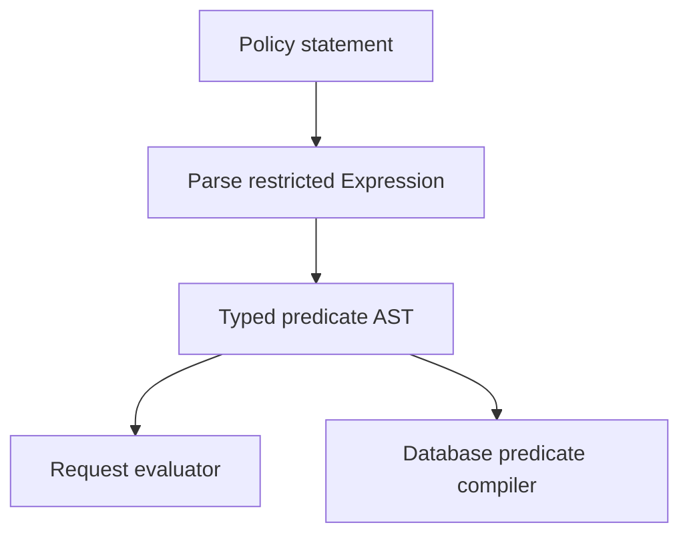

<Callout title='RFC — not implemented' type='warning'>
  This page defines engineering constraints for the proposed Policy contract. It must evolve with the canonical [Policy
  manual](/versions/v0/manuals/manifests/v0-policy).
</Callout>

Policy has two deliberately separate modes. `request` decides whether an API handler may run; `object` limits which database-backed objects an allowed request may return.

## Compilation model

Do not execute Policy Expressions as general templates. Parse the permitted function-call subset into a typed AST with explicit value sources (`Principal`, `Request`, and `Resource`). Reject pipelines, variables, iteration, arbitrary functions, I/O, and side effects during snapshot compilation.

## Selection and evaluation

For an incoming API request:

1. Normalize and resolve the registered API path.
2. Select snapshot-pinned Policies whose absolute path glob matches that path.
3. Intersect them with Policies attached to the Principal's effective Roles, including Group inheritance.
4. Evaluate request-mode Policies before the handler.
5. If allowed and an object query is required, compile applicable object-mode Policies before query execution.

| Phase         | Combination                                                    | Fail-closed result                  |
| ------------- | -------------------------------------------------------------- | ----------------------------------- |
| Request deny  | Any matching `deny` statement evaluating to true wins.         | Return `403`.                       |
| Request allow | At least one matching `allow` statement must evaluate to true. | No grant returns `403`.             |
| Object scopes | Compile each applicable statement and combine with `OR`.       | No scope becomes a false predicate. |

## Type and capability checking

Snapshot compilation must prove that every API matched by a Policy glob exposes compatible types for each referenced value. In object mode it must also prove that every `.Resource.*` field and computed value has a database translation.

Check function arity, operand types, null semantics, collection element types, and mode availability. `.Resource.*` is forbidden in request mode. `effect` is required in request mode and forbidden in object mode.

## Database adapter boundary

The Policy compiler should emit an adapter-neutral predicate tree rather than SQL text. A database adapter translates typed nodes such as equality, ordering, membership, containment, prefix/suffix, and null checks into parameterized operations.

| Responsibility                              | Policy compiler | Database adapter |
| ------------------------------------------- | :-------------: | :--------------: |
| Validate Policy function and operand types  |       ✅        |        ❌        |
| Resolve logical Resource fields             |       ✅        |        ❌        |
| Choose physical column/expression mapping   |       ❌        |        ✅        |
| Create placeholders and bind values         |       ❌        |        ✅        |
| Render user-controlled values into SQL text |       ❌        |        ❌        |

Every Principal and Request value becomes a bound parameter. Prefix and suffix operands are literals, not wildcard patterns. Compilation errors invalidate the affected snapshot; runtime must never remove the filter and retry.

## Query integration

Apply the Policy predicate to the base object query before counting, ordering, pagination, projection, and serialization. This ordering prevents leaking total counts or page boundaries for unauthorized objects.

Computed application-layer fields are policy-queryable only when their data source defines an equivalent database expression. Otherwise snapshot validation rejects a Policy that references them. Fetch-then-filter is forbidden.

## Caching

Cache parsed and type-checked ASTs by Policy revision. Cache database predicate plans only when the key includes the snapshot, matched API contract, adapter capability/version, and Resource mapping. Principal and Request values remain parameters and must not be embedded in a shared plan.

## Security tests

- Deny precedence with simultaneous matching allow and deny Policies.
- No request grant, no object scope, and false statements.
- Glob boundary cases for `*`, `**`, normalization, and case sensitivity.
- Role assignment both direct and inherited through Groups.
- SQL metacharacters in all parameter positions.
- Null, empty collection, type mismatch, and unsupported adapter operation.
- Count and pagination behavior proving filters run before aggregation.
- Compilation failure proving there is no unfiltered fallback.

## Open implementation decisions

- API contract for exposing `.Request.*` and policy-queryable `.Resource.*` mappings.
- Role attachment management and snapshot invalidation events.
- Predicate AST representation and database adapter interface.
- Policy diagnostics, audit records, and decision tracing.
- Limits for glob breadth, statement depth, child count, and parameter count.
