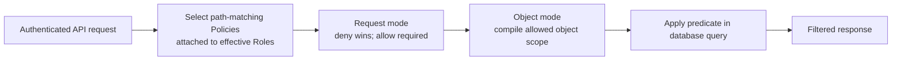
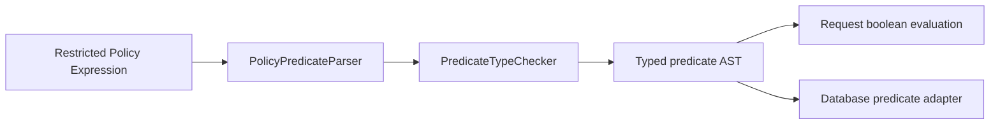
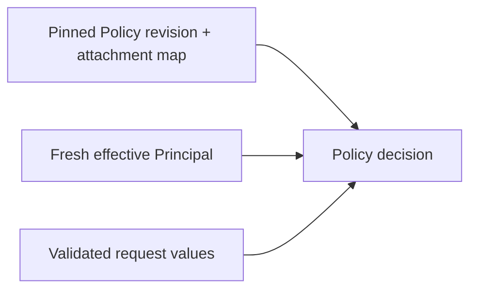

import { File, Folder, Files } from 'fumadocs-ui/components/files';

<Callout title='RFC — do not implement as delivered foundation behavior' type='warning'>
  This page translates the proposed [Policy contract](/versions/v0/manuals/manifests/v0-policy) into an implementation
  design. The contract may still change before Policy enters delivery.
</Callout>

## Runtime model

Policy does not authenticate users, control Page visibility, or filter records in application memory. Authentication/effective identity belongs to `access`; Policy makes API authorization/object-scope decisions using that authoritative principal view.

## Target module

<Files>
  <Folder name='policy' defaultOpen>
    <File name='package-info.java' />
    <File name='ApiPolicyAuthorizer.java' />
    <File name='ApiPolicyContract.java' />
    <File name='ObjectPolicyFilterCompiler.java' />
    <Folder name='internal'>
      <Folder name='application'>
        <File name='PolicySnapshotContributor.java' />
        <File name='PolicySelectionService.java' />
        <File name='ApiPolicyContractRegistry.java' />
      </Folder>
      <Folder name='domain'>
        <Folder name='expression' />
        <Folder name='target' />
        <Folder name='evaluation' />
      </Folder>
      <Folder name='persistence/attachment' />
      <Folder name='configuration' />
    </Folder>
  </Folder>
</Files>

The module may depend only on the public contracts it needs from `access`, `expression`, and `resource`. Database query implementations remain owned by the capability that owns the queried records.

## Public boundaries

`access` exposes a snapshot-independent principal view containing authenticated username, effective Roles, and Groups. Policy never receives Access persistence entities.

`ApiPolicyAuthorizer` evaluates request-mode Policies before the handler. `ObjectPolicyFilterCompiler` returns a typed adapter-neutral predicate and bound parameters for object-mode queries. Neither public port returns raw SQL.

Every Policy-aware API registers an `ApiPolicyContract` that declares its normalized registered path, validated `Request.*` values, and—when object filtering applies—logical `Resource.*` fields plus database-query mappings. Snapshot compilation rejects duplicate paths and incompatible mappings.

## Predicate pipeline

Do not depend on FreeMarker internal AST classes and never render an Expression into SQL text. Object-mode operands become typed nodes and bound parameters.

The predicate subset and value availability are canonical in [Policy — Available predicates](/versions/v0/manuals/manifests/v0-policy#available-predicates).

## Request and object phases

Request-mode decision:

1. keep Policies whose path glob matches and whose attachment is effective for the Principal;
2. any matching `deny` whose statement is true returns `403`;
3. otherwise at least one matching `allow` must be true;
4. without a grant, fail closed.

Object-mode decision:

1. compile every applicable object Policy;
2. combine granted scopes with `OR`;
3. no applicable Policy becomes a false predicate;
4. apply the predicate before count, ordering, pagination, projection, and serialization;
5. any unsupported mapping/compilation condition fails closed rather than retrying unfiltered.

## Role attachment and snapshot consistency

The final Role/Group management and Policy-attachment APIs remain open. Whatever transport is chosen, snapshot compilation pins the Policy revisions and Role-to-Policy attachment state used by that snapshot. User membership/authoritative principal state may change at request time and must not be frozen merely because the UI runtime binding is pinned.

## Database adapter rule

The capability owning an object query provides an adapter that can translate the typed predicate to its database query model and advertises supported predicate capabilities. Snapshot compilation verifies every `Resource.*` field has a compatible database translation for every API matched by the Policy glob.

Fetching records first and filtering them in Java is not a valid fallback.

## Verification

Policy RFC acceptance evidence must cover glob boundaries, predicate syntax/type checking, deny precedence, allow requirement, effective Role/Group selection, bound parameters, null/empty collections, filter-before-pagination behavior, database capability mismatches, and deliberate adapter/compiler failures that prove no unfiltered query executes.

Keep this RFC suite separate from the defined foundation acceptance suite until [Product status](/versions/v0/manuals/status) moves Policy into delivery.
