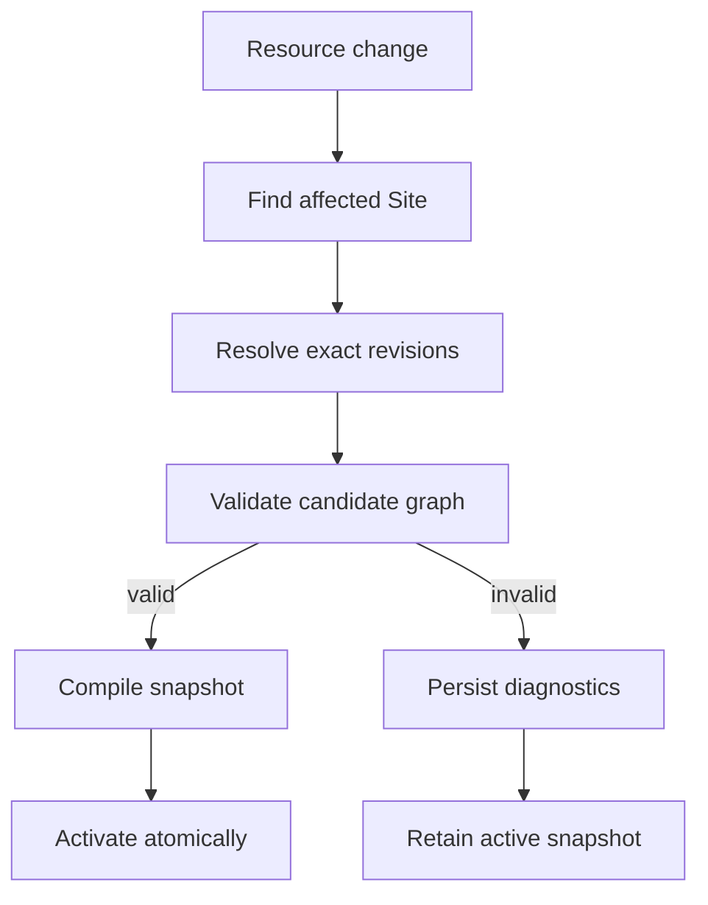

The resource pipeline is the consistency boundary between editable manifests and runtime state.

## Pipeline contract

| Stage                   | Input                                                            | Output                                         | Failure behavior                                                             |
| ----------------------- | ---------------------------------------------------------------- | ---------------------------------------------- | ---------------------------------------------------------------------------- |
| Affected-Site discovery | Changed resource identity/revision or dependency recovery event. | Sites that may resolve the changed resource.   | Queue retry; never activate an unexamined candidate.                         |
| Resolution              | Site root, resource revisions, and tags.                         | Directed graph of exact revision selections.   | Report malformed, missing, disallowed, duplicate, or unsatisfied references. |
| Validation              | Resolved graph and versioned contracts.                          | Validated candidate plus normalized values.    | Persist diagnostics and retain the active snapshot.                          |
| Compilation             | Validated candidate.                                             | Immutable runtime model with revision pins.    | Treat compilation errors as candidate failures.                              |
| Activation              | Compiled snapshot.                                               | Atomically replaced active snapshot reference. | Preserve the previous reference on failure.                                  |

## Deterministic resolution

Resource identity is `(kind, metadata.name)`; `apiVersion` selects the contract for a revision but is not part of identity. A reference without a tag constraint selects the current revision. A constrained reference selects the highest matching immutable semantic-version tag.

Resolution must be deterministic. Never silently select a lower tag after the highest matching revision fails validation: the selected candidate fails as a whole.

A traversal implementation should track both visited identities and the current recursion path. The former avoids duplicate work; the latter produces a useful cycle diagnostic. The reference-ability matrix is part of validation, not a hint to the resolver.

## Validation layers

Run validation from local syntax toward cross-resource behavior so diagnostics remain actionable:

1. Parse YAML and retain source locations.
2. Select the contract by `apiVersion` and `kind`.
3. Validate fields, required values, types, and kind-local constraints.
4. Parse and type-check Expressions using the field's context.
5. Resolve references and validate allowed dependency edges.
6. Validate graph-wide uniqueness, cardinality, routing, and security rules.
7. Validate compiler capabilities required by the candidate, such as Policy database translations.

Collect independent diagnostics when safe, but do not continue into stages whose prerequisites are invalid. A missing reference, for example, should not generate cascades of false field errors from the absent target.

## Snapshot contents

A snapshot needs enough normalized data for runtime operations to avoid re-reading mutable manifests:

- exact resource revision pins;
- normalized Application routes and Page component trees;
- resolved reusable Component dependencies;
- locale-catalog selection metadata;
- compiled or validated Expression representations;
- Policy revisions, matched API contracts, and Role attachments when the RFC is implemented;
- Workflow revisions and imported Components when the RFC is implemented.

This list defines logical content, not one large JSON document. Implementations may deduplicate immutable subgraphs or store indexed artifacts as long as a snapshot remains immutable and independently addressable.

## Concurrency and activation

Serialize candidate activation per logical Site. Multiple resource changes may be coalesced before evaluation, but an older candidate must never overwrite a newer active snapshot. Use a compare-and-swap version, transaction predicate, or equivalent monotonic check at activation.

Runtime operations acquire the active snapshot once and retain that reference until completion. Do not look up the active snapshot again midway through a request.

## Recovery and observability

Dependency changes enqueue affected Sites through the same pipeline. Recovery has no separate validation path and no fixed completion time.

At minimum, expose stage duration, queue age, candidate outcome, activated snapshot ID, diagnostic count, and failure category. Logs should correlate a resource change, candidate evaluation, and activation without recording sensitive manifest values.

## Open implementation decisions

- Physical revision, tag, diagnostic, and snapshot schemas.
- Snapshot artifact partitioning and cache eviction.
- Queue technology, coalescing window, retry schedule, and dead-letter handling.
- Maximum graph size, traversal depth, compilation time, and diagnostic count.
- Cross-process activation coordination.
