import { Step, Steps } from 'fumadocs-ui/components/steps';

This page is the implementation guide for the Resource control plane and the runtime read model consumed by Next.js. The proposed network-efficient serving model is developed separately in [Incremental Runtime Graph Delivery](/versions/v0/developer/incremental-runtime-graph); keep its open wire-protocol decisions behind the runtime boundaries described here.

<Callout title='Implementation target' type='info'>
  One browser application instance keeps one **runtime binding** across client-side navigation. The binding keeps the
  same snapshot and presentation context until the tab explicitly rebinds or performs a full reload.
</Callout>

## Architecture

```mermaid
flowchart LR
  subgraph Authoring[Authoring]
    save["Save Resource"] --> revision["Immutable revision"]
    revision --> graph["Resolve graph"]
    graph --> checksum["Propagate graph checksums"]
    checksum --> compile["Compile snapshot"]
    compile --> activate["Activate snapshot"]
  end

  subgraph Serving[Serving]
    bootstrap["Bootstrap tab"] --> binding["Runtime binding"]
    binding --> route["Resolve route"]
    route --> render["Page + Components"]
    render --> expression["Translation + Expressions"]
    expression --> model["Renderer-consumable runtime payload"]
  end

  activate -->|"new app instances"| bootstrap
```

Runtime uses immutable snapshots. It never rebuilds a runtime view from mutable current Resource pointers.

## Implementation ownership

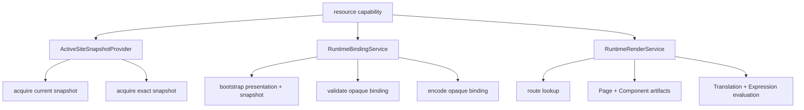

`RuntimeBindingService` owns the binding lifecycle. `RuntimeRenderService` receives an already validated binding and must not reacquire mutable current state.

## Bootstrap a tab

A full document request starts a fresh browser application instance.

<Steps>
  <Step>

### Read presentation defaults

Resolve the current presentation defaults. Locale is required by the current contract. Copy the values into presentation context; do not pass a mutable user-profile object into rendering.

  </Step>
  <Step>

### Acquire the active snapshot once

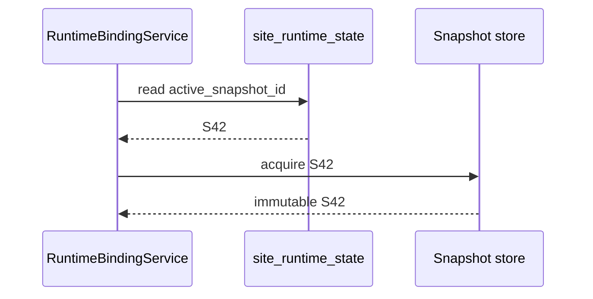

After acquisition, bootstrap does not read the active pointer again.

  </Step>
  <Step>

### Create the binding

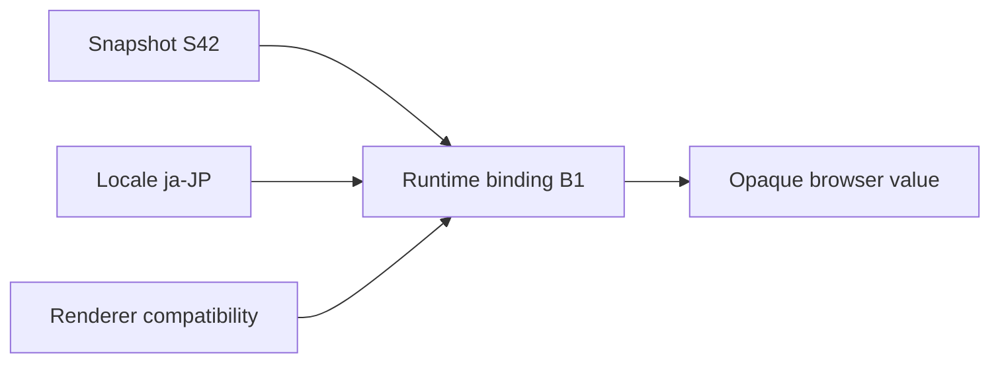

The browser representation is opaque. Frontend code must not construct a binding from individual snapshot, locale, checksum, or database fields.

  </Step>
  <Step>

### Render the initial Page

Use the new binding for the first SSR render. The returned HTML and binding therefore describe the same runtime view.

  </Step>
</Steps>

## Navigate without changing version

Client-side navigation validates the existing binding. It does not bootstrap again.

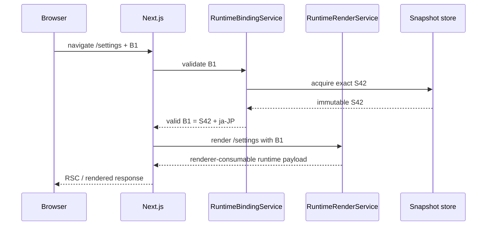

<Callout title='Never reacquire the active snapshot during navigation' type='warning'>
  After validation, every route, Page, Component, Translation, and Expression lookup must use the bound snapshot.
  Silently switching to the newly active snapshot can create a UI that never existed as one valid version.
</Callout>

## Build one render operation

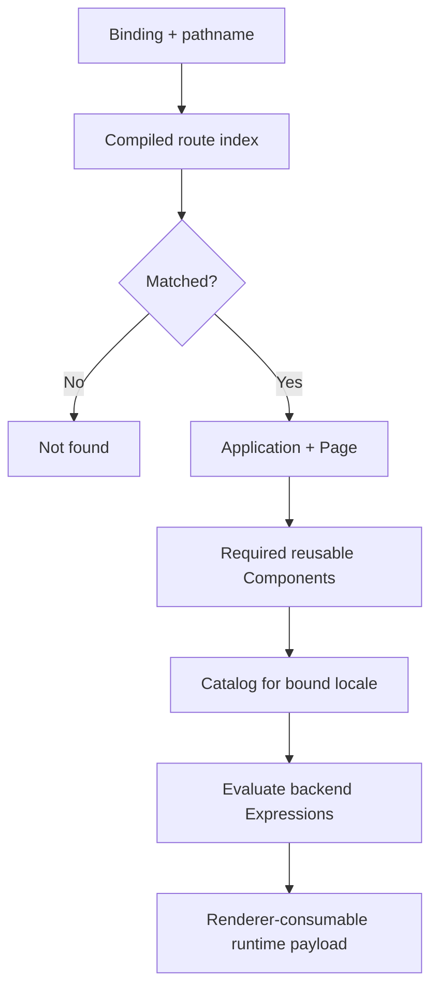

The operation must provide everything Next.js needs to render the requested Page without a serial Resource-by-Resource HTTP chain. The public serving payload is not finalized. In particular, it may use the progressive graph/delta design described in [Incremental Runtime Graph Delivery](/versions/v0/developer/incremental-runtime-graph) rather than retransmitting a complete Page model on every navigation.

## Keep locale consistent across tabs

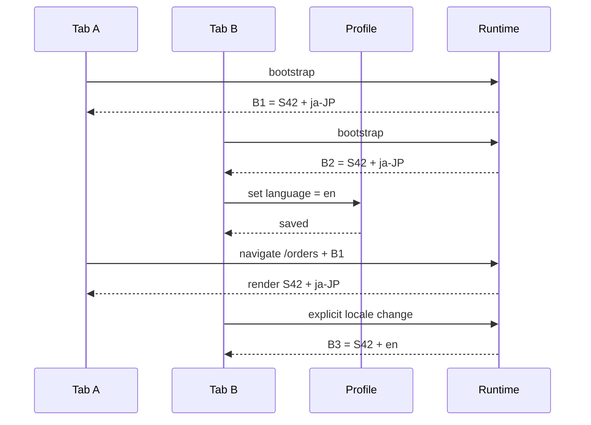

`Trans` and `TransN` use the locale in the runtime binding. The mutable profile language is a bootstrap default, or an input to an explicit presentation rebind in that tab; it is not reread on every navigation.

## Binding lifecycle

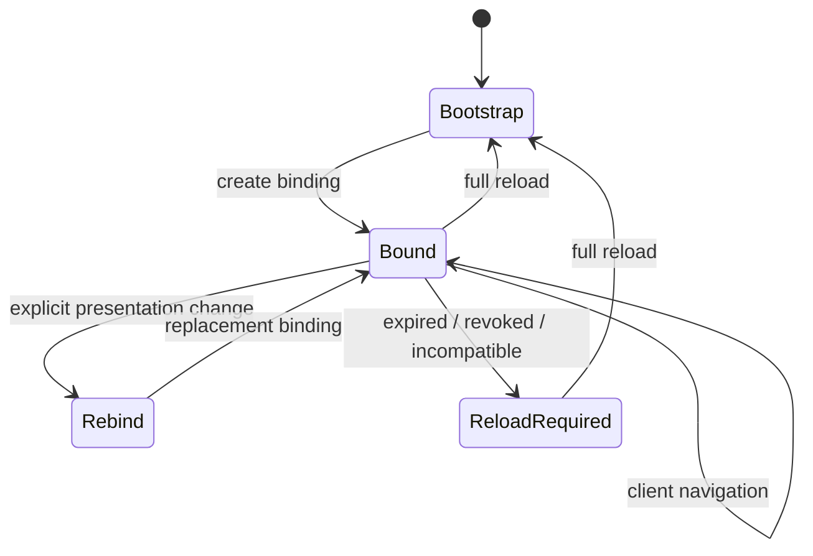

A full reload acquires the current active snapshot and current presentation defaults. Another tab changing the profile does not mutate this tab. An expired, revoked, or incompatible binding requests a reload instead of silently changing versions.

## Validate a binding

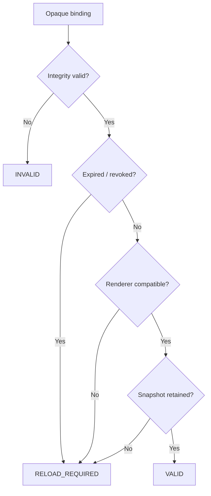

Token encoding, TTL, revocation, and renderer compatibility remain open decisions. Keep those mechanics behind `RuntimeBindingService`.

## Retain old snapshots safely

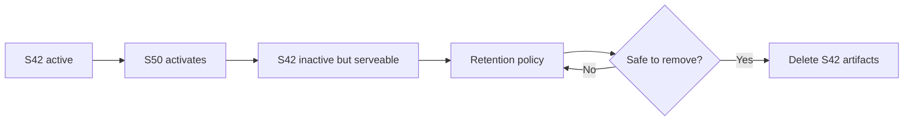

Do not add a `runtime_binding` table yet. A signed stateless binding may not need one. Cleanup must remain compatible with the lease/token strategy selected later.

## Keep authority fresh


A bound UI version does not justify reusing stale authorization decisions.

## Candidate and activation flow

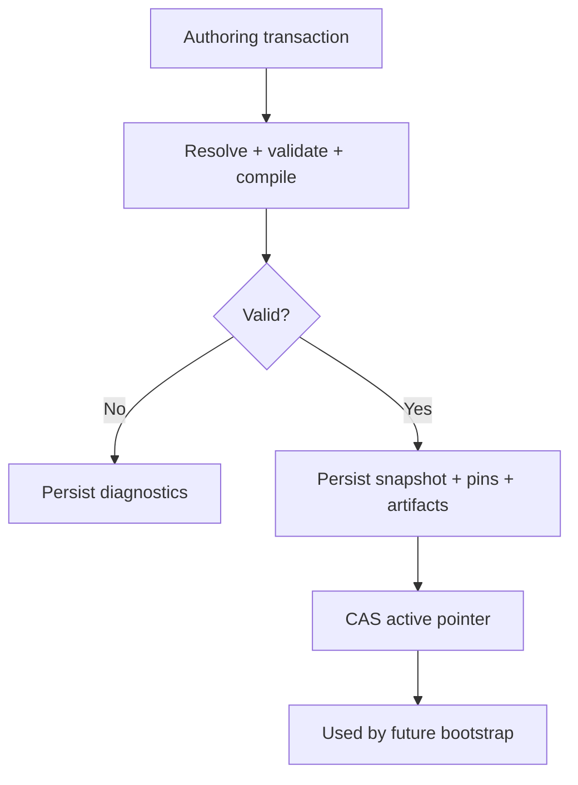

A crash before activation leaves the previous snapshot active. Activation changes new bindings only; existing valid bindings continue to use their immutable snapshot.

## Verification

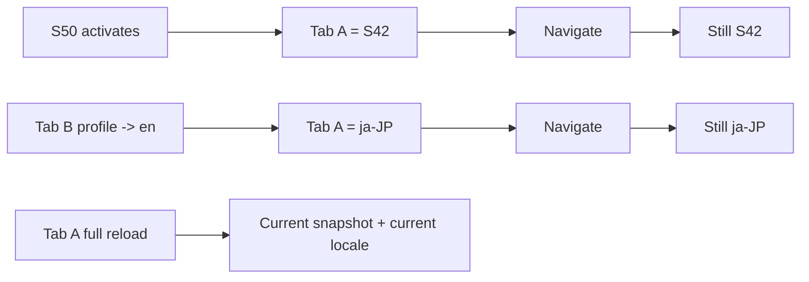

The acceptance suite must prove snapshot stability after activation, locale stability after another tab changes the profile, explicit rebind isolation, full-reload adoption of current defaults, reload-required behavior for invalid bindings, and zero fallback to mutable Resource pointers after binding validation.
