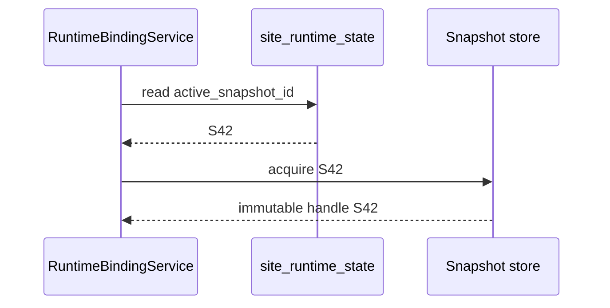
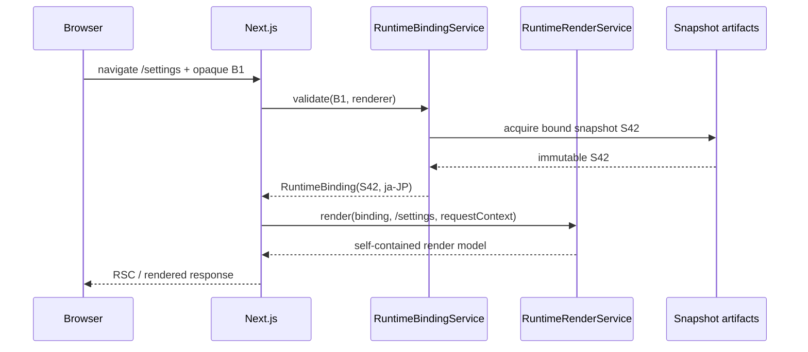
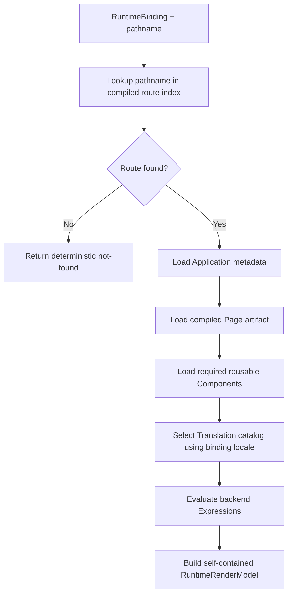
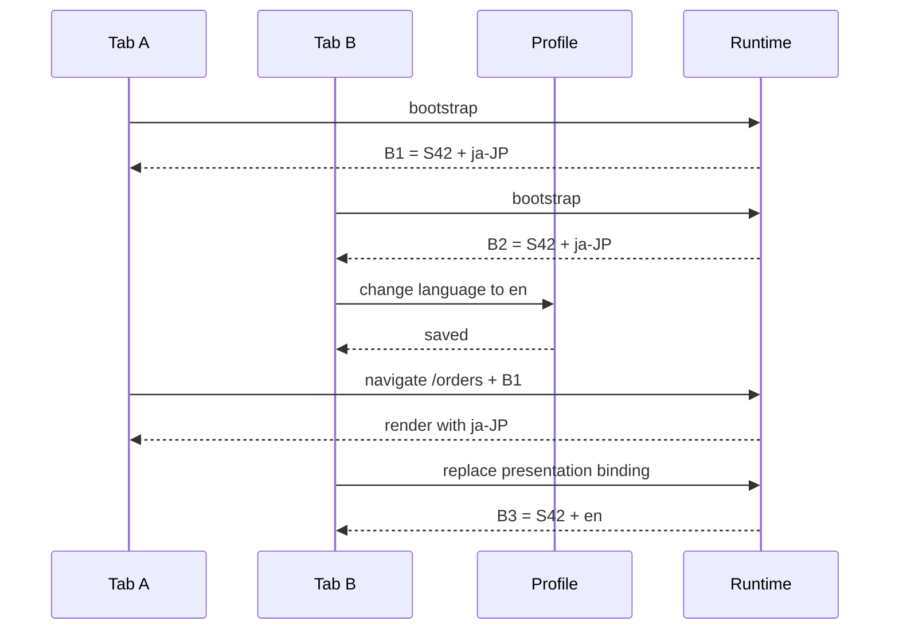
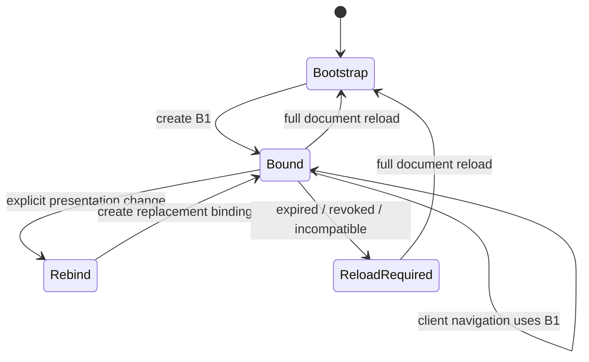
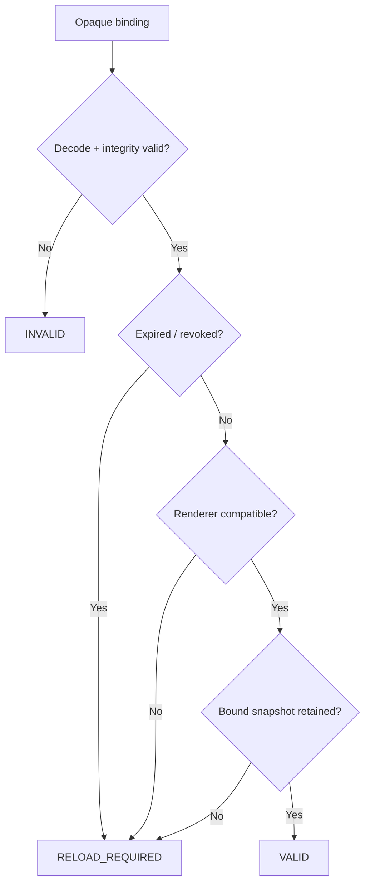
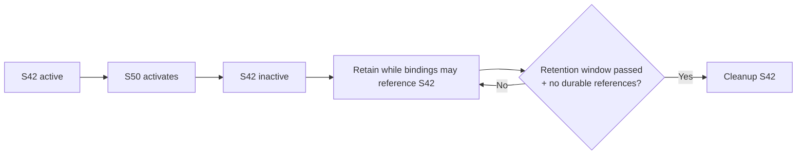
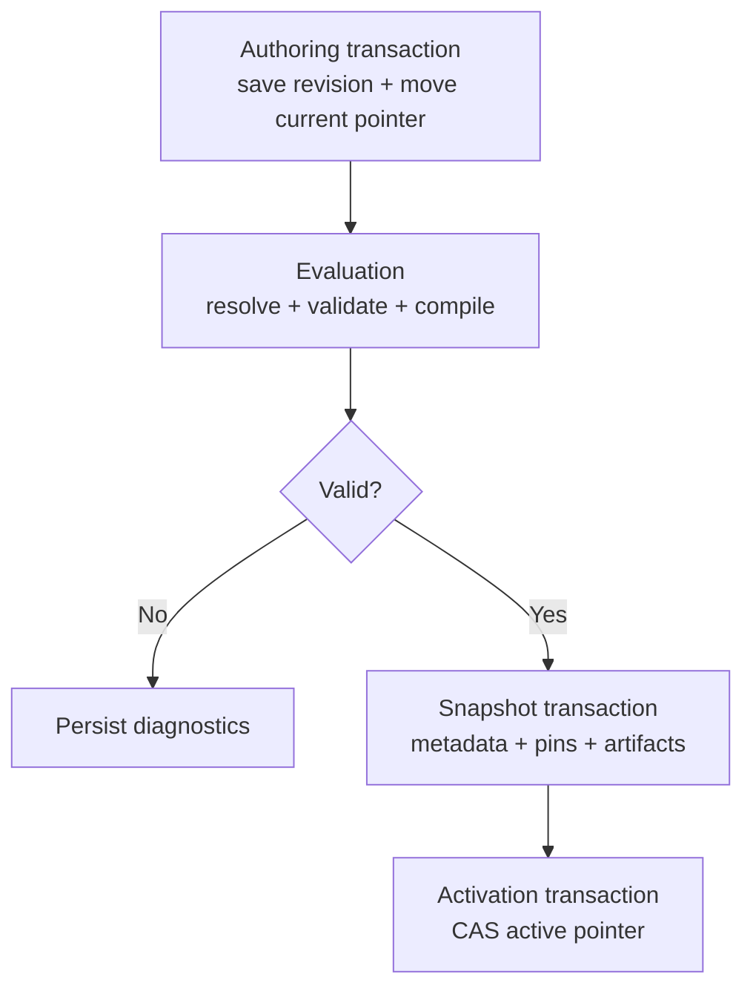
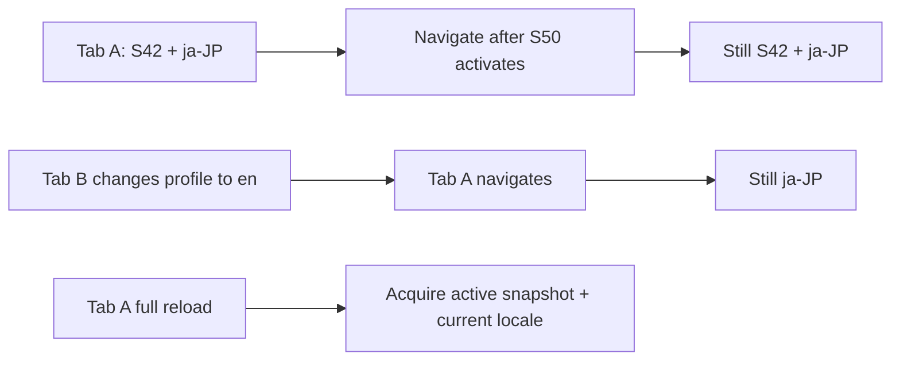

import { Step, Steps } from 'fumadocs-ui/components/steps';

This page is the canonical engineering design for the Resource control plane and the runtime read model consumed by Next.js.

<Callout type="info" title="Implementation target">
A browser application instance keeps one **runtime binding** across client-side navigation. The binding keeps the same snapshot and presentation context, while security and business state can still be evaluated using their own freshness rules.
</Callout>

## Architecture at a glance

```mermaid
flowchart LR
  subgraph Authoring[Authoring / control plane]
    save["Save Resource"] --> revision["Immutable revision"]
    revision --> graph["Resolve graph + graph checksums"]
    graph --> compile["Compile snapshot artifacts"]
    compile --> activate["Activate snapshot"]
  end

  subgraph Runtime[Runtime / serving plane]
    bootstrap["Bootstrap app instance"] --> binding["Runtime binding"]
    binding --> route["Resolve route"]
    route --> page["Load Page + Components"]
    page --> expression["Evaluate Translation + Expressions"]
    expression --> model["Self-contained render model"]
  end

  activate -->|"used by new bootstrap"| bootstrap
```

The two planes share immutable snapshots. Runtime never reconstructs a snapshot from mutable current Resource pointers.

## Target package structure

```text
com.taskmigo.console.resource/
├── package-info.java
├── ActiveSiteSnapshotProvider.java
├── RuntimeBindingService.java
├── RuntimeRenderService.java
├── ManifestContract.java
├── ManifestValidationContext.java
├── NormalizedResource.java
├── SnapshotCompilationContext.java
├── SnapshotContributor.java
├── SiteSnapshotActivated.java
└── internal/
    ├── application/
    │   ├── resource/ResourceCommandService.java
    │   ├── resource/ResourceQueryService.java
    │   ├── tag/ResourceTagService.java
    │   ├── pipeline/SiteCandidatePipeline.java
    │   └── runtime/
    │       ├── RuntimeBindingServiceImpl.java
    │       └── RuntimeRenderServiceImpl.java
    ├── domain/
    │   ├── model/{ResourceIdentity,ResourceRevision,ResourceTag}.java
    │   ├── reference/{ResourceReference,ResourceReferenceParser,RevisionSelector}.java
    │   ├── contract/{ManifestContractRegistry,V0SiteManifestContract}.java
    │   ├── graph/{ResolvedResourceGraph,ResourceGraphResolver}.java
    │   └── snapshot/{CompiledSiteSnapshot,SiteSnapshotCompiler}.java
    ├── persistence/
    │   ├── resource/
    │   ├── candidate/
    │   └── snapshot/
    ├── web/resource/
    └── configuration/ResourceConfiguration.java
```

## Core runtime types

Keep persistence IDs and mutable profile objects out of the browser contract.

```java
public interface ActiveSiteSnapshotProvider {
  AcquiredSiteSnapshot acquire();
  AcquiredSiteSnapshot acquire(UUID snapshotId);
}

public record PresentationContext(Locale locale) {}

public record RendererCompatibility(String rendererVersion, String artifactFormat) {}

public record RuntimeBinding(
    AcquiredSiteSnapshot snapshot,
    PresentationContext presentation,
    RendererCompatibility renderer) {}

public interface RuntimeBindingService {
  RuntimeBinding bootstrap(PresentationContext defaults, RendererCompatibility renderer);
  RuntimeBinding validate(OpaqueRuntimeBinding token, RendererCompatibility renderer);
  OpaqueRuntimeBinding encode(RuntimeBinding binding);
}

public interface RuntimeRenderService {
  RuntimeRenderModel render(RuntimeBinding binding, String pathname, RuntimeRequestContext request);
}
```

`RuntimeBinding` is a server-side value. Its browser representation is opaque. Do not let frontend code construct a binding from `snapshotId`, locale, graph checksum, or other individual fields.

## Implement bootstrap

A full document load starts a new browser application instance.

<Steps>
  <Step>

### Read presentation defaults

Resolve the user's current presentation defaults before creating the binding. Locale is required for the current design.

```text
User profile / request defaults
          ↓
PresentationContext(locale = ja-JP)
```

Do not pass the mutable profile object into the rendering pipeline.

  </Step>
  <Step>

### Acquire the active snapshot once

`ActiveSiteSnapshotProvider.acquire()` reads the active pointer and immediately turns it into an immutable snapshot handle.



After this step, bootstrap does not read `site_runtime_state` again.

  </Step>
  <Step>

### Create and encode the binding

Combine the acquired snapshot, presentation context, and renderer compatibility into one binding, then encode it into an opaque browser value.

```text
S42
+ locale ja-JP
+ renderer compatibility
        ↓
RuntimeBinding B1
        ↓
opaque token for browser
```

The token may eventually be signed/stateless, server-side, or hybrid. Keep `RuntimeBindingService` independent from that choice.

  </Step>
  <Step>

### Render the initial Page

Use the newly created binding for the first SSR render. The initial HTML and the opaque binding therefore describe the same runtime view.

  </Step>
</Steps>

## Implement client-side navigation

Client navigation must **validate the existing binding**, never bootstrap again.



<Callout type="warning" title="Never reacquire current runtime during navigation">
Do not call `ActiveSiteSnapshotProvider.acquire()` without the bound snapshot identity after binding validation. Doing so can mix an old layout with a newly activated Page graph.
</Callout>

## Implement route and render resolution

`RuntimeRenderService` performs the full serving operation using the validated binding.



The render model contains only what the requested Page needs. It may deduplicate reusable Components, but Next.js must not need additional Resource/revision requests to complete the render.

## Keep locale stable across tabs

Profile language is a bootstrap default, not a live locale pointer.



The important implementation rule is simple:

```text
Trans / TransN locale = RuntimeBinding.presentation.locale
```

not:

```text
Trans / TransN locale = UserProfile.currentLanguage on every request
```

An explicit language change replaces the binding for that tab and rerenders that tab consistently. It does not mutate bindings already running in other tabs.

## Full reload versus client navigation



| Event | Snapshot | Locale |
| --- | --- | --- |
| Client navigation | Keep binding value | Keep binding value |
| Another tab changes profile language | Keep binding value | Keep binding value |
| Explicit language change in this tab | Keep snapshot unless product rule changes | Replace locale consistently |
| Full reload | Acquire current active snapshot | Read current profile default |
| Binding expired/revoked/incompatible | Require reload | Rebootstrap |

## Binding validation

Validation should produce a small explicit state machine instead of scattered checks.



Do not silently replace an invalid binding with the current snapshot during a navigation request. That would recreate the mixed-version problem. Return an explicit reload-required result instead.

## Snapshot retention

Runtime binding makes inactive snapshots temporarily serveable.



The exact TTL/revocation design is open. Implement cleanup behind a policy boundary so choosing signed tokens versus persisted leases does not force a Resource model rewrite.

## Security boundary

Runtime binding freezes **presentation**, not authority.

| Data | Binding behavior |
| --- | --- |
| Snapshot / UI graph | Pinned |
| Locale | Pinned |
| Future timezone / SSR theme | Candidate for pinning |
| Permission revocation | Do not assume pinned |
| Account disabled state | Do not assume pinned |
| Subscription/business state | Owning capability decides freshness |

Do not cache an authorization grant merely because the Page itself comes from an older snapshot.

## Candidate flow and transaction boundaries



A crash before activation leaves the previous snapshot active. A crash after snapshot persistence but before activation may leave an unreferenced snapshot for later cleanup. A stale activation loses the compare-and-swap race.

Activation affects **new bindings**. Existing valid bindings continue to reference their immutable snapshot until reload or a future expiry/revocation rule requires replacement.

## Resolution and validation order

<Steps>
  <Step>Parse YAML and retain source locations.</Step>
  <Step>Validate `apiVersion`, `kind`, metadata, and kind-local fields.</Step>
  <Step>Validate Expression syntax, allowed functions/context, and result type.</Step>
  <Step>Parse references and select exact revisions.</Step>
  <Step>Validate reference-ability and cycles.</Step>
  <Step>Validate cross-resource rules such as Site cardinality and route uniqueness.</Step>
  <Step>Validate compiler capabilities and snapshot contributors.</Step>
  <Step>Calculate deterministic graph checksums bottom-up and compile artifacts.</Step>
</Steps>

The same revisions, tags, contracts, and adapter capabilities must produce the same graph, diagnostics, graph checksums, and compiled checksum regardless of database row or traversal order.

## Resource database schema

| Table | Runtime role |
| --- | --- |
| `resource` | Mutable logical identity and current authoring pointer. |
| `resource_revision` | Immutable authored source. |
| `resource_tag` | Immutable revision selectors. |
| `site_candidate` | One evaluation attempt. |
| `site_candidate_diagnostic` | Durable candidate validation output. |
| `site_snapshot` | Immutable compiled runtime identity. |
| `site_snapshot_resource` | Exact revision + graph identity pins. |
| `site_snapshot_artifact` | Route/Page/Component/Translation runtime artifacts. |
| `site_runtime_state` | Current snapshot pointer consulted by bootstrap only. |

No `runtime_binding` table is required by the current contract. Do not add one until the binding representation and retention/revocation strategy are decided. A signed stateless binding may need no per-tab durable row.

See [Database](/versions/v0/developer/database) for physical columns, constraints, transaction details, and cleanup reachability.

## Verification scenarios



The acceptance suite must prove:

- child revision changes propagate graph checksums without manufacturing ancestor revisions;
- a new snapshot activates without changing existing runtime bindings;
- client navigation uses the same bound snapshot after newer activation;
- a bound locale survives profile-language changes from another tab;
- an explicit language change replaces only the current tab's presentation binding;
- full reload can adopt the latest active snapshot and current profile defaults;
- invalid/expired/incompatible bindings require reload instead of silently switching versions;
- runtime rendering never falls back to `resource.current_revision_id` after binding validation;
- route resolution, Page/Component loading, Translation lookup, and Expression evaluation all use the same validated binding.
