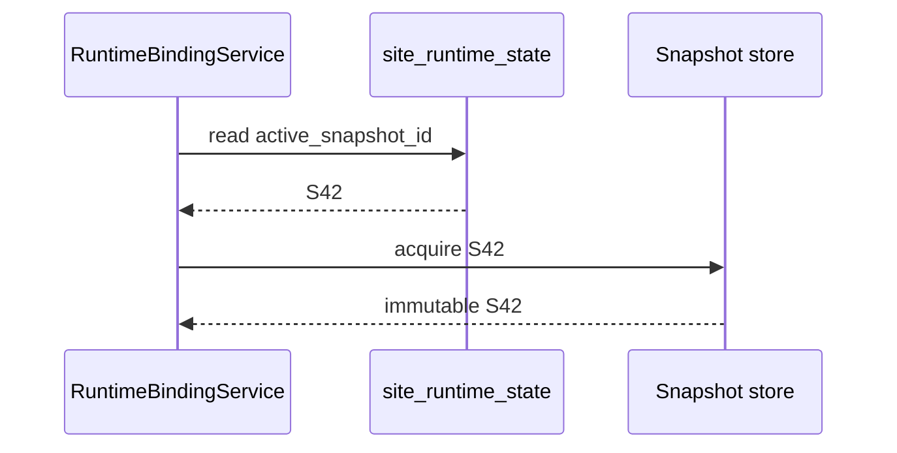
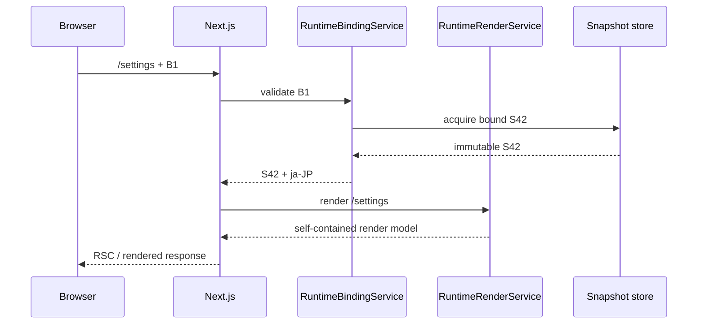
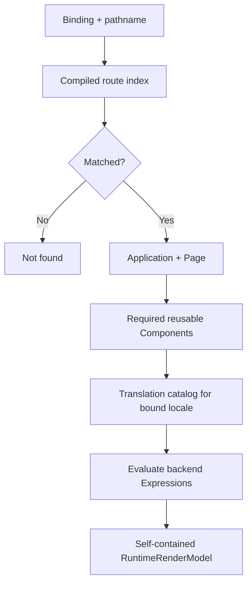
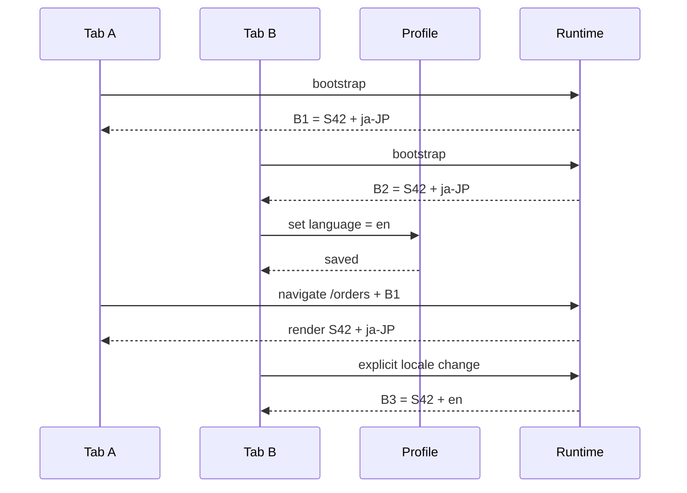
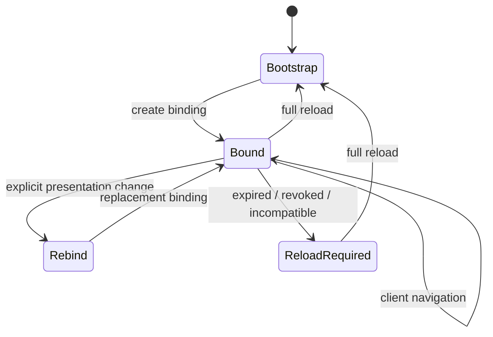
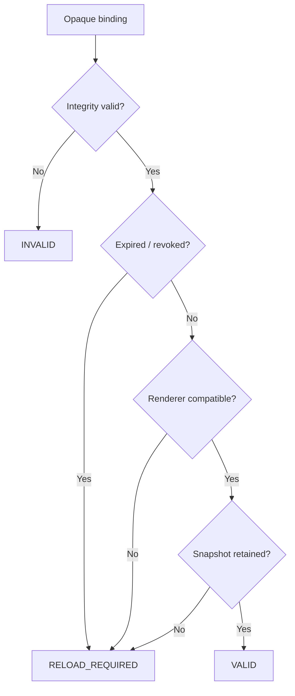
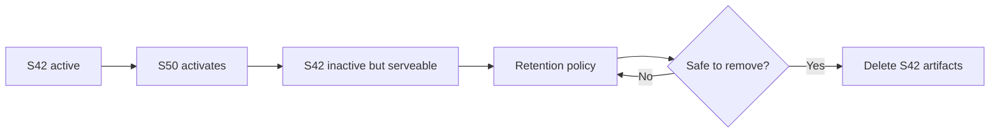
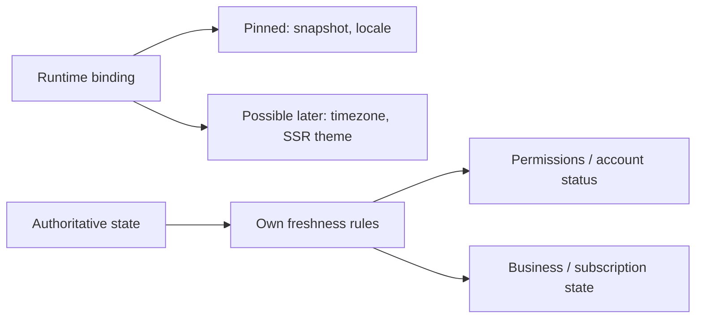
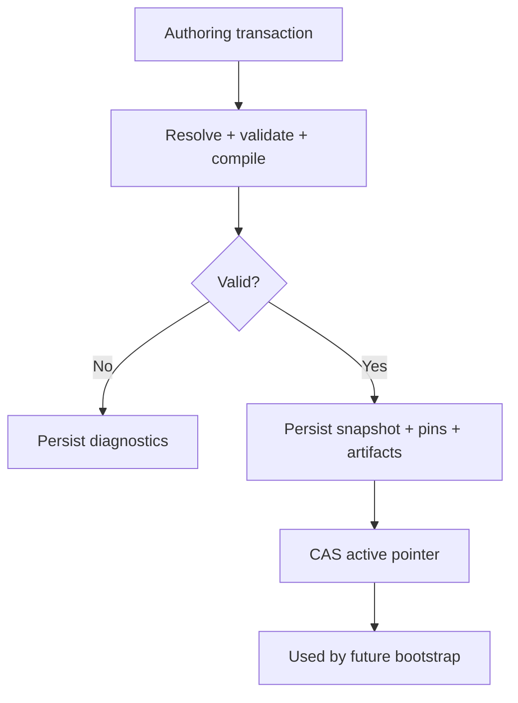
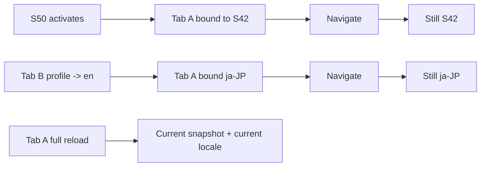

import { Step, Steps } from 'fumadocs-ui/components/steps';

This page is the implementation guide for the Resource control plane and the runtime read model consumed by Next.js.

<Callout title='Implementation target' type='info'>
  One browser application instance keeps one **runtime binding** across client-side navigation. The binding keeps the same
  snapshot and presentation context until the tab explicitly rebinds or performs a full reload.
</Callout>

## Architecture

```mermaid
flowchart LR
  subgraph Authoring[Authoring]
    save["Save Resource"] --> revision["Immutable revision"]
    revision --> graph["Resolve graph"]
    graph --> checksum["Propagate graph checksums"]
    checksum --> compile["Compile snapshot"]
    compile --> activate["Activate snapshot"]
  end

  subgraph Serving[Serving]
    bootstrap["Bootstrap tab"] --> binding["Runtime binding"]
    binding --> route["Resolve route"]
    route --> render["Page + Components"]
    render --> expression["Translation + Expressions"]
    expression --> model["Render model"]
  end

  activate -->|"new tabs only"| bootstrap
```

Runtime uses immutable snapshots. It never rebuilds a runtime view from mutable current Resource pointers.

## Runtime package

```text
com.taskmigo.console.resource/
├── ActiveSiteSnapshotProvider.java
├── RuntimeBindingService.java
├── RuntimeRenderService.java
└── internal/
    ├── application/runtime/
    │   ├── RuntimeBindingServiceImpl.java
    │   └── RuntimeRenderServiceImpl.java
    └── persistence/snapshot/
```

Keep Resource authoring, graph resolution, compilation, and snapshot persistence in the existing Resource capability. Runtime binding is another read boundary over those immutable snapshots, not a second Resource model.

## Runtime contracts

```java
public interface ActiveSiteSnapshotProvider {
  AcquiredSiteSnapshot acquire();
  AcquiredSiteSnapshot acquire(UUID snapshotId);
}

public record PresentationContext(Locale locale) {}

public record RendererCompatibility(String rendererVersion, String artifactFormat) {}

public record RuntimeBinding(
    AcquiredSiteSnapshot snapshot,
    PresentationContext presentation,
    RendererCompatibility renderer) {}

public interface RuntimeBindingService {
  RuntimeBinding bootstrap(PresentationContext defaults, RendererCompatibility renderer);
  RuntimeBinding validate(OpaqueRuntimeBinding token, RendererCompatibility renderer);
  OpaqueRuntimeBinding encode(RuntimeBinding binding);
}

public interface RuntimeRenderService {
  RuntimeRenderModel render(RuntimeBinding binding, String pathname, RuntimeRequestContext request);
}
```

`RuntimeBinding` is server-side. The browser receives only an opaque representation and must not construct bindings from snapshot IDs, locale values, checksums, or database keys.

## Bootstrap a tab

A full document request creates a fresh application instance.

<Steps>
  <Step>

### Read presentation defaults

Resolve the current presentation defaults. Locale is required by the current contract. Do not pass a mutable user-profile object into the render pipeline.

  </Step>
  <Step>

### Acquire the active snapshot

Read `site_runtime_state.active_snapshot_id` once and acquire that immutable snapshot.



After acquisition, bootstrap does not read the active pointer again.

  </Step>
  <Step>

### Create the runtime binding

Bind the snapshot, presentation context, and renderer compatibility, then encode the result as an opaque browser value.

```text
S42 + ja-JP + renderer compatibility -> B1
```

  </Step>
  <Step>

### Render the initial Page

Use `B1` for the first SSR render so the HTML and the browser binding describe exactly the same runtime view.

  </Step>
</Steps>

## Navigate without changing version

Client-side navigation validates the existing binding. It does not bootstrap again.



<Callout title='Never reacquire the active snapshot during navigation' type='warning'>
  After a binding is validated, every route, Page, Component, Translation, and Expression lookup must use its bound
  snapshot. Silently switching to the newly active snapshot can create a UI that never existed as one valid version.
</Callout>

## Build one render model



The model contains everything Next.js needs for that Page. Reusable Components may be deduplicated inside the payload, but rendering must not require a serial Resource-by-Resource HTTP chain.

## Keep locale consistent across tabs



`Trans` and `TransN` read `RuntimeBinding.presentation.locale`. They do not reread the mutable profile language on each navigation. The profile value is a bootstrap default, or an input to an explicit presentation rebind in that tab.

## Binding lifecycle



A full reload acquires the current active snapshot and current presentation defaults. Another tab changing the profile does not mutate this tab. A future expired, revoked, or incompatible binding must request a reload instead of silently switching runtime versions.

## Validate a binding



Token encoding, TTL, revocation, and renderer-compatibility protocol remain open decisions. Keep those mechanics behind `RuntimeBindingService`.

## Retain old snapshots safely



Do not add a `runtime_binding` table yet. A signed stateless token may not need one. Cleanup must remain compatible with whichever lease/token strategy is selected later.

## Do not pin authority with presentation



A bound UI version does not justify reusing stale authorization decisions.

## Candidate and activation flow



A crash before activation leaves the previous snapshot active. Activation changes new bindings only; existing valid bindings continue to use their immutable snapshot.

## Verification



The acceptance suite must prove snapshot stability after activation, locale stability after another tab changes the profile, explicit rebind isolation, full-reload adoption of current defaults, reload-required behavior for invalid bindings, and zero fallback to mutable Resource pointers after binding validation.
