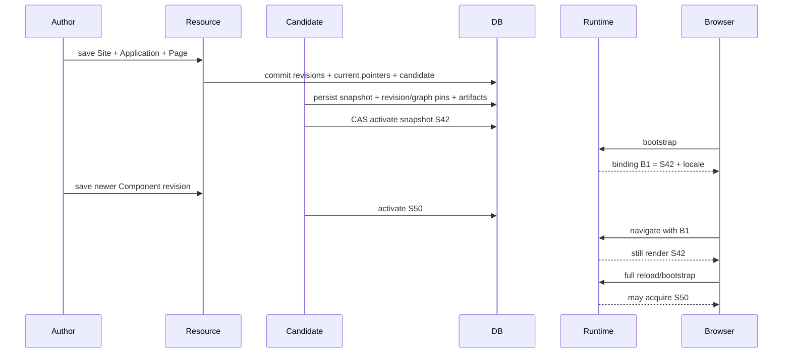
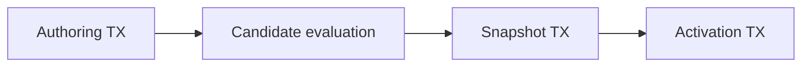

This page defines **required evidence**, not a claim that a particular application repository or test class already exists. Add repository commands and concrete test locations when the implementation introduces them; do not document commands that cannot run.

## Verification layers

| Layer                    | Proves                                                                                                  | Use real technology when…                                 |
| ------------------------ | ------------------------------------------------------------------------------------------------------- | --------------------------------------------------------- |
| Unit                     | Parsers, value types, graph algorithms, contract validation, Expression profiles, local state machines. | No external semantics are under test.                     |
| Architecture             | Capability boundaries and forbidden internal/repository shortcuts.                                      | Module/package rules are part of correctness.             |
| PostgreSQL integration   | Flyway schema, constraints, JSONB, locks, CAS, queue acquisition, transaction rollback, cleanup races.  | PostgreSQL semantics protect an invariant.                |
| Web/security integration | OpenAPI mapping, security chain, authorization boundary, ETag/preconditions, Problem Details.           | HTTP/security behavior is part of the contract.           |
| Failure/concurrency      | Crash boundaries, stale activation, duplicate work, race recovery.                                      | Correctness depends on ordering or durable commit points. |
| End to end               | One complete product journey through authoring → candidate → snapshot → runtime.                        | Cross-boundary behavior must be accepted as one system.   |

Do not substitute an in-memory database or mocked repository for a PostgreSQL constraint/race that the production design depends on.

## Defined foundation acceptance journey

## Resource and graph identity

Use a `Site → Application → Page → Component` fixture and change only the Component.

The suite must prove:

- only the changed Component receives a new authored revision;
- unchanged Page/Application/Site revision IDs and source checksums remain stable;
- the changed graph checksum propagates through each affected ancestor;
- an unrelated graph branch keeps both its revision ID and graph checksum;
- the root Site graph can produce a new snapshot while `siteRevisionId` stays unchanged;
- snapshot pins persist the exact `revisionId + graphChecksum` pair for every selected Resource;
- graph checksums are deterministic regardless of database row/traversal order.

## Candidate and activation safety

Inject or simulate failure at each durable boundary:

Required outcomes:

- failure before authoring commit exposes no partial revision/candidate;
- failure after authoring commit leaves recoverable queued work;
- invalid candidate persists safe diagnostics and keeps the active snapshot;
- failure after snapshot persistence but before activation may leave an inactive snapshot but never partial active state;
- stale CAS activation loses to the newer runtime version.

## Runtime binding consistency

### Snapshot isolation

1. Bootstrap Tab A on `S42`.
2. Activate `S50`.
3. Perform one or more client-side navigations from Tab A.
4. Assert every route/Page/Component/Translation lookup still uses `S42`.
5. Full reload and assert a new binding may adopt `S50`.

No lookup after binding validation may fall back to the mutable active pointer or `resource.current_revision_id`.

### Locale isolation

1. Bootstrap Tabs A and B with `ja-JP`.
2. Change the mutable profile default to `en` in Tab B.
3. Navigate in Tab A and assert existing layout plus new Page remain `ja-JP`.
4. Explicitly rebind Tab B to `en` and assert Tab A is unchanged.

### Binding failure states

When expiry/revocation/renderer compatibility are implemented, cover `VALID`, `INVALID`, and `RELOAD_REQUIRED` paths without silently changing snapshot versions.

## Expression verification

| Area                 | Required evidence                                                                                                           |
| -------------------- | --------------------------------------------------------------------------------------------------------------------------- |
| Syntax               | Documented interpolation/operators/built-ins/directives compile against the pinned FreeMarker version.                      |
| Typed result         | Sole interpolation preserves the declared result type; rendered templates return text/nodes as allowed by the field.        |
| Context isolation    | A field sees only its documented roots/functions; Workflow/Policy profiles stay unavailable outside those RFC capabilities. |
| Sandbox              | Java API/reflection/static/class/file/include/import access fails safely.                                                   |
| Limits               | Source/output/iteration/nesting limits fail deterministically without context leakage.                                      |
| Runtime presentation | `Trans`/`TransN` use the runtime-binding locale.                                                                            |

A FreeMarker upgrade requires the compatibility suite because parsing, numeric behavior, missing-value behavior, built-ins, or diagnostics may change.

## API verification

Against the canonical OpenAPI document, prove authentication/authorization, media types, ETag/precondition semantics, status/problem codes, no-op writes, immutable tags, cursor behavior, candidate diagnostics, and snapshot graph-checksum serialization.

When the SSR serving API is designed, add a contract test proving one happy-path backend request returns a self-contained render model for one validated runtime binding.

## Persistence verification

Use PostgreSQL integration coverage for composite revision ownership, one-Site uniqueness, immutable tags, candidate queue acquisition, snapshot all-or-nothing persistence, graph-checksum pins, activation CAS, exact-snapshot reacquisition, and retention/cleanup races.

## RFC verification

<Callout title='Keep RFC evidence separate from delivered acceptance' type='warning'>
  Policy and Workflow test designs may be prepared now, but passing those tests does not make the capabilities
  available.
</Callout>

Policy RFC evidence focuses on fail-closed authorization and database predicate compilation. Workflow RFC evidence focuses on pinned execution definitions, durable state transitions, retries/idempotency, interaction races, and crash recovery.

## Completion evidence

A change is ready only when the applicable product behavior, architecture boundary, database/API schema, runtime invariant, real-technology integration tests, and repository verification gates agree. If one layer cannot be executed in the current environment, use another valid environment that runs the actual gate; do not reinterpret skipped evidence as a pass.
