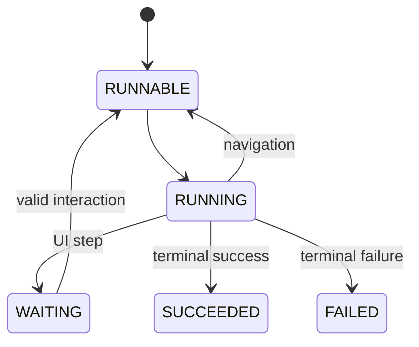

<Callout title='RFC — not implemented' type='warning'>
  This page defines engineering constraints for the proposed Workflow contract. It must evolve with the canonical
  [Workflow manual](/versions/v0/manuals/manifests/v0-workflow).
</Callout>

A Workflow execution is a durable state machine pinned to the Site snapshot, Workflow revision, and imported dependencies selected at start time.

## Execution model

The exact persisted status vocabulary is an implementation decision, but it must distinguish runnable work, claimed work, external interaction waits, and terminal outcomes. Recovery must be able to decide safely whether work may resume.

## Persistence boundary

Persist the execution transition that authorizes dependent work before publishing or scheduling that work. A worker crash after persistence may cause redelivery, so action execution and transition application need an idempotency strategy.

One transaction should protect the current execution version, step attempt result, resolved output, next state, and navigation decision. Use optimistic concurrency, a lease with a version check, or an equivalent mechanism so two workers cannot advance the same execution state.

## Step processing

| Step kind      | Before execution                                     | Completion boundary                                                | Failure path                                                                                |
| -------------- | ---------------------------------------------------- | ------------------------------------------------------------------ | ------------------------------------------------------------------------------------------- |
| Action         | Evaluate and validate input for the current attempt. | Persist output/status, then select navigation.                     | Retry according to the pinned definition; after exhaustion apply `continueOnError` or fail. |
| Interactive UI | Resolve imported Component and props.                | Persist `WAITING`; a later authorized interaction supplies output. | Reject invalid, stale, duplicate, or unauthorized interaction without advancing state.      |
| Fail           | Resolve the failure message.                         | Persist terminal `FAILED`.                                         | No navigation.                                                                              |

`timeout` applies to one Action attempt, not to time spent waiting for UI interaction. Attempt history must remain available for diagnostics and audit.

## Navigation

Evaluate routes in source order using the completed step output. The first true `when` wins; a route without `when` is the fallback. No navigation means successful completion. Navigation present with no match is a failure.

Store the selected destination with the transition. Do not reevaluate navigation after a restart against changed data or a newer Workflow revision.

## Revision pinning

Starting an execution records exact identifiers for:

- the active Site snapshot;
- the Workflow revision;
- imported Components and other compiled dependencies;
- Action contract versions required to reproduce validation and execution behavior.

New snapshots affect only new executions. Long-running executions therefore require retention rules that keep pinned artifacts available until terminal state and any audit-retention window have passed.

## Retry and idempotency

The public RFC defines attempts and delay but not the idempotency protocol. A recommended implementation supplies a stable execution/step/attempt key to Actions and records the external result before scheduling navigation. Actions that cannot honor idempotency need an explicit at-least-once risk classification.

Retry only failures classified as retryable. Validation errors, missing Action contracts, and deterministic input errors should fail without consuming repeated attempts unless a future contract states otherwise.

## Interaction security

An interaction request must identify the execution and expected waiting step, authenticate the Principal, authorize access, validate submitted data, and atomically advance only the current waiting version. Duplicate submissions should return the already-recorded outcome or a stable conflict; they must not run navigation twice.

## Operational signals

Track runnable queue age, claim duration, step latency, retry count, waiting age, terminal outcome, stuck executions, and transition conflicts. Correlate logs by execution ID and step ID while redacting inputs and outputs according to their data classification.

## Open implementation decisions

- Public start, inspect, interact, cancel, and retry APIs.
- Persistence schema, claim/lease protocol, and scheduler technology.
- Start-request and Action idempotency contracts.
- Action error envelope, retryability classification, and secret redaction.
- Cancellation, retention, operational limits, and dead-letter behavior.
- Authorization for starting and interacting with executions.
- Parallel execution and fork/join semantics.
