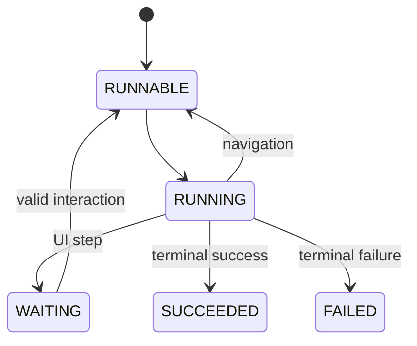
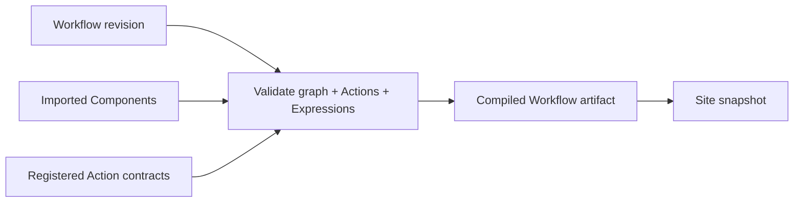
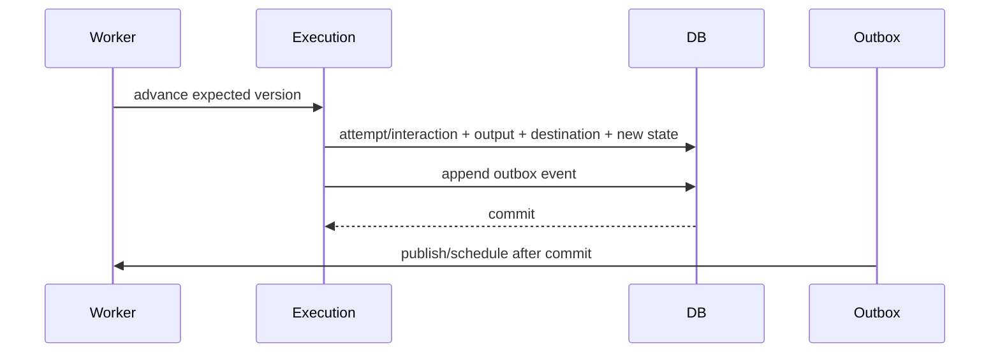

import { File, Folder, Files } from 'fumadocs-ui/components/files';

<Callout title='RFC — do not implement as delivered foundation behavior' type='warning'>
  This page translates the proposed [Workflow contract](/versions/v0/manuals/manifests/v0-workflow) into an
  implementation design. The contract may still change before Workflow enters delivery.
</Callout>

## Execution model

A Workflow execution is durable state pinned to the Site snapshot, Workflow revision, imported Components, and Action contracts selected when execution starts.

A newer Site snapshot changes new executions only; it does not reinterpret a running execution.

## Target module

<Files>
  <Folder name='workflow' defaultOpen>
    <File name='package-info.java' />
    <File name='WorkflowService.java' />
    <File name='WorkflowInteractionService.java' />
    <File name='Action.java' />
    <Folder name='internal'>
      <Folder name='application'>
        <File name='WorkflowWorker.java' />
        <File name='WorkflowTransitionService.java' />
      </Folder>
      <Folder name='domain'>
        <Folder name='definition' />
        <Folder name='execution' />
        <Folder name='navigation' />
      </Folder>
      <Folder name='persistence'>
        <Folder name='execution' />
        <Folder name='outbox' />
      </Folder>
      <Folder name='web' />
      <Folder name='configuration' />
    </Folder>
  </Folder>
</Files>

`WorkflowService` owns start/inspect use cases. `WorkflowInteractionService` accepts one waiting-step interaction. `Action` is the capability SPI for named executable steps. The concrete public HTTP routes remain open and must not be inferred from these Java ports.

## Snapshot compilation

`WorkflowSnapshotContributor` validates proposed Workflow graphs, resolves imported Components and Action contracts, compiles Expressions/navigation, and writes immutable Workflow artifacts into the Site snapshot.

Execution never falls back to a newer Workflow definition when the pinned artifact is unavailable or invalid.

## Persistence model

| Table                   | Durable responsibility                                                                                     |
| ----------------------- | ---------------------------------------------------------------------------------------------------------- |
| `workflow_execution`    | Snapshot/Workflow pins, status, current step, optimistic version, input, timestamps, terminal summary.     |
| `workflow_step_attempt` | Step/attempt identity, stable idempotency key, evaluated input, output, redacted error, attempt lifecycle. |
| `workflow_interaction`  | Waiting-step submission, expected execution version, requester, payload, accepted/rejected outcome.        |
| `workflow_outbox`       | Transition event plus publish/retry metadata for work scheduled after commit.                              |

One transition transaction records the current execution version, completed attempt/interaction, output, selected destination, new status, and outbox event. Dependent work is published or scheduled only after that transaction commits.

Optimistic locking prevents duplicate workers or interactions from advancing the same execution version twice.

## Retry and idempotency

`timeout` applies to one Action attempt, not user waiting time. Retry only failures classified as retryable by the Action contract. Deterministic validation/contract failures do not become retries unless the public Workflow contract explicitly says otherwise.

Each Action invocation receives a stable execution/step/attempt identity. Side-effecting integrations should consume an idempotency key; when an Action cannot guarantee idempotency, its contract must declare the at-least-once risk and the suite must test duplicate delivery.

## Navigation consistency

Navigation is evaluated once in source order from persisted input/output and the pinned compiled definition. Store the chosen destination with the transition. A process restart resumes from persisted state instead of reevaluating navigation against newer definitions or external mutable state.

## Interaction boundary

Submitting a UI interaction requires the execution ID, expected waiting step/version, authenticated Principal, authorization decision, and schema-valid payload. The transition is atomic. A stale/duplicate submission cannot execute navigation twice.

The interaction authorization/API contract remains open; do not invent a controller route merely because the service boundary exists.

## Verification

Workflow RFC evidence must cover graph validation, Expression contexts, navigation ordering/fallback/no-match behavior, retry classification, timeout semantics, optimistic races, outbox crash boundaries, duplicate delivery, waiting interaction, restart recovery, and pinning after newer snapshots activate.

Keep this RFC suite separate from the defined foundation acceptance suite until [Product status](/versions/v0/manuals/status) moves Workflow into delivery.
