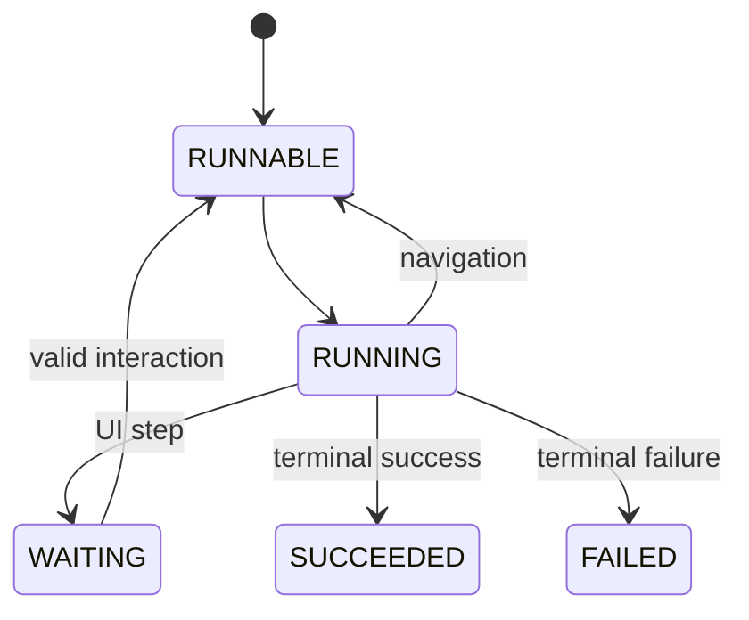

This page translates the [Workflow contract](/versions/v0/manuals/manifests/v0-workflow) into module boundaries, state transitions, transaction rules, and verification.

Workflow is a durable state machine pinned to the Site snapshot, Workflow revision, imported Components, and Action contracts selected when execution starts.

## Target packages and core services

```text
com.taskmigo.console.workflow/
├── package-info.java                         # allowedDependencies = {"resource"}
├── WorkflowService.java                      # start and inspect public application port
├── WorkflowInteractionService.java           # submit waiting-step interaction
├── Action.java                               # Action implementation SPI
└── internal/
    ├── application/{WorkflowWorker,WorkflowTransitionService}.java
    ├── domain/definition/{CompiledWorkflow,CompiledStep}.java
    ├── domain/execution/{WorkflowExecution,StepAttempt,ExecutionStatus}.java
    ├── domain/navigation/WorkflowNavigator.java
    ├── persistence/{execution,outbox}/
    ├── web/
    └── configuration/WorkflowConfiguration.java
```

```java
public interface WorkflowService {
  WorkflowExecutionView start(StartWorkflowCommand command);
  WorkflowExecutionView get(UUID executionId);
}

public interface WorkflowInteractionService {
  WorkflowExecutionView submit(SubmitInteractionCommand command);
}

public interface Action {
  String name();
  ActionContract contract();
  ActionResult execute(ActionContext context, Map<String, Object> input);
}
```

`WorkflowSnapshotContributor` validates Workflow graphs, resolves imported Components and Action contracts, compiles Expressions/navigation, and writes an immutable Workflow artifact into the Site snapshot.

## Execution and persistence model



Create these tables:

| Table                   | Required content                                                                                                                              |
| ----------------------- | --------------------------------------------------------------------------------------------------------------------------------------------- |
| `workflow_execution`    | Execution ID, snapshot ID, Workflow revision ID, status, current step, optimistic `version`, input JSONB, timestamps, terminal error summary. |
| `workflow_step_attempt` | Execution/step/attempt key, stable idempotency key, status, evaluated input, output, redacted error, started/completed timestamps.            |
| `workflow_interaction`  | Execution, waiting step, expected execution version, requester, submitted payload, accepted/rejected status, timestamp.                       |
| `workflow_outbox`       | Event ID, execution/version, event type, payload, creation/published timestamps, retry metadata.                                              |

One transaction records the current execution version, completed attempt or interaction, resolved output, selected navigation destination, next status, and outbox event. A worker publishes or schedules dependent work only after that transaction commits. Optimistic locking prevents two workers or duplicate interactions from advancing the same version.

`timeout` applies to one Action attempt, not time spent waiting for UI interaction. Navigation is evaluated once, in source order, and the chosen destination is stored with the transition. A restart never reevaluates navigation against newer data or definitions.

## Retry and idempotency

Each Action invocation receives a stable execution/step/attempt identity. Retry only errors classified as retryable. Missing contracts, validation errors, and deterministic input errors fail immediately unless the public contract later defines otherwise.

An Action that performs external side effects should accept or derive an idempotency key. When an integration cannot guarantee idempotency, document its at-least-once risk in the Action contract and test duplicate delivery explicitly.

## Interaction security

Submitting UI interaction requires the execution ID, expected waiting step and version, authenticated Principal, authorization decision, and schema-valid payload. The transition is atomic. A stale or duplicate submission cannot run navigation twice; it returns the recorded outcome or a stable conflict.

## Workflow verification

Unit tests cover graph validation, Expression contexts, navigation ordering, fallback/no-match behavior, retry classification, and state transitions. PostgreSQL integration tests crash or redeliver at each transaction/outbox boundary. End-to-end tests start an execution, wait for interaction, resume after restart, retain pinned revisions after a newer snapshot activates, and prove duplicate workers/submissions cannot advance twice.
