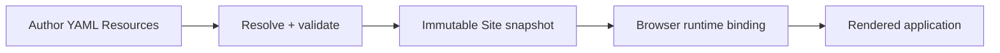

Taskmigo lets teams describe an application with versioned YAML resources. The backend validates the complete Site, compiles an immutable snapshot, and serves that snapshot without rebuilding the application from mutable manifests on every request.

<Cards>
  <Card
    title='Learn and author Taskmigo'
    href='/versions/v0/manuals'
    description='Understand the product model, build a Site, author manifests, and inspect runtime behavior.'
  />
  <Card
    title='Implement Taskmigo'
    href='/versions/v0/developer'
    description='Use the target architecture, persistence, runtime, API, and verification handbook.'
  />
</Cards>

<Callout title='Contract status' type='info'>
  Documentation maturity and delivery state are different. Check [Product status](/versions/v0/manuals/status) before
  treating an RFC or planned capability as available runtime behavior.
</Callout>
