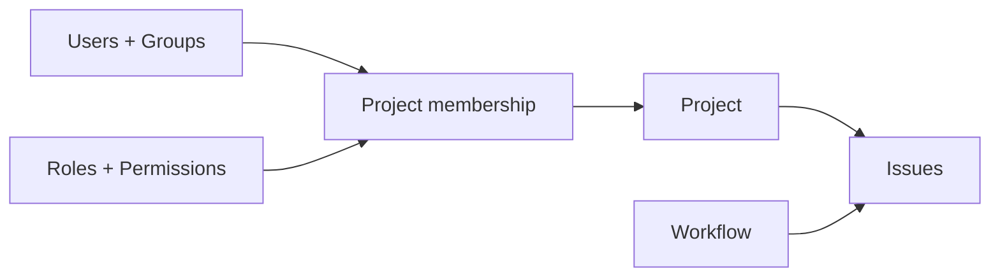

Taskmigo is a project and issue management system for teams that need clear ownership, configurable workflows, and predictable access control without inheriting the complexity or interaction model of legacy trackers.

The product starts with four foundations: **people**, **projects**, **authorization**, and **issues**. Everything else builds on those boundaries.

<Cards>
  <Card
    title='Product manual'
    href='/versions/v0/manuals'
    description='Understand projects, access control, issues, workflows, and the current product scope.'
  />
  <Card
    title='Developer guide'
    href='/versions/v0/developer'
    description='Use the domain boundaries, authorization rules, persistence invariants, and implementation sequence.'
  />
</Cards>

<Callout title='Not a Redmine compatibility layer' type='info'>
  Taskmigo targets the same class of work as Redmine, but its data model and UX are designed independently. Compatibility
  with Redmine plugins, schemas, and APIs is not a product goal.
</Callout>
