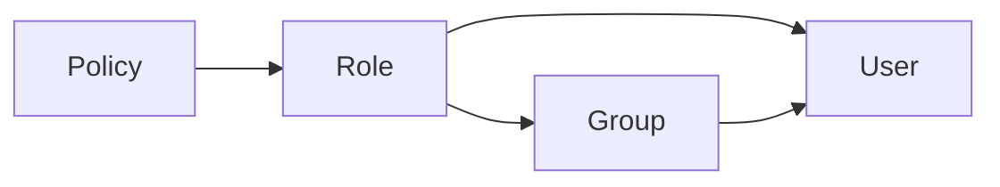

import { TypeTable } from 'fumadocs-ui/components/type-table';

<Callout title='RFC — not implemented' type='warning'>
  This page proposes the Policy contract. It is not available in the current runtime.
</Callout>

## Purpose

One Policy manifest defines one access rule. Registering it makes the policy available but does not activate it. The registered policy must be attached to one Role; that Role is then assigned directly to a user or inherited through a Group.



The Principal receives the union of directly assigned and Group-inherited Roles. Taskmigo evaluates only policies attached to those effective Roles. The Role attachment API and configuration surface remain an open decision; the attachment is not declared inside the Policy manifest.

A policy has only two effects, `allow` and `deny`. The target gives that decision its meaning.

| Target      | `allow`                                     | `deny`                                      |
| ----------- | ------------------------------------------- | ------------------------------------------- |
| Request     | Let the matching Page or API route run.     | Reject the request before its handler runs. |
| Data record | Include records matching the policy filter. | Exclude records matching the policy filter. |
| Data field  | Permit the selected field to be returned.   | Remove the selected field from the result.  |
| UI          | Render a policy-managed target.             | Do not render the target.                   |

UI policy is not a security boundary. A hidden UI target must still be protected by request and data policies.

## Filter database records

This policy permits reading an active or pending Project when it is public, owned by the current user, or belongs to one of the current user's Groups.

```yaml
apiVersion: v0
kind: policy
metadata:
  name: project-read-access

spec:
  name: Read accessible projects
  effect: allow

  target:
    data:
      resource: project
      operation: read

  where:
    and:
      - '{{ in .Resource.status "active" "pending" }}'
      - '{{ isNull .Resource.deletedAt }}'

      - or:
          - '{{ eq .Resource.visibility "public" }}'
          - '{{ eq .Resource.ownerUsername .Principal.username }}'
          - '{{ contains .Principal.groups .Resource.groupId }}'
```

The database adapter compiles the condition into a parameterized predicate equivalent to:

```sql
WHERE status IN ($1, $2)
  AND deleted_at IS NULL
  AND (
    visibility = $3
    OR owner_username = :principal_username
    OR group_id = ANY(:principal_groups)
  )
```

The generated database syntax may differ by adapter, but its result must be equivalent. Taskmigo never renders an Expression into a raw SQL string.

## Fields

<TypeTable
  type={{
    kind: { type: '"policy"', required: true, description: 'Selects the global Policy contract.' },
    'metadata.name': {
      type: 'string',
      required: true,
      description: 'Provides the stable policy key used by registration, Role attachment, and audit records.',
    },
    'spec.name': {
      type: 'string',
      required: true,
      description: 'Provides the human-readable policy name shown in management and audit views.',
    },
    'spec.effect': {
      type: '"allow" | "deny"',
      required: true,
      description: 'Makes the access decision whose outcome is defined by the selected target.',
    },
    'spec.target': {
      type: 'object',
      required: true,
      description: 'Selects one request, data, or UI scope governed by the policy.',
    },
    'spec.target.request': {
      type: 'object',
      description: 'Selects a Page or API route; mutually exclusive with `data` and `ui`.',
    },
    'spec.target.request.method': {
      type: '"GET" | "POST" | "PUT" | "PATCH" | "DELETE"',
      required: true,
      description: 'Matches the incoming request method when `request` is selected.',
    },
    'spec.target.request.path': {
      type: 'string',
      required: true,
      description: 'Matches an absolute Page or API path pattern when `request` is selected.',
    },
    'spec.target.data': {
      type: 'object',
      description: 'Selects records or fields; mutually exclusive with `request` and `ui`.',
    },
    'spec.target.data.resource': {
      type: 'string',
      required: true,
      description: 'Selects the logical data resource when `data` is selected.',
    },
    'spec.target.data.operation': {
      type: '"read"',
      required: true,
      description: 'Applies the data policy while records are read.',
    },
    'spec.target.data.fields': {
      type: 'string[]',
      description: 'Limits the decision to these logical fields; omission governs whole records.',
    },
    'spec.target.ui': {
      type: 'object',
      description: 'Selects one UI element; mutually exclusive with `request` and `data`.',
    },
    'spec.target.ui.application': {
      type: 'string',
      description: 'Selects one Application by name when `ui` is selected.',
    },
    'spec.target.ui.page': {
      type: 'string',
      description: 'Selects one Page by name when `ui` is selected.',
    },
    'spec.target.ui.componentId': {
      type: 'string',
      description: 'Selects one rendered component instance by its `data-component-id`.',
    },
    'spec.where': {
      type: 'PolicyCondition',
      typeDescriptionLink: '#boolean-conditions',
      required: true,
      description: 'Combines database-capable predicate Expressions with explicit boolean groups.',
    },
    'PolicyCondition.Expression': {
      type: 'string',
      typeDescriptionLink: '#available-predicate-functions',
      description: 'Calls one available policy predicate function.',
    },
    'PolicyCondition.and': {
      type: 'PolicyCondition[]',
      typeDescriptionLink: '#boolean-conditions',
      description: 'Matches only when every child condition matches.',
    },
    'PolicyCondition.or': {
      type: 'PolicyCondition[]',
      typeDescriptionLink: '#boolean-conditions',
      description: 'Matches when at least one child condition matches.',
    },
    'PolicyCondition.not': {
      type: 'PolicyCondition',
      typeDescriptionLink: '#boolean-conditions',
      description: 'Negates one child condition or boolean group.',
    },
  }}
/>

One manifest has no `rules` collection or rule `id`. `metadata.name` is the policy's stable key, while `spec.name` is its display name.

### Target fields

Declare exactly one of `request`, `data`, or `ui` under `spec.target`.

A UI target declares exactly one of `application`, `page`, or `componentId`.

## Boolean conditions

A `PolicyCondition` is exactly one of the following structures. This definition is recursive: each child may be another boolean group or a predicate Expression.

There is no implicit `and`. Use `and`, `or`, and `not` so the YAML structure always exposes the complete boolean logic.

```yaml
where:
  and:
    - '{{ in .Resource.status "active" "pending" }}'

    - or:
        - '{{ eq .Resource.visibility "public" }}'
        - '{{ eq .Resource.ownerUsername .Principal.username }}'

    - not:
        and:
          - '{{ eq .Resource.region "EU" }}'
          - '{{ contains .Principal.roles "contractor" }}'
```

## Available predicate functions

Policy conditions use the regular `{{ ... }}` Expression syntax, but permit only the functions below. Each function has a database-equivalent operation implemented by every supported adapter.

| Function     | Arguments            | Database-equivalent predicate             |
| ------------ | -------------------- | ----------------------------------------- |
| `eq`         | `left right`         | `left = right`                            |
| `ne`         | `left right`         | `left <> right`                           |
| `lt`         | `left right`         | `left < right`                            |
| `le`         | `left right`         | `left <= right`                           |
| `gt`         | `left right`         | `left > right`                            |
| `ge`         | `left right`         | `left >= right`                           |
| `in`         | `value candidate...` | `value IN (candidate...)`                 |
| `notIn`      | `value candidate...` | `value NOT IN (candidate...)`             |
| `contains`   | `collection value`   | The collection contains the value.        |
| `startsWith` | `value prefix`       | The value begins with the literal prefix. |
| `endsWith`   | `value suffix`       | The value ends with the literal suffix.   |
| `isNull`     | `value`              | `value IS NULL`                           |
| `isNotNull`  | `value`              | `value IS NOT NULL`                       |

Use `isNull` and `isNotNull` for null checks. `eq` and `ne` do not accept `null`. Database adapters must escape prefix and suffix values as literals rather than treating their contents as wildcard syntax.

Policy Expressions cannot use output formatting, pipelines, variables, condition blocks, iteration, arbitrary functions, I/O, or side effects. Boolean composition belongs in the YAML `and`, `or`, and `not` nodes rather than inside an Expression.

## Available values

| Value                 | Meaning                                                                  |
| --------------------- | ------------------------------------------------------------------------ |
| `.Principal.username` | Authenticated username.                                                  |
| `.Principal.roles`    | Effective Roles assigned directly or inherited through Groups.           |
| `.Principal.groups`   | Groups containing the authenticated user.                                |
| `.Resource.<field>`   | Logical field exposed as policy-queryable by the targeted data resource. |
| `.Request.<field>`    | Validated request value explicitly exposed by a request target.          |
| `.UI.<field>`         | Value explicitly exposed by a UI target.                                 |

Names and paths are case-sensitive. A context is available only for a target that declares it.

## Database filtering contract

When a policy governs record access, Taskmigo compiles `where` into a parameterized database predicate and applies it before pagination, counting, ordering, or serialization. It must not fetch candidate records and then filter them in application memory.

A data predicate may use only:

- A database-backed logical field.
- A computed field with a database translation supplied by the data-resource contract.
- An available Principal or validated request value passed as a query parameter.

A field computed only in the application layer cannot decide record or field access. An unsupported function, unavailable value, type mismatch, missing database translation, or adapter compilation failure makes the affected Site snapshot invalid. Taskmigo never falls back to an unfiltered query.

For a denied data field, the runtime omits that field from the database projection where possible and always removes it before serialization.

## Evaluation

- `deny` takes precedence over `allow` when policies attached to the Principal's effective Roles govern the same target.
- Request and data-record access require a matching `allow`; otherwise access is denied.
- A matching data-field `deny` removes the selected field.
- UI remains visible unless a matching UI `deny` applies. A UI `allow` never overrides a matching `deny`.
- Policies are evaluated from snapshot-pinned revisions, so an active operation does not change behavior mid-execution.

## Global registration

Policies do not participate in `imports`, and no manifest may import `policy`. Registering or changing a policy rebuilds affected Site snapshots. Each snapshot pins the selected policy revision and its Role attachment.
