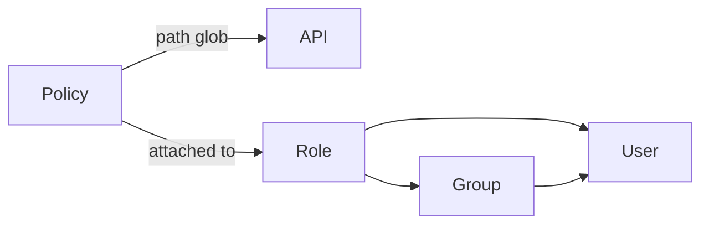

import { TypeTable } from 'fumadocs-ui/components/type-table';

<Callout title='RFC — not implemented' type='warning'>
  This page proposes the Policy contract. It is not available in the current runtime.
</Callout>

## Purpose

One Policy manifest defines one statement for APIs whose registered paths match its glob. Its `mode` selects one authorization phase:

| Mode      | Purpose                                                          | Effect                                                        |
| --------- | ---------------------------------------------------------------- | ------------------------------------------------------------- |
| `request` | Allow or deny an incoming API request before its handler runs.   | Requires `allow` or `deny`.                                   |
| `object`  | Filter which response objects an allowed API request may return. | Has no effect field; matching statements grant object scopes. |

A Policy does not control response fields, Page routes, or UI visibility.

Registering a Policy does not grant it to every user. The Policy must also be attached to a Role assigned directly to the user or inherited through a Group.



An API may match multiple Policies. For each request, Taskmigo applies only the Policies that both match the API path and belong to the Principal's effective Roles.

## Request Policy

This Policy denies requests from users in the `suspended` Group before a matching API handler runs.

```yaml
apiVersion: v0
kind: policy
metadata:
  name: deny-suspended-project-users

spec:
  name: Deny suspended project users
  mode: request
  effect: deny

  target:
    api: /api/v1/projects/**

  statement: '{{ contains .Principal.groups "suspended" }}'
```

A separate request-mode Policy must grant the request with `effect: allow`. Keeping grants and denials in separate manifests prevents incoming-request decisions from being mixed with response-object filtering.

## Object Policy

This Policy applies to every registered API path below `/api/v1/projects` and permits those APIs to return active or pending Projects that are public, owned by the current user, or assigned to one of the user's Groups.

```yaml
apiVersion: v0
kind: policy
metadata:
  name: read-accessible-projects

spec:
  name: Read accessible projects
  mode: object

  target:
    api: /api/v1/projects/**

  statement:
    and:
      - '{{ in .Resource.status "active" "pending" }}'
      - '{{ isNull .Resource.deletedAt }}'

      - or:
          - '{{ eq .Resource.visibility "public" }}'
          - '{{ eq .Resource.ownerUsername .Principal.username }}'
          - '{{ contains .Principal.groups .Resource.groupId }}'
```

## Fields

<TypeTable
  type={{
    kind: { type: '"policy"', required: true, description: 'Selects the global Policy contract.' },
    'metadata.name': {
      type: 'string',
      required: true,
      description: 'Provides the stable Policy key used by Role attachments and audit records.',
    },
    'spec.name': {
      type: 'string',
      required: true,
      description: 'Provides the human-readable name shown in management and audit views.',
    },
    'spec.mode': {
      type: '"request" | "object"',
      required: true,
      description: 'Selects incoming request authorization or response object filtering.',
    },
    'spec.effect': {
      type: '"allow" | "deny"',
      description: 'Makes a request-mode decision; required in request mode and forbidden in object mode.',
    },
    'spec.target': {
      type: 'object',
      required: true,
      description: 'Groups the API selection fields.',
    },
    'spec.target.api': {
      type: 'string',
      required: true,
      description: 'Matches normalized registered API paths using the absolute glob syntax documented below.',
    },
    'spec.statement': {
      type: 'PolicyStatement',
      typeDescriptionLink: '#statements',
      required: true,
      description: 'Defines a runtime request condition or a database-capable object filter, depending on the mode.',
    },
  }}
/>

One manifest has no `rules` collection or response `fields`. `metadata.name` is the stable key, while `spec.name` is the display name.

## API path glob

`spec.target.api` matches the normalized path of a registered API. It does not match an API name, raw request URL, query string, fragment, or HTTP method.

| Pattern            | Matches                                      |
| ------------------ | -------------------------------------------- |
| `/api/v1/projects` | Only that exact registered path.             |
| `/api/v1/*`        | Exactly one path segment below `/api/v1`.    |
| `/api/v1/**`       | `/api/v1` and any number of nested segments. |
| `/**`              | Every registered API path.                   |

The glob must begin with `/`. Only `*` and `**` are special; regex, `?`, and character classes are not supported. Because the target does not include an HTTP method, a matching Policy applies to every method registered at that path.

## Statements

A `PolicyStatement` is either one predicate Expression or exactly one boolean group:

<TypeTable
  type={{
    Expression: {
      type: 'string',
      typeDescriptionLink: '#available-predicate-functions',
      description:
        'Calls one available predicate function and produces a boolean request condition or database-capable object condition.',
    },
    and: {
      type: 'PolicyStatement[]',
      typeDescriptionLink: '#statements',
      description: 'Matches only when every child statement matches.',
    },
    or: {
      type: 'PolicyStatement[]',
      typeDescriptionLink: '#statements',
      description: 'Matches when at least one child statement matches.',
    },
    not: {
      type: 'PolicyStatement',
      typeDescriptionLink: '#statements',
      description: 'Negates one child statement or boolean group.',
    },
  }}
/>

There is no implicit `and`. Boolean composition belongs in the YAML `and`, `or`, and `not` nodes rather than inside an Expression.

```yaml
statement:
  and:
    - '{{ in .Resource.status "active" "pending" }}'

    - or:
        - '{{ eq .Resource.visibility "public" }}'
        - '{{ eq .Resource.ownerUsername .Principal.username }}'

    - not:
        and:
          - '{{ eq .Resource.region "EU" }}'
          - '{{ contains .Principal.roles "contractor" }}'
```

## Available predicate functions

Policy statements use the regular `{{ ... }}` Expression syntax, but permit only the functions below. Request mode evaluates them against request context. Object mode compiles them to the equivalent parameterized database operation.

| Function     | Arguments            | Object-mode database equivalent           |
| ------------ | -------------------- | ----------------------------------------- |
| `eq`         | `left right`         | `left = right`                            |
| `ne`         | `left right`         | `left <> right`                           |
| `lt`         | `left right`         | `left < right`                            |
| `le`         | `left right`         | `left <= right`                           |
| `gt`         | `left right`         | `left > right`                            |
| `ge`         | `left right`         | `left >= right`                           |
| `in`         | `value candidate...` | `value IN (candidate...)`                 |
| `notIn`      | `value candidate...` | `value NOT IN (candidate...)`             |
| `contains`   | `collection value`   | The collection contains the value.        |
| `startsWith` | `value prefix`       | The value begins with the literal prefix. |
| `endsWith`   | `value suffix`       | The value ends with the literal suffix.   |
| `isNull`     | `value`              | `value IS NULL`                           |
| `isNotNull`  | `value`              | `value IS NOT NULL`                       |

Use `isNull` and `isNotNull` for null checks; `eq` and `ne` do not accept `null`. Adapters treat prefix and suffix arguments as literals, not wildcard patterns.

Policy Expressions cannot use output formatting, pipelines, variables, condition blocks, iteration, arbitrary functions, I/O, or side effects. Taskmigo parses the Expression for the selected mode; object mode builds a parameterized predicate and never renders an Expression into raw SQL.

## Available values

| Value                 | Mode                   | Meaning                                                                                     |
| --------------------- | ---------------------- | ------------------------------------------------------------------------------------------- |
| `.Principal.username` | `request` and `object` | Authenticated username.                                                                     |
| `.Principal.roles`    | `request` and `object` | Roles assigned directly or inherited through Groups.                                        |
| `.Principal.groups`   | `request` and `object` | Groups containing the authenticated user.                                                   |
| `.Request.<field>`    | `request` and `object` | Validated request value explicitly exposed by every API matched by the glob.                |
| `.Resource.<field>`   | `object` only          | Logical response record field exposed as policy-queryable by every API matched by the glob. |

Names and paths are case-sensitive. A request value is available only when every API matched by the glob declares a compatible validated type. In object mode, each Resource value must also have a compatible database mapping across those APIs.

## Evaluation

For every incoming API request, Taskmigo first selects the Policies whose API glob matches the normalized registered path and that are attached to the Principal's effective Roles. It then evaluates the two modes in separate phases:

1. **Request phase:** evaluates request-mode statements before the handler runs. Any matching `deny` statement that evaluates to `true` returns `403`. Otherwise, at least one matching `allow` statement must evaluate to `true`; if none does, Taskmigo returns `403`.
2. **Object phase:** after the request is allowed and before an object query executes, compiles object-mode statements into parameterized database predicates. It combines matching statements with `OR` and applies the result before counting, ordering, pagination, and serialization.

The request phase is fail-closed: no applicable grant means no API access. The object phase is also fail-closed: when an API returns policy-queryable objects but no applicable object-mode Policy exists, Taskmigo uses a false predicate and returns no objects. A Policy whose statement matches nothing never makes the query unfiltered.

For example, if the user receives `read-public-projects` and `read-owned-projects`, the resulting predicate is equivalent to:

```sql
WHERE visibility = $1
   OR owner_username = :principal_username
```

## Database filtering contract

This contract applies only to object mode. Every `.Resource.*` field must be backed by a database field or a computed field with a database translation. Every `.Request.*` and `.Principal.*` value becomes a query parameter.

When one glob matches multiple APIs, all of them must expose compatible types and database mappings for every value used by the statement. An unsupported function, unavailable value, type mismatch, missing database translation, or compilation failure makes the Policy invalid for the affected Site snapshot.

Taskmigo never fetches candidate records and filters them in application memory. It never falls back to an unfiltered query. Request-mode statements are evaluated before the handler and do not produce database filters.

## Global registration

Policies do not participate in `imports`, and no manifest may import `policy`. Registering or changing a Policy rebuilds affected Site snapshots. Each snapshot pins the Policy revision, matched API contracts, and Role attachment used for evaluation.

The Role attachment API and management surface remain an open decision; the attachment is not declared inside the Policy manifest.
