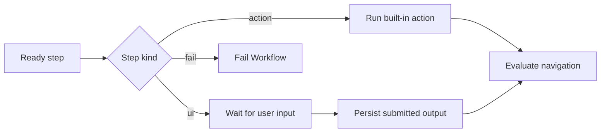
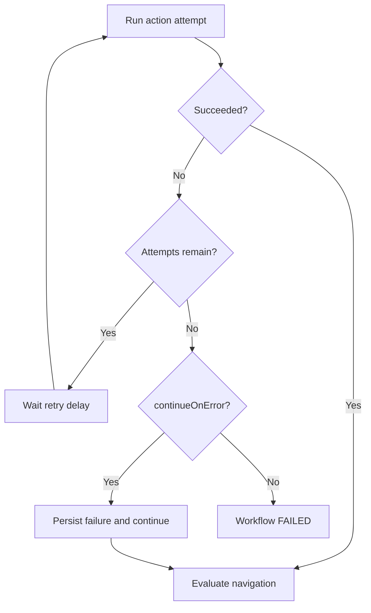
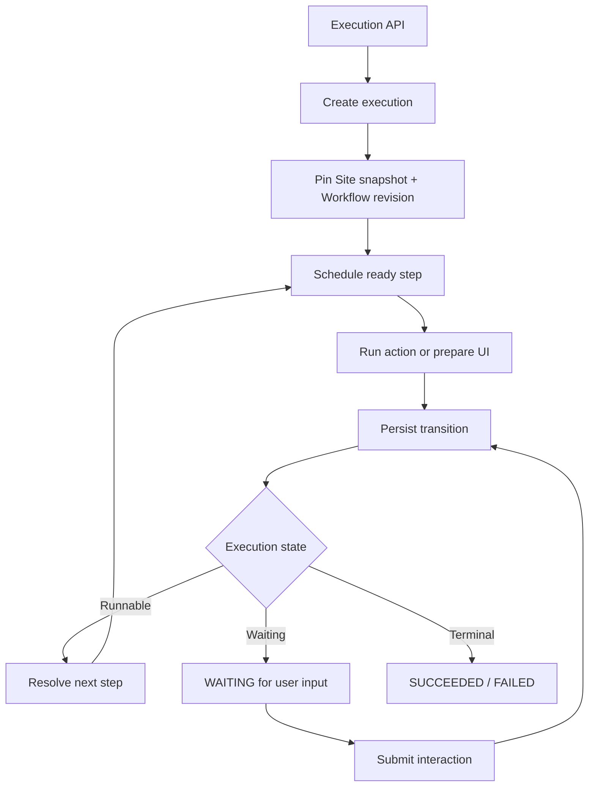
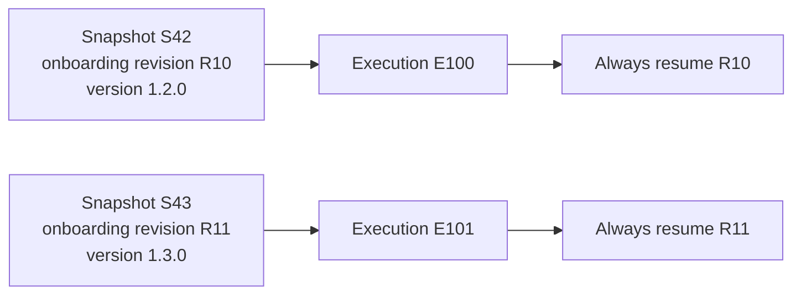
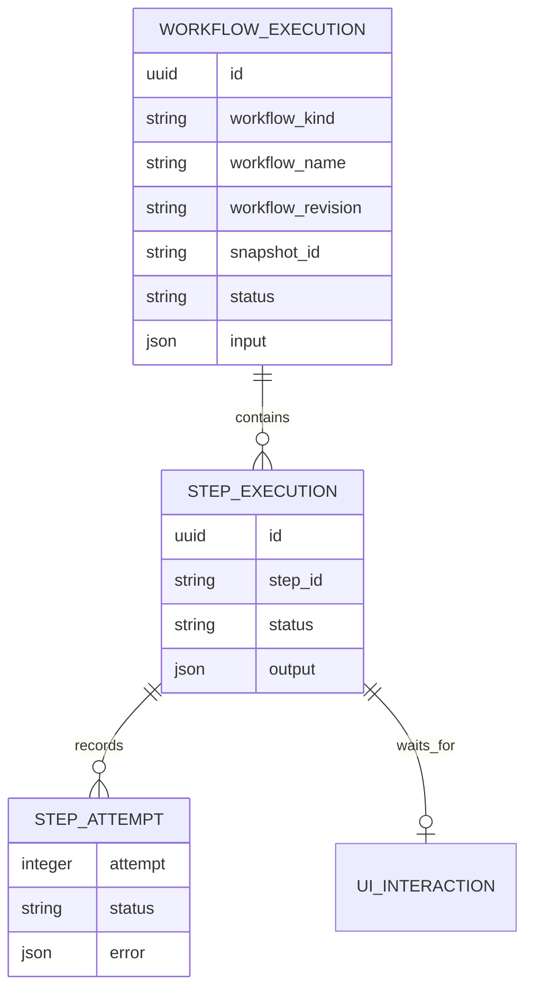

import { TypeTable } from 'fumadocs-ui/components/type-table';

<Callout title='RFC: not a supported manifest contract' type='warn'>
  This page proposes the `v0/workflow` contract and runtime model. It is design input for implementation and may change before adoption. Do not rely on it as current Taskmigo behavior.
</Callout>

A Workflow defines a durable execution graph. It starts through the execution API, runs built-in actions or waits for user interaction, moves between steps through an explicit navigation DSL, and keeps using the exact Workflow revision selected when the execution started.

## Goals

The RFC is designed to support:

- API-triggered executions now, without coupling the engine to future schedule or event triggers.
- Built-in action steps and interactive UI steps.
- Sequential flows first while preserving a graph model that can add parallel execution later.
- Data flow from Workflow input and previous step output through Expressions.
- Conditional navigation, retry, timeout, continue-on-error, and explicit failure.
- Page-controlled discovery: a Page imports the Workflows that users may start from that Page.
- Durable execution that survives service restarts and Workflow manifest changes.

A visual Workflow builder, sub-workflows, pause, cancellation, scheduled triggers, event triggers, and parallel execution are outside the initial implementation scope.

## Proposed manifest

```yaml
kind: v0/workflow
name: employee-onboarding
version: 1.2.0

imports:
  - v0/component/employee-confirmation

spec:
  meta:
    title: Employee onboarding
    description: Validate and provision a new employee

  inputs:
    employeeId:
      type: string
      required: true

  start: validate-employee

  steps:
    validate-employee:
      action: employee.validate
      input:
        employeeId: '{{ input.employeeId }}'
      timeout: 30s
      retry:
        attempts: 3
        delay: 5s
      navigation:
        - when: '{{ eq step.output.valid true }}'
          goto: confirm
        - goto: rejected

    confirm:
      ui:
        component: v0/component/employee-confirmation
        props:
          employee: '{{ steps.validate-employee.output.employee }}'
      navigation:
        - when: '{{ eq step.output.approved true }}'
          goto: provision
        - goto: rejected

    provision:
      action: employee.provision
      input:
        employeeId: '{{ input.employeeId }}'

    rejected:
      fail:
        message: Employee onboarding was rejected
```

`spec.steps` is a map. The map key is the stable step identifier used by navigation, Expressions, runtime state, logs, retries, and UI state. Source order does not define execution order.

## Fields

<TypeTable
  type={{
    kind: { type: '"v0/workflow"', required: true, description: 'Selects the proposed Workflow contract.' },
    'spec.meta': { type: 'object', required: true, description: 'Information used to present the Workflow to users.' },
    'spec.meta.title': { type: <FieldType supportsExpression={true}>string</FieldType>, required: true, description: 'Display name of the Workflow.' },
    'spec.meta.description': { type: <FieldType supportsExpression={true}>string</FieldType>, required: true, description: 'Short explanation of the Workflow outcome.' },
    'spec.inputs': { type: 'map<string, InputDefinition>', required: false, description: 'Declares values accepted when an execution starts.' },
    'spec.start': { type: 'string', required: true, description: 'Step identifier scheduled when a new execution starts.' },
    'spec.steps': { type: 'map<string, StepDefinition>', required: true, description: 'Defines the execution graph by stable step identifier.' },
  }}
/>

### Input definitions

The initial proposal uses the same scalar types as Component props: `string`, `number`, and `boolean`.

<TypeTable
  type={{
    type: { type: '"string" | "number" | "boolean"', required: true, description: 'Value type accepted at execution start.' },
    required: { type: 'boolean', required: true, description: 'Whether the caller must provide the input.' },
    default: { type: 'string | number | boolean', required: false, description: 'Value used when an optional input is omitted.' },
  }}
/>

## Step kinds

A step declares exactly one execution kind: `action`, `ui`, or `fail`.



### Action step

```yaml
load-user:
  action: user.load
  input:
    id: '{{ input.userId }}'
  timeout: 30s
  retry:
    attempts: 3
    delay: 5s
  continueOnError: false
```

`action` selects a built-in Action Registry entry. The registry owns the action input schema, output schema, and executor. A Workflow does not embed action implementation.

`input` is evaluated immediately before each attempt. The evaluated value must satisfy the selected action's input contract.

### Interactive UI step

```yaml
approve:
  ui:
    component: v0/component/approval-form
    props:
      request: '{{ steps.load-request.output }}'
```

An interactive step references an imported `v0/component`. The runtime renders that Component from the Workflow execution state and transitions the execution to `WAITING` until the user submits the interaction.

Waiting for user input does not keep the HTTP request or a worker open. The interaction result is persisted as the step output before navigation is evaluated.

The initial proposal does not apply action `timeout` to time spent waiting for a user. A future UI-expiration contract should be independent from action-attempt timeout.

### Fail step

```yaml
rejected:
  fail:
    message: Request rejected
```

`fail` is a Workflow control primitive rather than a built-in action. Entering the step terminates the execution as `FAILED` with the declared failure information.

## Expressions and data flow

Workflow fields that accept Expressions use the existing Taskmigo Expression syntax. The RFC adds Workflow-specific context values rather than defining another expression language.

| Value | Meaning |
| --- | --- |
| `input.<name>` | Resolved Workflow input captured when the execution starts. |
| `steps.<id>.output` | Persisted output of a completed or continued step. |
| `steps.<id>.status` | Persisted runtime status of that step. |
| `step.input` | Input of the step currently being evaluated. |
| `step.output` | Current step output while evaluating navigation. |
| `.This.*` | Existing manifest metadata context for the pinned Workflow revision. |
| `.Runtime.*` | Existing runtime context available to Expressions. |

Expressions read persisted execution state. Resuming an execution must not re-read a newer Workflow manifest or substitute a newer Workflow revision.

## Navigation DSL

Navigation is the only proposed control-flow mechanism between successful or continued steps.

### Linear navigation

```yaml
navigation:
  - goto: notify
```

### Conditional navigation

```yaml
navigation:
  - when: '{{ eq step.output.status "approved" }}'
    goto: approved
  - when: '{{ eq step.output.status "needs-review" }}'
    goto: review
  - goto: rejected
```

Routes are evaluated in declaration order. The first route whose `when` evaluates to `true` is selected. A route without `when` is an unconditional fallback.

A step with no `navigation` is a successful terminal step. If `navigation` exists but no route matches, the execution fails with a navigation-resolution error. Taskmigo must not silently treat that case as successful completion.

### Future graph extension

The runtime and persistence model should not assume that only one step can ever be active. A future contract may allow one route to activate multiple targets and use dependency/join semantics for parallel execution.

That extension is intentionally not part of the initial implementation. The first implementation may restrict each navigation result to one target while representing active work internally as a set of steps.

## Retry, timeout, and failure policy

Retry is evaluated before `continueOnError`.



```yaml
retry:
  attempts: 3
  delay: 5s

timeout: 30s
continueOnError: true
```

`timeout` applies to one action attempt. Each retry receives a new timeout window. Failed and timed-out attempts remain in execution history rather than being overwritten.

When retries are exhausted and `continueOnError` is `true`, the step keeps its failure result, transitions to a continued terminal state, and navigation is evaluated. When it is `false` or omitted, the Workflow fails.

## Execution model

A Workflow execution is durable runtime state, separate from the immutable Site snapshot that supplied its definition.



The engine is a resumable state machine, not one long-running HTTP operation. Every meaningful transition must be persisted before dependent work is scheduled.

### Proposed execution states

Workflow execution states:

- `PENDING`
- `RUNNING`
- `WAITING`
- `SUCCEEDED`
- `FAILED`

Step states should distinguish at least pending, running, waiting for input, succeeded, failed, timed out, and continued. Cancellation and manual pause are outside the initial scope.

## Version pinning

Workflow versioning reuses the common resource revision model. `v0/workflow` does not introduce `spec.version`.

When an execution starts, the runtime records the selected Workflow identity, exact revision, and Site snapshot. A semantic `version` tag is recorded when the selected revision has one, but the revision is the authoritative pin because common resources may also have untagged revisions.



Updating, deleting, or replacing the manifest after E100 starts must not alter E100's definition, Expressions, step graph, action selection, UI component revision, or navigation rules. New executions use the Workflow revision selected by the Site snapshot current when they start.

Dependencies required by a Workflow execution, including imported Components used by UI steps, must also resolve from the pinned snapshot rather than the current snapshot.

## Page integration

The proposed reference relationship is:

```text
v0/page     -> v0/workflow   allowed
v0/workflow -> v0/component  allowed
```

Other Workflow import relationships remain disallowed initially, including Workflow-to-Workflow imports.

A Page controls which Workflows its users can discover and start:

```yaml
kind: v0/page
name: operations

imports:
  - v0/workflow/employee-onboarding
  - v0/workflow/access-review
```

The UI may expose those imported resources through runtime-oriented components such as a Workflow list, start form, and execution view. This RFC does not propose a visual Workflow builder or a second Page-definition language inside a Workflow.

A Workflow UI step reuses `v0/component`; it does not embed an arbitrary Page body.

## API trigger boundary

API is the only initial trigger. Trigger handling must remain separate from the execution engine so future schedule and event triggers can create executions through the same start operation.

Conceptually:

```text
POST /workflows/{workflow}/executions
```

```json
{
  "input": {
    "employeeId": "EMP-123"
  }
}
```

A successful start returns an execution identifier plus the pinned Workflow metadata and current execution state. Page UI must use the same execution service rather than a separate UI-only execution path.

Exact public endpoint paths, authentication rules, idempotency semantics, and response schemas remain implementation decisions and are not fixed by this RFC.

## Validation

Snapshot-time validation should reject a Workflow before activation when the graph is structurally invalid. Checks include:

- `spec.start` does not identify a declared step.
- A step declares zero or more than one of `action`, `ui`, and `fail`.
- A navigation target does not exist.
- An action name is not registered or its statically known input is incompatible with its contract.
- A UI step references a Component that the Workflow did not import.
- A referenced Component cannot be resolved from the candidate Site graph.
- Expression syntax is invalid in a field that accepts Expressions.
- Retry, timeout, or navigation configuration is structurally invalid.

Runtime validation handles values that cannot be known at snapshot build time, including evaluated action input, action output, submitted UI data, navigation condition results, timeouts, and action failures.

## Persistence model

The storage layout is intentionally logical rather than a fixed PostgreSQL schema.



The durable model must retain enough information to resume after process restart without resolving the Workflow against the current Site snapshot.

## Implementation sequence

1. **Contract and compiler:** define schema, action registry contracts, Workflow-specific Expression context, graph validation, and compilation into the immutable Site snapshot.
2. **Durable execution engine:** create and resume executions, persist transitions, execute actions, evaluate navigation, implement retry, timeout, continue-on-error, and explicit failure.
3. **Interactive steps:** resolve pinned Components, persist waiting state, validate submitted interaction data, and resume navigation.
4. **Page integration:** allow Pages to import Workflows and add runtime UI for discovery, start input, waiting interaction, and execution status.
5. **Parallel graph extension:** only after sequential execution is stable, define fork, join, dependency, concurrent failure, and retry semantics without replacing the core execution model.

## Required invariants

The feature is not complete unless all of these remain true:

- A running execution never changes behavior because its Workflow manifest was updated.
- Restarting a Taskmigo service does not lose execution progress.
- Retry attempts remain independently observable.
- An interactive step can wait across requests and service restarts.
- Navigation is deterministic for persisted state.
- A Page exposes only Workflows it imports.
- A Workflow UI step can use only Components it imports.
- Invalid Workflow definitions cannot enter the active Site snapshot.
- A new Workflow revision affects new executions only.

## Open implementation decisions

The RFC deliberately leaves these details open until implementation planning provides stronger constraints:

- Public API paths and authentication/authorization policy.
- Start-request idempotency and duplicate execution handling.
- Exact persisted table layout and indexes.
- Action output/error envelope and redaction rules.
- Retention and archival policy for completed executions and attempts.
- UI interaction submission schema and authorization.
- Operational limits such as maximum steps, execution duration, retries, and persisted output size.
- Parallel fork/join syntax and failure aggregation semantics.
