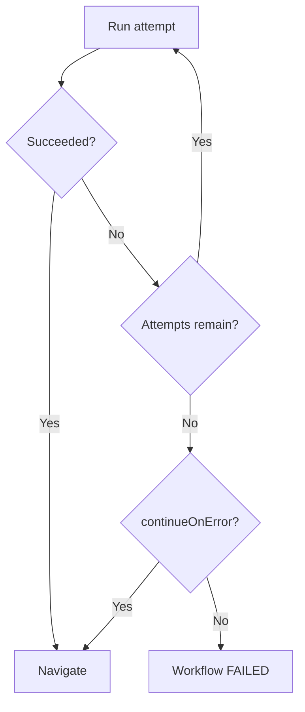

import { TypeTable } from 'fumadocs-ui/components/type-table';

<Callout title='RFC: not a supported manifest contract' type='warn'>
  This contract may change before adoption. Check [Product status](/versions/v0/status) before relying on it.
</Callout>

A Workflow is a durable execution graph. It can run built-in actions, wait for user interaction, and choose the next step from persisted data.

## Proposed manifest

```yaml
apiVersion: v0
kind: workflow
metadata:
  name: employee-onboarding
imports:
  - component/employee-confirmation
spec:
  meta:
    title: Employee onboarding
    description: Validate and provision a new employee
  inputs:
    employeeId:
      type: string
      required: true
  start: validate-employee
  steps:
    validate-employee:
      action: employee.validate
      input:
        employeeId: '{{ input.employeeId }}'
      timeout: 30s
      retry:
        attempts: 3
        delay: 5s
      navigation:
        - when: '{{ eq step.output.valid true }}'
          goto: confirm
        - goto: rejected
    confirm:
      ui:
        component: employee-confirmation
        props:
          employee: '{{ steps.validate-employee.output.employee }}'
      navigation:
        - when: '{{ eq step.output.approved true }}'
          goto: provision
        - goto: rejected
    provision:
      action: employee.provision
      input:
        employeeId: '{{ input.employeeId }}'
    rejected:
      fail:
        message: Employee onboarding was rejected
```

`spec.steps` is keyed by stable step identifier. Source order does not define execution order.

## Fields

<TypeTable
  type={{
    'spec.meta': {
      type: 'object',
      required: true,
      description: 'Groups the information used to present the Workflow.',
    },
    'spec.meta.title': {
      type: <FieldType supportsExpression={true}>string</FieldType>,
      required: true,
      description: 'Name shown to users.',
    },
    'spec.meta.description': {
      type: <FieldType supportsExpression={true}>string</FieldType>,
      required: true,
      description: 'Summary shown with the Workflow.',
    },
    'spec.inputs': {
      type: 'Dictionary<InputDefinition>',
      required: false,
      description: 'Maps each user-defined input name to the definition documented below.',
    },
    'spec.start': { type: 'string', required: true, description: 'Identifies the first step to schedule.' },
    'spec.steps': {
      type: 'Dictionary<StepDefinition>',
      required: true,
      description: 'Maps each stable step identifier to the step definition documented below.',
    },
  }}
/>

### Input definitions

<TypeTable
  type={{
    type: {
      type: '"string" | "number" | "boolean"',
      required: true,
      description: 'Constrains values accepted for this input.',
    },
    required: {
      type: 'boolean',
      required: true,
      description: 'Controls whether callers may omit the input.',
    },
    default: {
      type: 'string | number | boolean',
      description: 'Supplies a value when an optional input is omitted.',
    },
  }}
/>

## Step kinds

A step declares exactly one of `action`, `ui`, or `fail`.

<TypeTable
  type={{
    action: {
      type: 'string',
      description: 'Selects one Action Registry entry; mutually exclusive with `ui` and `fail`.',
    },
    input: {
      type: 'Dictionary',
      description: 'Supplies named values validated by the selected Action contract.',
    },
    timeout: { type: 'string', description: 'Limits one Action attempt using a duration such as `30s`.' },
    retry: { type: 'object', description: 'Configures retry behavior for an Action step.' },
    'retry.attempts': {
      type: 'number',
      description: 'Limits the total number of Action attempts; must be a positive integer.',
    },
    'retry.delay': {
      type: 'string',
      description: 'Waits this duration between Action attempts, such as `5s`.',
    },
    continueOnError: {
      type: 'boolean',
      description: 'Continues to navigation after Action attempts are exhausted.',
    },
    ui: {
      type: 'object',
      description: 'Waits for interaction; mutually exclusive with `action` and `fail`.',
    },
    'ui.component': { type: 'string', description: 'Selects an imported Component by name.' },
    'ui.props': {
      type: 'Dictionary',
      description: 'Supplies named values validated by the selected Component contract.',
    },
    fail: {
      type: 'object',
      description: 'Terminates execution as failed; mutually exclusive with `action` and `ui`.',
    },
    'fail.message': { type: 'string', description: 'Records the failure message.' },
    navigation: {
      type: 'object[]',
      description: 'Tests routes in order and selects the first matching destination.',
    },
    'navigation[].when': {
      type: <FieldType supportsExpression={true}>boolean</FieldType>,
      description: 'Controls whether this route matches; omission defines a fallback.',
    },
    'navigation[].goto': {
      type: 'string',
      required: true,
      description: 'Selects the next stable step identifier.',
    },
  }}
/>

### Action

```yaml
load-user:
  action: user.load
  input:
    id: '{{ input.userId }}'
  timeout: 30s
  retry:
    attempts: 3
    delay: 5s
  continueOnError: false
```

`action` selects a built-in Action Registry entry. Its `input` is evaluated before each attempt.

### Interactive UI

```yaml
approve:
  ui:
    component: approval-form
    props:
      request: '{{ steps.load-request.output }}'
```

The Component must appear in `imports`. Entering the step persists the execution as `WAITING`; submitted interaction data becomes the step output before navigation runs. User waiting time is not part of action `timeout`.

### Fail

```yaml
rejected:
  fail:
    message: Request rejected
```

Entering the step terminates the execution as `FAILED`.

## Expressions and data flow

Workflow fields marked as Expression-capable use [Expressions](/versions/v0/expressions) with these additional values:

| Value               | Meaning                                            |
| ------------------- | -------------------------------------------------- |
| `input.<name>`      | Workflow input captured at execution start.        |
| `steps.<id>.output` | Persisted output of a completed or continued step. |
| `steps.<id>.status` | Persisted status of that step.                     |
| `step.input`        | Current step input.                                |
| `step.output`       | Current step output during navigation.             |

## Navigation

```yaml
navigation:
  - when: '{{ eq step.output.status "approved" }}'
    goto: approved
  - when: '{{ eq step.output.status "needs-review" }}'
    goto: review
  - goto: rejected
```

Routes are evaluated in order. The first matching `when` wins; a route without `when` is the fallback. A step without `navigation` succeeds and ends the Workflow. If no route matches, the execution fails.

## Retry, timeout, and failure



`timeout` applies per action attempt. Attempt history is preserved. After retries are exhausted, `continueOnError: true` continues to navigation; otherwise the Workflow fails.

## Execution and revision pinning

Starting an execution pins its Site snapshot, Workflow revision, and imported dependencies. Later changes affect new executions only. See [Runtime lifecycle](/versions/v0/runtime#workflow-execution).

## Page integration

```yaml
imports:
  - workflow/employee-onboarding
  - workflow/access-review@1.0.0
```

A Page imports Workflows that its users may discover and start. Workflow-to-Workflow imports are not supported. See [Reference ability](/versions/v0/resources#reference-ability).

## Validation

Snapshot validation rejects invalid graph structure, references, Expressions, action contracts, retry, timeout, and navigation configuration. Values available only during execution are validated at runtime.

## Out of scope

- Visual Workflow builder
- Sub-workflows
- Pause and cancellation
- Scheduled and event triggers
- Parallel execution

## Open implementation decisions

- Public API paths and authorization
- Start-request idempotency
- Persistence layout and indexes
- Action error envelope and redaction
- Retention policy
- UI interaction authorization
- Operational limits
- Parallel fork/join semantics
