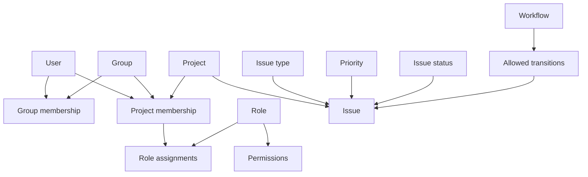

Taskmigo deliberately keeps identity, membership, authorization, and work tracking separate. That separation makes permission resolution predictable and avoids attaching global privileges to a person when the privilege only makes sense inside one project.

## Resource responsibilities

| Resource           | Responsibility                                                                             |
| ------------------ | ------------------------------------------------------------------------------------------ |
| User               | A person who can authenticate and participate in Taskmigo.                                 |
| Group              | A reusable collection of users.                                                            |
| Project            | The primary collaboration and authorization boundary.                                      |
| Project membership | Connects a project to either a user or a group.                                            |
| Role               | A named collection of project permissions.                                                 |
| Permission         | An atomic capability such as `issue:update`.                                               |
| Issue              | A unit of work owned by one project.                                                       |
| Issue type         | Classifies work, such as Bug, Task, or Feature.                                            |
| Priority           | Describes urgency independently from workflow state.                                       |
| Issue status       | Represents the current lifecycle state.                                                    |
| Workflow           | Defines which status changes are valid for an issue type and which roles may perform them. |

## Design rules

A project never owns users or groups. Membership only grants participation in that project. Removing a user from one project therefore does not alter their identity or their membership in other projects.

Roles are also independent from users. A person can be a Manager in one project, a Developer in another, and have no access to a third.

Issues never cross project boundaries. Relationships that would require one issue to be owned by multiple projects are intentionally excluded from the core model.
