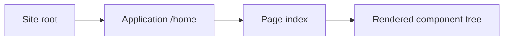
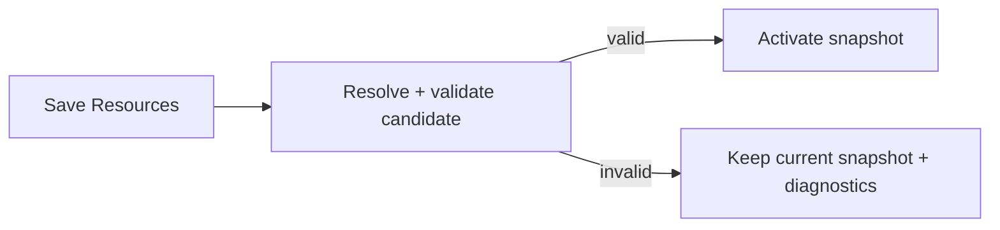

import { Step, Steps } from 'fumadocs-ui/components/steps';

A minimal Taskmigo UI needs three Resources:



<Steps>
  <Step>

### Create the Page

The Page owns metadata and the component tree. It does **not** own its URL.

```yaml
apiVersion: v0
kind: page
metadata:
  name: index
spec:
  meta:
    title: Home
    description: Home page
  body:
    - component: Typography
      props:
        variant: h1
      children: Hello Taskmigo
```

  </Step>
  <Step>

### Route the Page from an Application

The Application imports the Page and maps it below its own path.

```yaml
apiVersion: v0
kind: application
metadata:
  name: home
imports:
  - page/index
spec:
  icon: https://example.com/home.png
  label: Home
  description: Home application
  path: /home
  routes:
    - page: index
      path: /
```

The resulting URL path is `/home/`.

  </Step>
  <Step>

### Expose the Application from the Site

The Site is the composition root. Importing an Application makes it available to the Site; listing it in `spec.applications` exposes it.

```yaml
apiVersion: v0
kind: site
metadata:
  name: root
imports:
  - application/home
spec:
  brand:
    label: Taskmigo
    logo: ./logo.png
    favicon: ./favicon.ico
  applications:
    - home
```

  </Step>
  <Step>

### Save and activate

Saving creates immutable Resource revisions. Taskmigo then resolves the affected Site graph, validates it, compiles a candidate snapshot, and activates that snapshot only when the candidate is valid.



A successful save therefore does not guarantee that the change is already serving users. See [Runtime lifecycle](/versions/v0/manuals/runtime) when authoring state and runtime state differ.

  </Step>
</Steps>

## Add capabilities when you need them

<Cards>
  <Card
    title='Reuse UI'
    href='/versions/v0/manuals/manifests/v0-component'
    description='Move a shared component tree into an imported Component with typed props.'
  />
  <Card
    title='Translate UI'
    href='/versions/v0/manuals/manifests/v0-translation'
    description='Create locale catalogs and resolve messages with Trans or TransN.'
  />
  <Card
    title='Use dynamic values'
    href='/versions/v0/manuals/expressions'
    description='Use Expressions only in fields whose Type Table marks Expression support.'
  />
  <Card
    title='Understand versioning'
    href='/versions/v0/manuals/resources'
    description='Learn identity, revisions, tags, imports, graph checksums, and snapshot selection.'
  />
</Cards>

<Callout title='Workflow and Policy are RFCs' type='warning'>
  Workflow and Policy documentation describes proposed contracts, not currently available runtime capabilities. Check
  [Product status](/versions/v0/manuals/status) before relying on them.
</Callout>
