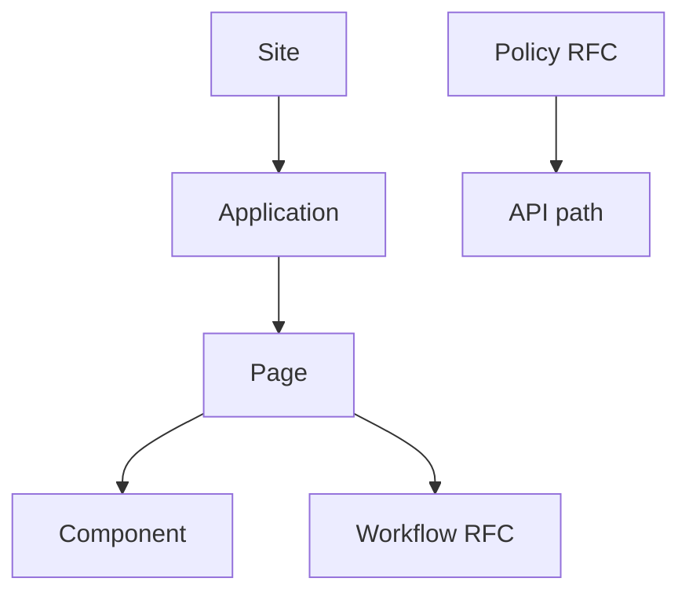

Taskmigo represents a product as versioned resources. A valid set of resources becomes an immutable Site snapshot; users interact with that snapshot while newer changes are validated separately.

## Product users

You use Applications and Pages exposed by an active Site. Depending on the product configuration, you may also start a Workflow or call an API protected by Policies.

Start with [How Taskmigo works](/versions/v0/manuals/how-taskmigo-works), then use [Product status](/versions/v0/manuals/status) to distinguish available contracts from RFCs and planned capabilities.

## Manifest developers

Use this order when building a Site:

1. Read the [resource model](/versions/v0/manuals/resources) for identity, revisions, imports, and tags.
2. Choose a resource from the [manifest reference](/versions/v0/manuals/manifests).
3. Compose `Site → Application → Page`, adding reusable Components and Translations as needed.
4. Use [Expressions](/versions/v0/manuals/expressions) only in fields marked Expression-capable.
5. Follow the [runtime lifecycle](/versions/v0/manuals/runtime) when a saved change does not become active.

The minimum UI path is one Site importing one Application, which imports and routes one Page. Component reuse is optional. Workflow and Policy are RFCs and must not be treated as implemented behavior.

## QC and QA

Begin with [Quality assurance](/versions/v0/manuals/quality-assurance). It maps each contract boundary to observable scenarios and separates save-time validation, snapshot activation, request-time behavior, and Workflow execution.

## Product managers

Begin with [Product planning](/versions/v0/manuals/product-planning). Use it with [Product status](/versions/v0/manuals/status) to assess maturity, dependencies, limitations, and unresolved decisions without reading every field reference.
