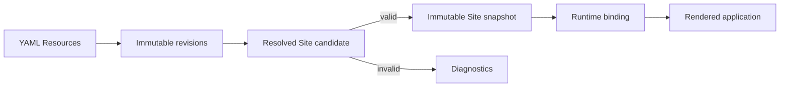
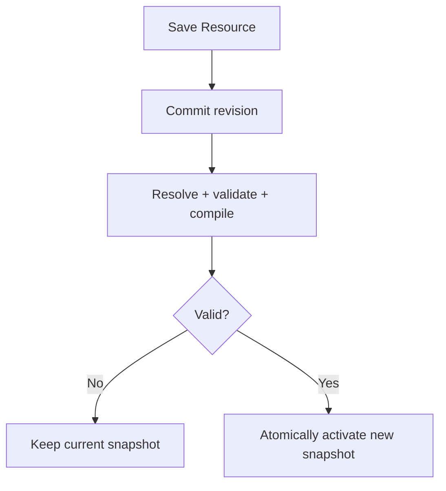
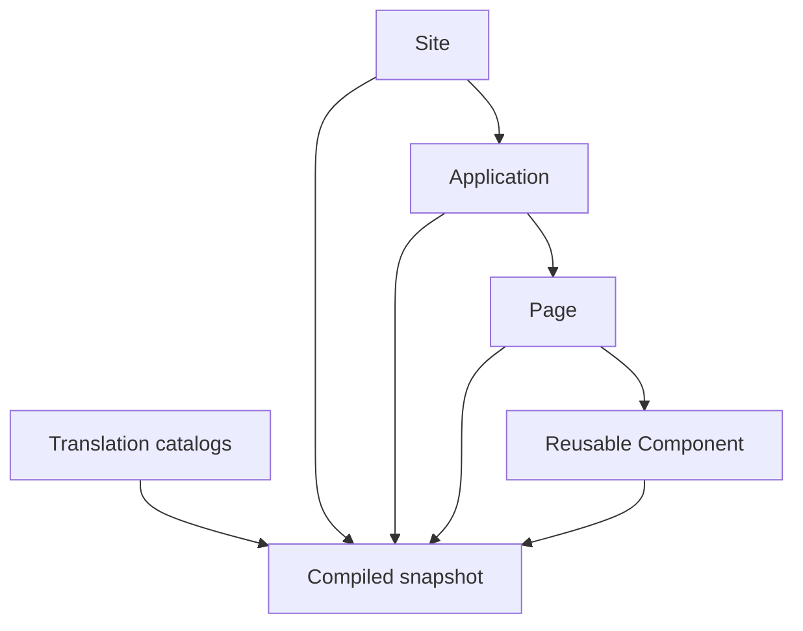

Taskmigo separates **authoring state** from the **runtime version serving an application instance**.

## The six concepts to know

| Concept | Mental model |
| --- | --- |
| Resource | A named definition such as a Site, Application, Page, Component, or Translation. |
| Revision | One immutable saved version of a Resource's authored source. |
| Resolved graph | The exact revisions selected for a Site and their dependency relationships. |
| Candidate | One attempt to validate and compile committed authoring state. |
| Snapshot | An immutable compiled runtime built from one valid resolved Site graph. |
| Runtime binding | The stable snapshot and presentation context used by one browser application instance. |

## Authoring does not immediately change runtime

A save first commits authoring history. Taskmigo then evaluates a candidate. Invalid candidates produce diagnostics while the previously active snapshot keeps serving users.

For exact identity, revision, tag, reference, and graph-checksum rules, use the [Resource model](/versions/v0/manuals/resources).

## Activation does not rewrite an open tab

A newly activated snapshot becomes the default for **new browser application instances**. A tab that is already running keeps its runtime binding across client-side navigation. A full document reload normally bootstraps a new binding from the current active snapshot.

Presentation values that must remain visually consistent, starting with locale, are captured by the same binding. This prevents one tab from mixing old and new UI versions or mixing languages after another tab changes the user's profile default.

See [Runtime lifecycle](/versions/v0/manuals/runtime) for the complete browser and activation behavior.

## Resource composition

The Site is the composition root, Applications own URL routing, Pages own UI trees, Components provide reusable trees, and Translation catalogs are selected by locale rather than imported.

Use the [Manifest reference](/versions/v0/manuals/manifests) when you know which behavior you want to author.
