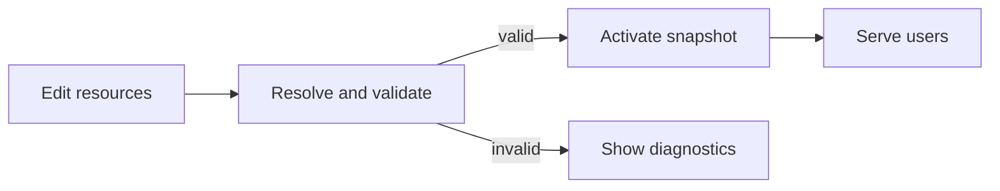

Taskmigo separates editable resources from the version currently serving users.

| Concept    | What it means to you                                                     |
| ---------- | ------------------------------------------------------------------------ |
| Resource   | One versioned definition, such as a Site, Page, or Component.            |
| Import     | A declared dependency between resources.                                 |
| Revision   | An immutable saved version of a resource.                                |
| Snapshot   | A validated, immutable set of exact revisions serving a Site.            |
| Diagnostic | A validation problem that prevents a candidate snapshot from activating. |

Saving a resource does not guarantee activation. Taskmigo first resolves its dependencies and validates the complete candidate. A valid candidate replaces the active snapshot atomically; an invalid candidate preserves the current working version.

For authoring rules, see the [resource model](/versions/v0/manuals/resources). For activation and recovery behavior, see the [runtime lifecycle](/versions/v0/manuals/runtime). Taskmigo contributors can find implementation-oriented boundaries in [Developer architecture](/versions/v0/developer/architecture).
