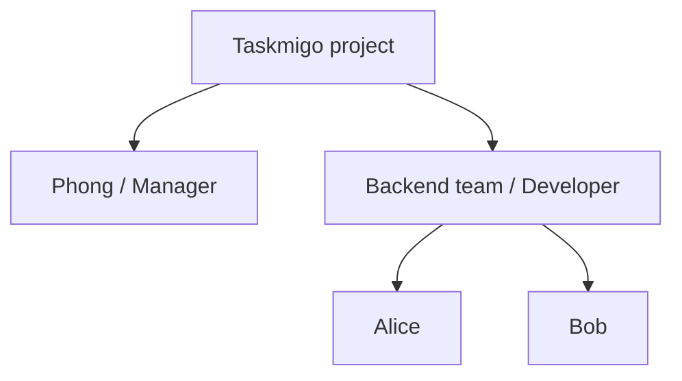

A project groups related work and defines who can access it. Every issue belongs to exactly one project.

## Project identity

| Field | Contract |
| --- | --- |
| ID | Stable internal identifier. |
| Key | Globally unique, short uppercase identifier used in issue references. |
| Name | Human-readable project name. |
| Description | Optional project summary. |
| Status | `ACTIVE` or `ARCHIVED`. |

For a project with key `TM`, issue sequence 42 is presented as `TM-42`.

A project key is immutable after the first issue is created. This keeps references stable in notifications, external links, exports, and human communication.

## Membership

A project member is a **principal**: either one user or one group. The member receives one or more roles.

A user may have both direct and group-derived membership. Effective roles are the union of every applicable assignment.

## Archive behavior

Archiving a project makes it read-only for ordinary project operations. Existing issues, comments, memberships, and audit history remain readable to users who still have access. Restoring an archived project returns it to `ACTIVE` without rewriting historical records.

Project deletion is not part of the initial contract. Destructive lifecycle behavior should be designed separately from archival.
