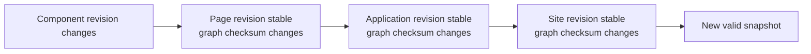

Test at the boundary where Taskmigo makes a product decision: authoring commit, candidate validation, snapshot activation, runtime binding, or render evaluation.

## Defined contract boundaries

| Boundary | Positive case | Failure case | Observable result |
| --- | --- | --- | --- |
| Manifest contract | Required fields, types, and field-local rules are valid. | A field is missing, invalid, or uses an unsupported Expression context. | Source-aware validation identifies the field/path. |
| Resource resolution | Every reference selects one allowed exact revision and deterministic graph checksum. | Missing, duplicate, disallowed, cyclic, or unsatisfied reference. | Candidate remains non-active; current snapshot is unchanged. |
| Site snapshot | Complete resolved graph compiles and pins exact revision + graph identity. | Any reachable Resource or cross-Resource rule is invalid. | Activation is all-or-nothing. |
| Runtime binding | Navigation uses the binding's snapshot and presentation context. | A newer snapshot/profile default appears while the tab remains open. | Existing tab stays internally consistent. |
| Expression | Backend evaluation has valid syntax, visible context, and result type. | Syntax/context/type fails at validation or runtime phase. | Safe diagnostic/error; browser never evaluates Expression source. |

## High-value regression journeys

### 1. Minimal Site activation

Create `Site → Application → Page`, activate it, and verify the Application route renders the Page from the active snapshot.

### 2. Dependency propagation without fake revisions

Assert both identities: the changed child receives a new revision; unchanged ancestors keep their revision IDs while affected graph checksums change.

### 3. Invalid change keeps the working runtime

Save an invalid dependency or Expression change. Verify authoring history remains available, the candidate exposes diagnostics, and the previous snapshot keeps serving.

### 4. Open tab stays on its snapshot

1. Bootstrap Tab A on snapshot `S42`.
2. Activate `S50`.
3. Navigate inside Tab A and verify it still renders from `S42`.
4. Perform a full reload and verify the new application instance can acquire `S50`.

### 5. Locale does not leak across tabs

1. Bootstrap Tab A with `ja-JP` and Tab B with `ja-JP`.
2. Change the user-profile language to `en` from Tab B.
3. Navigate in Tab A and verify both existing layout and newly rendered Page remain Japanese.
4. Explicitly change Tab B's presentation locale and verify only Tab B rebinds.

### 6. Recovery uses the same pipeline

Break a required dependency, confirm activation fails, restore it, and verify the affected Site reevaluates through the normal candidate pipeline.

## RFC-only scenarios

<Callout title='Do not report RFC behavior as delivered product coverage' type='warning'>
  Policy and Workflow scenarios are useful for contract review and future implementation, but they remain RFC-only until
  [Product status](/versions/v0/manuals/status) changes.
</Callout>

When reviewing those RFCs, test Policy fail-closed/deny precedence and Workflow revision pinning independently from the defined Resource/runtime suite.

## Assertions that matter

Prefer explicit Resource identities, revision IDs, source checksums, graph checksums, snapshot IDs, and runtime-binding fixtures. Assert the safety invariant as well as the happy-path result:

- dependency changes never manufacture ancestor revisions;
- graph identity propagates deterministically;
- activation is never partial;
- one running browser application instance never mixes snapshots;
- bound presentation locale does not silently follow another tab's profile change;
- backend-only Expression evaluation never leaks context or executable Expression source to the browser.

Use the [Manifest reference](/versions/v0/manuals/manifests) for field-level cases and [Product status](/versions/v0/manuals/status) for capability maturity.
