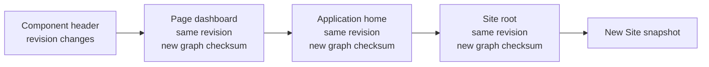

import { Step, Steps } from 'fumadocs-ui/components/steps';

```yaml
apiVersion: v0
kind: site
metadata:
  name: root
imports:
  - application/home
spec:
  # kind-specific configuration
```

| Field           | Rule                                                                       |
| --------------- | -------------------------------------------------------------------------- |
| `apiVersion`    | Contract version for this revision.                                        |
| `kind`          | Resource kind.                                                             |
| `metadata`      | Resource metadata.                                                         |
| `metadata.name` | Resource name matching `[a-zA-Z0-9_-]+`.                                   |
| `imports`       | `ResourceReference[]`; allowed dependencies, each identity appearing once. |
| `spec`          | Kind-specific configuration.                                               |

## Identity and revisions

`(kind, metadata.name)` identifies a resource. `apiVersion` selects the contract for a revision; it is not part of identity.

Changing a manifest creates a new immutable revision, including when `apiVersion` changes. Historical revisions keep the contract that validated them. A revision represents only that Resource's authored source: changing a dependency does not create or mutate revisions of its importers.

Each revision has a source checksum derived from its canonical stored source. The checksum therefore stays unchanged when only a dependency changes.

A Taskmigo system contains exactly one logical `site` resource. A different name or `apiVersion` cannot create a second Site.

## Revision tags

A revision may receive an immutable [Semantic Version](https://semver.org/) tag through the revision-tag API. Tags are external to YAML.

```yaml
imports:
  - component/header@1.2.0
  - component/navigation@^2.0.0
```

## References

```text
<kind>/<name>[@<tag-constraint>]
```

Without a constraint, Taskmigo uses the current revision. With one, it selects the highest matching tagged revision. Exact versions, caret ranges such as `^1.2.0`, and tilde ranges such as `~1.2.0` are supported.

A `ResourceReference` contains the target `kind` and `name`; its tag constraint is optional. `apiVersion` and revision IDs never appear in references. Within one `imports` field, `(kind, name)` may appear only once.

| Part             | Required | Meaning                                                        |
| ---------------- | :------: | -------------------------------------------------------------- |
| `kind`           |   Yes    | Target resource kind, such as `page` or `component`.           |
| `name`           |   Yes    | Target resource name. Names are unique only within their kind. |
| `tag-constraint` |    No    | Exact tag or supported range used to select a tagged revision. |

### Reference ability

**Legend:** ✅ allowed · 🧪 RFC · ❌ not allowed

| Importer      | `site` | `application` | `page` | `component` | `translation` | `workflow` | `policy` |
| ------------- | :----: | :-----------: | :----: | :---------: | :-----------: | :--------: | :------: |
| `site`        |   ❌   |      ✅       |   ❌   |     ❌      |      ❌       |     ❌     |    ❌    |
| `application` |   ❌   |      ❌       |   ✅   |     ❌      |      ❌       |     ❌     |    ❌    |
| `page`        |   ❌   |      ❌       |   ✅   |     ✅      |      ❌       |     🧪     |    ❌    |
| `component`   |   ❌   |      ❌       |   ❌   |     ✅      |      ❌       |     ❌     |    ❌    |
| `translation` |   ❌   |      ❌       |   ❌   |     ❌      |      ❌       |     ❌     |    ❌    |
| `workflow`    |   ❌   |      ❌       |   ❌   |     🧪      |      ❌       |     ❌     |    ❌    |
| `policy`      |   ❌   |      ❌       |   ❌   |     ❌      |      ❌       |     ❌     |    ❌    |

Translation catalogs are selected by locale. Policies are registered globally, target API path globs, are activated through Role attachments, and cannot be imported. Workflow relationships are part of the [Workflow RFC](/versions/v0/manuals/manifests/v0-workflow).

### Resolved graph identity

Candidate resolution selects exact revisions for every Resource used by the Site. Taskmigo gives each resolved node a **graph checksum** derived from its own exact revision and the graph checksums of its direct resolved dependencies. The Site node's graph checksum therefore identifies the complete resolved dependency state used by that candidate.



A dependency change propagates through every affected ancestor without manufacturing new ancestor revisions. For example, changing an imported Component can change the Page, Application, and Site graph checksums while all three keep their existing revision IDs.

The resolved Site graph also includes contract-defined Resource selections used during compilation even when they are not declared through `imports`, such as the Translation revisions selected for the Site locale catalogs. A change to any selected Resource that affects the Site causes reevaluation and, when the candidate remains valid, produces a new snapshot.

Graph checksums are deterministic: the same exact revision selections and dependency relationships produce the same values regardless of database row or traversal order.

### Resolution

<Steps>
  <Step>

### Find the resource

Match `(kind, name)`.

  </Step>
  <Step>

### Select a revision

Use the current revision, or the highest tagged revision satisfying the reference constraint.

  </Step>
  <Step>

### Validate, fingerprint, and pin

Validate with the selected revision's `apiVersion` contract, calculate the resolved graph checksums, and record each exact revision plus its graph checksum in the snapshot. Invalid selections do not fall back to another revision.

  </Step>
</Steps>

Malformed or disallowed references, missing resources, duplicate identities, unsatisfied constraints, invalid selected revisions, and Site cardinality violations fail resolution.
