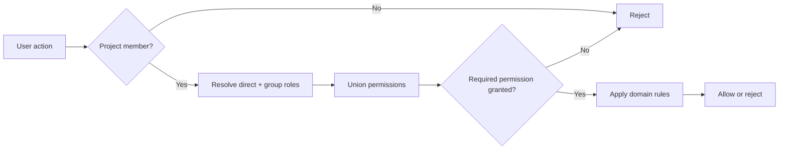

Taskmigo uses additive role-based access control. Roles grant permissions; they never deny them.

## Permission model

Permissions use the form `<resource>:<action>`, for example:

| Permission         | Allows                                                       |
| ------------------ | ------------------------------------------------------------ |
| `project:view`     | Open and read an accessible project.                         |
| `project:settings` | Change project configuration.                                |
| `member:view`      | Read project membership.                                     |
| `member:manage`    | Add, change, or remove project memberships.                  |
| `issue:view`       | Read issues in the project.                                  |
| `issue:create`     | Create issues.                                               |
| `issue:update`     | Edit issue fields that are otherwise valid.                  |
| `issue:delete`     | Delete an issue when deletion is supported.                  |
| `issue:assign`     | Change the assignee.                                         |
| `issue:transition` | Attempt a workflow status transition.                        |
| `comment:create`   | Add an issue comment.                                        |
| `comment:update`   | Edit one's own comment where the comment contract allows it. |

The permission catalog is centrally defined by Taskmigo. Custom roles select from that catalog; they do not create new permission keys.

## Effective roles

For a user `U` in project `P`:

```text
EffectiveRoles(U, P)
  = DirectRoles(U, P)
  union GroupRoles(U, P)
```

Effective permissions are the union of permissions granted by those roles.

There is no explicit `DENY`, no role inheritance, and no precedence rule between direct and group assignments. If any effective role grants a permission, that permission is granted.

## System administration

Installation administration is not a project role. A system administrator can perform installation-level recovery and administration even when they are not a project member. Product features should never require assigning an `Administrator` role to every project.

## Authorization decision



Permissions answer whether a user may attempt an operation. Domain rules still apply. For example, `issue:transition` does not make every status transition valid; the workflow must also allow that transition for one of the user's effective roles.
