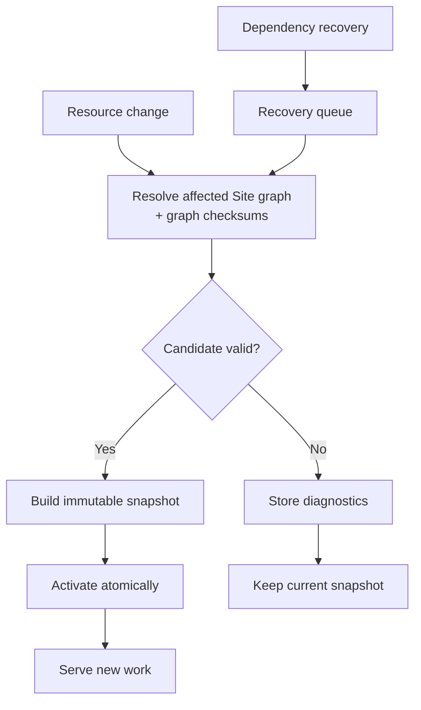
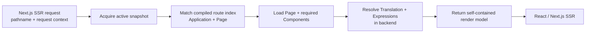
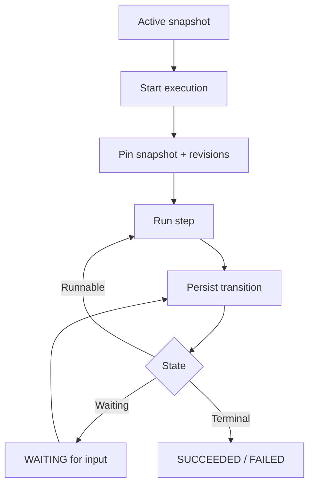

import { Step, Steps } from 'fumadocs-ui/components/steps';

## Resource change lifecycle

Create, update, delete, restore, package import, and dependency recovery all use this lifecycle.

<Steps>
  <Step>

### Resolve the affected Site

Taskmigo resolves a complete candidate graph and calculates a deterministic graph checksum for every selected node. A child revision change propagates through the graph checksums of its affected ancestors, so the root Site graph changes even when the Site's own revision does not. Translation changes also affect Sites using the corresponding locale catalog. Under the Policy RFC, Policy revisions, matched API contracts, and Role attachments affect Sites that pin them. See [Resource resolution](/versions/v0/manuals/resources#resolution).

  </Step>
  <Step>

### Validate the candidate

Each revision is validated against its `apiVersion` and `kind`, followed by dependency, graph, and security checks. Invalid candidates store diagnostics and leave the active snapshot unchanged.

  </Step>
  <Step>

### Build and activate

A valid candidate becomes an immutable snapshot containing the exact selected revisions, their resolved graph checksums, and the normalized runtime model. Its root graph checksum identifies the complete resolved Resource state compiled by that snapshot. The snapshot then replaces the active snapshot atomically.

  </Step>
</Steps>

Diagnostics identify the error, manifest path, and source location when available without exposing credentials or data outside Taskmigo's schema.

## Server-side rendering

Next.js is an SSR consumer of the compiled runtime, not a Resource compiler. Given an incoming pathname such as `/home/settings`, it needs two logical results from the acquired snapshot:

1. **Route result** — the matched Application and Page plus Site/Application metadata required by the rendered layout.
2. **Render result** — Page metadata and body, reusable Component definitions required by that Page, and resolved Translation/Expression values required to produce the React tree.

Next.js does not parse manifests, traverse imports, select revisions, resolve tags, or reconstruct the Resource graph. Revision IDs and graph checksums remain runtime integrity and inspection metadata rather than inputs the React renderer must compose itself.

For v0, Expressions execute only in the Taskmigo backend. A server-side rendering operation acquires one active snapshot and keeps that immutable snapshot for route resolution, Page/Component lookup, Translation lookup, and Expression evaluation.

The HTTP serving contract should make the happy path one backend round trip from Next.js: the request supplies the pathname and supported server request context, and the backend returns the self-contained render model needed for that SSR response. The logical route and render results do not imply separate HTTP requests.

The render model contains only data required by the matched request. It is not required to expose the complete Site snapshot or one payload per Resource. Reusable Components may remain deduplicated within the model instead of being expanded at every use, as long as the model is self-contained for the Page.

Next.js receives resolved Expression values. It does not receive Expression source or an Expression program that the browser must execute. Frontend-only Expression context is outside the v0 contract.

A snapshot activation that happens after acquisition does not change the in-flight SSR operation. Route selection, Component structure, Translation values, and evaluated Expression results therefore always come from one consistent snapshot.

Compiled route indexes and render artifacts may be cached by immutable snapshot identity, but cache partitioning, transport schema, and the concrete serving endpoint remain open design decisions. The correctness contract is independent of those optimizations: one SSR operation resolves entirely against one acquired snapshot and does not fall back to mutable current Resource pointers.

## Workflow execution

Transitions are persisted before dependent work is scheduled. Service restarts resume from persisted state, and waiting for input does not hold an HTTP request or worker.

Existing executions keep their pinned Workflow and dependencies; newer snapshots affect new executions only. See [Workflow RFC](/versions/v0/manuals/manifests/v0-workflow#execution-and-revision-pinning) for step behavior.

## Dependency recovery

Dependency changes queue affected Sites for reevaluation. A dependency revision change can therefore create a new Site snapshot without creating a new Site, Application, or Page revision: the resolved graph checksums propagate the change while authored ancestor revisions remain immutable. Candidates run one at a time through the lifecycle above, preventing conflicting activations. Intermediate revisions are not guaranteed to activate, and recovery has no fixed completion time.

## Package import

A package is validated as one candidate before activation. A failed import cannot partially change runtime state. Exported revision IDs, resolution results, graph checksums, and revision tags are not imported as manifest state.
