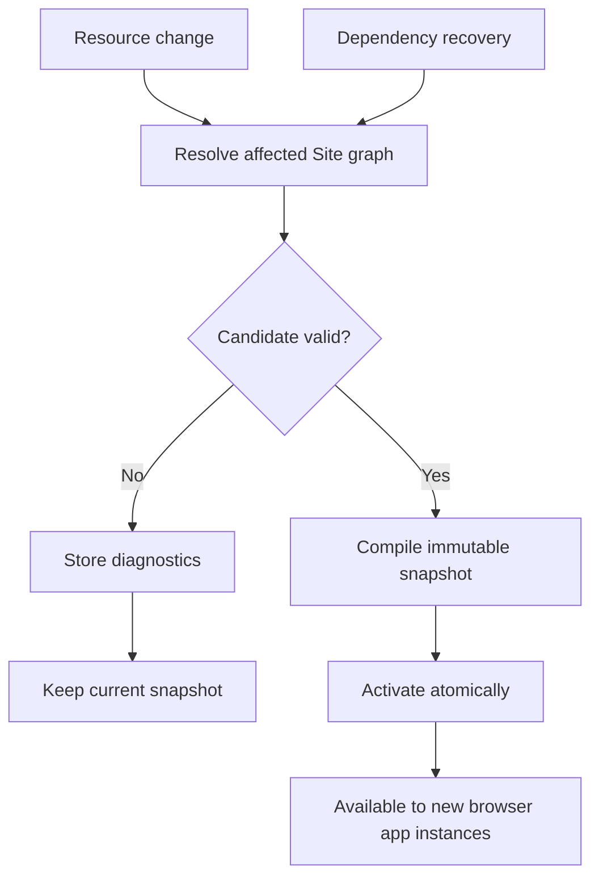
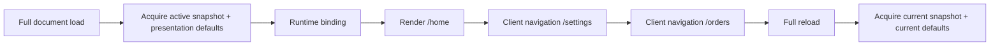
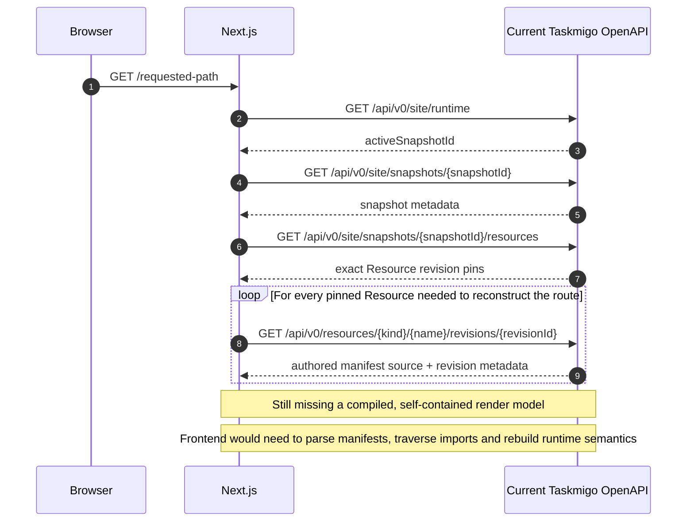
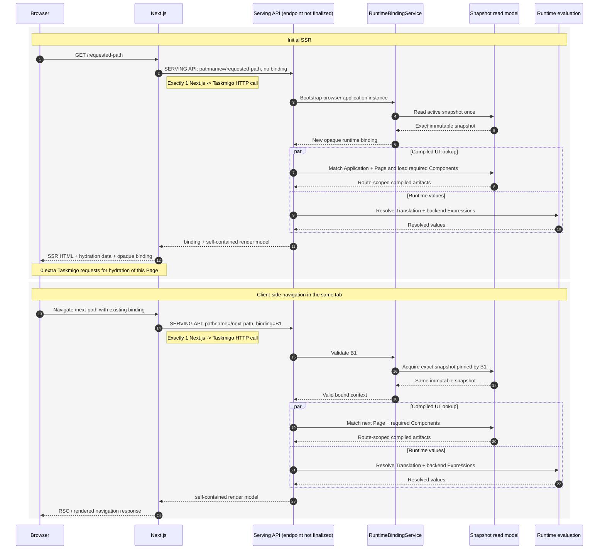
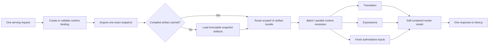
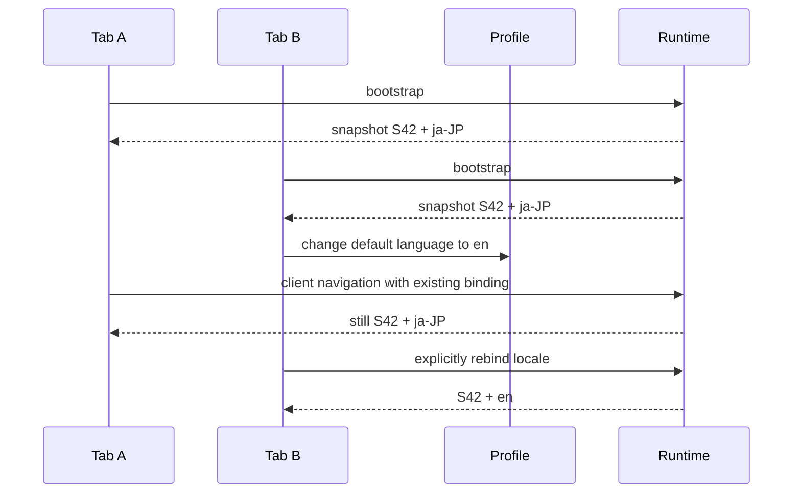

import { Step, Steps } from 'fumadocs-ui/components/steps';

Taskmigo keeps editable authoring state separate from the immutable runtime serving users.

## From save to activation

<Steps>
  <Step>

### Commit authoring state

Saving a Resource creates or reuses an immutable revision and updates that Resource's current authoring pointer. The save can succeed even when the resulting Site cannot activate.

  </Step>
  <Step>

### Resolve and validate the candidate

Taskmigo selects exact revisions for the affected Site graph, validates Resource contracts and cross-Resource rules, and calculates resolved graph checksums. A dependency change can therefore change the Site graph without creating new revisions for unchanged ancestors.

See [Resource model](/versions/v0/manuals/resources#resolved-graph-identity) for the checksum contract.

  </Step>
  <Step>

### Compile and activate

A valid candidate becomes an immutable snapshot containing exact Resource selections and compiled runtime data. Activation swaps the active snapshot atomically. An invalid candidate records diagnostics and leaves the previous snapshot active.

  </Step>
</Steps>

## Browser runtime binding

Activation changes the snapshot used by **new browser application instances**. An already-running tab normally keeps the snapshot it acquired when that application instance was bootstrapped.

The binding belongs to the running application instance, not the login session. Two tabs can therefore use different snapshots without corrupting each other.

### What remains stable?

| Value                            | During client-side navigation                                                     | How it changes                                                        |
| -------------------------------- | --------------------------------------------------------------------------------- | --------------------------------------------------------------------- |
| Site snapshot                    | Pinned to the binding.                                                            | Normally on full reload; future expiry/revocation may require reload. |
| Locale                           | Pinned presentation context.                                                      | Explicit change in that tab or a new bootstrap.                       |
| Future presentation values       | Pinned only when the contract explicitly classifies them as presentation context. | Defined by that presentation feature.                                 |
| Authorization and business state | Not automatically pinned.                                                         | Follows the freshness rules of the owning capability.                 |

Snapshot pinning is a UI/runtime-consistency rule, not permission caching.

## End-to-end UI rendering

The current OpenAPI exposes authoring and inspection APIs, not a render API. That distinction matters because the inspection surface can describe runtime state but cannot efficiently produce a Page for React/Next.js.

### What the current APIs can do

This is an inspection flow, not the rendering flow. It has at least three backend round trips before any Resource source is fetched, then one more request per revision. It also exposes authored source rather than the compiled runtime model that the frontend needs. **Next.js must not use this chain to render UI.**

The individual endpoints remain useful for authoring tools, diagnostics, admin inspection, and debugging:

| Purpose                                | API                                                          |
| -------------------------------------- | ------------------------------------------------------------ |
| Read the active runtime pointer        | `GET /api/v0/site/runtime`                                   |
| Read snapshot metadata                 | `GET /api/v0/site/snapshots/{snapshotId}`                    |
| Read exact Resource pins in a snapshot | `GET /api/v0/site/snapshots/{snapshotId}/resources`          |
| Read one immutable authored revision   | `GET /api/v0/resources/{kind}/{name}/revisions/{revisionId}` |
| Read current authoring state           | `GET /api/v0/resources/{kind}/{name}`                        |

### API required for React / Next.js rendering

The serving boundary must collapse snapshot selection, route matching, compiled artifact lookup, Translation resolution, and backend Expression evaluation into **one Taskmigo request per render/navigation**.

The serving endpoint is intentionally shown as **not finalized** because it is not present in the current OpenAPI contract. The important contract is the shape of the interaction: initial SSR sends the requested pathname without a binding; subsequent navigation sends the pathname plus the existing opaque binding. Both operations return everything required to render that route in one backend response.

### Round-trip budget

| Operation                      | Browser → Next.js | Next.js → Taskmigo | Extra Taskmigo fetch after response |
| ------------------------------ | ----------------: | -----------------: | ----------------------------------: |
| Full load                      |                 1 |                  1 |                                   0 |
| Navigation within the same tab |                 1 |                  1 |                                   0 |

A future serving API must therefore replace the inspection chain above rather than wrap it. The backend can still perform multiple internal cache/database reads, but those reads must stay behind the serving boundary and must not become frontend-visible HTTP calls.

### Backend hot path

Keep this path predictable: compile static route/UI structure when the snapshot is created, cache by immutable snapshot identity, acquire the snapshot once per render operation, batch or parallelize independent backend work, scope the payload to the matched route, deduplicate reusable Components, and keep authorization/business-state freshness independent from snapshot caching.

## Why locale is part of the binding

The profile language is a default used during bootstrap or an explicit presentation change. It is not reread as the locale for every navigation. `Trans` and `TransN` therefore cannot switch one Page to a different language while the existing layout remains in the old language.

## Rendering behavior

For one render/navigation operation, Taskmigo resolves the route, Page, reusable Components, Translation values, and backend Expressions from the snapshot and presentation context carried by the binding.

The frontend does not parse manifests, traverse imports, select revisions, or evaluate Expressions. The target serving contract is one backend round trip for the happy-path render; the concrete endpoint and binding token format remain open decisions. Implementation details belong in [Resource and runtime](/versions/v0/developer/resource-runtime) and [API development](/versions/v0/developer/api#ssr-serving-contract).

## Dependency recovery

Restoring or changing a dependency reevaluates affected Sites through the same candidate pipeline. Recovery does not create revisions for unchanged importers: resolved graph identity propagates the dependency change instead.

Intermediate authoring revisions are not guaranteed to become active, and recovery has no fixed completion time.

## Package import

A package import is validated as one candidate before activation. A failed import cannot partially replace runtime state. Revision IDs, resolved selections, graph checksums, and revision tags are runtime/authoring metadata and are not imported as manifest source.

## Workflow execution

<Callout title='Workflow is an RFC and is not implemented' type='warning'>
  The behavior below belongs to the Workflow RFC and does not describe an available runtime capability.
</Callout>

A proposed Workflow execution pins the Site snapshot, Workflow revision, and selected dependencies when execution starts. Newer snapshots would affect new executions only. See [Workflow — execution and revision pinning](/versions/v0/manuals/manifests/v0-workflow#execution-and-revision-pinning).
