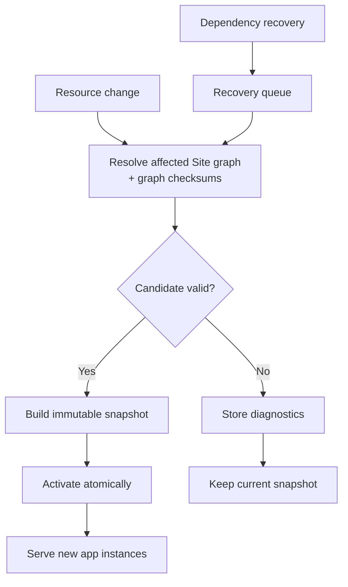
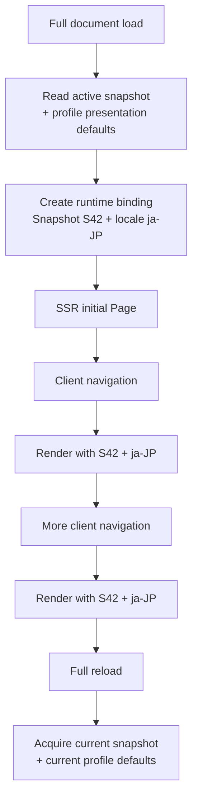
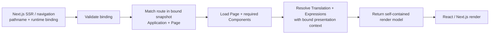
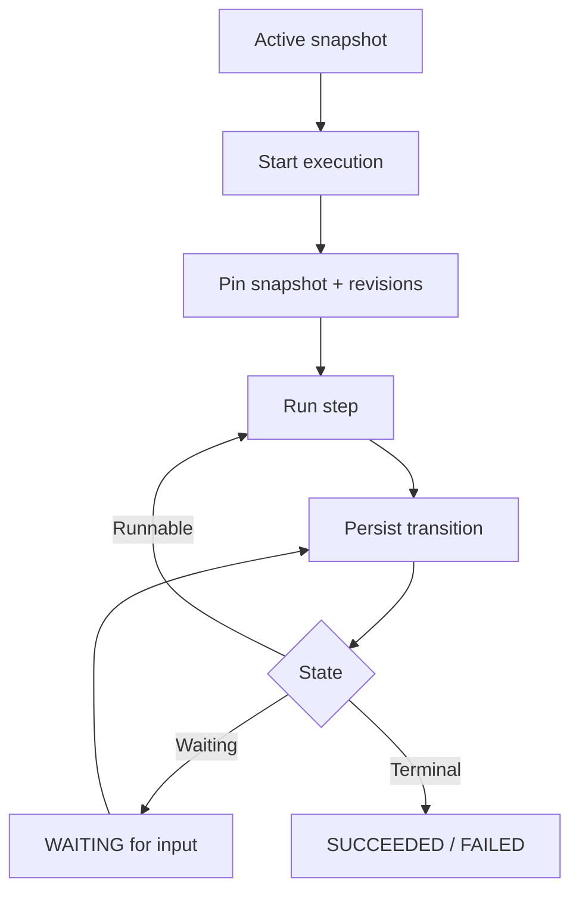

import { Step, Steps } from 'fumadocs-ui/components/steps';

## Resource change lifecycle



Create, update, delete, restore, package import, and dependency recovery all use this lifecycle.

<Steps>
  <Step>

### Resolve the affected Site

Taskmigo resolves a complete candidate graph and calculates a deterministic graph checksum for every selected node. A child revision change propagates through the graph checksums of its affected ancestors, so the root Site graph changes even when the Site's own revision does not. Translation changes also affect Sites using the corresponding locale catalog. Under the Policy RFC, Policy revisions, matched API contracts, and Role attachments affect Sites that pin them. See [Resource resolution](/versions/v0/manuals/resources#resolution).

  </Step>
  <Step>

### Validate the candidate

Each revision is validated against its `apiVersion` and `kind`, followed by dependency, graph, and security checks. Invalid candidates store diagnostics and leave the active snapshot unchanged.

  </Step>
  <Step>

### Build and activate

A valid candidate becomes an immutable snapshot containing the exact selected revisions, their resolved graph checksums, and the normalized runtime model. Its root graph checksum identifies the complete resolved Resource state compiled by that snapshot. The snapshot then replaces the active snapshot atomically.

Activation changes which snapshot **new browser application instances** acquire. It does not silently move an application instance that is already running to the new snapshot.

  </Step>
</Steps>

Diagnostics identify the error, manifest path, and source location when available without exposing credentials or data outside Taskmigo's schema.

## One browser app, one runtime binding

A **browser application instance** is the running Taskmigo UI in one tab between its initial full document load and the next full reload. Taskmigo binds that instance to one stable runtime view so client-side navigation cannot mix versions or presentation settings.

The binding contains, conceptually:

| Bound value | Why it stays stable |
| --- | --- |
| Snapshot | Routes, Pages, Components, and Translation catalogs must come from one immutable Resource graph. |
| Locale | A tab must not switch language halfway through its UI because another tab changed the user's profile. |
| Other presentation context | Future values such as timezone or SSR theme may be captured when changing them mid-instance would create a mixed presentation. |
| Renderer compatibility | A retained snapshot must be rendered only by a compatible runtime/artifact format. |

The concrete token format, expiry, revocation mechanism, and additional presentation fields are still design decisions. The important contract is the binding itself: subsequent navigation uses the captured runtime view instead of rereading mutable defaults.



A newer snapshot can activate while the tab is open without changing that tab. Under normal operation, the tab adopts the newer snapshot on its next full reload. The runtime may later define expiry or emergency revocation so an unsafe or incompatible binding can require a reload; a binding must not be treated as an unbounded retention promise.

The binding belongs to the browser application instance, not the login session. Two tabs opened at different times may therefore use different snapshots or locales without corrupting each other.

## Why presentation context is captured

Consider a user whose profile language starts as Japanese:

```text
Tab 1 bootstrap -> snapshot S42 + locale ja-JP
Tab 2 bootstrap -> snapshot S42 + locale ja-JP
```

The user changes their profile language to English in Tab 2. The profile default is now English, but Tab 1 already contains Japanese layout text. If Tab 1 reread the mutable profile during its next client navigation, the existing layout could remain Japanese while the newly rendered Page becomes English.

Taskmigo avoids that mixed UI by separating **profile defaults** from the **active presentation context** of an application instance:

```text
User profile language
        |
        | used when bootstrapping or explicitly changing this tab
        v
Runtime binding locale
        |
        | source of truth for rendering this app instance
        v
Translation + Expression evaluation
```

Changing the profile does not silently mutate other running tabs. If the user explicitly changes language in the current tab, that tab may establish a new presentation binding and rerender consistently; the exact language-change transport is still an API design decision. Other tabs keep their captured locale until they explicitly change it, reload, or their binding is no longer valid.

The same rule should be applied deliberately to future presentation values: capture a value only when changing it between navigations would create an internally inconsistent UI. Security-sensitive or business-authoritative mutable state is not automatically frozen merely because presentation context is pinned.

## Server-side rendering

Next.js is an SSR consumer of the compiled runtime, not a Resource compiler. Given an incoming pathname such as `/home/settings`, it needs two logical results from the runtime binding:

1. **Route result** — the matched Application and Page plus Site/Application metadata required by the rendered layout.
2. **Render result** — Page metadata and body, reusable Component definitions required by that Page, and resolved Translation/Expression values required to produce the React tree.

Next.js does not parse manifests, traverse imports, select revisions, resolve tags, or reconstruct the Resource graph. Revision IDs and graph checksums remain runtime integrity and inspection metadata rather than inputs the React renderer must compose itself.

For v0, Expressions execute only in the Taskmigo backend. Expression evaluation uses the snapshot and presentation context captured by the runtime binding. In particular, `Trans` and `TransN` use the binding locale rather than rereading the user's mutable profile language on each navigation.



The initial full document load bootstraps a fresh binding from the active snapshot and current presentation defaults. Subsequent client-side navigation carries that binding back to the serving boundary. A request with a valid binding resolves exclusively against its bound snapshot and presentation context, regardless of which snapshot or profile defaults are current by then.

The HTTP serving contract should make the happy path one backend round trip from Next.js: the request supplies the pathname, runtime binding when one already exists, and supported server request context; the backend returns the self-contained render model needed for that render. The logical route and render results do not imply separate HTTP requests.

The render model contains only data required by the matched request. It is not required to expose the complete Site snapshot or one payload per Resource. Reusable Components may remain deduplicated within the model instead of being expanded at every use, as long as the model is self-contained for the Page.

Next.js receives resolved Expression values. It does not receive Expression source or an Expression program that the browser must execute. Frontend-only Expression context is outside the v0 contract.

Compiled route indexes and render artifacts may be cached by immutable snapshot identity. The runtime binding itself should be opaque to the browser so persistence IDs and future compatibility metadata do not become frontend protocol assumptions. Token representation, cache partitioning, transport schema, retention limits, and the concrete serving endpoint remain open design decisions.

## Workflow execution



Transitions are persisted before dependent work is scheduled. Service restarts resume from persisted state, and waiting for input does not hold an HTTP request or worker.

Existing executions keep their pinned Workflow and dependencies; newer snapshots affect new executions only. See [Workflow RFC](/versions/v0/manuals/manifests/v0-workflow#execution-and-revision-pinning) for step behavior.

## Dependency recovery

Dependency changes queue affected Sites for reevaluation. A dependency revision change can therefore create a new Site snapshot without creating a new Site, Application, or Page revision: the resolved graph checksums propagate the change while authored ancestor revisions remain immutable. Candidates run one at a time through the lifecycle above, preventing conflicting activations. Intermediate revisions are not guaranteed to activate, and recovery has no fixed completion time.

## Package import

A package is validated as one candidate before activation. A failed import cannot partially change runtime state. Exported revision IDs, resolution results, graph checksums, and revision tags are not imported as manifest state.
